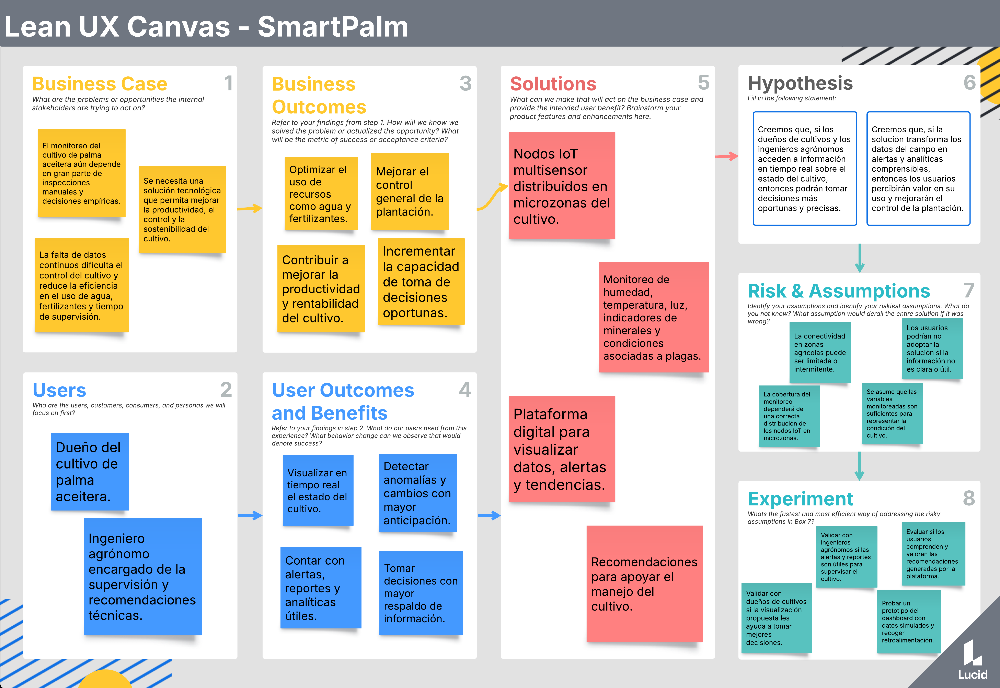
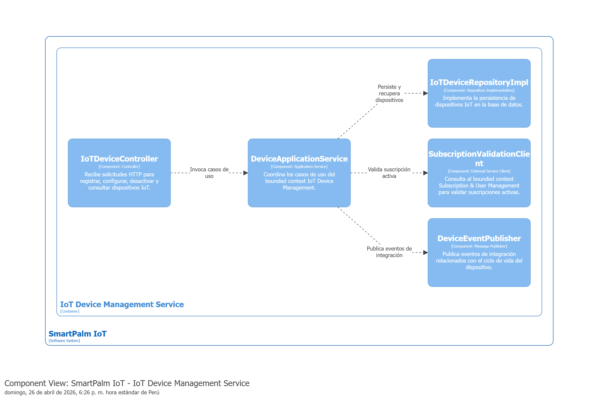
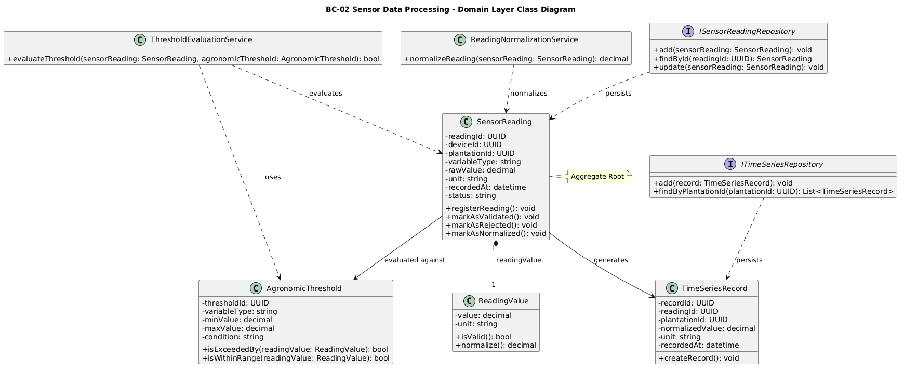
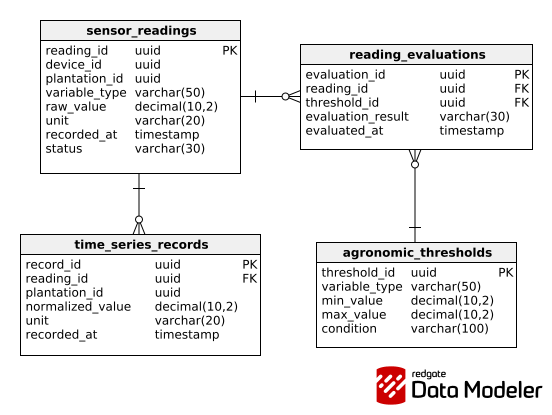
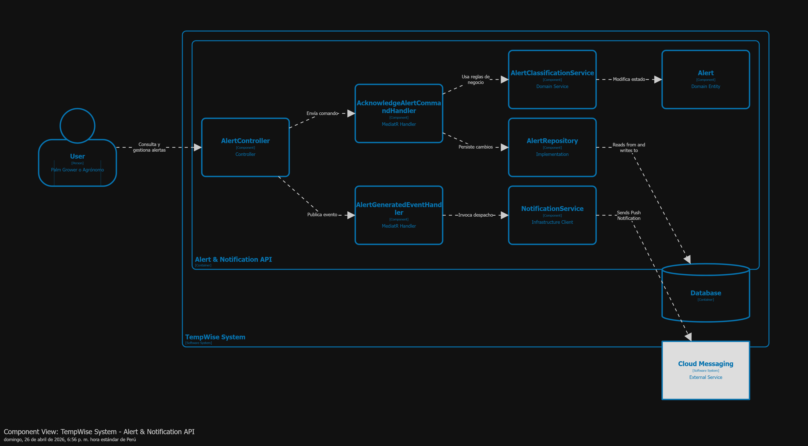

 

<h3>Universidad Peruana de Ciencias Aplicadas</h3>  

Carrera: Ingenieria de Software
   

Ciclo: 2026-10
 

Código del curso: 1ASI0572
 

Curso: Desarrollo de Soluciones IOT
  

NRC: 6779
  

Profesor: Angel Augusto Velasquez Nuñez
  

"INFORME DE TRABAJO FINAL"
  

### 
Startup: TempWise

### 
Producto: [COMPLETAR]

### Integrantes:

<table >
    <tr>
        <th>Nombre</th>
        <th>Codigo</th>
    </tr>
    <tr>
        <td>Victor Manuel Rojas Reategui</td>
        <td>U202123655</td>
    </tr>
    <tr>
        <td>[COMPLETAR]</td>
        <td>[COMPLETAR]</td>
    </tr>
    <tr>
        <td>[COMPLETAR]</td>
        <td>[COMPLETAR]</td>
    </tr>
    <tr>
        <td>[COMPLETAR]</td>
        <td>[COMPLETAR]</td>
    </tr>
    <tr>
        <td>[COMPLETAR]</td>
        <td>[COMPLETAR]</td>
    </tr>
    <tr>
        <td>[COMPLETAR]</td>
        <td>[COMPLETAR]</td>
    </tr>
</table >

 Julio, 2025

**Registro de Versiones del Informe:**

En esta sección se resumen todas las modificaciones relevantes que sean realizadas sobre el informe durante el ciclo de vida del proyecto.

| Versión | Fecha | Autor | Descripción de modificación |
| ------- | ----- | ----- | --------------------------- |
| V0.1    |

# Project Report Collaboration Insights

Link de Repositorio: https://github.com/TempWise-DesarrolloIoT-202610/upc-Desarrollo-IoT-Report

TB1: En esta etapa, el equipo se reunió para definir el alcance y los objetivos, asignando tareas específicas a cada miembro. Comenzamos recopilando datos y revisando información relevante, con cada miembro contribuyendo con investigaciones individuales que luego compartimos y discutimos en reuniones periódicas. En GitHub, establecimos un flujo de trabajo para colaborar en la redacción del informe, creando un repositorio dedicado con secciones divididas en archivos Markdown para facilitar la colaboración y revisión

# Contenido

- [Capítulo I: Introducción](#capítulo-i-introducción)
  - [1.1. Startup Profile](#11-startup-profile)
    - [1.1.1. Descripción de la Startup](#111-descripción-de-la-startup)
    - [1.1.2. Perfiles de integrantes del equipo](#112-perfiles-de-integrantes-del-equipo)
  - [1.2. Solution Profile](#12-solution-profile)
    - [1.2.1. Antecedentes y problemática](#121-antecedentes-y-problemática)
    - [1.2.2. Lean UX Process](#122-lean-ux-process)
      - [1.2.2.1. Lean UX Problem Statements](#1221-lean-ux-problem-statements)
      - [1.2.2.2. Lean UX Assumptions](#1222-lean-ux-assumptions)
      - [1.2.2.3. Lean UX Hypothesis Statements](#1223-lean-ux-hypothesis-statements)
      - [1.2.2.4. Lean UX Canvas](#1224-lean-ux-canvas)
    - [1.3. Segmentos objetivo](#13-segmento-objetivo)
- [Capítulo II: Requirements Elicitation & Analysis](#capítulo-ii-requirements-elicitation--analysis)
  - [2.1. Competidores](#21-competidores)
    - [2.1.1. Análisis competitivo](#211-análisis-competitivo)
    - [2.1.2. Estrategias y tácticas frente a competidores](#212-estrategias-y-tácticas-frente-a-competidores)
  - [2.2. Entrevistas](#22-entrevistas)
    - [2.2.1. Diseño de entrevistas](#221-diseño-de-entrevistas)
    - [2.2.2. Registro de entrevistas](#222-registro-de-entrevistas)
    - [2.2.3. Análisis de entrevistas](#223-análisis-de-entrevistas)
  - [2.3. Needfinding](#23-needfinding)
    - [2.3.1. User Personas](#231-user-personas)
    - [2.3.2. User Task Matrix](#232-user-task-matrix)
    - [2.3.3. User Journey Mapping](#233-user-journey-mapping)
    - [2.3.4. Empathy Mapping](#234-empathy-mapping)
    - [2.3.5. As-is Scenario Mapping](#235-as-is-scenario-mapping)
  - [2.4. Ubiquitous Language](#24-ubiquitous-language)
- [Capítulo III: Requirements Specification](#capítulo-iii-requirements-specification)
  - [3.1. To-Be Scenario Mapping](#31-to-be-scenario-mapping)
  - [3.2. User Stories](#32-user-stories)
  - [3.3. Impact Mapping](#33-impact-mapping)
  - [3.4. Product Backlog](#34-product-backlog)
- [Capítulo IV: Solution Software Design](#capítulo-iv-solution-software-design)
  - [4.1. Strategic-Level Domain-Driven Design](#41-strategic-level-domain-driven-design)
    - [4.1.1. EventStorming](#411-eventstorming)
      - [4.1.1.1. Candidate Context Discovery](#4111-candidate-context-discovery)
      - [4.1.1.2. Domain Message Flows Modeling](#4112-domain-message-flows-modeling)
      - [4.1.1.3. Bounded Context Canvases](#4113-bounded-context-canvases)
    - [4.1.2. Context Mapping](#412-context-mapping)
    - [4.1.3. Software Architecture](#413-software-architecture)
      - [4.1.3.1. Software Architecture System Landscape Diagram](#4131-software-architecture-system-landscape-diagram)
      - [4.1.3.2. Software Architecture Context Level Diagrams](#4132-software-architecture-context-level-diagrams)
      - [4.1.3.3. Software Architecture Deployment Diagrams](#4133-software-architecture-deployment-diagrams)
  - [4.2. Tactical-Level Domain-Driven Design](#42-tactical-level-domain-driven-design)
    - [4.2.X. Bounded Context: <Bounded Context Name>](#42x-bounded-context-bounded-context-name)
      - [4.2.X.1. Domain Layer](#42x1-domain-layer)
      - [4.2.X.2. Interface Layer](#42x2-interface-layer)
      - [4.2.X.3. Application Layer](#42x3-application-layer)
      - [4.2.X.4. Infrastructure Layer](#42x4-infrastructure-layer)
      - [4.2.X.5. Bounded Context Software Architecture Component Level Diagrams](#42x5-bounded-context-software-architecture-component-level-diagrams)
      - [4.2.X.6. Bounded Context Software Architecture Code Level Diagrams](#42x6-bounded-context-software-architecture-code-level-diagrams)
        - [4.2.X.6.1. Bounded Context Domain Layer Class Diagrams](#42x61-bounded-context-domain-layer-class-diagrams)
        - [4.2.X.6.2. Bounded Context Database Design Diagram](#42x62-bounded-context-database-design-diagram)

- [Conclusiones](#conclusiones)
  - [Conclusiones y recomendaciones](#conclusiones-y-recomendaciones)
  - [Video About-the-Team](#video-about-the-team)
- [Bibliografía](#bibliografía)
- [Anexos](#anexos)

# Student Outcome

**El curso contribuye al cumplimiento del Student Outcome ABET:**
**ABET – EAC - Student Outcome**

Criterio: La capacidad de funcionar efectivamente en un equipo cuyos miembros
juntos proporcionan liderazgo, crean un entorno de colaboración e inclusivo,
establecen objetivos, planifican tareas y cumplen objetivos.
En el siguiente cuadro se describe las acciones realizadas y enunciados de
conclusiones por parte del grupo, que permiten sustentar el haber alcanzado el logro
del ABET – EAC - Student Outcome 5.

| Criterio específico                                                                            | Acciones realizadas | Conclusiones |
| ---------------------------------------------------------------------------------------------- | ------------------- | ------------ |
| Trabaja en equipo para proporcionar liderazgo en forma conjunta                                |                     |              |
| Crea un entorno colaborativo e inclusivo, establece metas, planifica tareas y cumple objetivos |                     |              |

# Chapter 1

## 1.1 Startup Profile

### 1.1.1 Descripción de la Startup

TempWise es una startup peruana de tecnología agrícola (AgTech) fundada en 2026 en la ciudad de Lima, con operaciones orientadas a la Amazonia peruana. La organización nació a partir de la identificación de una brecha crítica entre la complejidad técnica que exige el manejo óptimo de cultivos tropicales como la palma aceitera y la ausencia de herramientas tecnológicas accesibles, contextualizadas y asequibles para el productor amazónico de pequeña y mediana escala.

Como propuesta principal, la startup desarrolla SmartPalm IoT, un producto enfocado en el monitoreo inteligente y en tiempo real de cultivos de palma aceitera. Este producto integra nodos IoT multisensor distribuidos en microzonas del cultivo y una plataforma digital de visualización y análisis, con el fin de brindar información útil, alertas y recomendaciones que apoyen la toma de decisiones de los actores del sector agrícola.

TempWise busca generar valor para dos segmentos clave: los dueños de cultivos y los ingenieros agrónomos. Para ello, propone una solución que facilita la supervisión continua de variables relevantes del cultivo, mejora el control operativo y promueve una gestión agrícola más eficiente, sostenible y basada en datos.

De esta manera, TempWise se posiciona como una iniciativa innovadora con potencial de transformar el manejo tradicional de la palma aceitera mediante el uso de tecnologías IoT, analítica y herramientas digitales accesibles, contribuyendo a una agricultura más moderna y con mayor capacidad de respuesta frente a las condiciones del entorno.

**Misión**: Democratizar el acceso a la agricultura de precisión para los productores de palma aceitera en la Amazonia peruana, proporcionando soluciones IoT accesibles, contextualizadas y orientadas a la acción que conviertan los datos del cultivo en decisiones agronómicas inteligentes, oportunas y rentables.

**Visión**: Convertirnos en la plataforma de referencia para la gestión tecnológica de cultivos tropicales en América Latina, comenzando con la palma aceitera en el Perú y expandiéndonos progresivamente hacia otros cultivos estratégicos de la región amazónica, contribuyendo a una agricultura más productiva, sostenible e inclusiva.

### 1.1.2 Perfiles de integrantes del equipo

<table>
  <tr>
    <th>Integrante</th>
    <th>Información</th>
    <th>Foto</th>
  </tr>
  <tr>
    <td><strong>Victor Manuel Rojas Reategui</strong></td>
    <td>
      <strong>Código de estudiante:</strong> U202123655  
      <strong>Carrera:</strong> Ingeniería de Software  
      Soy Victor Rojas y voy en el 7mo ciclo de la carrera de Ingeniería de Software. Me gusta lo rápido que cambia la tecnología en la actualidad, por lo que este curso me ayudará a expandir mis conocimientos y a explorar nuevas aplicaciones de mi carrera que no había experimentado antes.  
      Tengo conocimientos en desarrollo web para el lado frontend con Angular 21 y backend con ASP.Net para C# y Spring boot para java. También, flutter para desarrollo móvil, python básico, c++, sql, familiarizado con el marco de trabajo ágil Scrum, diseño de patrones de software, y conocimientos básicos de electronica. Considero que estás habilidades y conocimientos me servirán para desarrollar este proyecto y a seguir mejorandolas con la práctica.
    </td>
    <td align="center">
     
    </td>
  </tr>
  <tr>
    <td><strong>[COMPLETAR NOMBRE]</strong></td>
    <td>
      <strong>Código de estudiante:</strong> [COMPLETAR]  
      <strong>Carrera:</strong> [COMPLETAR]  
      [COMPLETAR DESCRIPCIÓN DEL INTEGRANTE]  
      [COMPLETAR CONOCIMIENTOS Y APORTE AL EQUIPO]
    </td>
    <td align="center">
      [COMPLETAR FOTO]
    </td>
  </tr>
    <tr>
    <td><strong>Javier Oswaldo Tello Murga</strong></td>
    <td>
      <strong>Código de estudiante:</strong> U202218387  
      <strong>Carrera:</strong> Ingeniería de Software, Universidad Peruana de Ciencias Aplicadas (UPC)  
      Soy estudiante de Ingeniería de Software en la Universidad Peruana de Ciencias Aplicadas. Me caracterizo por ser una persona responsable, con disposición para aprender continuamente y fortalecer mis conocimientos en temas relacionados con mi formación profesional. Dentro del equipo, aporto compromiso, interés por el trabajo colaborativo y motivación para contribuir activamente en el desarrollo del proyecto.  
      Cuento con conocimientos en WordPress básico, HTML, CSS y JavaScript, Python a nivel básico, fundamentos de base de datos y bases de programación en C++. Estas competencias me permiten apoyar en tareas de documentación, desarrollo web y comprensión de las tecnologías que forman parte de la solución.
    </td>
    <td align="center">
      
    </td>
  </tr>
  <tr>
    <td><strong>[COMPLETAR NOMBRE]</strong></td>
    <td>
      <strong>Código de estudiante:</strong> [COMPLETAR]  
      <strong>Carrera:</strong> [COMPLETAR]  
      [COMPLETAR DESCRIPCIÓN DEL INTEGRANTE]  
      [COMPLETAR CONOCIMIENTOS Y APORTE AL EQUIPO]
    </td>
    <td align="center">
      [COMPLETAR FOTO]
    </td>
  </tr>
  <tr>
    <td><strong>[COMPLETAR NOMBRE]</strong></td>
    <td>
      <strong>Código de estudiante:</strong> [COMPLETAR]  
      <strong>Carrera:</strong> [COMPLETAR]  
      [COMPLETAR DESCRIPCIÓN DEL INTEGRANTE]  
      [COMPLETAR CONOCIMIENTOS Y APORTE AL EQUIPO]
    </td>
    <td align="center">
      [COMPLETAR FOTO]
    </td>
  </tr>
  <tr>
    <td><strong>[COMPLETAR NOMBRE]</strong></td>
    <td>
      <strong>Código de estudiante:</strong> [COMPLETAR]  
      <strong>Carrera:</strong> [COMPLETAR]  
      [COMPLETAR DESCRIPCIÓN DEL INTEGRANTE]  
      [COMPLETAR CONOCIMIENTOS Y APORTE AL EQUIPO]
    </td>
    <td align="center">
      [COMPLETAR FOTO]
    </td>
  </tr>
</table>                                                                                                                                                                                                                                                                                                                                                                                                                                                                                                                                                                                                                                                                                                       | [COMPLETAR]                                                                                                   |

## 1.2 Solution Profile
### 1.2.1 Antecedentes y problemática

La palma aceitera (*Elaeis guineensis* Jacq.) se cultivó por primera vez en el Perú en 1960 en la provincia de Tocache, región San Martín. En Ucayali, la producción a pequeña escala se inició en la década de los noventa con el respaldo del Programa de las Naciones Unidas para el Desarrollo (PNUD), que la promovió como cultivo alternativo a la hoja de coca. Entre 1995 y 2010, el cultivo contribuyó al reemplazo de más de 25 000 hectáreas de coca ilegal en todo el país, consolidándose como un instrumento de desarrollo económico y reconversión productiva en zonas históricamente vulnerables de la Amazonia (MIDAGRI, 2026).

A partir de este período fundacional, el sector creció de forma acelerada. Al año 2020, la superficie instalada superaba las 116 000 hectáreas, de las cuales 80 000 se encontraban en producción, concentradas principalmente en San Martín, Ucayali, Loreto y Huánuco (MIDAGRI, citado en Gestión, 2022). Para 2026, según la Resolución Ministerial N° 0046-2026-MIDAGRI, que incorpora a la palma aceitera entre los cinco cultivos estratégicos priorizados para la agricultura familiar peruana, existen más de 120 000 hectáreas cultivadas a nivel nacional, de las cuales aproximadamente 95 000 ya se encuentran en producción activa. Ucayali lidera el área con más de 60 000 hectáreas, respaldada por la disponibilidad de tierras previamente intervenidas y la conectividad de la Carretera Federico Basadre, su principal corredor productivo. La producción nacional alcanza aproximadamente 280 000 toneladas anuales de aceite crudo de palma (ACP), procesadas íntegramente en más de 15 plantas extractoras y refinerías a lo largo del país (Business Empresarial, 2026).

El impacto socioeconomico del secto es significativo. La actividad genera más de 40000 puestos de trabajo directos e indirectos anuales (JUNPALMA, 2025), beneficiaa más de 7200 familias y representa el 1,8% del Producto Bruto Interno de toda la selva peruana, con participaciones del 3,4% en San Martin y del 1,5% en Ucayali (MIDAGRI, 2021). En términos de política pública, el MIDAGRI publicó en marzo de 2025 el Instrumento de Gestión para el Desarrollo Sostenible de la Palma Aceitera en el Perú, periodo 2025-2034, que propone incrementar la frontera agrícola y mejorar la competitividad de la cadena con enfoque de sostenibilidad, reconociendo la Amazonia como el territorio con condiciones agroclimáticas óptimas para el desarrollo del cultivo (Mongabay, abril 2025). Estos datos confirman que la palmicultura amazónica es un sector en expansión, estratégico para el Estado y con alto potencial de crecimiento.

Sin embargo, este crecimiento sostenido en superficie y producción no se ha traducido en mejoras proporcionales de productividad para el pequeño y mediano palmicultor. El Plan de Competitividad de la Palma Aceitera de Ucayali 2016–2026 documenta que el productor tradicional de la región obtiene alrededor de 10 t de Racimos de Fruta Fresca (RFF)/ha/año, mientras que el promedio regional para el productor promedio se ubica actualmente entre 15 y 16 t/ha/año según datos de Agraria.pe (2023). Ambas cifras contrastan marcadamente con el potencial demostrado: opearciones tecnificadas en Ucayali alcanzaron 21 t/ha en 2023 (Agraria.pe, 2023), y el Manual del Cultivo de Palma Aceitera del INIAP certifica que con la variedad INIAP-Tenera bajo manejo óptimo es posible obtener al menos 35 t/ha. El propio Plan de Competitividad identifica como causa directa de esta brecha el escaso servicio de transferencia de tecnología, la insuficiente asistencia técnica y el bajo nivel de conocimiento del manejo agronómico por parte de los productores, señalando que en 2016 solo el 25% de los palmicultores de Ucayali conocía el manejo adecuado del cultivo, con una meta institucional de alcanzar el 70% hacia 2026 (Gobierno Regional de Ucayali, 2016).

Esta realidad motivó iniciativas de cooperación internacional para cerrar la brecha. El Proyecto Paisajes Productivos Sostenibles en la Amazonia Peruana (PPS), ejecutado por el Ministerio del Ambiente con cooperación técnica del PNUD y financiamiento del GEF, formalizó el reconocimiento de las brechas tecnológicas y productivas existentes en Ucayali y Huánuco, y articuló una alianza entre JUNPALMA, el Comité Central de Palmicultores de Ucayali (COCEPU), la Asociación de Palmicultores de Shambillo (ASPASH) y la organización colombiana CENIPALMA para acompañar a más de 500 palmicultores que intervienen en más de 7500 hectáreas en la incorporación de buenas prácticas agronómicas y estándares de sostenibilidad (PNUD-PPS, 2022). La existencia de esta alianza confirma que la brecha tecnológica en la palmicultura amazónica peruana es un problema reconocido institucionalmente al más alto nivel, y que los mecanismos informales de transferencia de conocimiento disponibles hasta ahora resultan insuficientes para su dimensión y urgencia.

Las condiciones agroecológicas de la región refuerzan la necesidad de monitoreo continuo. Según el Manual del Cultivo de Palma Aceitera para la Región de Ucayali (INIA, 2018), la zona se caracteriza por un clima cálido húmedo con temperaturas entre 24 y 32 °C, precipitaciones anuales de 1800 a 3500 mm y suelos de pH variable entre 4,5 y 6,5. La alta pluviosidad demanda vigilancia fitosanitaria permanente, dado que las condiciones de humedad extrema favorecen enfermedades de alta incidencia como la Marchitez Sorpresiva y el Anillo Rojo en todo el eje palmicultor de la Carretera Federico Basadre. A este escenario se suma el riesgo climático emergente: el MIDAGRI reportó en abril de 2026 que el Fenómeno El Niño costero persistirá en el Perú hasta enero de 2027 con intensidad potencialmente modersda entre junio y julio de 2026, elevando la exposición del cultivo a variaciones térmicas e hídricas que intensifican el estrés de las plantas y crean condiciones propicias para el desarrollo de patógenos.

**Objetivo principal**:

Desarrollar una solución IoT para el monitoreo en tiempo real de cultivos de palma aceitera, que permita supervisar variables críticas del cultivo y apoyar la toma de decisiones oportunas para mejorar la productividad, el control y la sostenibilidad de la plantación.

**Objetivos específicos**:

- Monitorear variables relevantes del cultivo, como humedad, temperatura, luz, indicadores de minerales y condiciones asociadas a la presencia de plagas.
- Generar alertas y notificaciones oportunas sobre cambios o anomalías en el estado del cultivo.
- Facilitar la visualización de información mediante reportes, paneles de control y analíticas de tendencias.
- Apoyar la toma de decisiones del dueño del cultivo y del ingeniero agrónomo mediante recomendaciones basadas en datos.
- Promover una gestión más eficiente de recursos como agua, fertilizantes y tiempo de supervisión en campo.

**Restricciones**:

- La solución debe adaptarse a contextos de conectividad limitada o intermitente en zonas agrícolas.
- El prototipo debe ser viable dentro del alcance académico, técnico y temporal del curso.
- El monitoreo se realizará mediante nodos IoT multisensor distribuidos en microzonas representativas del cultivo, y no necesariamente a nivel individual para cada planta.
- La solución debe responder a las necesidades de dos segmentos objetivo distintos: el dueño del cultivo y el ingeniero agrónomo.
- El sistema debe integrarse con una plataforma digital que permita visualizar datos, alertas y recomendaciones de manera clara, accesible y útil para ambos segmentos.

#### Técnica 5Ws y 2Hs

**Who (¿Quién?):** Los principales afectados son los dueños de cultivos de palma aceitera de pequeña y mediana escala y los ingenieros agrónomos que supervisan múltiples plantaciones en las zonas productoras de la Amazonia peruana. Según la Resolución Ministerial N° 0046-2026-MIDAGRI, más del 70% de las 95000 hectáreas en producción activa es gestionado por pequeños y medianos productores organizados en asociaciones y cooperativas. Cada productor atiende típicamente entre 5 y 8 hectáreas con labores manuales de campo, en contraste con el promedio de Malasia donde un productor gestiona entre 10 y 15 hectáreas con mecanización (Ivanova, 2015). El CITTEPALMA (Centro de Innovación y Transferencia de Tecnología para Palma Aceitera promovido por el MIDAGRI) fue creado con el objetivo explícito de reducir la brecha tecnológica entre la producción actual y el potencial del cultivo mediante capacitación directa a pequeños productores (MIDAGRI, 2012), lo que confirma que este segmento ha sido históricamente subatendido en materia de tecnificación.

**What (¿Qué?):** La problemática central es la ausencia de herramientas tecnológicas accesibles que permitan el monitoreo continuo y en tiempo real del estado agronómico de los cultivos de palma aceitera en la Amazonia peruana. Los productores carecen de datos objetivos sobre variables críticas como humedad del suelo, temperatura, pH, conductividad eléctrica y estado fitosanitario de las plantas, lo que los obliga a tomar decisiones agronómicas de manera reactiva, tardía e imprecisa. El Plan de Competitividad de Ucayali 2016–2026 identifica explícitamente como debilidad estructural del sector tanto la falta de un sistema de información tecnológica y comercial como el escaso servicio de transferencia de tecnología y asistencia técnica. A escala nacional, el MIDAGRI reconoce que más del 60% de la demanda de aceites vegetales para alimentos se atiende con importaciones y más del 90% del componente energético de biocombustibles proviene del extranjero, desaprovechando el potencial productivo interno precisamente por la insuficiencia en el manejo tecnológico del cultivo (Resolución Ministerial N° 0120-2021-MIDAGRI).

**Where (¿Dónde?):** El problema se concentra en las regiones palmicultoras de la Amazonia peruana. Ucayali es la región con mayor superficie cultivada, con más de 60000 hectáreas al 2026 (MIDAGRI, 2026), donde la actividad se desarrolla principalmente a lo largo del corredor Pucallpa–Aguaytía (Carretera Federico Basadre), en los distritos de Campo Verde, Padre Abad y Coronel Portillo. En enero de 2024, el Gobierno Regional de Ucayali y la Municipalidad Provincial de Padre Abad cofinanciaron un proyecto de S/ 6,3 millones para mejorar las capacidades técnicas productivas de 1399 familias palmicultoras en 25 comunidades del valle de Shambillo, evidenciando la escala del déficit de asistencia técnica que persiste en la zona (Inforegión, 2024). Estas áreas se caracterizan por conectividad de telecomunicaciones deficiente, infraestructura vial que dificulta el desplazamiento de técnicos, y lejanía de centros urbanos con servicios especializados.

**When (¿Cuándo?):** El problema es permanente a lo largo de todo el ciclo productivo, pero se agudiza en tres momentos críticos propios del entorno amazónico. El primero es el período de establecimiento del cultivo en los primeros 28 a 36 meses hasta el inicio de cosecha (INIA, 2018), cuando las plantas son más vulnerables a errores de manejo y deficiencias nutricionales. El segundo es la época de alta precipitación y anomalías climáticas: la Marchitez Sorpresiva y el Anillo Rojo tienen su mayor incidencia durante los períodos de mayor humedad, y el Fenómeno El Niño proyectado hasta enero de 2027 agrava este riesgo de manera sostenida (MIDAGRI, abril 2026). A modo de precedente regional, en Colombia la Pudrición del Cogollo y la sequía derivada del Fenómeno El Niño determinaron una caída del 6,6% en la producción nacional de aceite de palma en 2024 respecto a 2023 (Fedepalma, diciembre 2024), ilustrando el impacto sectorial que genera un monitoreo insuficiente ante eventos climáticos extremos. El tercer momento crítico es el período de cosecha, cuando una detección tardía de condiciones adversas ya no permite revertir el daño acumulado en la producción.

**Why (¿Por qué?):** La causa raíz es una brecha tecnológica estructural con reconocimiento institucional múltiple y sostenido. El Proyecto PPS del PNUD-GEF formalizó en 2022 el reconocimiento de brechas tecnológicas en Ucayali y Huánuco que requieren programas de entrenamiento adaptados al contexto local. El presidente del Consejo Directivo de JUNPALMA declaró públicamente la necesidad de pasar de una palmicultura tradicional a una más sostenible con mayor tecnificación (Agraria.pe, 2022). El MIDAGRI, a través del Instrumento de Gestión 2025–2034, reconoce la necesidad de mejorar la productividad y la competitividad de la cadena sin establecer herramientas tecnológicas concretas de monitoreo para el productor individual, dejando esa brecha abierta para soluciones del sector privado (Mongabay, 2025). A estas causas se suman la escasa capacidad financiera de los pequeños palmicultores para acceder a tecnología de precisión de alto costo, la débil articulación entre empresas, universidades y centros de investigación, y la ausencia de sistemas de información tecnológica y comercial adaptados a las condiciones de la Amazonia peruana.

**How (¿Cómo?):** La problemática se manifiesta en un ciclo reactivo que caracteriza la gestión de la mayoría de plantaciones amazónicas: el productor realiza inspecciones manuales esporádicas de su cultivo, detecta problemas cuando los síntomas visuales ya son irreversibles, convoca a un técnico que puede tardar días en llegar dadas las distancias y el estado de las vías rurales, y aplica una intervención que en muchos casos ya no puede revertir el daño acumulado. El Manual del Cultivo de Palma Aceitera para Ucayali (INIA, 2018) advierte que la Marchitez Sorpresiva puede acabar con una plantación completa si no se actúa de inmediato al eliminar la fuente de inóculo, intervención que resulta prácticamente inalcanzable sin un sistema de detección continua en campo.

**How Much (¿Cuánto?):** Las pérdidas económicas derivadas de una gestión agronómica deficiente son cuantificables con precisión. El Plan de Competitividad de Ucayali 2016–2026 establece que en un escenario de producción de 10 t de RFF/ha/año, rendimiento del productor tradicional sin tecnificación, a un precio de USD 90/t y costos de mantenimiento de USD 850/ha, la utilidad neta es de apenas USD 50/ha/año, situación que ante una baja del precio puede derivar en pérdidas netas. En contraste, con una productividad de 20 t/ha a USD 130/t, la utilidad sube a USD 1750/ha/año (Gobierno Regional de Ucayali, 2016): la brecha entre ambos escenarios, de hasta USD 1700/ha/año, es directamente atribuible a la calidad de la gestión agronómica y representa el valor económico que Smart Palm puede contribuir a capturar. A nivel fitosanitario, el Manual del Cultivo de Palma Aceitera del INIAP documenta que los insectos defoliadores como *Alurnus humeralis* pueden provocar defoliaciones de entre el 30% y el 50% del área foliar en períodos de alta incidencia (INIAP, 2018), y que la Marchitez Sorpresiva puede destruir una plantación completa de no actuarse de forma oportuna (INIA, 2018). Aplicando los rangos de daño documentados sobre el ingreso de un productor promedio con 10 hectáreas en Ucayali, con producción de 150 a 160 t/año a rendimiento promedio de 15–16 t/ha/año (Agraria.pe, 2023), las pérdidas por evento fitosanitario no controlado pueden oscilar entre USD 4050 y la pérdida total del ingreso del ciclo. A nivel de riesgo sistémico regional, el Manual del INIAP registra que la Pudrición del Cogollo diezmó aproximadamente 25000 hectáreas en el noroccidente del Ecuador (ANCUPA, 2014); con 95000 hectáreas en producción activa en la Amazonia peruana y el agravante del Fenómeno El Niño proyectado hasta 2027, la exposición potencial del sector peruano a este tipo de evento justifica de manera contundente la inversión en herramientas de monitoreo continuo y detección temprana como las que propone Smart Palm.

### 1.2.2 Lean UX Process

#### 1.2.2.1 Lean UX Problem Statements

En el dominio de la gestión agrícola de cultivos de palma aceitera, los dueños de cultivos y los ingenieros agrónomos enfrentan dificultades para supervisar de manera continua y precisa el estado del cultivo, debido a que gran parte del monitoreo todavía depende de revisiones manuales, observación empírica y registros no centralizados.

El segmento de dueños de cultivos necesita tener mayor control sobre la condición general de la plantación, optimizar el uso de recursos y reducir riesgos que afecten la productividad y rentabilidad. Por su parte, el segmento de ingenieros agrónomos necesita contar con información técnica más confiable, actualizada y accesible para evaluar el estado del cultivo, detectar anomalías y formular recomendaciones de manejo oportunas.

Actualmente, ambos segmentos experimentan problemas como falta de visibilidad en tiempo real, respuesta tardía ante cambios en el cultivo, dificultad para identificar tendencias y uso poco eficiente de agua, fertilizantes y tiempo de supervisión. La brecha principal radica en la ausencia de una solución tecnológica que permita monitorear variables críticas del cultivo, transformar esos datos en información útil y apoyar la toma de decisiones de forma continua y accesible.

Por ello, la visión de la solución consiste en desarrollar un ecosistema digital basado en nodos IoT multisensor distribuidos en microzonas del cultivo, integrados con una plataforma que permita visualizar datos, generar alertas, analizar tendencias y ofrecer recomendaciones útiles para la gestión del cultivo de palma aceitera.

Como estrategia inicial, la solución se enfocará primero en atender a los dueños de cultivos y a los ingenieros agrónomos que requieran mejorar el monitoreo, control y análisis de plantaciones de palma aceitera, brindándoles una herramienta tecnológica que facilite una gestión más eficiente, preventiva y basada en datos.

#### 1.2.2.2 Lean UX Assumptions

**1. Business Assumptions**:

- Se asume que los cultivos de palma aceitera necesitan una solución tecnológica que permita mejorar el monitoreo del cultivo y optimizar la toma de decisiones agrícolas.

- Se asume que una solución basada en IoT puede aportar valor al negocio al reducir la incertidumbre en el manejo del cultivo y promover un uso más eficiente de recursos como agua, fertilizantes y tiempo de supervisión.

- Se asume que el acceso a información en tiempo real puede contribuir a mejorar la productividad, el control y la sostenibilidad de la plantación.

**2. Outcome Assumptions**:

- Se asume que la implementación de la solución permitirá un mayor control sobre el estado del cultivo.

- Se asume que la solución ayudará a detectar cambios o anomalías de forma más oportuna.

- Se asume que el uso de datos y analíticas favorecerá decisiones más precisas y una gestión más eficiente del cultivo.

**3. User Assumptions**:

- Se asume que los dueños de cultivos necesitan información clara, accesible y actualizada para supervisar la plantación y proteger su rentabilidad.

- Se asume que los ingenieros agrónomos requieren datos continuos y confiables para evaluar la condición del cultivo y formular recomendaciones técnicas.

- Se asume que ambos segmentos tienen dificultades para monitorear el cultivo únicamente mediante observación manual o registros dispersos.

**4. Feature Assumptions**:

- Se asume que el monitoreo de variables como humedad, temperatura, luz, indicadores de minerales y condiciones asociadas a la presencia de plagas será relevante para evaluar la condición del cultivo.

- Se asume que las alertas, reportes, paneles de control y analíticas de tendencias serán funciones útiles para ambos segmentos objetivo.

- Se asume que una plataforma digital conectada a nodos IoT multisensor distribuidos en microzonas del cultivo permitirá una supervisión más eficiente y ordenada.

**5. User Outcome Assumptions**:

- Se asume que los usuarios podrán comprender mejor el estado del cultivo gracias a la visualización de datos en tiempo real.

- Se asume que los usuarios podrán actuar con mayor rapidez frente a riesgos o cambios en la plantación.

- Se asume que los usuarios tomarán decisiones con mayor respaldo de información, mejorando el control, la prevención y la gestión general del cultivo.
  

#### 1.2.2.3 Lean UX Hypothesis Statements

**Hipótesis 1:**
Creemos que, si los dueños de cultivos de palma aceitera pueden visualizar en tiempo real el estado general de la plantación mediante una plataforma digital, entonces podrán tomar decisiones más oportunas sobre riego, abonado y manejo del cultivo, mejorando el control y la rentabilidad de la plantación.

**Hipótesis 2:**
Creemos que, si los ingenieros agrónomos cuentan con datos continuos y confiables sobre variables críticas del cultivo, entonces podrán detectar anomalías con mayor anticipación y formular recomendaciones técnicas más precisas para el manejo de la plantación.

**Hipótesis 3:**
Creemos que, si la solución utiliza nodos IoT multisensor distribuidos en microzonas del cultivo para monitorear humedad, temperatura, luz, indicadores de minerales y condiciones asociadas a la presencia de plagas, entonces será posible obtener una supervisión más eficiente y representativa del estado del cultivo.

**Hipótesis 4:**
Creemos que, si la plataforma transforma los datos recolectados en alertas, reportes y analíticas de tendencias, entonces los usuarios comprenderán mejor el comportamiento del cultivo y podrán actuar de manera preventiva frente a cambios o riesgos relevantes.

**Hipótesis 5:**
Creemos que, si la solución presenta información clara, útil y accesible para ambos segmentos objetivo, entonces el dueño del cultivo y el ingeniero agrónomo percibirán valor en su uso y estarán más dispuestos a incorporarla en la gestión cotidiana del cultivo.

#### 1.2.2.4 Lean UX Canvas

El Lean UX Canvas resume el problema de negocio, los segmentos objetivo, los resultados esperados, la propuesta de solución, las hipótesis, los riesgos y los experimentos iniciales para validar la propuesta de valor de SmartPalm.

Permitió organizar de forma integral los principales elementos del problema y de la solución propuesta, facilitando la alineación entre las necesidades de los usuarios, los objetivos del negocio y las decisiones iniciales de diseño de la propuesta.

## 1.3 Segmento Objetivo

# Chapter 2: Requirements Elicitation & Analysis

## 2.1 Competidores

### 2.1.1 Análisis competitivo

### 2.1.2 Estrategias y tácticas frente a competidores

**1. Diferenciación de Producto:** 
**Estrategia:**  
**Tácticas:**   
**2. Mejora Continua y Adaptación:** 
**Estrategia:**  
**Tácticas:**   
**3. Penetración de Mercado:** 
**Estrategia:**  
**Tácticas:**   
**4. Colaboración y Alianzas Estratégicas:** 
**Estrategia:**  
**Tácticas:**   
**5. Optimización de Costos y Valor Percibido:** 
**Estrategia:**  
**Tácticas:**   
**6. Desarrollo de Nuevas Funcionalidades y Servicios:**  
**Estrategia:**  
**Tácticas:**

## 2.2 Entrevistas

### 2.2.1 Diseño de entrevistas

**Segmento 1:**

**Segmento 2:**

### 2.2.2 Registro de entrevistas

**Segmento 1:** 
**Entrevista N°1:** 

**Entrevista N°2:** 

**Entrevista N°3:** 

**Segmento 2:** 
**Entrevista N°1:** 

**Entrevista N°2:** 

**Entrevista N°3:** 

### 2.2.3 Análisis de entrevistas

**Segmento 1:**
 

**SEgmento 2:**

## 2.3 Needfinding

### 2.3.1 User Personas

### 2.3.2 User Task Matrix

### 2.3.3 User Journey Mapping

### 2.3.4 Empathy Mapping

### 2.3.5 As-is Scenario Mapping

## 2.4 Ubiquitous Language

Ubiquitous Language (o Lenguaje Ubicuo) es un conjunto de términos compartidos y consistentes que se utilizan en todo un equipo de desarrollo (diseñadores, programadores, analistas, stakeholders, etc.) para describir el dominio del problema. Es muy común en metodologías como Domain-Driven Design (DDD).

| Término | Definición |
| ------- | ---------- |
|         |            |
|         |            |
|         |            |
|         |            |
|         |            |
|         |            |
|         |            |
|         |            |

# Capítulo 3: Requirements Specification

## 3.1 To-Be Scenario Mapping

## 3.2 User Stories

USER STORIES

## 3.3 Impact Mapping

## 3.4 Product Backlog

Product Backlog Trello:

# Chapter 04: Solution Software Design

## 4.1 Strategic-Level Domain-Driven Design

### 4.1.1 EventStorming

#### 4.1.1.1 Candidate Context Discovery

#### 4.1.1.2 Domain Message Flows Modeling.

#### 4.1.1.3 Bounded Context Canvases.

### 4.1.2. Context Mapping.

### 4.1.3. Software Architecture.

#### 4.1.3.1. Software Architecture System Landscape Diagram.

#### 4.1.3.2. Software Architecture Context Level Diagrams.

#### 4.1.3.3. Software Architecture Container Level Diagrams.

#### 4.1.3.4. Software Architecture Deployment Diagrams.

## 4.2. Tactical-Level Domain-Driven Design

En esta sección se desarrolla la perspectiva táctica del diseño de la solución SmartPalm IoT, tomando como base los bounded contexts identificados previamente en el diseño estratégico. El propósito de este nivel es describir con mayor detalle la organización interna de cada bounded context, especificando las clases, responsabilidades, capas y componentes que permiten materializar su lógica de negocio dentro de la arquitectura de software propuesta.

### 4.2.1. Bounded Context: IoT Device Management

El bounded context **IoT Device Management** se encarga de gestionar el ciclo de vida de los dispositivos IoT desplegados en campo dentro de la solución SmartPalm IoT. Su responsabilidad principal es administrar el registro, configuración, activación, desactivación, monitoreo de conectividad y sincronización de datos de los nodos IoT multisensor ubicados en microzonas del cultivo de palma aceitera.

#### 4.2.1.1. Domain Layer

La **Domain Layer** del bounded context **IoT Device Management** representa el núcleo del dominio encargado de gestionar el ciclo de vida de los dispositivos IoT desplegados en campo. En esta capa se ubican las clases que modelan las reglas de negocio relacionadas con el registro del dispositivo, su configuración operativa, el control de conectividad, la activación de modo offline y la sincronización de datos acumulados cuando la conexión se restablece.

Para este bounded context, el dominio se encuentra compuesto por una entidad principal que actúa como *aggregate root*, complementada por un objeto de valor, enumeraciones, una interfaz de repositorio, una *factory* y un *domain service*. Esta organización permite representar de forma clara la lógica de negocio del contexto sin mezclarla con detalles de infraestructura o persistencia.

---

##### 1. IoTDevice

| Campo | Detalle |
|---|---|
| **Nombre** | IoTDevice |
| **Categoría** | Entity / Aggregate Root |
| **Propósito** | Representar al dispositivo IoT desplegado en una microzona del cultivo y gestionar su ciclo de vida dentro del bounded context. |

**Atributos**

| Nombre | Tipo de dato | Visibilidad | Descripción |
|---|---|---|---|
| DeviceId | UUID | private | Identificador único del dispositivo. |
| SerialNumber | string | private | Número de serie o código único del dispositivo físico. |
| MonitoringZoneId | UUID | private | Identificador de la microzona del cultivo asociada al dispositivo. |
| ActivationStatus | ActivationStatus | private | Estado de activación del dispositivo. |
| ConnectivityStatus | ConnectivityStatus | private | Estado actual de conectividad del dispositivo. |
| HealthStatus | DeviceHealthStatus | private | Estado general de salud del dispositivo en campo. |
| Configuration | DeviceConfiguration | private | Configuración operativa del dispositivo. |
| LastSyncAt | datetime | private | Fecha y hora de la última sincronización de datos. |
| CreatedAt | datetime | private | Fecha y hora de registro del dispositivo. |

**Métodos**

| Nombre | Tipo de retorno | Visibilidad | Descripción |
|---|---|---|---|
| Register | void | public | Registrar un nuevo dispositivo en el sistema. |
| ConfigureSamplingParameters | void | public | Configurar los parámetros de muestreo del dispositivo. |
| Deactivate | void | public | Desactivar el dispositivo para detener su operación. |
| ActivateOfflineMode | void | public | Cambiar el dispositivo a modo offline ante pérdida de conectividad. |
| RestoreConnectivity | void | public | Restablecer el estado de conectividad del dispositivo. |
| SynchronizeEdgeData | void | public | Registrar la sincronización de los datos almacenados localmente en el edge node. |

---

##### 2. DeviceConfiguration

| Campo | Detalle |
|---|---|
| **Nombre** | DeviceConfiguration |
| **Categoría** | Value Object |
| **Propósito** | Almacenar la configuración operativa del dispositivo IoT, especialmente los parámetros de muestreo y comportamiento de transmisión. |

**Atributos**

| Nombre | Tipo de dato | Visibilidad | Descripción |
|---|---|---|---|
| SamplingIntervalMinutes | int | private | Intervalo de tiempo, en minutos, entre cada lectura del dispositivo. |
| TransmissionMode | string | private | Modo de transmisión o preparación de datos del dispositivo. |
| RetryPolicy | string | private | Política de reintentos aplicada cuando existe falla de conectividad. |
| MaxOfflineStorageHours | int | private | Cantidad máxima de horas que el dispositivo puede almacenar datos localmente en modo offline. |

**Métodos**

| Nombre | Tipo de retorno | Visibilidad | Descripción |
|---|---|---|---|
| Validate | bool | public | Validar que la configuración sea consistente y permitida. |
| UpdateSamplingInterval | void | public | Actualizar el intervalo de muestreo del dispositivo. |
| UpdateTransmissionMode | void | public | Actualizar el modo de transmisión de datos. |
| UpdateRetryPolicy | void | public | Actualizar la política de reintentos del dispositivo. |

---

##### 3. ConnectivityStatus

| Campo | Detalle |
|---|---|
| **Nombre** | ConnectivityStatus |
| **Categoría** | Enumeration |
| **Propósito** | Representar los posibles estados de conectividad del dispositivo IoT. |

**Valores**

| Nombre | Descripción |
|---|---|
| Connected | El dispositivo mantiene conectividad con la plataforma. |
| Disconnected | El dispositivo ha perdido la conectividad, pero aún no se ha confirmado la operación offline. |
| OfflineMode | El dispositivo opera en modo offline y almacena datos localmente. |

---

##### 4. DeviceHealthStatus

| Campo | Detalle |
|---|---|
| **Nombre** | DeviceHealthStatus |
| **Categoría** | Enumeration |
| **Propósito** | Representar el estado general de salud del dispositivo IoT en campo. |

**Valores**

| Nombre | Descripción |
|---|---|
| Healthy | El dispositivo opera con normalidad. |
| Warning | El dispositivo presenta una condición que requiere atención. |
| Critical | El dispositivo presenta una condición crítica que compromete su operación. |

---

##### 5. ActivationStatus

| Campo | Detalle |
|---|---|
| **Nombre** | ActivationStatus |
| **Categoría** | Enumeration |
| **Propósito** | Representar el estado de activación del dispositivo dentro del sistema. |

**Valores**

| Nombre | Descripción |
|---|---|
| Active | El dispositivo está habilitado para operar. |
| Inactive | El dispositivo ha sido desactivado. |

---

##### 6. IoTDeviceRepository

| Campo | Detalle |
|---|---|
| **Nombre** | IoTDeviceRepository |
| **Categoría** | Repository |
| **Propósito** | Abstraer la persistencia de los dispositivos IoT gestionados por el bounded context. |

**Métodos**

| Nombre | Tipo de retorno | Visibilidad | Descripción |
|---|---|---|---|
| FindById | IoTDevice | public | Buscar un dispositivo por su identificador. |
| FindBySerialNumber | IoTDevice | public | Buscar un dispositivo por su número de serie. |
| Save | void | public | Persistir un nuevo dispositivo. |
| Update | void | public | Actualizar el estado o configuración de un dispositivo existente. |
| Remove | void | public | Eliminar o dar de baja lógica a un dispositivo. |

---

##### 7. IoTDeviceFactory

| Campo | Detalle |
|---|---|
| **Nombre** | IoTDeviceFactory |
| **Categoría** | Factory |
| **Propósito** | Crear nuevas instancias válidas de la entidad IoTDevice con sus configuraciones iniciales. |

**Métodos**

| Nombre | Tipo de retorno | Visibilidad | Descripción |
|---|---|---|---|
| Create | IoTDevice | public | Crear una nueva instancia de dispositivo IoT. |
| CreateWithDefaultConfiguration | IoTDevice | public | Crear un nuevo dispositivo con una configuración inicial por defecto. |

---

##### 8. EdgeSynchronizationService

| Campo | Detalle |
|---|---|
| **Nombre** | EdgeSynchronizationService |
| **Categoría** | Domain Service |
| **Propósito** | Gestionar la lógica de negocio asociada a la sincronización de datos acumulados en el edge node cuando la conectividad es restaurada. |

**Métodos**

| Nombre | Tipo de retorno | Visibilidad | Descripción |
|---|---|---|---|
| ValidateSynchronization | bool | public | Validar si el dispositivo cumple las condiciones para sincronizar datos acumulados. |
| SynchronizeStoredData | void | public | Ejecutar la sincronización lógica de los datos almacenados localmente. |
| VerifyChronologicalOrder | bool | public | Verificar que los datos acumulados se procesen en orden cronológico. |

#### 4.2.1.2. Interface Layer

La **Interface Layer** del bounded context **IoT Device Management** agrupa las clases encargadas de recibir solicitudes, eventos o mensajes provenientes de actores externos y derivarlos hacia la capa de aplicación. Su función principal es actuar como punto de entrada del bounded context, validando la estructura de los datos de entrada y canalizando correctamente las operaciones relacionadas con el ciclo de vida del dispositivo IoT.

En este bounded context, la capa de interfaz se encuentra compuesta principalmente por clases del tipo **Controller** y **Consumer**, ya que la interacción puede provenir tanto de solicitudes HTTP como de eventos o mensajes relacionados con la conectividad y sincronización del dispositivo.

---

##### 1. IoTDeviceController

| Campo | Detalle |
|---|---|
| **Nombre** | IoTDeviceController |
| **Categoría** | Controller |
| **Propósito** | Exponer endpoints HTTP para las operaciones principales del bounded context, relacionadas con el registro, configuración, consulta y desactivación de dispositivos IoT. |

**Atributos**

| Nombre | Tipo de dato | Visibilidad | Descripción |
|---|---|---|---|
| DeviceApplicationService | DeviceApplicationService | private | Servicio de aplicación encargado de coordinar los casos de uso del bounded context. |

**Métodos**

| Nombre | Tipo de retorno | Visibilidad | Descripción |
|---|---|---|---|
| RegisterDevice | HttpResponse | public | Recibir la solicitud de registro de un nuevo dispositivo IoT. |
| ConfigureSamplingParameters | HttpResponse | public | Recibir la solicitud de configuración de parámetros de muestreo del dispositivo. |
| DeactivateDevice | HttpResponse | public | Recibir la solicitud para desactivar un dispositivo. |
| GetDeviceById | HttpResponse | public | Obtener la información de un dispositivo específico. |
| GetDeviceStatus | HttpResponse | public | Consultar el estado de activación, conectividad y salud de un dispositivo. |

---

##### 2. ConnectivityEventConsumer

| Campo | Detalle |
|---|---|
| **Nombre** | ConnectivityEventConsumer |
| **Categoría** | Consumer |
| **Propósito** | Recibir eventos o mensajes relacionados con la pérdida o restauración de conectividad del dispositivo IoT y derivarlos hacia la capa de aplicación. |

**Atributos**

| Nombre | Tipo de dato | Visibilidad | Descripción |
|---|---|---|---|
| DeviceApplicationService | DeviceApplicationService | private | Servicio de aplicación que procesa los cambios de conectividad del dispositivo. |

**Métodos**

| Nombre | Tipo de retorno | Visibilidad | Descripción |
|---|---|---|---|
| ConsumeConnectivityLost | void | public | Procesar el evento de pérdida de conectividad del dispositivo. |
| ConsumeConnectivityRestored | void | public | Procesar el evento de restauración de conectividad del dispositivo. |

---

##### 3. EdgeSynchronizationConsumer

| Campo | Detalle |
|---|---|
| **Nombre** | EdgeSynchronizationConsumer |
| **Categoría** | Consumer |
| **Propósito** | Recibir solicitudes o eventos relacionados con la sincronización de datos acumulados desde el edge node hacia la plataforma central. |

**Atributos**

| Nombre | Tipo de dato | Visibilidad | Descripción |
|---|---|---|---|
| DeviceApplicationService | DeviceApplicationService | private | Servicio de aplicación que coordina el proceso de sincronización de datos del dispositivo. |

**Métodos**

| Nombre | Tipo de retorno | Visibilidad | Descripción |
|---|---|---|---|
| ConsumeSynchronizationRequest | void | public | Procesar una solicitud de sincronización de datos acumulados desde el edge node. |
| ConsumeSynchronizationCompleted | void | public | Procesar la confirmación de que la sincronización fue completada. |

---

##### 4. SubscriptionActivatedConsumer

| Campo | Detalle |
|---|---|
| **Nombre** | SubscriptionActivatedConsumer |
| **Categoría** | Consumer |
| **Propósito** | Recibir el evento de activación de suscripción proveniente del bounded context Subscription & User Management para habilitar el registro de dispositivos asociados a una plantación activa. |

**Atributos**

| Nombre | Tipo de dato | Visibilidad | Descripción |
|---|---|---|---|
| DeviceApplicationService | DeviceApplicationService | private | Servicio de aplicación que valida y habilita el proceso de registro del dispositivo en función de la suscripción activa. |

**Métodos**

| Nombre | Tipo de retorno | Visibilidad | Descripción |
|---|---|---|---|
| ConsumeSubscriptionActivated | void | public | Procesar el evento de activación de suscripción relacionado con la habilitación del registro de dispositivos. |

#### 4.2.1.3. Application Layer

La **Application Layer** del bounded context **IoT Device Management** se encarga de coordinar los flujos de negocio asociados al ciclo de vida de los dispositivos IoT. Su responsabilidad principal es recibir las solicitudes derivadas desde la Interface Layer, transformarlas en comandos o eventos de aplicación, y orquestar su ejecución utilizando las clases del dominio correspondientes.

---

##### 1. DeviceApplicationService

| Campo | Detalle |
|---|---|
| **Nombre** | DeviceApplicationService |
| **Categoría** | Application Service |
| **Propósito** | Coordinar los principales casos de uso del bounded context y servir como punto de orquestación entre la Interface Layer y los handlers de aplicación. |

**Atributos**

| Nombre | Tipo de dato | Visibilidad | Descripción |
|---|---|---|---|
| RegisterDeviceCommandHandler | RegisterDeviceCommandHandler | private | Handler encargado del registro de dispositivos. |
| ConfigureSamplingParametersCommandHandler | ConfigureSamplingParametersCommandHandler | private | Handler encargado de la configuración operativa del dispositivo. |
| DeactivateDeviceCommandHandler | DeactivateDeviceCommandHandler | private | Handler encargado de la desactivación lógica del dispositivo. |
| ConnectivityEventHandler | ConnectivityEventHandler | private | Handler encargado de gestionar eventos de conectividad. |
| EdgeSynchronizationCommandHandler | EdgeSynchronizationCommandHandler | private | Handler encargado de coordinar la sincronización de datos acumulados. |
| SubscriptionActivatedEventHandler | SubscriptionActivatedEventHandler | private | Handler encargado de procesar eventos de activación de suscripción relacionados con el registro de dispositivos. |

**Métodos**

| Nombre | Tipo de retorno | Visibilidad | Descripción |
|---|---|---|---|
| RegisterDevice | void | public | Coordinar el flujo completo de registro de un nuevo dispositivo. |
| ConfigureDevice | void | public | Coordinar la actualización de los parámetros de configuración del dispositivo. |
| DeactivateDevice | void | public | Coordinar la desactivación de un dispositivo existente. |
| HandleConnectivityChange | void | public | Coordinar el procesamiento de cambios de conectividad. |
| SynchronizeDeviceData | void | public | Coordinar la sincronización de datos acumulados desde el edge node. |

---

##### 2. RegisterDeviceCommandHandler

| Campo | Detalle |
|---|---|
| **Nombre** | RegisterDeviceCommandHandler |
| **Categoría** | Command Handler |
| **Propósito** | Ejecutar el caso de uso de registro de un nuevo dispositivo IoT dentro del sistema. |

**Atributos**

| Nombre | Tipo de dato | Visibilidad | Descripción |
|---|---|---|---|
| IoTDeviceRepository | IoTDeviceRepository | private | Repositorio para persistir el nuevo dispositivo. |
| IoTDeviceFactory | IoTDeviceFactory | private | Factory que permite crear una instancia válida del dispositivo. |

**Métodos**

| Nombre | Tipo de retorno | Visibilidad | Descripción |
|---|---|---|---|
| Handle | void | public | Procesar el comando de registro de dispositivo y persistir la nueva entidad. |

---

##### 3. ConfigureSamplingParametersCommandHandler

| Campo | Detalle |
|---|---|
| **Nombre** | ConfigureSamplingParametersCommandHandler |
| **Categoría** | Command Handler |
| **Propósito** | Ejecutar el caso de uso relacionado con la configuración de parámetros de muestreo del dispositivo IoT. |

**Atributos**

| Nombre | Tipo de dato | Visibilidad | Descripción |
|---|---|---|---|
| IoTDeviceRepository | IoTDeviceRepository | private | Repositorio para recuperar y actualizar el dispositivo. |

**Métodos**

| Nombre | Tipo de retorno | Visibilidad | Descripción |
|---|---|---|---|
| Handle | void | public | Procesar el comando de actualización de configuración operativa del dispositivo. |

---

##### 4. DeactivateDeviceCommandHandler

| Campo | Detalle |
|---|---|
| **Nombre** | DeactivateDeviceCommandHandler |
| **Categoría** | Command Handler |
| **Propósito** | Ejecutar el caso de uso de desactivación lógica de un dispositivo IoT. |

**Atributos**

| Nombre | Tipo de dato | Visibilidad | Descripción |
|---|---|---|---|
| IoTDeviceRepository | IoTDeviceRepository | private | Repositorio para recuperar y actualizar el estado del dispositivo. |

**Métodos**

| Nombre | Tipo de retorno | Visibilidad | Descripción |
|---|---|---|---|
| Handle | void | public | Procesar el comando que desactiva el dispositivo dentro del sistema. |

---

##### 5. ConnectivityEventHandler

| Campo | Detalle |
|---|---|
| **Nombre** | ConnectivityEventHandler |
| **Categoría** | Event Handler |
| **Propósito** | Gestionar los eventos relacionados con la pérdida o restauración de conectividad del dispositivo IoT. |

**Atributos**

| Nombre | Tipo de dato | Visibilidad | Descripción |
|---|---|---|---|
| IoTDeviceRepository | IoTDeviceRepository | private | Repositorio para recuperar y actualizar el estado de conectividad del dispositivo. |

**Métodos**

| Nombre | Tipo de retorno | Visibilidad | Descripción |
|---|---|---|---|
| HandleConnectivityLost | void | public | Procesar el evento de pérdida de conectividad y activar el modo offline. |
| HandleConnectivityRestored | void | public | Procesar el evento de restauración de conectividad del dispositivo. |

---

##### 6. EdgeSynchronizationCommandHandler

| Campo | Detalle |
|---|---|
| **Nombre** | EdgeSynchronizationCommandHandler |
| **Categoría** | Command Handler |
| **Propósito** | Coordinar el flujo de sincronización de datos acumulados desde el edge node hacia la plataforma central. |

**Atributos**

| Nombre | Tipo de dato | Visibilidad | Descripción |
|---|---|---|---|
| IoTDeviceRepository | IoTDeviceRepository | private | Repositorio para recuperar la entidad del dispositivo a sincronizar. |
| EdgeSynchronizationService | EdgeSynchronizationService | private | Servicio de dominio que contiene la lógica de sincronización. |

**Métodos**

| Nombre | Tipo de retorno | Visibilidad | Descripción |
|---|---|---|---|
| Handle | void | public | Procesar el comando de sincronización de datos acumulados. |

---

##### 7. SubscriptionActivatedEventHandler

| Campo | Detalle |
|---|---|
| **Nombre** | SubscriptionActivatedEventHandler |
| **Categoría** | Event Handler |
| **Propósito** | Procesar el evento de activación de suscripción proveniente de otro bounded context para habilitar el registro de dispositivos asociados a una plantación activa. |

**Atributos**

| Nombre | Tipo de dato | Visibilidad | Descripción |
|---|---|---|---|
| IoTDeviceRepository | IoTDeviceRepository | private | Repositorio utilizado para verificar la disponibilidad de asociación de dispositivos. |

**Métodos**

| Nombre | Tipo de retorno | Visibilidad | Descripción |
|---|---|---|---|
| Handle | void | public | Procesar el evento de activación de suscripción y habilitar el registro de dispositivos correspondientes. |

#### 4.2.1.4. Infrastructure Layer

La **Infrastructure Layer** del bounded context **IoT Device Management** agrupa las clases responsables de la persistencia, integración y comunicación con servicios externos necesarios para soportar el ciclo de vida de los dispositivos IoT. En esta capa se materializan técnicamente las abstracciones definidas en la Domain Layer, permitiendo que el bounded context pueda operar sobre componentes reales de base de datos, mensajería e interoperabilidad con otros bounded contexts.

---

##### 1. IoTDeviceRepositoryImpl

| Campo | Detalle |
|---|---|
| **Nombre** | IoTDeviceRepositoryImpl |
| **Categoría** | Repository Implementation |
| **Propósito** | Implementar la interfaz `IoTDeviceRepository` para persistir y recuperar dispositivos IoT desde la base de datos de la plataforma. |

**Atributos**

| Nombre | Tipo de dato | Visibilidad | Descripción |
|---|---|---|---|
| DataSource | DatabaseConnection | private | Conexión o acceso al motor de base de datos. |
| DeviceMapper | IoTDeviceMapper | private | Componente encargado de mapear entre objetos del dominio y estructuras de persistencia. |

**Métodos**

| Nombre | Tipo de retorno | Visibilidad | Descripción |
|---|---|---|---|
| FindById | IoTDevice | public | Recuperar un dispositivo según su identificador. |
| FindBySerialNumber | IoTDevice | public | Recuperar un dispositivo según su número de serie. |
| Save | void | public | Persistir un nuevo dispositivo en la base de datos. |
| Update | void | public | Actualizar la información de un dispositivo existente. |
| Remove | void | public | Ejecutar la baja lógica o eliminación del dispositivo. |

---

##### 2. IoTDeviceMapper

| Campo | Detalle |
|---|---|
| **Nombre** | IoTDeviceMapper |
| **Categoría** | Mapper |
| **Propósito** | Transformar la información entre la representación del dominio (`IoTDevice`) y la representación de persistencia utilizada por la base de datos. |

**Métodos**

| Nombre | Tipo de retorno | Visibilidad | Descripción |
|---|---|---|---|
| ToDomain | IoTDevice | public | Convertir una estructura de persistencia en una entidad del dominio. |
| ToPersistence | Record | public | Convertir una entidad del dominio en una estructura lista para persistir. |

---

##### 3. SubscriptionValidationClient

| Campo | Detalle |
|---|---|
| **Nombre** | SubscriptionValidationClient |
| **Categoría** | External Service Client |
| **Propósito** | Consultar al bounded context `Subscription & User Management` para validar que la suscripción asociada al dispositivo se encuentre activa antes de permitir su registro. |

**Atributos**

| Nombre | Tipo de dato | Visibilidad | Descripción |
|---|---|---|---|
| ServiceEndpoint | string | private | URL o punto de acceso al servicio externo de validación de suscripción. |

**Métodos**

| Nombre | Tipo de retorno | Visibilidad | Descripción |
|---|---|---|---|
| ValidateActiveSubscription | bool | public | Verificar si la suscripción asociada al dispositivo o plantación está activa. |

---

##### 4. DeviceEventPublisher

| Campo | Detalle |
|---|---|
| **Nombre** | DeviceEventPublisher |
| **Categoría** | Message Publisher |
| **Propósito** | Publicar eventos de integración generados por el bounded context, de manera que otros bounded contexts puedan continuar el flujo de negocio. |

**Atributos**

| Nombre | Tipo de dato | Visibilidad | Descripción |
|---|---|---|---|
| MessageBrokerClient | MessageBrokerConnection | private | Cliente o conexión al sistema de mensajería utilizado por la plataforma. |

**Métodos**

| Nombre | Tipo de retorno | Visibilidad | Descripción |
|---|---|---|---|
| PublishDeviceRegistered | void | public | Publicar el evento de registro de dispositivo. |
| PublishConnectivityRestored | void | public | Publicar el evento de restauración de conectividad. |
| PublishEdgeDataSynchronized | void | public | Publicar el evento relacionado con la sincronización de datos del edge node. |

---

##### 5. EdgeSynchronizationGateway

| Campo | Detalle |
|---|---|
| **Nombre** | EdgeSynchronizationGateway |
| **Categoría** | Integration Gateway |
| **Propósito** | Recibir lotes de datos sincronizados desde el edge node y canalizarlos hacia los componentes internos del bounded context. |

**Atributos**

| Nombre | Tipo de dato | Visibilidad | Descripción |
|---|---|---|---|
| EndpointAddress | string | private | Punto de acceso para recepción de datos sincronizados desde el edge node. |

**Métodos**

| Nombre | Tipo de retorno | Visibilidad | Descripción |
|---|---|---|---|
| ReceiveSynchronizationBatch | void | public | Recibir un lote de datos acumulados desde el edge node. |
| ForwardSynchronizationBatch | void | public | Derivar el lote recibido hacia la capa de aplicación para su procesamiento. |

---

##### 6. LocalEdgeStorageAdapter

| Campo | Detalle |
|---|---|
| **Nombre** | LocalEdgeStorageAdapter |
| **Categoría** | Storage Adapter |
| **Propósito** | Gestionar el acceso al almacenamiento local del edge node para los datos acumulados durante el modo offline. |

**Atributos**

| Nombre | Tipo de dato | Visibilidad | Descripción |
|---|---|---|---|
| LocalStoragePath | string | private | Ruta o referencia al almacenamiento local del edge node. |

**Métodos**

| Nombre | Tipo de retorno | Visibilidad | Descripción |
|---|---|---|---|
| StoreOfflineData | void | public | Almacenar datos localmente mientras el dispositivo se encuentra sin conectividad. |
| RetrieveStoredData | List<Record> | public | Recuperar los datos almacenados localmente para su posterior sincronización. |
| ClearSynchronizedData | void | public | Limpiar los datos que ya fueron sincronizados correctamente. |

#### 4.2.1.5. Bounded Context Software Architecture Component Level Diagrams

#### 4.2.1.6. Bounded Context Software Architecture Code Level Diagrams

##### 4.2.1.6.1. Bounded Context Domain Layer Class Diagrams

##### 4.2.1.6.2. Bounded Context Database Design Diagram

### 4.2.2. Bounded Context: Sensor Data Processing

El bounded context **Sensor Data Processing** se encarga de recibir, validar, normalizar y almacenar las lecturas enviadas por los nodos IoT desplegados en el cultivo. Además, evalúa si los valores capturados superan los umbrales agronómicos definidos para variables como humedad, temperatura, luz o indicadores asociados al estado de la planta. Cuando detecta una anomalía o una lectura fuera de rango, genera eventos que permiten activar alertas y apoyar la toma de decisiones dentro del sistema SmartPalm IoT.

#### 4.2.2.1. Domain Layer

La **Domain Layer** del bounded context **Sensor Data Processing** representa el núcleo del dominio encargado del procesamiento de lecturas sensoriales capturadas por los dispositivos IoT. En esta capa se ubican las clases que modelan la recepción, validación, normalización, persistencia histórica y evaluación de umbrales agronómicos para las variables monitoreadas en campo.

Para este bounded context, el dominio se encuentra compuesto por una entidad principal que actúa como *aggregate root*, complementada por un objeto de valor, entidades auxiliares, servicios de dominio y abstracciones de persistencia mediante repositorios. Esta organización permite representar de forma clara las reglas de negocio asociadas a las lecturas sensoriales sin mezclar detalles de infraestructura o integración con otros contextos.

---

##### 1. SensorReading

| Campo | Detalle |
|---|---|
| **Nombre** | SensorReading |
| **Categoría** | Entity / Aggregate Root |
| **Propósito** | Representar una lectura capturada por un sensor IoT dentro del bounded context Sensor Data Processing. |

**Atributos**

| Nombre | Tipo de dato | Visibilidad | Descripción |
|---|---|---|---|
| ReadingId | UUID | private | Identificador único de la lectura del sensor. |
| DeviceId | UUID | private | Identificador del dispositivo IoT que generó la lectura. |
| PlantationId | UUID | private | Identificador de la plantación asociada a la lectura. |
| VariableType | string | private | Tipo de variable agronómica medida, como humedad, temperatura o luz. |
| RawValue | decimal | private | Valor original recibido desde el sensor antes de cualquier normalización. |
| Unit | string | private | Unidad de medida de la lectura capturada. |
| RecordedAt | datetime | private | Fecha y hora en que la lectura fue registrada por el dispositivo. |
| Status | string | private | Estado actual de la lectura, por ejemplo recibida, validada, rechazada o normalizada. |

**Métodos**

| Nombre | Tipo de retorno | Visibilidad | Descripción |
|---|---|---|---|
| RegisterReading | void | public | Registrar una nueva lectura recibida desde el dispositivo IoT. |
| MarkAsValidated | void | public | Marcar la lectura como validada después de verificar su integridad. |
| MarkAsRejected | void | public | Marcar la lectura como rechazada cuando no cumple con los criterios de validación. |
| MarkAsNormalized | void | public | Marcar la lectura como normalizada luego de aplicar las reglas de transformación necesarias. |

---

##### 2. ReadingValue

| Campo | Detalle |
|---|---|
| **Nombre** | ReadingValue |
| **Categoría** | Value Object |
| **Propósito** | Representar el valor medido por un sensor junto con su unidad de medida. |

**Atributos**

| Nombre | Tipo de dato | Visibilidad | Descripción |
|---|---|---|---|
| Value | decimal | private | Valor numérico registrado por el sensor. |
| Unit | string | private | Unidad de medida asociada al valor capturado. |

**Métodos**

| Nombre | Tipo de retorno | Visibilidad | Descripción |
|---|---|---|---|
| IsValid | bool | public | Validar que el valor se encuentre dentro de un formato aceptable. |
| Normalize | decimal | public | Obtener una versión normalizada del valor para su posterior procesamiento. |

---

##### 3. AgronomicThreshold

| Campo | Detalle |
|---|---|
| **Nombre** | AgronomicThreshold |
| **Categoría** | Entity |
| **Propósito** | Representar el rango permitido de una variable agronómica según la condición monitoreada. |

**Atributos**

| Nombre | Tipo de dato | Visibilidad | Descripción |
|---|---|---|---|
| ThresholdId | UUID | private | Identificador único del umbral agronómico. |
| VariableType | string | private | Tipo de variable agronómica evaluada. |
| MinValue | decimal | private | Valor mínimo permitido para la variable. |
| MaxValue | decimal | private | Valor máximo permitido para la variable. |
| Condition | string | private | Condición o contexto agronómico al que aplica el umbral. |

**Métodos**

| Nombre | Tipo de retorno | Visibilidad | Descripción |
|---|---|---|---|
| IsExceededBy | bool | public | Determinar si una lectura supera el rango permitido. |
| IsWithinRange | bool | public | Determinar si una lectura se encuentra dentro del rango esperado. |

---

##### 4. TimeSeriesRecord

| Campo | Detalle |
|---|---|
| **Nombre** | TimeSeriesRecord |
| **Categoría** | Entity |
| **Propósito** | Almacenar el registro histórico de una lectura procesada para análisis temporal. |

**Atributos**

| Nombre | Tipo de dato | Visibilidad | Descripción |
|---|---|---|---|
| RecordId | UUID | private | Identificador único del registro histórico. |
| ReadingId | UUID | private | Identificador de la lectura procesada asociada. |
| PlantationId | UUID | private | Identificador de la plantación a la que corresponde el registro. |
| NormalizedValue | decimal | private | Valor normalizado de la lectura. |
| Unit | string | private | Unidad de medida del valor normalizado. |
| RecordedAt | datetime | private | Fecha y hora asociada al registro histórico. |

**Métodos**

| Nombre | Tipo de retorno | Visibilidad | Descripción |
|---|---|---|---|
| CreateRecord | void | public | Crear un nuevo registro histórico a partir de una lectura procesada. |

---

##### 5. ReadingNormalizationService

| Campo | Detalle |
|---|---|
| **Nombre** | ReadingNormalizationService |
| **Categoría** | Domain Service |
| **Propósito** | Aplicar reglas de normalización a las lecturas sensoriales recibidas. |

**Métodos**

| Nombre | Tipo de retorno | Visibilidad | Descripción |
|---|---|---|---|
| NormalizeReading | decimal | public | Aplicar la lógica de normalización a una lectura recibida. |

---

##### 6. ThresholdEvaluationService

| Campo | Detalle |
|---|---|
| **Nombre** | ThresholdEvaluationService |
| **Categoría** | Domain Service |
| **Propósito** | Evaluar si una lectura supera o no los umbrales agronómicos definidos. |

**Métodos**

| Nombre | Tipo de retorno | Visibilidad | Descripción |
|---|---|---|---|
| EvaluateThreshold | bool | public | Evaluar una lectura frente al umbral agronómico correspondiente. |

---

##### 7. ISensorReadingRepository

| Campo | Detalle |
|---|---|
| **Nombre** | ISensorReadingRepository |
| **Categoría** | Repository |
| **Propósito** | Persistir y consultar lecturas sensoriales dentro del bounded context. |

**Métodos**

| Nombre | Tipo de retorno | Visibilidad | Descripción |
|---|---|---|---|
| Add | void | public | Persistir una nueva lectura del sensor. |
| FindById | SensorReading | public | Buscar una lectura por su identificador. |
| Update | void | public | Actualizar el estado o contenido de una lectura existente. |

---

##### 8. ITimeSeriesRepository

| Campo | Detalle |
|---|---|
| **Nombre** | ITimeSeriesRepository |
| **Categoría** | Repository |
| **Propósito** | Persistir y consultar registros históricos de series de tiempo por plantación. |

**Métodos**

| Nombre | Tipo de retorno | Visibilidad | Descripción |
|---|---|---|---|
| Add | void | public | Persistir un nuevo registro histórico de serie de tiempo. |
| FindByPlantationId | List<TimeSeriesRecord> | public | Obtener el historial de lecturas procesadas para una plantación específica. |

#### 4.2.2.2. Interface Layer

La **Interface Layer** del bounded context **Sensor Data Processing** agrupa las clases encargadas de recibir solicitudes, eventos o mensajes relacionados con las lecturas de sensores y derivarlos hacia la capa de aplicación. Su función principal es actuar como punto de entrada del bounded context, permitiendo el ingreso de nuevas lecturas y la consulta del historial de datos procesados.

En este bounded context, la capa de interfaz se encuentra compuesta principalmente por clases del tipo **Controller**, ya que la interacción se da tanto desde servicios internos del sistema como desde componentes que consultan la información histórica de lecturas.

---

##### 1. SensorReadingController

| Campo | Detalle |
|---|---|
| **Nombre** | SensorReadingController |
| **Categoría** | Controller |
| **Propósito** | Recibir lecturas enviadas por dispositivos o servicios externos y derivarlas hacia la capa de aplicación para su procesamiento. |

**Atributos**

| Nombre | Tipo de dato | Visibilidad | Descripción |
|---|---|---|---|
| SensorDataProcessingService | SensorDataProcessingService | private | Servicio de aplicación encargado de coordinar el procesamiento de lecturas de sensores. |

**Métodos**

| Nombre | Tipo de retorno | Visibilidad | Descripción |
|---|---|---|---|
| ReceiveSensorReading | HttpResponse | public | Recibir una lectura proveniente de un dispositivo IoT y derivarla al flujo de procesamiento. |
| ValidateReading | HttpResponse | public | Invocar el proceso de validación de integridad de una lectura recibida. |

---

##### 2. SensorReadingHistoryController

| Campo | Detalle |
|---|---|
| **Nombre** | SensorReadingHistoryController |
| **Categoría** | Controller |
| **Propósito** | Exponer consultas relacionadas con el historial de lecturas sensoriales procesadas por plantación. |

**Atributos**

| Nombre | Tipo de dato | Visibilidad | Descripción |
|---|---|---|---|
| SensorDataProcessingService | SensorDataProcessingService | private | Servicio de aplicación encargado de recuperar el historial de lecturas procesadas. |

**Métodos**

| Nombre | Tipo de retorno | Visibilidad | Descripción |
|---|---|---|---|
| GetSensorReadingHistoryByPlantation | HttpResponse | public | Obtener el historial de lecturas procesadas asociado a una plantación. |

#### 4.2.2.3. Application Layer

La **Application Layer** del bounded context **Sensor Data Processing** se encarga de coordinar los flujos de negocio relacionados con la recepción, validación, normalización, persistencia y evaluación de lecturas sensoriales. Su responsabilidad principal es recibir las solicitudes provenientes de la Interface Layer, transformarlas en flujos de aplicación y orquestar la ejecución de los casos de uso del contexto.

En esta capa se ubican las clases que representan los *capabilities* del bounded context, permitiendo gestionar de manera organizada el procesamiento de datos enviados desde los sensores IoT antes de ser consumidos por otros contextos o por las funcionalidades analíticas de la plataforma.

---

##### 1. SensorDataProcessingService

| Campo | Detalle |
|---|---|
| **Nombre** | SensorDataProcessingService |
| **Categoría** | Application Service |
| **Propósito** | Coordinar los principales casos de uso del bounded context Sensor Data Processing y servir como punto de orquestación entre la Interface Layer y los servicios de aplicación especializados. |

**Atributos**

| Nombre | Tipo de dato | Visibilidad | Descripción |
|---|---|---|---|
| ReceiveSensorReadingService | ReceiveSensorReadingService | private | Servicio encargado de gestionar la recepción inicial de la lectura. |
| ValidateReadingIntegrityService | ValidateReadingIntegrityService | private | Servicio encargado de validar la integridad y consistencia de la lectura. |
| NormalizeReadingService | NormalizeReadingService | private | Servicio encargado de normalizar la lectura recibida. |
| PersistTimeSeriesService | PersistTimeSeriesService | private | Servicio encargado de persistir la lectura procesada en el historial temporal. |
| EvaluateAgronomicThresholdService | EvaluateAgronomicThresholdService | private | Servicio encargado de evaluar la lectura frente a los umbrales agronómicos. |

**Métodos**

| Nombre | Tipo de retorno | Visibilidad | Descripción |
|---|---|---|---|
| ProcessSensorReading | void | public | Coordinar el flujo completo de procesamiento de una nueva lectura sensorial. |
| GetPlantationReadingHistory | List<TimeSeriesRecord> | public | Obtener el historial de lecturas procesadas de una plantación. |

---

##### 2. ReceiveSensorReadingService

| Campo | Detalle |
|---|---|
| **Nombre** | ReceiveSensorReadingService |
| **Categoría** | Application Service |
| **Propósito** | Gestionar la recepción inicial de una lectura de sensor dentro del bounded context. |

**Atributos**

| Nombre | Tipo de dato | Visibilidad | Descripción |
|---|---|---|---|
| ISensorReadingRepository | ISensorReadingRepository | private | Repositorio encargado de persistir la lectura recibida. |

**Métodos**

| Nombre | Tipo de retorno | Visibilidad | Descripción |
|---|---|---|---|
| Handle | void | public | Procesar la recepción inicial de una lectura de sensor. |

---

##### 3. ValidateReadingIntegrityService

| Campo | Detalle |
|---|---|
| **Nombre** | ValidateReadingIntegrityService |
| **Categoría** | Application Service |
| **Propósito** | Validar que la lectura recibida tenga formato, estructura y contenido consistentes. |

**Atributos**

| Nombre | Tipo de dato | Visibilidad | Descripción |
|---|---|---|---|
| ISensorReadingRepository | ISensorReadingRepository | private | Repositorio utilizado para actualizar el estado de validación de la lectura. |

**Métodos**

| Nombre | Tipo de retorno | Visibilidad | Descripción |
|---|---|---|---|
| Handle | void | public | Ejecutar el proceso de validación de integridad de la lectura sensorial. |

---

##### 4. NormalizeReadingService

| Campo | Detalle |
|---|---|
| **Nombre** | NormalizeReadingService |
| **Categoría** | Application Service |
| **Propósito** | Gestionar la normalización de las lecturas sensoriales antes de su almacenamiento histórico. |

**Atributos**

| Nombre | Tipo de dato | Visibilidad | Descripción |
|---|---|---|---|
| ReadingNormalizationService | ReadingNormalizationService | private | Servicio de dominio encargado de aplicar la lógica de normalización. |

**Métodos**

| Nombre | Tipo de retorno | Visibilidad | Descripción |
|---|---|---|---|
| Handle | void | public | Ejecutar la normalización de una lectura previamente validada. |

---

##### 5. PersistTimeSeriesService

| Campo | Detalle |
|---|---|
| **Nombre** | PersistTimeSeriesService |
| **Categoría** | Application Service |
| **Propósito** | Persistir las lecturas procesadas dentro del historial temporal asociado a una plantación. |

**Atributos**

| Nombre | Tipo de dato | Visibilidad | Descripción |
|---|---|---|---|
| ITimeSeriesRepository | ITimeSeriesRepository | private | Repositorio encargado de persistir registros históricos de lecturas procesadas. |

**Métodos**

| Nombre | Tipo de retorno | Visibilidad | Descripción |
|---|---|---|---|
| Handle | void | public | Persistir un nuevo registro de serie de tiempo a partir de una lectura procesada. |

---

##### 6. EvaluateAgronomicThresholdService

| Campo | Detalle |
|---|---|
| **Nombre** | EvaluateAgronomicThresholdService |
| **Categoría** | Application Service |
| **Propósito** | Evaluar si una lectura procesada supera o no los umbrales agronómicos definidos para la variable monitoreada. |

**Atributos**

| Nombre | Tipo de dato | Visibilidad | Descripción |
|---|---|---|---|
| ThresholdEvaluationService | ThresholdEvaluationService | private | Servicio de dominio encargado de aplicar la lógica de evaluación de umbrales. |

**Métodos**

| Nombre | Tipo de retorno | Visibilidad | Descripción |
|---|---|---|---|
| Handle | void | public | Ejecutar la evaluación de una lectura procesada frente a los umbrales agronómicos correspondientes. |

#### 4.2.2.4. Infrastructure Layer

La **Infrastructure Layer** del bounded context **Sensor Data Processing** agrupa las clases responsables de la persistencia, integración y comunicación con servicios externos necesarios para soportar el procesamiento de lecturas sensoriales. En esta capa se implementan las abstracciones de repositorios definidas en el dominio y se gestionan mecanismos de publicación de eventos y registro de errores.

A diferencia de las capas de dominio y aplicación, esta capa no define reglas de negocio, sino que implementa detalles técnicos concretos para almacenar lecturas, consultar umbrales agronómicos, publicar eventos de alerta y registrar errores de procesamiento.

---

##### 1. SensorReadingRepositoryImpl

| Campo | Detalle |
|---|---|
| **Nombre** | SensorReadingRepositoryImpl |
| **Categoría** | Repository Implementation |
| **Propósito** | Implementar la persistencia de lecturas de sensores dentro del sistema. |

**Métodos**

| Nombre | Tipo de retorno | Visibilidad | Descripción |
|---|---|---|---|
| Add | void | public | Persistir una nueva lectura sensorial. |
| FindById | SensorReading | public | Recuperar una lectura específica por su identificador. |
| Update | void | public | Actualizar el estado o contenido de una lectura existente. |

---

##### 2. TimeSeriesRepositoryImpl

| Campo | Detalle |
|---|---|
| **Nombre** | TimeSeriesRepositoryImpl |
| **Categoría** | Repository Implementation |
| **Propósito** | Implementar la persistencia de registros históricos de series de tiempo. |

**Métodos**

| Nombre | Tipo de retorno | Visibilidad | Descripción |
|---|---|---|---|
| Add | void | public | Persistir un nuevo registro histórico de lectura procesada. |
| FindByPlantationId | List<TimeSeriesRecord> | public | Recuperar el historial de lecturas procesadas para una plantación. |

---

##### 3. AgronomicThresholdRepositoryImpl

| Campo | Detalle |
|---|---|
| **Nombre** | AgronomicThresholdRepositoryImpl |
| **Categoría** | Repository Implementation |
| **Propósito** | Consultar los umbrales agronómicos configurados para cada variable monitoreada. |

**Métodos**

| Nombre | Tipo de retorno | Visibilidad | Descripción |
|---|---|---|---|
| FindByVariableType | AgronomicThreshold | public | Recuperar el umbral agronómico correspondiente al tipo de variable evaluada. |

---

##### 4. AlertEventPublisher

| Campo | Detalle |
|---|---|
| **Nombre** | AlertEventPublisher |
| **Categoría** | Message Publisher |
| **Propósito** | Publicar eventos cuando una lectura supera los umbrales agronómicos permitidos. |

**Métodos**

| Nombre | Tipo de retorno | Visibilidad | Descripción |
|---|---|---|---|
| PublishThresholdExceeded | void | public | Publicar un evento de superación de umbral para ser consumido por otros bounded contexts. |

---

##### 5. ErrorLogService

| Campo | Detalle |
|---|---|
| **Nombre** | ErrorLogService |
| **Categoría** | Logging Service |
| **Propósito** | Registrar errores cuando una lectura es rechazada o no cumple con los criterios de validación. |

**Métodos**

| Nombre | Tipo de retorno | Visibilidad | Descripción |
|---|---|---|---|
| LogRejectedReading | void | public | Registrar un error relacionado con una lectura rechazada durante el procesamiento. |

#### 4.2.2.5. Bounded Context Software Architecture Component Level Diagrams

#### 4.2.2.6. Bounded Context Software Architecture Code Level Diagrams

##### 4.2.2.6.1. Bounded Context Domain Layer Class Diagrams

##### 4.2.2.6.2. Bounded Context Database Design Diagram

### 4.2.3. Bounded Context: <Bounded Alert & Notification>

Este Bounded Context es el encargado de gestionar el ciclo de vida completo de las alertas generadas por el sistema de monitoreo. Su propósito principal es supervisar los datos provenientes de los dispositivos IoT, evaluar si estos superan los umbrales agronómicos definidos por el INIA, clasificar la severidad de los eventos, suprimir notificaciones duplicadas y permitir que los usuarios (dueños de cultivos o agrónomos) reconozcan y gestionen las alertas críticas.

#### 4.2.3.1. Domain Layer.

A continuación, se describen las entidades, objetos de valor, servicios de dominio, factorías y repositorios que componen la lógica central de este contexto.

#### Clase: Alert

| Nombre: | Alert |
| :--- | :--- |
| **Categoría:** | Entity |
| **Propósito:** | Representar una notificación generada ante una condición crítica detectada en una zona de monitoreo. |

**Atributos**

| Nombre | Tipo de dato | Visibilidad | Descripción |
| :--- | :--- | :--- | :--- |
| AlertId | Guid | private | Identificador único de la alerta |
| SensorId | Guid | private | Identificador del nodo IoT relacionado |
| Message | string | private | Descripción del evento detectado |
| Level | AlertLevel | private | Severidad de la alerta |
| Status | AlertStatus | private | Estado actual del ciclo de vida |
| Timestamp | DateTime | private | Fecha y hora del registro |

**Métodos**

| Nombre | Tipo de retorno | Visibilidad | Descripción |
| :--- | :--- | :--- | :--- |
| Acknowledge | void | public | Cambia el estado a reconocido por el usuario |
| Suppress | void | public | Cambia el estado a suprimido |
| Classify | void | public | Asigna el nivel de severidad según reglas |

---

#### Clase: AlertLevel

| Nombre: | AlertLevel |
| :--- | :--- |
| **Categoría:** | Value Object |
| **Propósito:** | Definir la jerarquía de severidad de la alerta (Critical, Warning, Informational). |

**Atributos**

| Nombre | Tipo de dato | Visibilidad | Descripción |
| :--- | :--- | :--- | :--- |
| Name | string | private | Nombre del nivel de severidad |
| Priority | int | private | Valor numérico para priorización |

---

#### Clase: AlertStatus

| Nombre: | AlertStatus |
| :--- | :--- |
| **Categoría:** | Value Object |
| **Propósito:** | Definir los estados válidos de la alerta (Active, Suppressed, Acknowledged). |

**Atributos**

| Nombre | Tipo de dato | Visibilidad | Descripción |
| :--- | :--- | :--- | :--- |
| Value | string | private | Nombre del estado actual |

---

#### Clase: AlertClassificationService

| Nombre: | AlertClassificationService |
| :--- | :--- |
| **Categoría:** | Domain Service |
| **Propósito:** | Lógica de negocio para clasificar alertas basándose en parámetros agronómicos locales. |

**Métodos**

| Nombre | Tipo de retorno | Visibilidad | Descripción |
| :--- | :--- | :--- | :--- |
| ClassifySeverity | AlertLevel | public | Analiza lecturas frente a umbrales INIA |

---

### Clase: AlertSuppressionService

| Nombre: | AlertSuppressionService |
| :--- | :--- |
| **Categoría:** | Domain Service |
| **Propósito:** | Evitar la generación de alertas duplicadas en un intervalo de tiempo específico. |

**Métodos**

| Nombre | Tipo de retorno | Visibilidad | Descripción |
| :--- | :--- | :--- | :--- |
| ShouldSuppress | bool | public | Verifica si ya existe una alerta activa similar |

---

### Clase: IAlertRepository

| Nombre: | IAlertRepository |
| :--- | :--- |
| **Categoría:** | Repository |
| **Propósito:** | Definir el contrato para la persistencia de las alertas en la base de datos. |

**Métodos**

| Nombre | Tipo de retorno | Visibilidad | Descripción |
| :--- | :--- | :--- | :--- |
| AddAsync | Task | public | Registra una nueva alerta en el sistema |
| GetByIdAsync | Task<Alert> | public | Recupera una alerta por identificador |
| GetHistoryBySensorAsync | Task<IEnumerable<Alert>> | public | Lista historial de alertas de un sensor |

---

### Clase: AlertFactory

| Nombre: | AlertFactory |
| :--- | :--- |
| **Categoría:** | Factory |
| **Propósito:** | Centralizar la lógica de creación e instanciación de una nueva alerta. |

**Métodos**

| Nombre | Tipo de retorno | Visibilidad | Descripción |
| :--- | :--- | :--- | :--- |
| Create | Alert | public | Valida datos y crea una nueva instancia de alerta |

#### 4.2.3.2. Interface Layer.

En esta sección se presentan las clases que conforman la capa de interfaz del Bounded Context **Alert & Notification**. Esta capa es fundamental para exponer las funcionalidades de monitoreo del cultivo de palma aceitera a las aplicaciones móviles de los usuarios (Palm Growers y Agrónomos) y gestionar la comunicación con servicios externos de mensajería.

### Controller: AlertController

| Nombre: | AlertController |
| :--- | :--- |
| **Categoría:** | Controller |
| **Propósito:** | Servir como intermediario entre las aplicaciones móviles (del Palm Grower y Agrónomo) y la lógica de negocio de alertas, permitiendo la consulta y gestión de notificaciones. |

**Métodos**

| Nombre | Tipo de retorno | Visibilidad | Descripción |
| :--- | :--- | :--- | :--- |
| GetAlerts | Task<IEnumerable<AlertResponse>> | public | Listar las alertas activas por plantación |
| AcknowledgeAlert | Task<IActionResult> | public | Registrar la confirmación de una alerta por el usuario |
| GetAlertHistory | Task<IEnumerable<AlertResponse>> | public | Obtener el historial cronológico de alertas |
| SuppressAlert | Task<IActionResult> | public | Suprimir una alerta para evitar notificaciones duplicadas |

---

### Consumer: NotificationConsumer

| Nombre: | NotificationConsumer |
| :--- | :--- |
| **Categoría:** | Consumer |
| **Propósito:** | Gestionar el despacho de notificaciones push hacia el servicio externo de mensajería cuando el sistema genera una alerta crítica. |

**Métodos**

| Nombre | Tipo de retorno | Visibilidad | Descripción |
| :--- | :--- | :--- | :--- |
| DispatchPushNotification | Task | public | Enviar notificación push |
| ProcessAlertEvent | Task | public | Escuchar eventos de alertas internas para disparar el flujo de notificación |

#### 4.2.3.3. Application Layer.

La capa de aplicación es responsable de orquestar los flujos de procesos del negocio, coordinando las interacciones entre la capa de interfaz (Interface Layer) y el núcleo del dominio. Aquí se implementan los casos de uso a través de **Command Handlers**, que procesan las intenciones de los usuarios, y **Event Handlers**, que reaccionan a los eventos del dominio para disparar procesos secundarios (como notificaciones o actualizaciones de estado).

### Command Handlers

| Nombre: | AcknowledgeAlertCommandHandler |
| :--- | :--- |
| **Categoría:** | Command Handler |
| **Propósito:** | Procesar la intención del usuario de reconocer una alerta crítica recibida. |

**Métodos**

| Nombre | Tipo de retorno | Visibilidad | Descripción |
| :--- | :--- | :--- | :--- |
| Handle | Task | public | Ejecuta la lógica de reconocimiento de una alerta específica |

---

| Nombre: | SuppressAlertCommandHandler |
| :--- | :--- |
| **Categoría:** | Command Handler |
| **Propósito:** | Procesar la petición de suprimir una alerta para evitar notificaciones duplicadas en el cultivo. |

**Métodos**

| Nombre | Tipo de retorno | Visibilidad | Descripción |
| :--- | :--- | :--- | :--- |
| Handle | Task | public | Valida y marca la alerta como suprimida en el repositorio |

---

### Event Handlers

| Nombre: | AlertGeneratedEventHandler |
| :--- | :--- |
| **Categoría:** | Event Handler |
| **Propósito:** | Reaccionar ante la creación de una nueva alerta para disparar el proceso de notificación inmediata. |

**Métodos**

| Nombre | Tipo de retorno | Visibilidad | Descripción |
| :--- | :--- | :--- | :--- |
| Handle | Task | public | Invoca al NotificationConsumer para enviar la notificación push al usuario |

---

| Nombre: | AlertSuppressedEventHandler |
| :--- | :--- |
| **Categoría:** | Event Handler |
| **Propósito:** | Actualizar el estado del dashboard cuando una alerta ha sido suprimida por el sistema o usuario. |

**Métodos**

| Nombre | Tipo de retorno | Visibilidad | Descripción |
| :--- | :--- | :--- | :--- |
| Handle | Task | public | Notifica al dashboard sobre el cambio de estado de la alerta |

#### 4.2.3.4. Infrastructure Layer.

Esta capa contiene la implementación técnica necesaria para que el sistema interactúe con servicios externos. Aquí se implementan las interfaces definidas en la Domain Layer (como los repositorios) y se gestiona la integración con sistemas de persistencia (Base de Datos) y sistemas de mensajería/notificaciones externas.

### Clase: AlertRepository (Implementación)

| Nombre: | AlertRepository |
| :--- | :--- |
| **Categoría:** | Repository Implementation |
| **Propósito:** | Implementación de la interfaz `IAlertRepository` para persistir y recuperar alertas desde la base de datos. |

**Métodos**

| Nombre | Tipo de retorno | Visibilidad | Descripción |
| :--- | :--- | :--- | :--- |
| AddAsync | Task | public | Inserta una nueva entidad Alert en la base de datos |
| GetByIdAsync | Task<Alert> | public | Consulta una alerta específica usando Entity Framework |
| GetHistoryBySensorAsync | Task<IEnumerable<Alert>> | public | Ejecuta una query para obtener alertas históricas filtradas por sensor |

---

### Clase: FirebaseNotificationService

| Nombre: | FirebaseNotificationService |
| :--- | :--- |
| **Categoría:** | External Service |
| **Propósito:** | Implementar la lógica para el envío de notificaciones push utilizando la API externa. |

**Métodos**

| Nombre | Tipo de retorno | Visibilidad | Descripción |
| :--- | :--- | :--- | :--- |
| SendNotificationAsync | Task | public | Envía el payload de la alerta al servicio externo. |

---

### Clase: AlertMessageBroker

| Nombre: | AlertMessageBroker |
| :--- | :--- |
| **Categoría:** | Messaging System |
| **Propósito:** | Gestionar el envío de alertas a una cola de mensajes (Message Broker) para desacoplar el procesamiento del sistema de notificaciones. |

**Métodos**

| Nombre | Tipo de retorno | Visibilidad | Descripción |
| :--- | :--- | :--- | :--- |
| PublishAlertEvent | Task | public | Publica un evento de alerta en el bus de mensajes para consumo asíncrono |

---

### Clase: AppDbContext

| Nombre: | AppDbContext |
| :--- | :--- |
| **Categoría:** | Database Access |
| **Propósito:** | Clase de contexto de Entity Framework encargada de mapear las entidades del dominio al esquema relacional de la base de datos. |

**Atributos**

| Nombre | Tipo de dato | Visibilidad | Descripción |
| :--- | :--- | :--- | :--- |
| Alerts | DbSet<Alert> | private | Colección mapeada a la tabla de alertas en la base de datos. |

#### 4.2.3.5. Bounded Context Software Architecture Component Level Diagrams.

#### 4.2.3.6. Bounded Context Software Architecture Code Level Diagrams.

##### 4.2.3.6.1. Bounded Context Domain Layer Class Diagrams.

##### 4.2.3.6.2. Bounded Context Database Design Diagram.

### 4.2.4. Bounded Context: <Bounded Agronomic Recommendation>

Esta capa contiene las entidades y reglas de negocio necesarias para gestionar la generación, aprobación y publicación de recomendaciones agronómicas.

#### 4.2.4.1. Domain Layer.

#### Clase: Recommendation (Aggregate Root)

| Nombre: | Recommendation |
| :--- | :--- |
| **Categoría:** | Entity / Aggregate Root |
| **Propósito:** | Representar una propuesta de manejo para el cultivo, generada ya sea por IA o de forma manual por un agrónomo. |

**Atributos**

| Nombre | Tipo de dato | Visibilidad | Descripción |
| :--- | :--- | :--- | :--- |
| RecommendationId | Guid | private | Identificador único de la recomendación |
| PlantationId | Guid | private | Identificador de la plantación objetivo |
| AgronomistId | Guid | private | Identificador del agrónomo responsable |
| Content | string | private | Detalle de la recomendación técnica |
| Type | RecommendationType | private | Origen (AI o Manual) |
| Status | RecommendationStatus | private | Estado del ciclo de vida |
| CreatedAt | DateTime | private | Fecha de generación |

**Métodos**

| Nombre | Tipo de retorno | Visibilidad | Descripción |
| :--- | :--- | :--- | :--- |
| Approve | void | public | Cambia el estado a Aprobado |
| Publish | void | public | Cambia el estado a Publicado y notifica |
| UpdateContent | void | public | Permite edición manual del contenido |

---

#### Clase: RecommendationStatus (Value Object)

| Nombre: | RecommendationStatus |
| :--- | :--- |
| **Categoría:** | Value Object |
| **Propósito:** | Definir los estados del flujo de la recomendación (Pending, Approved, Published). |

**Atributos**

| Nombre | Tipo de dato | Visibilidad | Descripción |
| :--- | :--- | :--- | :--- |
| Value | string | private | Nombre del estado |

---

#### Clase: RecommendationType (Value Object)

| Nombre: | RecommendationType |
| :--- | :--- |
| **Categoría:** | Value Object |
| **Propósito:** | Diferenciar si la recomendación fue generada por el AI Engine o un Agrónomo. |

**Atributos**

| Nombre | Tipo de dato | Visibilidad | Descripción |
| :--- | :--- | :--- | :--- |
| TypeName | string | private | Identificador del tipo (AI o Manual) |

---

#### Clase: AIRecommendationService (Domain Service)

| Nombre: | AIRecommendationService |
| :--- | :--- |
| **Categoría:** | Domain Service |
| **Propósito:** | Lógica de negocio para invocar el motor de IA y generar recomendaciones basadas en datos de sensores. |

**Métodos**

| Nombre | Tipo de retorno | Visibilidad | Descripción |
| :--- | :--- | :--- | :--- |
| GenerateAIRecommendation | Recommendation | public | Procesa inputs y genera la recomendación automática |

---

#### Clase: RecommendationFactory (Factory)

| Nombre: | RecommendationFactory |
| :--- | :--- |
| **Categoría:** | Factory |
| **Propósito:** | Encapsular la lógica de instanciación de recomendaciones según su origen. |

**Métodos**

| Nombre | Tipo de retorno | Visibilidad | Descripción |
| :--- | :--- | :--- | :--- |
| CreateAI | Recommendation | public | Crea recomendación basada en el motor de IA |
| CreateManual | Recommendation | public | Crea recomendación basada en entrada del Agrónomo |

---

#### Clase: AgronomicIntervention (Entity)

| Nombre: | AgronomicIntervention |
| :--- | :--- |
| **Categoría:** | Entity |
| **Propósito:** | Registrar la acción tomada por el Palm Grower tras recibir una recomendación. |

**Atributos**

| Nombre | Tipo de dato | Visibilidad | Descripción |
| :--- | :--- | :--- | :--- |
| InterventionId | Guid | private | Identificador único |
| RecommendationId | Guid | private | Referencia a la recomendación base |
| ExecutionDate | DateTime | private | Fecha real de ejecución |

**Métodos**

| Nombre | Tipo de retorno | Visibilidad | Descripción |
| :--- | :--- | :--- | :--- |
| RegisterIntervention | void | public | Guarda el registro de la actividad realizada en campo |

---

#### Clase: IRecommendationRepository (Interface)

| Nombre: | IRecommendationRepository |
| :--- | :--- |
| **Categoría:** | Repository (Interface) |
| **Propósito:** | Definir las operaciones para persistir y consultar las recomendaciones en el sistema. |

**Métodos**

| Nombre | Tipo de retorno | Visibilidad | Descripción |
| :--- | :--- | :--- | :--- |
| AddAsync | Task | public | Guarda una recomendación en persistencia |
| GetByIdAsync | Task<Recommendation> | public | Recupera recomendación por ID |
| GetPendingByAgronomist | Task<IEnumerable<Recommendation>> | public | Lista las pendientes de aprobación |

#### 4.2.4.2. Interface Layer.

#### Controller: RecommendationController

| Nombre: | RecommendationController |
| :--- | :--- |
| **Categoría:** | Controller |
| **Propósito:** | Servir como interfaz para que los Agrónomos gestionen el flujo de aprobación y para que los Palm Growers consulten sus recomendaciones. |

**Métodos**

| Nombre | Tipo de retorno | Visibilidad | Descripción |
| :--- | :--- | :--- | :--- |
| GetPendingRecommendations | Task<IEnumerable<RecommendationResponse>> | public | Lista todas las recomendaciones pendientes de validación por el agrónomo |
| ApproveRecommendation | Task<IActionResult> | public | Registra la aprobación de una recomendación específica |
| UpdateRecommendation | Task<IActionResult> | public | Modifica el contenido de una recomendación (manual o IA) |
| GetPlantationHistory | Task<IEnumerable<RecommendationResponse>> | public | Obtiene el historial de recomendaciones de una plantación |

---

#### Consumer: AIRecommendationConsumer

| Nombre: | AIRecommendationConsumer |
| :--- | :--- |
| **Categoría:** | Consumer |
| **Propósito:** | Escuchar eventos de entrada provenientes del Motor de IA y disparar el proceso de creación de una nueva recomendación en el sistema. |

**Métodos**

| Nombre | Tipo de retorno | Visibilidad | Descripción |
| :--- | :--- | :--- | :--- |
| ProcessAIEvent | Task | public | Consume el evento de "Predicción generada" y llama a la lógica de aplicación para registrar la recomendación |

### 4.2.X. Bounded Context: (Bounded Context Name)

#### 4.2.X.1. Domain Layer.

#### 4.2.X.2. Interface Layer.

#### 4.2.X.3. Application Layer.

#### 4.2.X.4. Infrastructure Layer.

#### 4.2.X.5. Bounded Context Software Architecture Component Level Diagrams.

#### 4.2.X.6. Bounded Context Software Architecture Code Level Diagrams.

#### 4.2.X.6.1. Bounded Context Domain Layer Class Diagrams.

#### 4.2.X.6.2. Bounded Context Database Design Diagram.

# Conclusiones 
# Conclusiones y recomendaciones. 
# Video About-the-Team.
