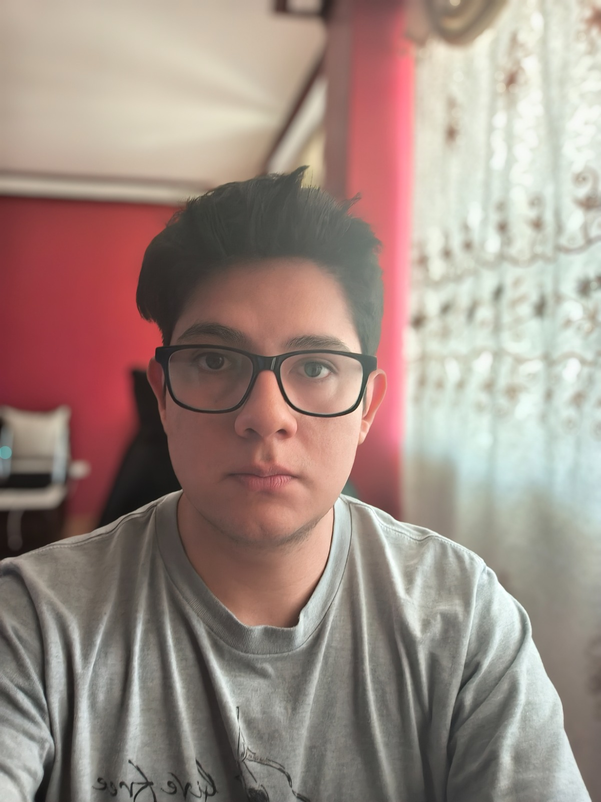

# Capítulo I: Introducción

## 1.1. Startup Profile

### 1.1.1. Descripción de la Startup

### 1.1.2. Perfiles de integrantes del equipo

| Integrante                               | Información                                                                                                                                                                                              | Foto                                                                  |
| :--------------------------------------- | :------------------------------------------------------------------------------------------------------------------------------------------------------------------------------------------------------- | :-------------------------------------------------------------------- |
| **Victor Manuel Rojas Reategui** | `Código:` U202123655    `Carrera:` Ingeniería de Software   Soy Victor Rojas y voy en el 7mo ciclo de la carrera de Ingeniería de Software. Me gusta lo rápido que cambia la tecnología en la actualidad, por lo que este curso me ayudará a expandir mis conocimientos y a explorar nuevas aplicaciones de mi carrera que no había experimentado antes. |     |
| **Renso Anthony Julca Cruz** | `Código:` U202121579   `Carrera:` Ingeniería de Software   Soy Renso Anthony Julca Cruz estudiante de Ingenieria de Software, actualmente curso el 7mo ciclo de esta carrera. Me apasiona programar y ser autodidacta para poder mejorar mis habilidades en el desarrollo de software, quisiera dedicarme a la parte de gestion bancaria, o la parte de data analyst.   Cuento con conocimientos en HTML, CSS y JavaScript en la parte de desarrollo web. Python a nivel básico-intermedio, SQL a nivel intermedio y BI a nivel intermedio. Estas competencias y habilidades me permitiran aportar a este proyecto y poder mejorar en la práctica. |  |
| **Javier Oswaldo Tello Murga** | `Código:` U202116207   `Carrera:` Soy estudiante de Ingeniería de Software en la Universidad Peruana de Ciencias Aplicadas. Me caracterizo por ser una persona responsable, con disposición para aprender continuamente y fortalecer mis conocimientos en temas relacionados con mi formación profesional. Dentro del equipo, aporto compromiso, interés por el trabajo colaborativo y motivación para contribuir activamente en el desarrollo del proyecto. Cuento con conocimientos en WordPress básico, HTML, CSS y JavaScript, Python a nivel básico, fundamentos de base de datos y bases de programación en C++. Estas competencias me permiten apoyar en tareas de documentación, desarrollo web y comprensión de las tecnologías que forman parte de la solución.                                  |     |
| **Jeremy Alión Paucar Meneses** | `Código:` u201919449     `Carrera:` Ingeniería de Software   Soy estudiante de Ingeniería de Software, apasionado por la programación y el desarrollo de soluciones tecnológicas. Poseo conocimientos en C++, JavaScript y C#, así como experiencia básica en el uso de frameworks modernos como Vue.js. Me considero una persona curiosa, perseverante y orientada al aprendizaje continuo. En mi tiempo libre disfruto escuchar música, ver fútbol y series, actividades que me ayudan a mantener el equilibrio entre la creatividad y la concentración.                                                    |     |
| **Renzo Javier Loli Ruiz** | `Código:` U20161C993   `Carrera:` Ingeniería de Software   Soy Renzo Loli, tengo 26 años y soy de la carrera de Ingeniería de Software. Curso el 8vo ciclo. Tengo conocimientos en lenguages como javascript y python y base en arquitecturas cloud como aws. Me desemboco mejor en el ambito de identificar y resolver problemas.                     |     |
| **Sebastian Carbajal Santivañez**| `Código:` u202111461    `Carrera:` Ingeniería de Software   Soy estudiante de Ingeniería de Software en la Universidad Peruana de Ciencias Aplicadas, actualmente cursando el 8vo ciclo de la carrera. Me apasiona el análisis de datos y el desarrollo de Databases, asimismo, el diseñar diferentes tipos de Interfaces para el usuario y brindar UX’s eficiente, asimismo me considero una persona analitica y creativa en el ambito innovativo. Cuento con conocimientos en Lenguajes como Python, React, Node.js MySQL, SQL Management, Swift, C# y C++, también poseo habilidades con la plataforma MongoDB Atlas , Microsoft Azure Studio y Adobe Creative Cloud Suite,Estas competencias me permitiran aportar a este proyecto y poder pulir lo ya adquirido.                                                 |   |

## 1.2. Solution Profile

### 1.2.1. Antecedentes y problemática

### 1.2.2. Lean UX Process

#### 1.2.2.1. Lean UX Problem Statements

#### 1.2.2.2. Lean UX Assumptions

#### 1.2.2.3. Lean UX Hypothesis Statements

#### 1.2.2.4. Lean UX Canvas

## 1.3. Segmentos objetivo
