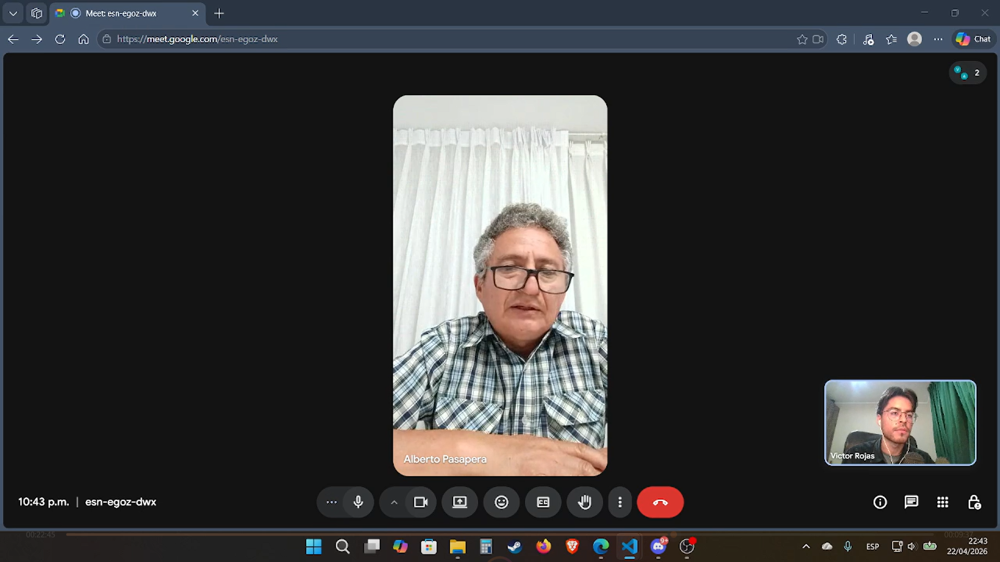
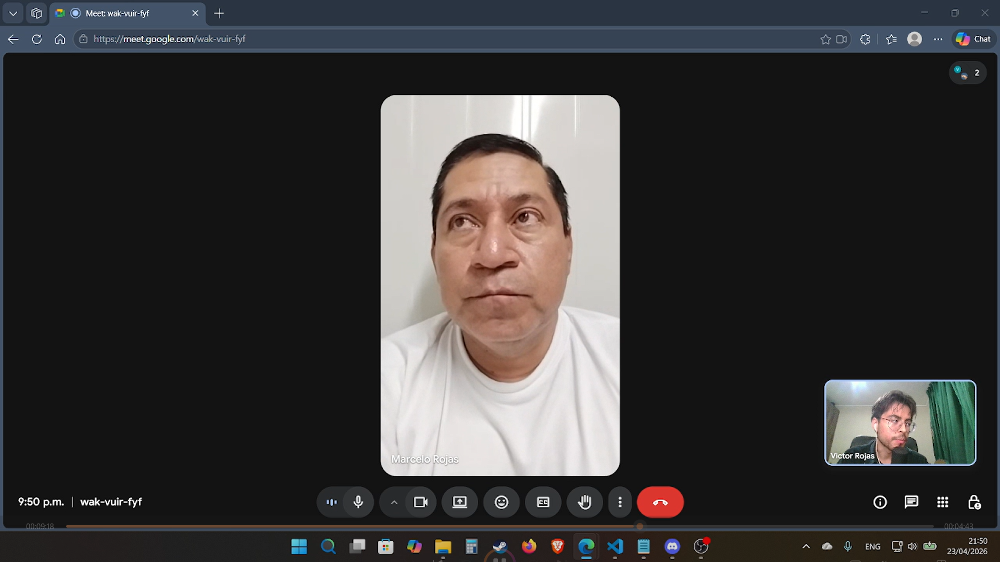
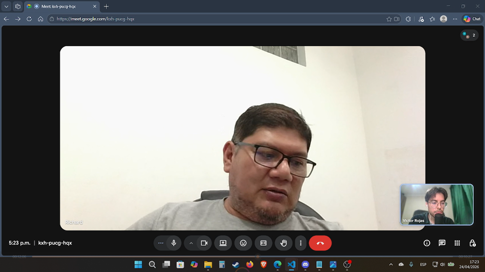
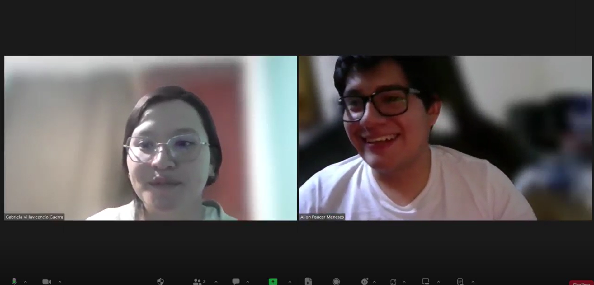

## 2.2. Entrevistas

### 2.2.1. Diseño de Entrevistas

Las entrevistas tienen por objetivo recolectar información primaria sobre las necesidades, comportamientos, frustraciones y expectativas de los dos segmentos objetivos de Smart Palm. Los hallazgos obtenidos servirán como base empírica para la construcción de los User Personas, el User Task Matrix, los User Journey Maps y los Empathy Maps del proceso de needfinding. Las primeras preguntas de cada guía, de carácter introductorio, tienen el propósito de construir el perfil demográfico y contextual del entrevistado para alimentar los arquetipos. Las siguientes preguntas exploran en profundidad las dimensiones relevantes para la validación de la propuesta de valor de Smart Palm.

---

#### Guía de Entrevista — Segmento 1: Dueño del Cultivo de Palma Aceitera

1. ¿Podría presentarse brevemente? ¿Cuántos años lleva cultivando palma aceitera, cuántas hectáreas gestiona actualmente y en qué zona de la región se ubican sus plantaciones?

2. ¿Cómo llegó a dedicarse al cultivo de palma aceitera? ¿Fue una decisión propia, siguió a otros productores de su comunidad o fue parte de algún programa de reconversión de cultivos?

3. ¿Con qué dispositivos tecnológicos cuenta en su día a día —smartphone, tablet, computadora— y con qué frecuencia tiene acceso a internet en la zona donde están sus cultivos?

4. Fuera del cultivo, ¿qué otras actividades económicas o responsabilidades familiares ocupa su tiempo de manera importante?

5. Descríbame cómo es un día típico de trabajo en su plantación: ¿qué actividades realiza, en qué orden y con qué frecuencia visita sus cultivos?

6. Cuando detecta que algo no está bien en su plantación —una hoja amarilla, una palma que no produce bien, alguna plaga—, ¿qué hace exactamente? ¿A quién acude, cuánto tiempo tarda en recibir una solución y qué tan satisfecho queda con ella?

7. ¿Cuál ha sido la pérdida económica más significativa que ha sufrido en sus cultivos en los últimos años? ¿Qué la causó y en qué momento se dio cuenta de que el problema existía?

8. ¿Cómo decide cuándo y cuánto fertilizar, irrigar o aplicar algún producto fitosanitario? ¿Se basa en algún criterio técnico, en su experiencia propia o en la recomendación de alguien?

9. ¿Recibe asistencia técnica de algún agrónomo, cooperativa o institución del Estado? ¿Con qué frecuencia y de qué manera? ¿Qué tan útil le resulta esa asistencia en la práctica?

10. Si pudiera conocer el estado de su cultivo en tiempo real desde su celular —saber cuándo la tierra necesita agua, si hay condiciones de riesgo para enfermedades o cuándo es el mejor momento para cosechar—, ¿le resultaría valioso? ¿Por qué?

11. ¿Ha utilizado alguna vez una aplicación móvil o herramienta digital relacionada con su actividad agrícola? ¿Cuál fue su experiencia? ¿Qué le resultó difícil o sencillo de usar?

12. ¿Estaría dispuesto a pagar una suscripción mensual por una herramienta que le ayude a monitorear sus cultivos y prevenir pérdidas? ¿Qué condiciones tendría que cumplir esa herramienta para que considerara ese gasto justificado?

13. ¿Qué tan importante es para usted que una herramienta tecnológica funcione aunque no haya señal de internet en la zona de cultivo?

14. ¿Qué es lo que más le preocupa actualmente respecto a la rentabilidad o sostenibilidad de su cultivo en los próximos años?

---

#### Guía de Entrevista — Segmento 2: Ingeniero Agrónomo

1. ¿Podría presentarse brevemente? ¿Cuántos años lleva ejerciendo como ingeniero agrónomo, en qué regiones de la Amazonia trabaja y cuántas plantaciones de palma aceitera supervisa actualmente?

2. ¿Trabaja de manera independiente, para una empresa palmicultora o vinculado a alguna institución como el INIA, una cooperativa o el MIDAGRI? ¿Cómo se organiza su carga de trabajo?

3. ¿Qué dispositivos y herramientas digitales utiliza habitualmente en su trabajo? ¿Tiene acceso a internet durante sus visitas de campo?

4. ¿Qué herramientas o plataformas digitales utiliza actualmente para registrar sus observaciones de campo, comunicarse con los productores o generar reportes técnicos?

5. Descríbame cómo planifica y ejecuta el ciclo de supervisión de una plantación: ¿con qué frecuencia la visita, qué evalúa en cada visita y cómo registra sus observaciones?

6. ¿Cuáles son las principales limitaciones logísticas que enfrenta para mantener una supervisión técnica efectiva sobre todas las plantaciones que gestiona? ¿Qué es lo que más le impide hacer mejor su trabajo?

7. Cuénteme sobre alguna situación en que detectó tarde un problema fitosanitario o agronómico en una plantación. ¿Qué consecuencias tuvo y qué habría necesitado para haberlo detectado antes?

8. ¿Cómo comunica sus recomendaciones técnicas a los productores que asesora? ¿Qué tan bien siguen ellos sus instrucciones y qué obstáculos encuentra en ese proceso de comunicación?

9. ¿Qué tipo de datos le resultaría más valioso obtener de manera continua y en tiempo real de una plantación de palma aceitera? ¿Cuáles son los parámetros que considera más críticos para el manejo del cultivo?

10. Si tuviera acceso remoto a datos sensoriales en tiempo real de todas las plantaciones que supervisa —humedad del suelo, temperatura, pH, imágenes del follaje—, ¿cómo cambiaría su forma de trabajar y cuánto tiempo podría ahorrar?

11. ¿Cuánto tiempo dedica actualmente a la generación de reportes técnicos para los productores o para entidades financiadoras? ¿Qué parte de ese proceso considera más tedioso o ineficiente?

12. ¿Estaría dispuesto a recomendar a los productores que asesora el uso de una plataforma de monitoreo IoT si eso le permitiera supervisar más plantaciones con la misma carga de trabajo? ¿Qué condiciones debería cumplir esa plataforma para que se sintiera cómodo recomendándola?

13. ¿Qué tan importante es para usted que las recomendaciones agronómicas generadas por un sistema de IA estén validadas con datos locales de la Amazonia peruana, en lugar de basarse en parámetros genéricos internacionales?

14. ¿Cuál es el mayor reto que enfrenta hoy para demostrar el valor de su trabajo técnico ante los productores y ante entidades financiadoras o certificadoras?

15. En su experiencia, ¿qué factores han hecho fracasar la adopción de tecnología agrícola por parte de los palmicultores de la región? ¿Qué cree que haría diferente a Smart Palm?

---

### 2.2.2. Registro de Entrevistas

---

#### Segmento 1: Dueño del Cultivo de Palma Aceitera

**Entrevista 1**

| Campo | Detalle |
|-------|---------|
| Nombres y Apellidos | Alberto Pasapera |
| Edad | 56|
| Distrito / Zona | Lima, Perú |
| Screenshot del video |  |
| URL del video | https://acortar.link/MEfvZW |
| Timing de inicio en el video compilado | 00:06 |
| Duración de la entrevista | 32:22 |

**Resumen:** Alberto es palmicultor con aproximadamente 2 años de experiencia que gestiona 86 hectáreas en la región Huánuco, distribuidas en dos parcelas de 64 y 22 hectáreas, desarrolladas junto a inversionistas del entorno familiar y amical tras analizar distintas alternativas agropecuarias. Cuenta con smartphone y laptop, pero carece completamente de señal de internet y electricidad en la zona de cultivo, debiendo desplazarse 40 minutos hasta el pueblo más cercano para tener conectividad; evalúa a futuro la instalación de paneles solares para habilitar internet satelital. Dedica el 70% de su tiempo al cultivo y prevé incrementarlo al 100% cuando las plantas entren en producción al tercer año. Su pérdida más significativa fue un manejo inadecuado del deshierbe que permitió que la maleza compitiera con las palmas jóvenes por luz solar y nutrientes, afectando su desarrollo sin detección oportuna. Cuenta con un ingeniero agrónomo que visita la plantación por sectores cada quincena, lo que en la práctica resulta en una evaluación completa del cultivo aproximadamente cada mes. Nunca ha utilizado herramientas digitales agrícolas, pero mostró disposición clara a pagar una suscripción si la solución opera sin conexión permanente, almacenando datos localmente para sincronizarlos después; sus expectativas funcionales incluyen recomendaciones de fertilización, alertas de deficiencias de suelo, estimación del momento óptimo de cosecha, control de stocks de insumos, seguimiento de costos frente a presupuesto y comparativas de rendimiento con otros productores. Su motivación central es maximizar la producción —estima un mínimo de 20 t/ha y aspira a 25–27 t/ha con tecnología— y reducir costos operativos, reconociendo que el precio de mercado está fuera de su control pero la eficiencia productiva no.

---

**Entrevista 2**

| Campo | Detalle |
|-------|---------|
| Nombres y Apellidos | Marcelo Rojas |
| Edad | 50 |
| Distrito / Zona | Lima, Perú |
| Screenshot del video |  |
| URL del video | https://acortar.link/cuvFu3 |
| Timing de inicio en el video compilado | 00:08 |
| Duración de la entrevista | 14:01 |

**Resumen:** Marcelo es palmicultor nuevo desde hace 2 años y medio en la región de Ucayali, con aproximadamente 11 hectáreas de cultivo personal y, en consorcio con socios, 66 hectáreas de 1 año y 2 meses y 22 hectáreas de 6 meses en otras zonas. Se animó a ser palmicultor por influencia de un amigo que le mostró el potencial del cultivo. Cuenta con dispositivos móviles y laptop, sin embargo, en las zonas donde se encuentran sus cultivos existe baja o nula conectividad celular. Para el monitoreo de sus plantaciones, Marcelo realiza visitas presenciales e inspecciones visuales verificando el estado de las hojas y la presencia de vectores e insectos. Cuenta con el apoyo de un ingeniero agrónomo que lo asesora ante cualquier inconveniente y elabora planes de fertilización basados en estudios de suelo; la comunicación entre ambos se da por WhatsApp y llamadas telefónicas. Su pérdida más significativa fue una invasión de roedores que destruyó cerca de 320 plantones en dos episodios, que resolvió de forma reactiva con trampas, malla de protección y limpieza del área. Ha escuchado a conocidos usar herramientas digitales agrícolas, pero no ha implementado ninguna hasta el momento. Marcelo muestra bastante interés en una herramienta como Smart Palm, valorando datos en tiempo real e historial de tendencias del cultivo, y propone soluciones concretas para la conectividad limitada de sus zonas, como antenas Starlink con energía solar y almacenamiento local con sincronización automática al recuperar señal.

---

**Entrevista 3**

| Campo | Detalle |
|-------|---------|
| Nombres y Apellidos | Richard Mori |
| Edad | 53 |
| Distrito / Zona | Ucayali, Perú |
| Screenshot del video |  |
| URL del video | https://acortar.link/ZA77pL |
| Timing de inicio en el video compilado | 00:05 |
| Duración de la entrevista | 22:33 |

**Resumen:** Richard es un ingeniero comercial de profesión que lleva desde 2015 dedicado al cultivo de palma aceitera en la región Ucayali, aproximadamente a 60 km de Pucallpa, con 10 hectáreas sembradas de un terreno de 16 hectáreas que adquirió por influencia de un amigo de la familia con experiencia en el sector. Fuera del cultivo, dedica el 80% de su tiempo a un negocio de servicios logísticos. Cuenta con smartphone y computadora, aunque la zona de cultivo tiene cobertura celular limitada. Visita la plantación semanalmente y se queda aproximadamente una semana cuando hay labores programadas como poda, plateo o abonado. Su principal pérdida fue el reemplazo de 2 hectáreas de palmas antiguas demasiado altas para ser cosechadas manualmente, decisión que implicó resignar producción por los 3 años que tomarán las nuevas plantas en producir. Recibe asistencia técnica directa de la empresa Olanza —a la que provee su producción— que realiza visitas inopinadas y le notifica proactivamente cualquier anomalía por WhatsApp o llamada, describiéndola como inmediata y muy valorada. No ha utilizado ninguna herramienta digital agrícola, pero mostró disposición clara a pagar una suscripción, señalando que el valor estaría en la detección temprana de plagas por zonas antes de que se propaguen en cadena, en el seguimiento de la cosecha cada 15 a 20 días para evitar pérdida de peso por sobremaduración, y en acceder a data histórica para comparaciones y toma de decisiones; aceptó positivamente la propuesta de almacenamiento local con sincronización al recuperar señal. Sus principales preocupaciones a futuro son la entrada de plagas devastadoras —citando como referencia lo ocurrido en África y Colombia— y el impacto del cambio climático, especialmente las sequías, dado que prácticamente ninguna plantación en Ucayali cuenta con sistema de riego.

---

#### Segmento 2: Ingeniero Agrónomo

**Entrevista 1**

| Campo | Detalle |
|-------|---------|
| Nombres y Apellidos | Catalina Villavicencio Guerra |
| Edad | 29 |
| Distrito / Zona | Arequipa, Perú  |
| Screenshot del video |  |
| URL del video | https://acortar.link/rBS6Zt |
| Timing de inicio en el video compilado | 00:02 |
| Duración de la entrevista | 10:38 |

Resumen:  La profesional identifica tres ausencias críticas en la agricultura peruana: falta de datos agronómicos en tiempo real —humedad de suelo, temperatura, precipitación, que obliga a decidir por intuición y no por evidencia; asistencia técnica discontinua, concentrada en grandes empresas y prácticamente inexistente en zonas alejadas de San Martín, Ucayali y Loreto;  ausencia total de trazabilidad, sin registro de qué afectó al cultivo ni cuándo. Sobre la gestión actual en zonas remotas, describe un modelo artesanal basado en la experiencia empírica del productor, visitas técnicas esporádicas y anotaciones en cuaderno, agravado por la nula conectividad a internet. Respecto a Smart Palm, valora positivamente la arquitectura edge-fog-cloud con procesamiento local y sincronización offline por adaptarse a la realidad de conectividad intermitente del campo peruano. Destaca la clara separación de roles entre dueño del cultivo e ingeniero agrónomo, y el ciclo cerrado que convierte lecturas de sensores en acciones agronómicas concretas. Concluye que la propuesta demuestra entendimiento real de las restricciones del agro peruano y ofrece una base sólida para reducir la brecha entre monitoreo digital y decisión técnica. Como mejora futura sugiere incorporar recomendaciones automatizadas básicas basadas en combinaciones de variables críticas.

---

---

### 2.2.3. Análisis de Entrevistas

*Esta sección se completará una vez concluido el registro y resumen de todas las entrevistas. El análisis debe realizarse por segmento objetivo, identificando con sustento estadístico —porcentajes sobre el total de entrevistados del segmento— las características objetivas y subjetivas más representativas para la construcción de los arquetipos. A continuación se presenta la estructura que debe completarse.*

---

#### Análisis — Segmento 1: Dueño del Cultivo de Palma Aceitera

El análisis siguiente se basa en las tres entrevistas realizadas a representantes del segmento de dueños del cultivo de palma aceitera. Los porcentajes se calculan sobre el total de entrevistados del segmento (n=3). El objetivo es identificar las características objetivas y subjetivas más representativas para la construcción del User Persona correspondiente.

**Características demográficas objetivas**

El 100% de los entrevistados son de género masculino. El rango de edad se sitúa entre los 30 y 55 años aproximadamente. En cuanto a formación, el perfil es heterogéneo: uno de los entrevistados tiene formación técnica agropecuaria implícita por experiencia, otro es ingeniero comercial de profesión y el tercero tiene perfil de inversionista con experiencia en otros rubros, lo que indica que el 100% llegó al cultivo desde actividades económicas previas distintas a la agricultura de palma. El 67% (2 de 3) gestiona sus plantaciones en la región Ucayali, mientras que el 33% restante opera en Huánuco. El 100% gestiona superficies superiores a las 10 hectáreas, con extensiones que van desde las 10 hasta las 86 hectáreas propias, y en dos de los tres casos se suman hectáreas adicionales en régimen de consorcio o sociedad. El 67% lleva menos de 3 años en el cultivo, encontrándose aún en etapa de establecimiento sin producción, mientras que el 33% tiene más de 9 años de experiencia y sí está en etapa productiva.

**Características tecnológicas**

El 100% de los entrevistados cuenta con smartphone y laptop o computadora como dispositivos principales. Sin embargo, el 100% reportó tener conectividad celular deficiente o nula en las zonas donde se ubican sus cultivos, debiendo desplazarse a centros poblados cercanos para acceder a internet. Ninguno de los tres ha utilizado alguna vez una herramienta digital específica para la gestión agrícola. El 67% mencionó espontáneamente soluciones tecnológicas para resolver la limitación de conectividad —como internet satelital Starlink, paneles solares y almacenamiento local de datos con sincronización posterior— lo que indica un nivel de alfabetización digital superior al promedio del productor tradicional de la región.

**Comportamientos y hábitos agronómicos**

El 100% de los entrevistados basa el monitoreo de sus cultivos en inspecciones visuales presenciales, con una frecuencia que varía entre visitas semanales (33%) y visitas mensuales (67%). En todos los casos, las decisiones de fertilización y manejo fitosanitario se delegan a un ingeniero agrónomo o técnico especializado, ya sea contratado directamente o provisto por la empresa compradora. El 100% organiza sus labores agronómicas —poda, plateo, deshierbe, abonado— mediante programación previa con el personal de campo. Ninguno de los tres realiza mediciones objetivas de parámetros del suelo o del cultivo de manera propia; todos dependen del criterio del técnico para interpretar el estado de la plantación.

**Frustraciones principales**

El 100% de los entrevistados identificó como frustración central la imposibilidad de conocer el estado de su cultivo de manera continua entre visitas, ya sea por la frecuencia insuficiente del agrónomo, por la extensión de las parcelas o por la falta de herramientas de monitoreo. El 67% reportó haber sufrido pérdidas económicas significativas atribuibles a problemas detectados de forma tardía: manejo inadecuado del deshierbe en el caso de Alberto y plaga de roedores en el caso de Marcelo. El 100% expresó preocupación por la propagación de plagas y enfermedades, destacando el riesgo de no detectarlas a tiempo antes de que afecten sectores amplios de la plantación. El 100% señaló la falta de conectividad en zona de cultivo como una limitación operativa relevante para la adopción de cualquier herramienta tecnológica.

**Objetivos y motivaciones**

El 100% de los entrevistados tiene como objetivo central maximizar la producción de RFF por hectárea y reducir los costos operativos para mejorar la rentabilidad del cultivo. El 67% expresó interés en controlar o proyectar sus costos de insumos y mano de obra mediante alguna herramienta de seguimiento. El 33% mencionó explícitamente el deseo de comparar su rendimiento con el de otros productores de la zona para identificar oportunidades de mejora. En todos los casos, la motivación subyacente es económica: el cultivo representa una inversión patrimonial importante, en algunos casos compartida con socios o financiada con ingresos de otras actividades.

**Actitud frente a la tecnología y disposición de pago**

El 100% de los entrevistados manifestó disposición a pagar una suscripción mensual por una herramienta de monitoreo si esta demuestra impacto directo en la producción o en la reducción de pérdidas. Las condiciones mencionadas de manera recurrente para justificar ese gasto son: funcionamiento sin conexión permanente a internet con sincronización posterior (100%), recomendaciones de fertilización y alertas de deficiencias del suelo (67%), seguimiento histórico de datos del cultivo para análisis de tendencias (67%) y detección temprana de plagas o condiciones de riesgo (100%). El 100% mostró una actitud receptiva y no defensiva frente a la tecnología, aunque ninguno ha dado el paso de adoptarla aún, principalmente por la ausencia de soluciones adaptadas a las condiciones de conectividad de sus zonas de cultivo.

---

#### Análisis — Segmento 2: Ingeniero Agrónomo

**Características demográficas objetivas**

**Características tecnológicas**

**Comportamientos y hábitos de supervisión**

**Frustraciones principales**

**Objetivos y motivaciones profesionales**

**Actitud frente a herramientas de monitoreo remoto e IA agronómica**

---
