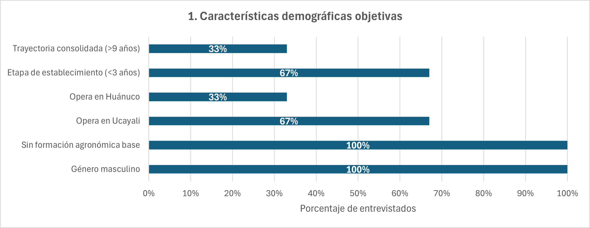
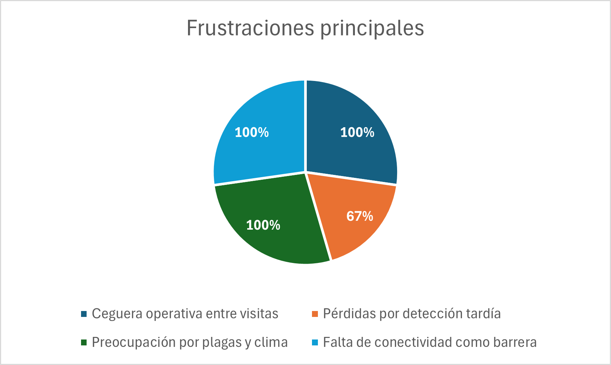
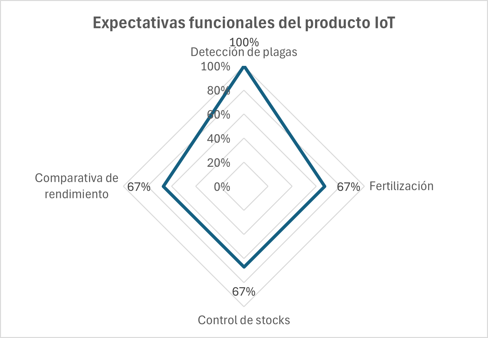

## 2.2. Entrevistas

### 2.2.1. Diseño de Entrevistas

Las entrevistas tienen por objetivo recolectar información primaria sobre las necesidades, comportamientos, frustraciones y expectativas de los dos segmentos objetivos de Smart Palm. Los hallazgos obtenidos servirán como base empírica para la construcción de los User Personas, el User Task Matrix, los User Journey Maps y los Empathy Maps del proceso de needfinding. Las primeras preguntas de cada guía, de carácter introductorio, tienen el propósito de construir el perfil demográfico y contextual del entrevistado para alimentar los arquetipos. Las siguientes preguntas exploran en profundidad las dimensiones relevantes para la validación de la propuesta de valor de Smart Palm.

---

#### Guía de Entrevista — Segmento 1: Dueño del Cultivo de Palma Aceitera

1. ¿Podría presentarse brevemente? ¿Cuántos años lleva cultivando palma aceitera, cuántas hectáreas gestiona actualmente y en qué zona de la región se ubican sus plantaciones?

2. ¿Cómo llegó a dedicarse al cultivo de palma aceitera? ¿Fue una decisión propia, siguió a otros productores de su comunidad o fue parte de algún programa de reconversión de cultivos?

3. ¿Con qué dispositivos tecnológicos cuenta en su día a día —smartphone, tablet, computadora— y con qué frecuencia tiene acceso a internet en la zona donde están sus cultivos?

4. Fuera del cultivo, ¿qué otras actividades económicas o responsabilidades familiares ocupa su tiempo de manera importante?

5. Descríbame cómo es un día típico de trabajo en su plantación: ¿qué actividades realiza, en qué orden y con qué frecuencia visita sus cultivos?

6. Cuando detecta que algo no está bien en su plantación —una hoja amarilla, una palma que no produce bien, alguna plaga—, ¿qué hace exactamente? ¿A quién acude, cuánto tiempo tarda en recibir una solución y qué tan satisfecho queda con ella?

7. ¿Cuál ha sido la pérdida económica más significativa que ha sufrido en sus cultivos en los últimos años? ¿Qué la causó y en qué momento se dio cuenta de que el problema existía?

8. ¿Cómo decide cuándo y cuánto fertilizar, irrigar o aplicar algún producto fitosanitario? ¿Se basa en algún criterio técnico, en su experiencia propia o en la recomendación de alguien?

9. ¿Recibe asistencia técnica de algún agrónomo, cooperativa o institución del Estado? ¿Con qué frecuencia y de qué manera? ¿Qué tan útil le resulta esa asistencia en la práctica?

10. Si pudiera conocer el estado de su cultivo en tiempo real desde su celular —saber cuándo la tierra necesita agua, si hay condiciones de riesgo para enfermedades o cuándo es el mejor momento para cosechar—, ¿le resultaría valioso? ¿Por qué?

11. ¿Ha utilizado alguna vez una aplicación móvil o herramienta digital relacionada con su actividad agrícola? ¿Cuál fue su experiencia? ¿Qué le resultó difícil o sencillo de usar?

12. ¿Estaría dispuesto a pagar una suscripción mensual por una herramienta que le ayude a monitorear sus cultivos y prevenir pérdidas? ¿Qué condiciones tendría que cumplir esa herramienta para que considerara ese gasto justificado?

13. ¿Qué tan importante es para usted que una herramienta tecnológica funcione aunque no haya señal de internet en la zona de cultivo?

14. ¿Qué es lo que más le preocupa actualmente respecto a la rentabilidad o sostenibilidad de su cultivo en los próximos años?

---

#### Guía de Entrevista — Segmento 2: Ingeniero Agrónomo

1. ¿Podría presentarse brevemente? ¿Cuántos años lleva ejerciendo como ingeniero agrónomo, en qué regiones de la Amazonia trabaja y cuántas plantaciones de palma aceitera supervisa actualmente?

2. ¿Trabaja de manera independiente, para una empresa palmicultora o vinculado a alguna institución como el INIA, una cooperativa o el MIDAGRI? ¿Cómo se organiza su carga de trabajo?

3. ¿Qué dispositivos y herramientas digitales utiliza habitualmente en su trabajo? ¿Tiene acceso a internet durante sus visitas de campo?

4. ¿Qué herramientas o plataformas digitales utiliza actualmente para registrar sus observaciones de campo, comunicarse con los productores o generar reportes técnicos?

5. Descríbame cómo planifica y ejecuta el ciclo de supervisión de una plantación: ¿con qué frecuencia la visita, qué evalúa en cada visita y cómo registra sus observaciones?

6. ¿Cuáles son las principales limitaciones logísticas que enfrenta para mantener una supervisión técnica efectiva sobre todas las plantaciones que gestiona? ¿Qué es lo que más le impide hacer mejor su trabajo?

7. Cuénteme sobre alguna situación en que detectó tarde un problema fitosanitario o agronómico en una plantación. ¿Qué consecuencias tuvo y qué habría necesitado para haberlo detectado antes?

8. ¿Cómo comunica sus recomendaciones técnicas a los productores que asesora? ¿Qué tan bien siguen ellos sus instrucciones y qué obstáculos encuentra en ese proceso de comunicación?

9. ¿Qué tipo de datos le resultaría más valioso obtener de manera continua y en tiempo real de una plantación de palma aceitera? ¿Cuáles son los parámetros que considera más críticos para el manejo del cultivo?

10. Si tuviera acceso remoto a datos sensoriales en tiempo real de todas las plantaciones que supervisa —humedad del suelo, temperatura, pH, imágenes del follaje—, ¿cómo cambiaría su forma de trabajar y cuánto tiempo podría ahorrar?

11. ¿Cuánto tiempo dedica actualmente a la generación de reportes técnicos para los productores o para entidades financiadoras? ¿Qué parte de ese proceso considera más tedioso o ineficiente?

12. ¿Estaría dispuesto a recomendar a los productores que asesora el uso de una plataforma de monitoreo IoT si eso le permitiera supervisar más plantaciones con la misma carga de trabajo? ¿Qué condiciones debería cumplir esa plataforma para que se sintiera cómodo recomendándola?

13. ¿Qué tan importante es para usted que las recomendaciones agronómicas generadas por un sistema de IA estén validadas con datos locales de la Amazonia peruana, en lugar de basarse en parámetros genéricos internacionales?

14. ¿Cuál es el mayor reto que enfrenta hoy para demostrar el valor de su trabajo técnico ante los productores y ante entidades financiadoras o certificadoras?

15. En su experiencia, ¿qué factores han hecho fracasar la adopción de tecnología agrícola por parte de los palmicultores de la región? ¿Qué cree que haría diferente a Smart Palm?

---

### 2.2.2. Registro de Entrevistas

---

#### Segmento 1: Dueño del Cultivo de Palma Aceitera

**Entrevista 1**

| Campo | Detalle |
|-------|---------|
| Nombres y Apellidos | Alberto Pasapera |
| Edad | 56|
| Distrito / Zona | Lima, Perú |
| Screenshot del video |  |
| URL del video | https://acortar.link/MEfvZW |
| Timing de inicio en el video compilado | 00:06 |
| Duración de la entrevista | 32:22 |

**Resumen:** Alberto es un palmicultor pragmático y enfocado en la eficiencia, con aproximadamente 2 años de experiencia. Gestiona 86 hectáreas en la región Huánuco, distribuidas en dos parcelas de 64 y 22 hectáreas, desarrolladas junto a inversionistas del entorno familiar y amical tras analizar distintas alternativas agropecuarias. Cuenta con un smartphone marca Samsung y una laptop (de marca no precisada), y cuando tiene acceso a internet utiliza Chrome como navegador principal. Sin embargo, carece completamente de señal de internet y electricidad en la zona de cultivo, debiendo desplazarse 40 minutos hasta el pueblo más cercano para tener conectividad; evalúa a futuro la instalación de paneles solares para habilitar internet satelital. Para sus interacciones diarias, prefiere comunicarse a través de llamadas telefónicas y WhatsApp.

Dedica el 70% de su tiempo al cultivo y prevé incrementarlo al 100% cuando las plantas entren en producción al tercer año. Su pérdida más significativa fue un manejo inadecuado del deshierbe que permitió que la maleza compitiera con las palmas jóvenes por luz solar y nutrientes, afectando su desarrollo sin detección oportuna. Cuenta con un ingeniero agrónomo que visita la plantación por sectores cada quincena, lo que en la práctica resulta en una evaluación completa del cultivo aproximadamente cada mes. Nunca ha utilizado herramientas digitales agrícolas, pero mostró disposición clara a pagar una suscripción si la solución opera sin conexión permanente, almacenando datos localmente para sincronizarlos después; sus expectativas funcionales incluyen recomendaciones de fertilización, alertas de deficiencias de suelo, estimación del momento óptimo de cosecha, control de stocks de insumos, seguimiento de costos frente a presupuesto y comparativas de rendimiento con otros productores. Su motivación central es maximizar la producción —estima un mínimo de 20 t/ha y aspira a 25–27 t/ha con tecnología— y reducir costos operativos, reconociendo que el precio de mercado está fuera de su control pero la eficiencia productiva no.

---

**Entrevista 2**

| Campo | Detalle |
|-------|---------|
| Nombres y Apellidos | Marcelo Rojas |
| Edad | 50 |
| Distrito / Zona | Lima, Perú |
| Screenshot del video |  |
| URL del video | https://acortar.link/cuvFu3 |
| Timing de inicio en el video compilado | 00:08 |
| Duración de la entrevista | 14:01 |

**Resumen:** Marcelo es un palmicultor de perfil proactivo e innovador, nuevo en el rubro desde hace 2 años y medio en la región de Ucayali, con aproximadamente 11 hectáreas de cultivo personal y, en consorcio con socios, 66 hectáreas de 1 año y 2 meses y 22 hectáreas de 6 meses en otras zonas. Se animó a ser palmicultor por influencia de un amigo que le mostró el potencial del cultivo. Cuenta con dispositivos móviles marca Xiaomi y una laptop, y cuando tiene conexión a internet, su navegador de preferencia es Chrome. Sin embargo, en las zonas donde se encuentran sus cultivos existe baja o nula conectividad celular.

Para el monitoreo de sus plantaciones, Marcelo realiza visitas presenciales e inspecciones visuales verificando el estado de las hojas y la presencia de vectores e insectos. Cuenta con el apoyo de un ingeniero agrónomo que lo asesora ante cualquier inconveniente y elabora planes de fertilización basados en estudios de suelo; la comunicación entre ambos se da por WhatsApp y llamadas telefónicas. Su pérdida más significativa fue una invasión de roedores que destruyó cerca de 320 plantones en dos episodios, que resolvió de forma reactiva con trampas, malla de protección y limpieza del área. Ha escuchado a conocidos usar herramientas digitales agrícolas, pero no ha implementado ninguna hasta el momento. Marcelo muestra bastante interés en una herramienta como Smart Palm, valorando datos en tiempo real e historial de tendencias del cultivo, y propone soluciones concretas para la conectividad limitada de sus zonas, como antenas Starlink con energía solar y almacenamiento local con sincronización automática al recuperar señal.

---

**Entrevista 3**

| Campo | Detalle |
|-------|---------|
| Nombres y Apellidos | Richard Mori |
| Edad | 53 |
| Distrito / Zona | Ucayali, Perú |
| Screenshot del video |  |
| URL del video | https://acortar.link/ZA77pL |
| Timing de inicio en el video compilado | 00:05 |
| Duración de la entrevista | 22:33 |

**Resumen:** Richard es un palmicultor de perfil analítico y estratégico, ingeniero comercial de profesión, que lleva desde 2015 dedicado al cultivo de palma aceitera en la región Ucayali, aproximadamente a 60 km de Pucallpa, con 10 hectáreas sembradas de un terreno de 16 hectáreas que adquirió por influencia de un amigo de la familia con experiencia en el sector. Fuera del cultivo, dedica el 80% de su tiempo a un negocio de servicios logísticos. Cuenta con un smartphone marca Xiaomi y una computadora HP VICTUS, y utiliza el navegador Chrome para gestionar sus actividades digitales, aunque la zona de cultivo presenta cobertura celular limitada.

Visita la plantación semanalmente y se queda aproximadamente una semana cuando hay labores programadas como poda, plateo o abonado. Su principal pérdida fue el reemplazo de 2 hectáreas de palmas antiguas demasiado altas para ser cosechadas manualmente, decisión que implicó resignar producción por los 3 años que tomarán las nuevas plantas en producir. Recibe asistencia técnica directa de la empresa Olanza —a la que provee su producción—, la cual realiza visitas inopinadas y le notifica proactivamente cualquier anomalía por WhatsApp o llamada, describiéndola como inmediata y muy valorada. No ha utilizado ninguna herramienta digital agrícola, pero mostró disposición clara a pagar una suscripción, señalando que el valor estaría en la detección temprana de plagas por zonas antes de que se propaguen en cadena, en el seguimiento de la cosecha cada 15 a 20 días para evitar pérdida de peso por sobremaduración, y en acceder a data histórica para comparaciones y toma de decisiones; aceptó positivamente la propuesta de almacenamiento local con sincronización al recuperar señal. Sus principales preocupaciones a futuro son la entrada de plagas devastadoras —citando como referencia lo ocurrido en África y Colombia— y el impacto del cambio climático, especialmente las sequías, dado que prácticamente ninguna plantación en Ucayali cuenta con sistema de riego.

---

#### Segmento 2: Ingeniero Agrónomo

**Entrevista 1**

| Campo | Detalle |
|-------|---------|
| Nombres y Apellidos | Catalina Villavicencio Guerra |
| Edad | 29 |
| Distrito / Zona | Arequipa, Perú  |
| Screenshot del video |  |
| URL del video | https://acortar.link/rBS6Zt |
| Timing de inicio en el video compilado | 00:02 |
| Duración de la entrevista | 10:38 |

Resumen:  La profesional identifica tres ausencias críticas en la agricultura peruana: falta de datos agronómicos en tiempo real —humedad de suelo, temperatura, precipitación, que obliga a decidir por intuición y no por evidencia; asistencia técnica discontinua, concentrada en grandes empresas y prácticamente inexistente en zonas alejadas de San Martín, Ucayali y Loreto;  ausencia total de trazabilidad, sin registro de qué afectó al cultivo ni cuándo. Sobre la gestión actual en zonas remotas, describe un modelo artesanal basado en la experiencia empírica del productor, visitas técnicas esporádicas y anotaciones en cuaderno, agravado por la nula conectividad a internet. Respecto a Smart Palm, valora positivamente la arquitectura edge-fog-cloud con procesamiento local y sincronización offline por adaptarse a la realidad de conectividad intermitente del campo peruano. Destaca la clara separación de roles entre dueño del cultivo e ingeniero agrónomo, y el ciclo cerrado que convierte lecturas de sensores en acciones agronómicas concretas. Concluye que la propuesta demuestra entendimiento real de las restricciones del agro peruano y ofrece una base sólida para reducir la brecha entre monitoreo digital y decisión técnica. Como mejora futura sugiere incorporar recomendaciones automatizadas básicas basadas en combinaciones de variables críticas.

**Entrevista 2**

| Campo | Detalle |
|-------|---------|
  | Nombres y Apellidos | Cesar Santivañez Solis |
| Edad | 43 |
| Distrito / Zona | Ucayali, Perú  |
| Screenshot del video | - |
| URL del video | - |
| Timing de inicio en el video compilado | 0:02 |
| Duración de la entrevista | 10:10 |

Resumen:  El Ingeniero señala que su labor depende casi exclusivamente de lo que observa en cada visita, sin ningún respaldo sensorial entre una supervisión y otra. Esto es especialmente riesgoso con enfermedades como la pudrición del cogollo, donde detectar el síntoma tarde suele significar la pérdida irreversible de la planta, como ilustra un caso real que relata en Curimaná. A esto se suma una limitación logística fuerte: gran parte de su tiempo se va en trasladarse a plantaciones dispersas en Ucayali y San Martín, siguiendo una ruta fija en vez de una basada en urgencia real. Su respaldo documental tampoco ayuda, ya que se reduce a fotos sueltas y reportes en Excel, sin un historial de datos que sustente sus recomendaciones ante productores o financiadoras.
Frente a esto, valora en SmartPalm la posibilidad de priorizar visitas según datos reales y no por calendario, ahorrando tiempo de traslado. Como condiciones clave pide que funcione con conectividad intermitente, sea simple de usar y accesible en costo para pequeños productores, y que las recomendaciones estén calibradas con datos reales de la Amazonía y no con parámetros genéricos. Concluye que el problema no es falta de criterio técnico sino de información continua, y sugiere como mejora futura alertas tempranas automáticas ante combinaciones de variables de riesgo fitosanitario.

---

---

### 2.2.3. Análisis de Entrevistas

*Esta sección se completará una vez concluido el registro y resumen de todas las entrevistas. El análisis debe realizarse por segmento objetivo, identificando con sustento estadístico —porcentajes sobre el total de entrevistados del segmento— las características objetivas y subjetivas más representativas para la construcción de los arquetipos. A continuación se presenta la estructura que debe completarse.*

---

#### Análisis — Segmento 1: Dueño del Cultivo de Palma Aceitera

El siguiente análisis sintetiza los resultados de las tres entrevistas realizadas a dueños de cultivos de palma aceitera (n=3). El objetivo es identificar los patrones de comportamiento, necesidades y expectativas para la definición de los User Personas.

**Características demográficas objetivas**

El 100% de los entrevistados es de género masculino, con edades que oscilan entre los 30 y 55 años. Un hallazgo relevante es la procedencia heterogénea: ninguno tiene una formación agronómica de base; provienen de ámbitos como la ingeniería comercial, la logística y la inversión en otros sectores. Esto los define como gestores con visión empresarial, pero con una brecha técnica que cubren mediante asesoría externa. El 67% opera en la región de Ucayali y el 33% en Huánuco, gestionando superficies que van desde las 10 hasta las 86 hectáreas. El 67% se encuentra en una etapa de establecimiento (menores de 3 años en el rubro), mientras que el 33% ya posee una trayectoria consolidada de más de 9 años.

**Características tecnológicas**

Todos los entrevistados poseen smartphones (marcas Samsung y Xiaomi) y laptops (HP VICTUS y marcas no especificadas), utilizando el navegador Chrome de forma estandarizada. La limitación crítica es el entorno: el 100% enfrenta conectividad deficiente o nula en campo. A pesar de esto, demuestran un nivel de alfabetización digital alto; el 100% está dispuesto a adoptar tecnología si esta contempla el almacenamiento local y sincronización automática. Richard y Marcelo incluso proponen activamente soluciones de conectividad (Starlink, paneles solares), lo que evidencia una actitud innovadora ante las barreras geográficas.

**Comportamientos y hábitos agronómicos**

El monitoreo se realiza mediante inspecciones visuales presenciales, con frecuencias que varían de semanal (33%) a mensual (67%). Existe una dependencia absoluta del ingeniero agrónomo para la toma de decisiones técnicas (fertilización y manejo fitosanitario). Esta dependencia actúa como un cuello de botella: al ser visitas espaciadas, los dueños sienten que carecen de visibilidad en tiempo real entre una visita y otra, delegando la salud de su patrimonio a un experto externo que no siempre está presente en el momento crítico.

**Frustraciones principales**

La frustración unánime es la "ceguera" operativa entre visitas. El 67% ha sufrido pérdidas cuantificables por detección tardía de problemas: Alberto perdió desarrollo de plantas por maleza no controlada y Marcelo perdió 320 plantones por roedores. El temor a la propagación de plagas (citando riesgos en África y Colombia) y el impacto del cambio climático (sequías) son preocupaciones constantes. La falta de conectividad en el campo se percibe no como una imposibilidad tecnológica, sino como una barrera operativa que esperan que cualquier solución IoT resuelva mediante el diseño de hardware robusto y protocolos de sincronización local.

**Objetivos y motivaciones**

El 100% de los usuarios busca maximizar la producción (toneladas por hectárea) y reducir costos operativos. A diferencia de un agricultor tradicional, ellos ven el cultivo como una inversión patrimonial estratégica. Están motivados por la eficiencia productiva: el 67% busca activamente comparar rendimientos con otros productores y controlar stocks. Su interés no es solo "cultivar", sino "gestionar" un activo.

**Actitud frente a la tecnología y disposición de pago**

El 100% está dispuesto a pagar una suscripción mensual, siempre que el sistema demuestre reducir pérdidas o aumentar el rendimiento. Sus expectativas funcionales son claras y coinciden en:

1. Detección temprana de plagas (100%).
2. Alertas de deficiencias de suelo y recomendaciones de fertilización (67%).
3. Seguimiento de cosecha para evitar sobremaduración (Richard).
4. Almacenamiento local con sincronización (100%).

---

#### Análisis — Segmento 2: Ingeniero Agrónomo

Este análisis se elaboró a partir de dos entrevistas realizadas a profesionales que ejercen supervisión técnica en cultivos de palma aceitera (n=2). Los porcentajes reportados se calculan sobre el total de entrevistados de este segmento, con el fin de sustentar la construcción del User Persona correspondiente.

**Características demográficas objetivas**

Los entrevistados tienen 29 y 43 años respectivamente, lo que evidencia que las carencias identificadas no responden a una brecha generacional sino a limitaciones estructurales del sector. Sus formaciones son afines pero no idénticas —ingeniería agroindustrial en un caso, agronomía especializada en el otro— y ambos ejercen su labor técnica en la Amazonía peruana. Ucayali y San Martín aparecen mencionadas como zonas de trabajo, mientras que Loreto fue referida únicamente. En cuanto a su modalidad laboral, uno trabaja de forma semi-independiente afiliado a una cooperativa de productores, mientras que la otra entrevistada enfoca su labor en zonas alejadas donde la asistencia técnica formal es prácticamente inexistente.

**Características tecnológicas**

Ambos entrevistados dependen del celular como herramienta principal para el registro de campo, apoyándose en soluciones no especializadas —Excel, cuaderno físico, WhatsApp— ante la falta de una plataforma dedicada a gestión agronómica; ninguno reportó haber usado alguna vez una herramienta digital específica para este fin. La conectividad a internet fue señalada por el 100% como deficiente o intermitente durante las visitas, un factor que obliga a mantener los registros offline hasta encontrar cobertura, replicando así el mismo cuello de botella tecnológico identificado en el segmento de dueños de cultivo.

**Comportamientos y hábitos de supervisión**

La supervisión en este segmento se sostiene sobre visitas técnicas presenciales espaciadas —cada dos a tres semanas según uno de los entrevistados— durante las cuales se evalúa de forma visual el follaje, el suelo y el desarrollo de los racimos. El registro posterior es manual en el 100% de los casos, ya sea en libreta física, notas de voz o fotografías, con transcripción diferida a un archivo digital. Ninguno de los dos entrevistados cuenta con mediciones instrumentales continuas del cultivo; el criterio técnico y la experiencia acumulada siguen siendo la única fuente de diagnóstico disponible.

**Frustraciones principales**

La detección tardía de problemas fitosanitarios surge como la preocupación más consistente del segmento, ilustrada con un caso concreto de pérdida irreversible de planta por un síntoma no identificado a tiempo. A esto se suma una limitación logística estructural: el tiempo invertido en trasladarse entre plantaciones dispersas termina superando el tiempo real dedicado a la evaluación técnica, obligando a rutas fijas en lugar de visitas priorizadas por urgencia. Cada entrevistado aportó además un matiz propio: uno destacó la fragilidad de su respaldo documental frente a productores y financiadoras, mientras que la otra enfatizó la discontinuidad casi total de la asistencia técnica en zonas alejadas.

**Objetivos y motivaciones profesionales**

Ambos entrevistados coinciden en que su principal aspiración profesional es poder respaldar sus recomendaciones técnicas con evidencia objetiva en lugar de depender únicamente del juicio empírico acumulado por experiencia. De forma igualmente unánime, buscan optimizar su tiempo de supervisión para cubrir más plantaciones sin que ello implique una carga de trabajo adicional, lo que supone pasar de un esquema de visitas por calendario a uno guiado por nivel de riesgo real.

**Actitud frente a herramientas de monitoreo remoto e IA agronómica**

La disposición hacia una plataforma de monitoreo IoT es positiva en el 100% del segmento, aunque sujeta a tres condiciones que ambos mencionaron de forma independiente: estabilidad de funcionamiento pese a la conectividad intermitente, simplicidad de uso para productores con bajo manejo tecnológico, y un costo accesible que no excluya a los palmicultores pequeños. Existe también consenso total en que las recomendaciones generadas por IA deben calibrarse con datos agronómicos propios de la Amazonía peruana, descartando de forma explícita los modelos entrenados con parámetros internacionales genéricos. Un matiz diferenciador: mientras uno de los entrevistados valoró en detalle la arquitectura edge-fog-cloud de SmartPalm —en particular la sincronización offline y la separación de roles entre productor y agrónomo—, el otro puso el foco en el impacto directo que esta tecnología tendría sobre su tiempo de traslado y su capacidad de sustentar técnicamente su criterio.

---
