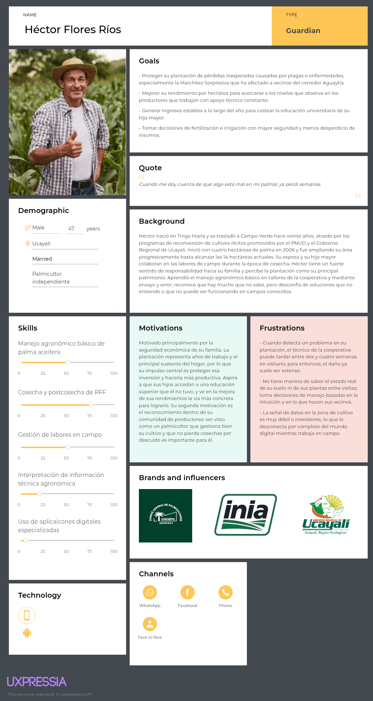
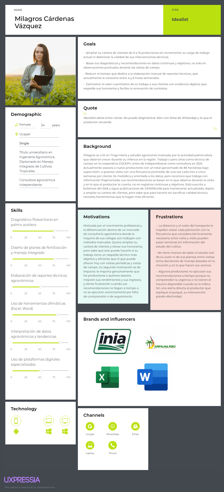
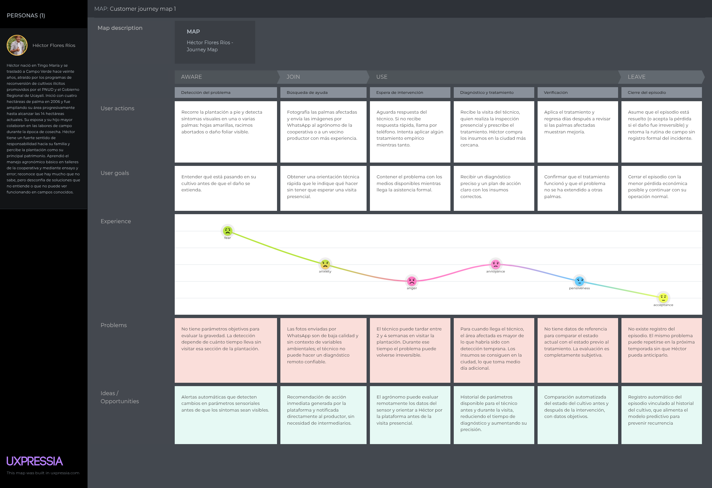
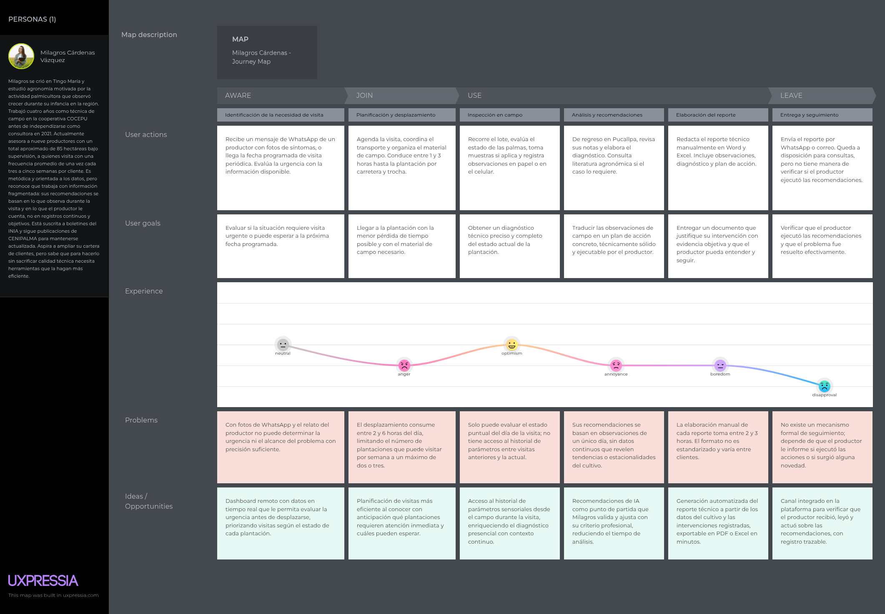
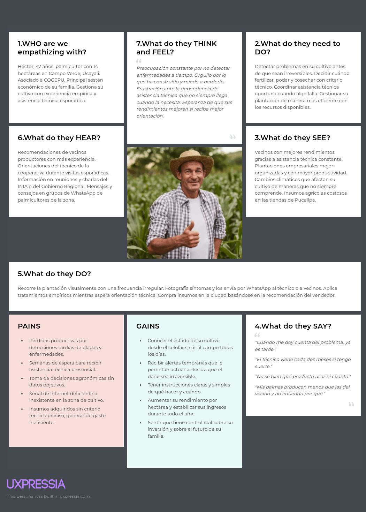
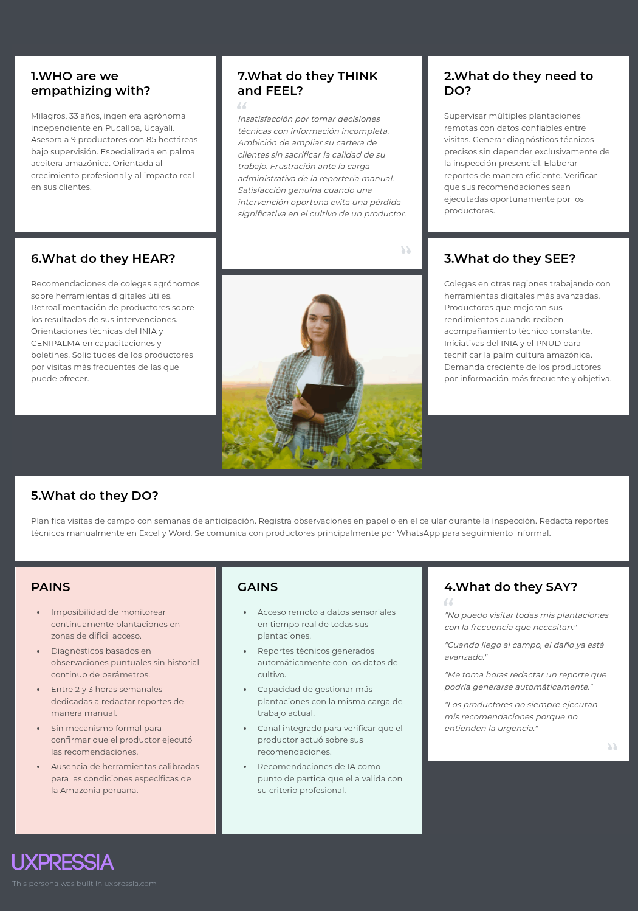

## 2.3. Needfinding

### 2.3.1. User Personas

Los User Personas se elaboran en UXPressia y sus capturas se incluyen en esta sección. A continuación se especifica el contenido que debe completarse en cada campo de la ficha para cada segmento, derivado del análisis de entrevistas. Se elabora una ficha por segmento objetivo.

---

#### User Persona — Segmento 1: Dueño del Cultivo de Palma Aceitera

<figure style="text-align: center; break-inside: avoid; page-break-inside: avoid; -webkit-column-break-inside: avoid;">
  
  <figcaption style="font-size: 0.9em; color: #555;">
    <strong>Figura 1:</strong> User Persona - Héctor Flores Ríos.
  </figcaption>
</figure>

---

#### User Persona — Segmento 2: Ingeniero Agrónomo

<figure style="text-align: center; break-inside: avoid; page-break-inside: avoid; -webkit-column-break-inside: avoid;">
  
  <figcaption style="font-size: 0.9em; color: #555;">
    <strong>Figura 2:</strong> User Persona - Milagros Cárdenas Vásques.
  </figcaption>
</figure>

---

### 2.3.2. User Task Matrix

La User Task Matrix concentra las tareas que cada User Persona realiza para cumplir sus objetivos, con independencia de la existencia de una solución de software. Las tareas representan acciones del mundo real del palmicultor y del agrónomo, no funcionalidades de la plataforma. Para cada tarea se evalúa la **Frecuencia** (Alta / Media / Baja) y la **Importancia** (Alta / Media / Baja) desde la perspectiva de cada persona.

Los segmentos considerados son: Dueño del Cultivo (Héctor Flores) e  Ingeniero Agrónomo (Milagros Cárdenas).
<table>
  <tr>
    <th rowspan="2">Tarea / Task</th>
    <th colspan="2">Héctor Flores</th>
    <th colspan="2">Milagros Cárdenas</th>
  </tr>
  <tr>
    <th>Frecuencia</th>
    <th>Importancia</th>
    <th>Frecuencia</th>
    <th>Importancia</th>
  </tr>
  <tr>
    <td>Inspeccionar visualmente el estado de las plantaciones en campo</td>
    <td>Alta</td>
    <td>Alta</td>
    <td>Alta</td>
    <td>Alta</td>
  </tr>
  <tr>
    <td>Detectar síntomas de enfermedades o presencia de plagas en las palmas</td>
    <td>Media</td>
    <td>Alta</td>
    <td>Alta</td>
    <td>Alta</td>
  </tr>
  <tr>
    <td>Decidir cuándo y cuánto fertilizar o aplicar productos fitosanitarios</td>
    <td>Media</td>
    <td>Alta</td>
    <td>Media</td>
    <td>Alta</td>
  </tr>
  <tr>
    <td>Coordinar con un técnico o agrónomo ante un problema identificado</td>
    <td>Baja</td>
    <td>Alta</td>
    <td>Media</td>
    <td>Alta</td>
  </tr>
  <tr>
    <td>Registrar las labores agronómicas realizadas (podas, cosechas, fertilizaciones)</td>
    <td>Baja</td>
    <td>Media</td>
    <td>Alta</td>
    <td>Alta</td>
  </tr>
  <tr>
    <td>Evaluar el rendimiento de la plantación por período productivo</td>
    <td>Baja</td>
    <td>Alta</td>
    <td>Media</td>
    <td>Alta</td>
  </tr>
  <tr>
    <td>Planificar la cosecha en función del estado de madurez de los racimos</td>
    <td>Media</td>
    <td>Alta</td>
    <td>Media</td>
    <td>Alta</td>
  </tr>
  <tr>
    <td>Comunicar el estado del cultivo al agrónomo o a la cooperativa</td>
    <td>Baja</td>
    <td>Media</td>
    <td>Media</td>
    <td>Alta</td>
  </tr>
  <tr>
    <td>Generar o recibir un reporte técnico del estado de la plantación</td>
    <td>Baja</td>
    <td>Media</td>
    <td>Media</td>
    <td>Alta</td>
  </tr>
  <tr>
    <td>Tomar decisiones de inversión basadas en el rendimiento del cultivo</td>
    <td>Baja</td>
    <td>Alta</td>
    <td>Baja</td>
    <td>Media</td>
  </tr>
  <tr>
    <td>Capacitarse sobre nuevas técnicas de manejo agronómico</td>
    <td>Baja</td>
    <td>Media</td>
    <td>Media</td>
    <td>Alta</td>
  </tr>
  <tr>
    <td>Gestionar el riesgo de pérdidas ante eventos climáticos o fitosanitarios</td>
    <td>Baja</td>
    <td>Alta</td>
    <td>Media</td>
    <td>Alta</td>
  </tr>
</table>

---

### 2.3.3. User Journey Mapping

---

#### User Journey Map — User Persona 1: Dueño del Cultivo

El siguiente mapa ilustra el recorrido end-to-end que atraviesa el dueño del cultivo desde que detecta una señal de alerta en su plantación hasta que logra —o no— resolver el problema a tiempo.

<figure style="page-break-inside: avoid; text-align: center;">
  
  <figcaption style="font-size: 0.9em; color: #555;">
    <strong>Figura 1:</strong> Segmento 1 del Journey Map.
  </figcaption>
</figure>

---

#### User Journey Map — User Persona 2: Ingeniero Agrónomo

El siguiente mapa representa el ciclo de supervisión del ingeniero agrónomo desde la planificación de una visita de campo hasta la comunicación de sus recomendaciones al productor.

<figure style="page-break-inside: avoid; text-align: center;">
  
  <figcaption style="font-size: 0.9em; color: #555;">
    <strong>Figura 2:</strong> Segmento 2 del Journey Map.
  </figcaption>
</figure>

---

### 2.3.4. Empathy Mapping

---

**Segmento Objetivo 1: Dueño del Cultivo de Palma Aceitera**

<figure style="page-break-inside: avoid; text-align: center;">
  
  <figcaption style="font-size: 0.9em; color: #555;">
    <strong>Figura 1:</strong> Segmento 1 del Mapa de Empatía.
  </figcaption>
</figure>

---

**Segmento Objetivo 2: Ingeniero Agrónomo**

<figure style="page-break-inside: avoid; text-align: center;">
  
  <figcaption style="font-size: 0.9em; color: #555;">
    <strong>Figura 2:</strong> Segmento 2 del Mapa de Empatía.
  </figcaption>
</figure>

---
