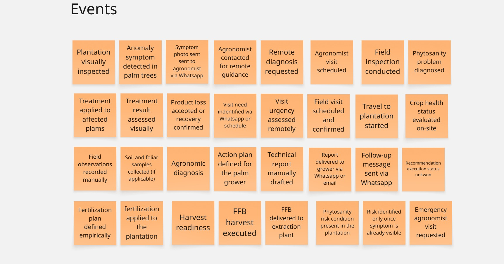
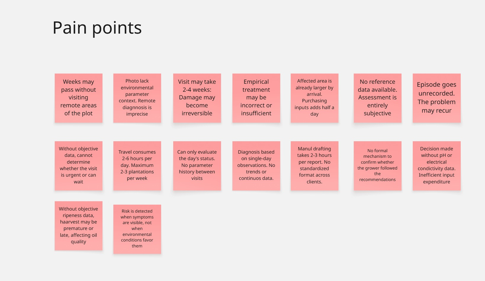
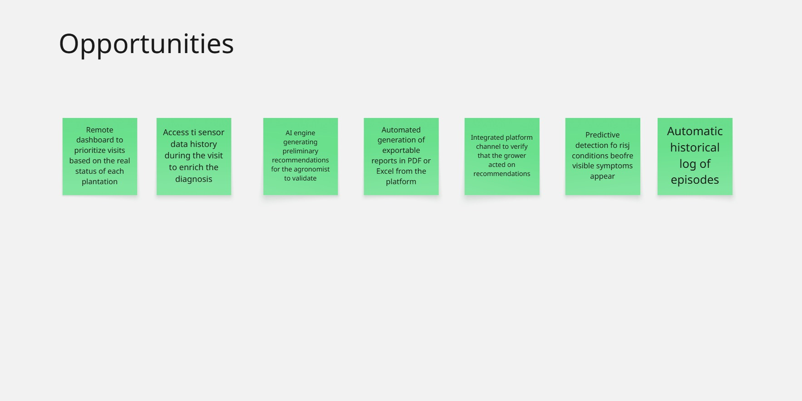
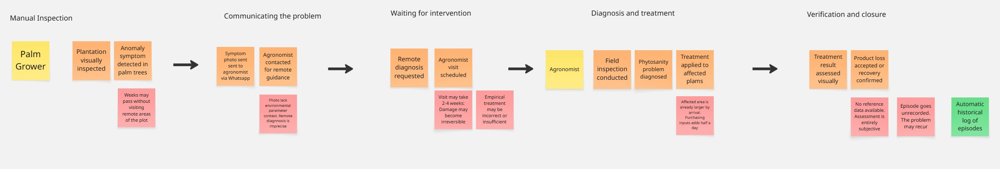
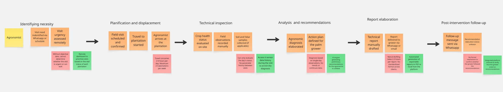
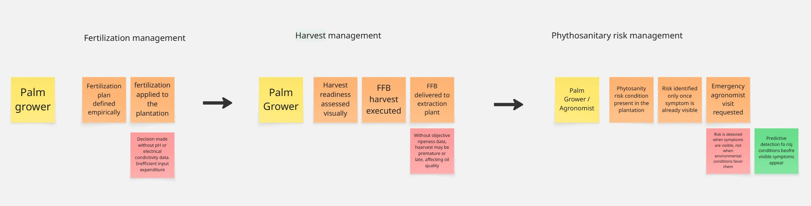

## 2.4. Big Picture EventStorming

El Big Picture EventStorming es una técnica de modelado colaborativo que se utiliza para comprender y visualizar el dominio de un sistema o proceso. En esta técnica, los participantes trabajan juntos para identificar eventos clave, comandos, agregados y otros elementos importantes del dominio. El objetivo es crear un mapa visual que represente cómo interactúan estos elementos entre sí y cómo fluyen los procesos dentro del negocio AS-IS sin la consideración de la solucón Smart Palm.
 

 
Enlace de Miro: https://miro.com/app/board/uXjVK2R7nV4=/?share_link_id=837305751989

 

- Events: Representan acciones o sucesos que ocurren dentro del dominio.
 

 

- Pain Points: Representan problemas o desafíos que enfrentan los usuarios o el sistema.

 

- Opportunities: Representan oportunidades de mejora o innovación dentro del dominio.

 

- Flujo 1 

 

- Flujo 2

 

- Flujo 3

 

---