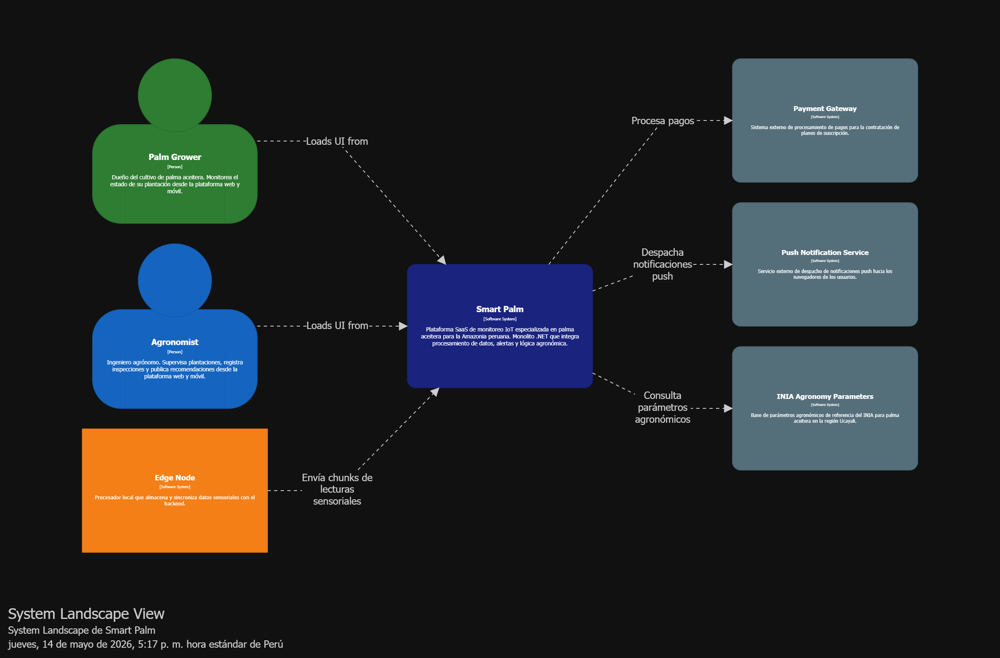
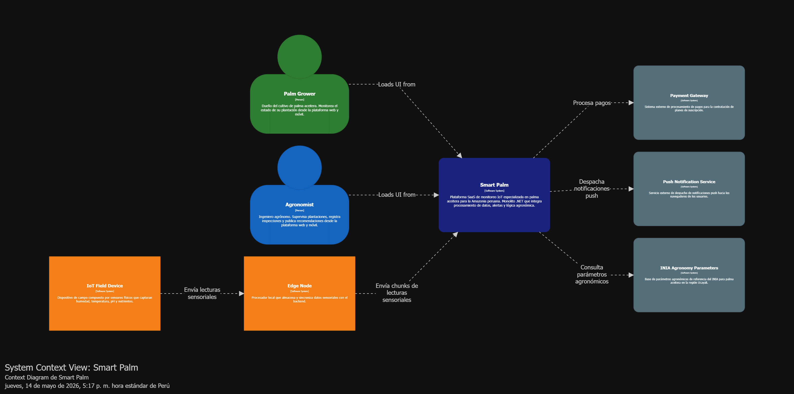
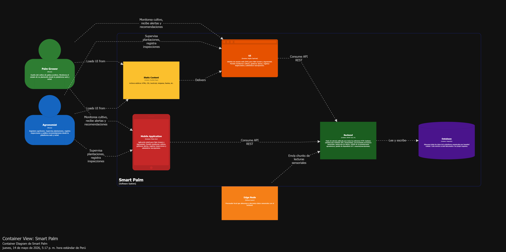

### 4.1.3. Software Architecture.

La arquitectura de software de Smart Palm se representa mediante el modelo C4, utilizando Structurizr DSL para la generación de los diagramas. La arquitectura responde a los siete bounded contexts identificados en el proceso de Domain-Driven Design y contempla tres niveles de representación: System Landscape, Context y Container.

#### 4.1.3.1. Software Architecture System Landscape Diagram.

El System Landscape Diagram muestra Smart Palm en relación con los sistemas externos con los que interactúa y los tipos de usuario que lo utilizan.

#### 4.1.3.2. Software Architecture Context Level Diagrams.

El Context Diagram muestra Smart Palm como sistema central, sus usuarios directos y los sistemas externos con los que interactúa, sin detallar su estructura interna.

#### 4.1.3.3. Software Architecture Container Level Diagrams.

El Container Diagram descompone Smart Palm en sus contenedores principales, mostrando las responsabilidades de cada uno y cómo se comunican entre sí.

#### 4.1.3.4. Software Architecture Deployment Diagrams.

El Deployment Diagram muestra cómo los contenedores de Smart Palm se despliegan en infraestructura de nube, considerando los entornos de producción y el dispositivo IoT en campo. En nuestro caso usaremos servicios como render, cloudflare pages, junto a dispositivos Arduino y Raspberry PI

