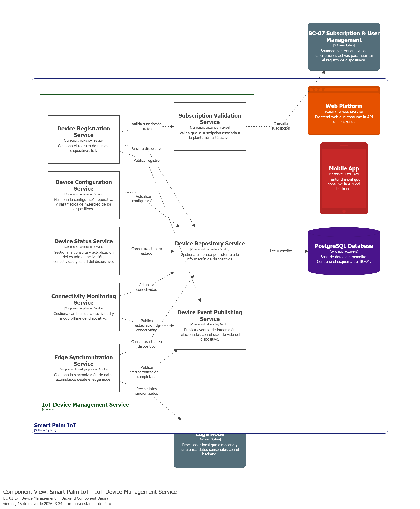
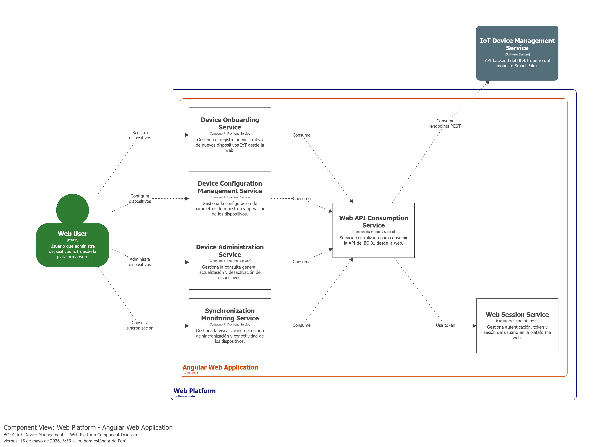
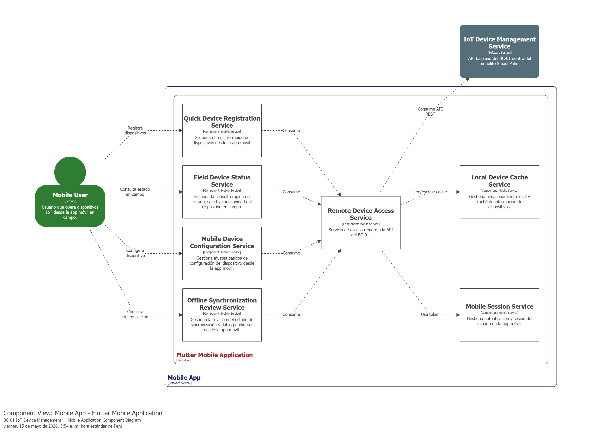
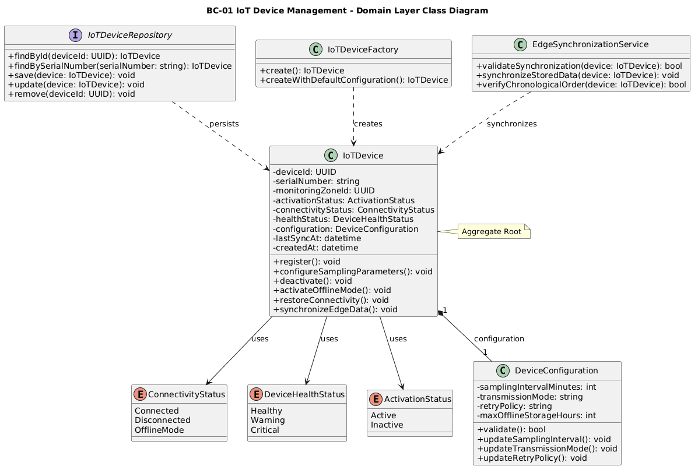
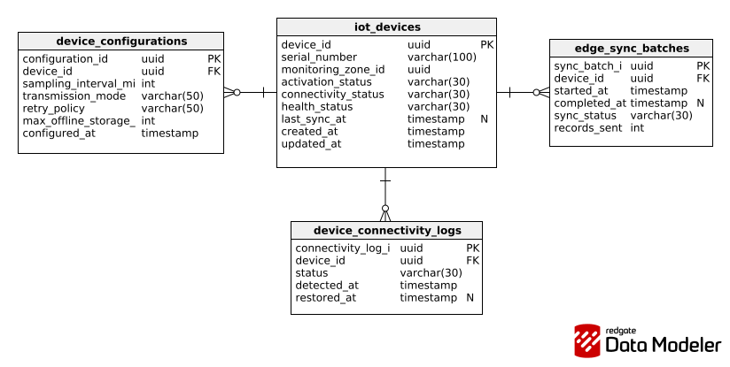

## 4.2. Tactical-Level Domain-Driven Design

En esta sección se desarrolla la perspectiva táctica del diseño de la solución SmartPalm IoT, tomando como base los bounded contexts identificados previamente en el diseño estratégico. El propósito de este nivel es describir con mayor detalle la organización interna de cada bounded context, especificando las clases, responsabilidades, capas y componentes que permiten materializar su lógica de negocio dentro de la arquitectura de software propuesta.

### 4.2.1. Bounded Context: IoT Device Management

El bounded context **IoT Device Management** se encarga de gestionar el ciclo de vida de los dispositivos IoT desplegados en campo dentro de la solución SmartPalm IoT. Su responsabilidad principal es administrar el registro, configuración, activación, desactivación, monitoreo de conectividad y sincronización de datos de los nodos IoT multisensor ubicados en microzonas del cultivo de palma aceitera.

#### 4.2.1.1. Domain Layer

La **Domain Layer** del bounded context **IoT Device Management** representa el núcleo del dominio encargado de gestionar el ciclo de vida de los dispositivos IoT desplegados en campo. En esta capa se ubican las clases que modelan las reglas de negocio relacionadas con el registro del dispositivo, su configuración operativa, el control de conectividad, la activación de modo offline y la sincronización de datos acumulados cuando la conexión se restablece.

El dominio se compone de un *aggregate root* (`IotDevice`), una entidad de soporte (`SensorReading`), un *value object* (`DeviceConfiguration`), tres enumeraciones, una interfaz de repositorio, tres interfaces de servicio de dominio, un *domain service* y los *commands* y *queries* que estructuran las operaciones del bounded context.

---

##### 1. IotDevice

| Campo | Detalle |
|---|---|
| **Nombre** | IotDevice |
| **Categoría** | Entity / Aggregate Root |
| **Propósito** | Representar al dispositivo IoT desplegado en una microzona del cultivo y gestionar su ciclo de vida dentro del bounded context. |

**Atributos**

| Nombre | Tipo de dato | Visibilidad | Descripción |
|---|---|---|---|
| Id | int | private | Identificador único del dispositivo generado por la base de datos. |
| SerialNumber | string | private | Número de serie o código único del dispositivo físico. |
| MonitoringZoneId | int | private | Identificador de la microzona del cultivo asociada al dispositivo. |
| ActivationStatus | DeviceActivationStatus | private | Estado de activación del dispositivo. Valor inicial: `Inactive`. |
| ConnectivityStatus | DeviceConnectivityStatus | private | Estado actual de conectividad del dispositivo. Valor inicial: `Disconnected`. |
| HealthStatus | DeviceHealthStatus | private | Estado general de salud del dispositivo en campo. Valor inicial: `Warning`. |
| Configuration | DeviceConfiguration | private | Configuración operativa del dispositivo. Valor inicial: `DeviceConfiguration.Default`. |
| LastSyncAt | DateTime | private | Fecha y hora de la última sincronización de datos. |
| CreatedAt | DateTime | private | Fecha y hora de registro del dispositivo. |
| IsActive | bool | public | Propiedad calculada: indica si el estado de activación es `Active`. |
| IsConnected | bool | public | Propiedad calculada: indica si el estado de conectividad es `Connected`. |

**Métodos**

| Nombre | Tipo de retorno | Visibilidad | Descripción |
|---|---|---|---|
| Register | void | public | Establece el dispositivo como activo, conectado y saludable al momento de su primer registro. |
| ConfigureSamplingParameters | void | public | Actualiza la configuración operativa del dispositivo con el objeto `DeviceConfiguration` recibido. |
| Activate | void | public | Establece el estado de activación en `Active`. |
| Deactivate | void | public | Establece el estado de activación en `Inactive`. |
| ActivateOfflineMode | void | public | Cambia el dispositivo a modo offline: activación `Inactive`, conectividad `OfflineMode` y salud `Critical`. |
| RestoreConnectivity | void | public | Restablece el dispositivo a estado activo y conectado. |
| SynchronizeEdgeData | void | public | Actualiza `LastSyncAt` con la hora actual y restablece el estado de conectividad a `Connected`. |

---

##### 2. SensorReading

| Campo | Detalle |
|---|---|
| **Nombre** | SensorReading |
| **Categoría** | Entity |
| **Propósito** | Representar una lectura individual de un sensor del dispositivo IoT, incluyendo el tipo de sensor, el valor medido y el instante de captura. |

**Atributos**

| Nombre | Tipo de dato | Visibilidad | Descripción |
|---|---|---|---|
| SensorType | SensorType | private | Tipo de sensor que generó la lectura. |
| Value | double | private | Valor numérico registrado por el sensor. |
| Timestamp | DateTime | private | Fecha y hora exacta en que se tomó la lectura. |

**Métodos**

| Nombre | Tipo de retorno | Visibilidad | Descripción |
|---|---|---|---|
| Clone | SensorReading | public | Crea y retorna una copia exacta de la lectura actual. |

---

##### 3. DeviceConfiguration

| Campo | Detalle |
|---|---|
| **Nombre** | DeviceConfiguration |
| **Categoría** | Value Object |
| **Propósito** | Almacenar la configuración operativa del dispositivo IoT, especialmente los parámetros de muestreo y comportamiento de transmisión. |

**Atributos**

| Nombre | Tipo de dato | Visibilidad | Descripción |
|---|---|---|---|
| SamplingIntervalMinutes | int | private | Intervalo de tiempo, en minutos, entre cada lectura del dispositivo. Valor por defecto: `60`. |
| TransmissionMode | string | private | Modo de transmisión de datos del dispositivo. Valor por defecto: `"Push"`. |
| RetryPolicy | string | private | Política de reintentos aplicada cuando existe falla de conectividad. Valor por defecto: `"RetryOnce"`. |
| MaxOfflineStorageHours | int | private | Cantidad máxima de horas que el dispositivo puede almacenar datos localmente en modo offline. Valor por defecto: `24`. |
| Default | DeviceConfiguration | public static | Propiedad estática que retorna una instancia con los valores de configuración por defecto. |

---

##### 4. DeviceActivationStatus

| Campo | Detalle |
|---|---|
| **Nombre** | DeviceActivationStatus |
| **Categoría** | Enumeration |
| **Propósito** | Representar el estado de activación del dispositivo dentro del sistema. |

**Valores**

| Nombre | Descripción |
|---|---|
| Active | El dispositivo está habilitado para operar. |
| Inactive | El dispositivo ha sido desactivado. |

---

##### 5. DeviceConnectivityStatus

| Campo | Detalle |
|---|---|
| **Nombre** | DeviceConnectivityStatus |
| **Categoría** | Enumeration |
| **Propósito** | Representar los posibles estados de conectividad del dispositivo IoT. |

**Valores**

| Nombre | Descripción |
|---|---|
| Connected | El dispositivo mantiene conectividad con la plataforma. |
| Disconnected | El dispositivo ha perdido la conectividad, pero aún no se ha confirmado la operación offline. |
| OfflineMode | El dispositivo opera en modo offline y almacena datos localmente. |

---

##### 6. DeviceHealthStatus

| Campo | Detalle |
|---|---|
| **Nombre** | DeviceHealthStatus |
| **Categoría** | Enumeration |
| **Propósito** | Representar el estado general de salud del dispositivo IoT en campo. |

**Valores**

| Nombre | Descripción |
|---|---|
| Healthy | El dispositivo opera con normalidad. |
| Warning | El dispositivo presenta una condición que requiere atención. |
| Critical | El dispositivo presenta una condición crítica que compromete su operación. |

---

##### 7. SensorType

| Campo | Detalle |
|---|---|
| **Nombre** | SensorType |
| **Categoría** | Enumeration |
| **Propósito** | Representar los tipos de sensores soportados por el dispositivo IoT. |

**Valores**

| Nombre | Descripción |
|---|---|
| Temperature | Sensor de temperatura ambiental o del suelo. |
| Humidity | Sensor de humedad relativa ambiental o del suelo. |
| Pressure | Sensor de presión atmosférica. |
| GasResistance | Sensor de resistencia de gas. |
| Voltage | Sensor de voltaje eléctrico. |
| Current | Sensor de corriente eléctrica. |
| Power | Sensor de potencia eléctrica. |
| Speed | Sensor de velocidad. |
| Direction | Sensor de dirección o orientación. |

---

##### 8. IIotDeviceRepository

| Campo | Detalle |
|---|---|
| **Nombre** | IIotDeviceRepository |
| **Categoría** | Repository (interfaz) |
| **Propósito** | Abstraer la persistencia de los dispositivos IoT gestionados por el bounded context. Extiende `IBaseRepository<IotDevice>`, por lo que hereda las operaciones CRUD genéricas. |

**Métodos propios**

| Nombre | Tipo de retorno | Visibilidad | Descripción |
|---|---|---|---|
| FindBySerialNumberAsync | Task\<IotDevice?\> | public | Buscar de forma asíncrona un dispositivo por su número de serie. Retorna `null` si no existe. |

**Métodos heredados de IBaseRepository\<IotDevice\>**

| Nombre | Tipo de retorno | Visibilidad | Descripción |
|---|---|---|---|
| AddAsync | Task | public | Agregar un nuevo dispositivo al repositorio. |
| FindByIdAsync | Task\<IotDevice?\> | public | Buscar un dispositivo por su identificador. |
| Update | void | public | Actualizar el estado o configuración de un dispositivo existente. |
| Remove | void | public | Eliminar o dar de baja lógica a un dispositivo. |
| ListAsync | Task\<IEnumerable\<IotDevice\>\> | public | Obtener todos los dispositivos registrados. |

---

##### 9. IDeviceStatusCommandService

| Campo | Detalle |
|---|---|
| **Nombre** | IDeviceStatusCommandService |
| **Categoría** | Domain Service (interfaz) |
| **Propósito** | Definir el contrato para el servicio que procesa los comandos de registro, activación y desactivación de dispositivos. |

**Métodos**

| Nombre | Tipo de retorno | Visibilidad | Descripción |
|---|---|---|---|
| Handle(RegisterDeviceCommand) | Task | public | Procesar el comando de registro de un nuevo dispositivo. |
| Handle(ActivateDeviceCommand) | Task | public | Procesar el comando de activación de un dispositivo existente. |
| Handle(DeactivateDeviceCommand) | Task | public | Procesar el comando de desactivación de un dispositivo existente. |

---

##### 10. IDeviceStatusQueryService

| Campo | Detalle |
|---|---|
| **Nombre** | IDeviceStatusQueryService |
| **Categoría** | Domain Service (interfaz) |
| **Propósito** | Definir el contrato para el servicio que procesa las consultas de estado de conectividad y activación de un dispositivo. |

**Métodos**

| Nombre | Tipo de retorno | Visibilidad | Descripción |
|---|---|---|---|
| Handle(ConnectiviyStatusQuery) | Task\<IotDevice\> | public | Procesar la consulta del estado de conectividad de un dispositivo identificado por su número de serie. |
| Handle(ActivationStatusQuery) | Task\<IotDevice\> | public | Procesar la consulta del estado de activación de un dispositivo identificado por su número de serie. |

---

##### 11. IEdgeSynchronizationService

| Campo | Detalle |
|---|---|
| **Nombre** | IEdgeSynchronizationService |
| **Categoría** | Domain Service (interfaz) |
| **Propósito** | Definir el contrato para el servicio que procesa el comando de sincronización de datos acumulados desde el edge node. |

**Métodos**

| Nombre | Tipo de retorno | Visibilidad | Descripción |
|---|---|---|---|
| Handle(EdgeSynchronizationCommand) | Task | public | Procesar el comando de sincronización de datos del dispositivo indicado. |

---

##### 12. EdgeSynchronizationService

| Campo | Detalle |
|---|---|
| **Nombre** | EdgeSynchronizationService |
| **Categoría** | Domain Service |
| **Propósito** | Contener la lógica de negocio asociada a la validación y ordenamiento de datos acumulados en el edge node, así como al registro de la sincronización en el agregado. |

**Métodos**

| Nombre | Tipo de retorno | Visibilidad | Descripción |
|---|---|---|---|
| ValidateSynchronization | bool | public | Verificar si el dispositivo se encuentra activo y cumple las condiciones para sincronizar datos acumulados. |
| MapReadingsToChronologicalOrder | List\<SensorReading\> | public | Retornar una copia ordenada cronológicamente de la lista de lecturas recibida. |
| SynchronizeStoredData | void | public | Invocar `SynchronizeEdgeData()` en el agregado para registrar la sincronización. |

---

##### 13. Commands

Los *commands* son objetos inmutables de tipo `record` que encapsulan la intención de modificar el estado del sistema. Los definidos en este bounded context son:

| Nombre | Parámetros | Descripción |
|---|---|---|
| RegisterDeviceCommand | serial, monitoringZoneId, Username, Password | Solicitar el registro de un nuevo dispositivo IoT en el sistema. |
| ActivateDeviceCommand | serial | Solicitar la activación de un dispositivo previamente registrado. |
| DeactivateDeviceCommand | serial | Solicitar la desactivación de un dispositivo activo. |
| EdgeSynchronizationCommand | serial | Solicitar el registro de sincronización de datos acumulados para el dispositivo indicado. |

---

##### 14. Queries

Las *queries* son objetos inmutables de tipo `record` que encapsulan la intención de consultar el estado del sistema sin modificarlo. Las definidas en este bounded context son:

| Nombre | Parámetros | Descripción |
|---|---|---|
| ActivationStatusQuery | serial | Consultar el estado de activación del dispositivo identificado por su número de serie. |
| ConnectiviyStatusQuery | serial | Consultar el estado de conectividad del dispositivo identificado por su número de serie. |

#### 4.2.1.2. Interface Layer

La **Interface Layer** del bounded context **IoT Device Management** agrupa las clases encargadas de recibir solicitudes HTTP provenientes de actores externos y derivarlas hacia la capa de aplicación. Su función principal es actuar como punto de entrada del bounded context, descomponiendo los recursos de la petición en *commands* o *queries* a través de ensambladores, y retornando recursos estructurados como respuesta.

En este bounded context, la capa de interfaz se encuentra compuesta por dos **Controllers** (uno para autenticación de dispositivos y otro para gestión de su estado), un conjunto de **Resources** que representan los cuerpos de petición y respuesta, y un conjunto de **Assemblers** que transforman entre recursos y objetos del dominio.

---

##### 1. DeviceAuthenticationController

| Campo | Detalle |
|---|---|
| **Nombre** | DeviceAuthenticationController |
| **Categoría** | Controller |
| **Ruta base** | `api/v1/device/auth` |
| **Propósito** | Exponer el endpoint de registro de dispositivos IoT en la plataforma. |

**Atributos**

| Nombre | Tipo de dato | Visibilidad | Descripción |
|---|---|---|---|
| _deviceStatusCommandService | IDeviceStatusCommandService | private | Servicio de comandos de dominio inyectado para coordinar el registro del dispositivo. |

**Métodos**

| Nombre | Verbo HTTP | Ruta | Tipo de retorno | Descripción |
|---|---|---|---|---|
| RegisterDevice | POST | `/register` | IActionResult | Recibir un `DeviceRegistrationResource`, construir el `RegisterDeviceCommand` mediante el ensamblador correspondiente y delegar su ejecución al command service. Retorna `201 Created` si el registro es exitoso. |

---

##### 2. DeviceStatusController

| Campo | Detalle |
|---|---|
| **Nombre** | DeviceStatusController |
| **Categoría** | Controller |
| **Ruta base** | `api/v1/device/status` |
| **Propósito** | Exponer endpoints HTTP para activar, desactivar y consultar el estado de activación y conectividad de un dispositivo IoT. |

**Atributos**

| Nombre | Tipo de dato | Visibilidad | Descripción |
|---|---|---|---|
| _deviceStatusCommandService | IDeviceStatusCommandService | private | Servicio de comandos de dominio inyectado para las operaciones de activación y desactivación. |
| _deviceStatusQueryService | IDeviceStatusQueryService | private | Servicio de consultas de dominio inyectado para las operaciones de lectura de estado. |

**Métodos**

| Nombre | Verbo HTTP | Ruta | Tipo de retorno | Descripción |
|---|---|---|---|---|
| DeactivateDevice | POST | `/deactivate` | IActionResult | Recibir un `SerialResource`, construir el `DeactivateDeviceCommand` y delegar al command service. Retorna `200 OK`. |
| ActivateDevice | POST | `/activate` | IActionResult | Recibir un `SerialResource`, construir el `ActivateDeviceCommand` y delegar al command service. Retorna `200 OK`. |
| GetActivationStatus | GET | `/activation` | IActionResult | Recibir el número de serie como query param, construir el `ActivationStatusQuery` y retornar un `ActivationStatusResource`. |
| GetConnectivityStatus | GET | `/connectivity` | IActionResult | Recibir el número de serie como query param, construir el `ConnectiviyStatusQuery` y retornar un `ConnectivityStatusResource`. |

---

##### 3. Resources

Los *resources* son objetos inmutables de tipo `record` que definen la estructura de los cuerpos de solicitud y respuesta de la API REST.

| Nombre | Campos | Descripción |
|---|---|---|
| DeviceRegistrationResource | serialNumber, monitoringZoneId, username, password | Cuerpo de solicitud para el registro de un dispositivo IoT. |
| SerialResource | serialNumber | Recurso genérico que transporta únicamente el número de serie del dispositivo. Utilizado como body en comandos y como query param en consultas. |
| ActivationStatusResource | serialNumber, isActive | Respuesta que expone el estado de activación de un dispositivo. |
| ConnectivityStatusResource | serialNumber, isConnected, status | Respuesta que expone el estado de conectividad de un dispositivo, incluyendo su descripción textual. |

---

##### 4. Assemblers (Transform)

Los *assemblers* son clases estáticas que transforman entre recursos de la interfaz y objetos del dominio (commands, queries o aggregates).

| Nombre | Método | Descripción |
|---|---|---|
| RegisterDeviceCommandFromResourceAssembler | ToCommandFromResource(DeviceRegistrationResource) | Construir un `RegisterDeviceCommand` a partir del recurso de registro. |
| ActivateDeviceCommmandFromResourceAssembler | ToCommandFromResource(string serial) | Construir un `ActivateDeviceCommand` a partir del número de serie. |
| DeactivateDeviceCommandFromResourceAssembler | ToCommandFromResource(string serial) | Construir un `DeactivateDeviceCommand` a partir del número de serie. |
| ActivationStatusQueryFromResourceAssembler | ToQueryFromResource(string serial) | Construir un `ActivationStatusQuery` a partir del número de serie. |
| ConnectiviyStatusQueryFromResourceAssembler | ToQueryFromResource(string serial) | Construir un `ConnectiviyStatusQuery` a partir del número de serie. |
| ActivationStatusResourceFromIotDeviceAggregateAssembler | ToResourceFromIotDeviceAggregate(IotDevice) | Construir un `ActivationStatusResource` a partir del aggregate `IotDevice`. |
| ConnectivityStatusResourceFromIotDeviceAggregateAssembler | ToResourceFromIotDeviceAggregate(IotDevice) | Construir un `ConnectivityStatusResource` a partir del aggregate `IotDevice`. |

#### 4.2.1.3. Application Layer

La **Application Layer** del bounded context **IoT Device Management** se encarga de orquestar los flujos de negocio relacionados con el ciclo de vida de los dispositivos IoT. Recibe los *commands* y *queries* derivados desde la Interface Layer, accede al repositorio de dominio para recuperar o persistir el aggregate `IotDevice`, aplica la lógica de negocio sobre el mismo y confirma los cambios a través de la unidad de trabajo.

En este bounded context, la capa de aplicación se compone de dos **Command Services** y un **Query Service**, implementando las interfaces de dominio correspondientes.

---

##### 1. DeviceStatusCommandService

| Campo | Detalle |
|---|---|
| **Nombre** | DeviceStatusCommandService |
| **Categoría** | Command Service |
| **Propósito** | Implementar `IDeviceStatusCommandService`. Gestionar los flujos de registro, activación y desactivación de dispositivos IoT, coordinando el acceso al repositorio y la confirmación de cambios mediante la unidad de trabajo. |

**Atributos**

| Nombre | Tipo de dato | Visibilidad | Descripción |
|---|---|---|---|
| uow | IUnitOfWork | private | Unidad de trabajo inyectada para confirmar las transacciones de persistencia. |
| deviceRepository | IIotDeviceRepository | private | Repositorio inyectado para recuperar y persistir el aggregate `IotDevice`. |

**Métodos**

| Nombre | Tipo de retorno | Visibilidad | Descripción |
|---|---|---|---|
| Handle(RegisterDeviceCommand) | Task | public | Verificar que el número de serie no esté registrado, crear un nuevo `IotDevice`, invocarlo con `Activate()` y persistirlo. Lanza excepción si el dispositivo ya existe. |
| Handle(ActivateDeviceCommand) | Task | public | Recuperar el dispositivo por número de serie, invocar `Activate()` y persistir el cambio. Lanza excepción si el dispositivo no existe. |
| Handle(DeactivateDeviceCommand) | Task | public | Recuperar el dispositivo por número de serie, invocar `Deactivate()` y persistir el cambio. Lanza excepción si el dispositivo no existe. |

---

##### 2. EdgeSyncrhonizationService

| Campo | Detalle |
|---|---|
| **Nombre** | EdgeSyncrhonizationService |
| **Categoría** | Command Service |
| **Propósito** | Implementar `IEdgeSynchronizationService`. Gestionar el flujo de sincronización de datos acumulados desde el edge node, actualizando el estado del aggregate `IotDevice`. |

**Atributos**

| Nombre | Tipo de dato | Visibilidad | Descripción |
|---|---|---|---|
| uow | IUnitOfWork | private | Unidad de trabajo inyectada para confirmar las transacciones de persistencia. |
| deviceRepository | IIotDeviceRepository | private | Repositorio inyectado para recuperar y actualizar el aggregate `IotDevice`. |

**Métodos**

| Nombre | Tipo de retorno | Visibilidad | Descripción |
|---|---|---|---|
| Handle(EdgeSynchronizationCommand) | Task | public | Recuperar el dispositivo por número de serie, invocar `SynchronizeEdgeData()` y persistir el cambio. Lanza excepción si el dispositivo no existe. |

---

##### 3. DeviceStatusQueryService

| Campo | Detalle |
|---|---|
| **Nombre** | DeviceStatusQueryService |
| **Categoría** | Query Service |
| **Propósito** | Implementar `IDeviceStatusQueryService`. Gestionar las consultas de estado de activación y conectividad de un dispositivo IoT, retornando el aggregate completo para que la Interface Layer construya el recurso de respuesta. |

**Atributos**

| Nombre | Tipo de dato | Visibilidad | Descripción |
|---|---|---|---|
| deviceRepository | IIotDeviceRepository | private | Repositorio inyectado para recuperar el aggregate `IotDevice`. |

**Métodos**

| Nombre | Tipo de retorno | Visibilidad | Descripción |
|---|---|---|---|
| Handle(ConnectiviyStatusQuery) | Task\<IotDevice\> | public | Recuperar el dispositivo por número de serie y retornarlo para la consulta de estado de conectividad. Lanza excepción si el dispositivo no existe. |
| Handle(ActivationStatusQuery) | Task\<IotDevice\> | public | Recuperar el dispositivo por número de serie y retornarlo para la consulta de estado de activación. Lanza excepción si el dispositivo no existe. |

#### 4.2.1.4. Infrastructure Layer

La **Infrastructure Layer** del bounded context **IoT Device Management** agrupa las clases que materializan las abstracciones de persistencia definidas en la Domain Layer. Se apoya en Entity Framework Core (EFC) con acceso al `AppDbContext` compartido, implementando las interfaces de repositorio para operar sobre la base de datos relacional de la plataforma.

---

##### 1. IotDeviceRepository

| Campo | Detalle |
|---|---|
| **Nombre** | IotDeviceRepository |
| **Categoría** | Repository Implementation |
| **Propósito** | Implementar `IIotDeviceRepository` utilizando Entity Framework Core. Extiende `BaseRepository<IotDevice>`, que provee las operaciones CRUD genéricas, y añade la búsqueda por número de serie. |

**Atributos**

| Nombre | Tipo de dato | Visibilidad | Descripción |
|---|---|---|---|
| Context | AppDbContext | protected | Contexto de base de datos de Entity Framework Core heredado de `BaseRepository<IotDevice>`. Proporciona acceso al `DbSet<IotDevice>` utilizado para las consultas y operaciones de persistencia. |

**Métodos propios**

| Nombre | Tipo de retorno | Visibilidad | Descripción |
|---|---|---|---|
| FindBySerialNumberAsync | Task\<IotDevice?\> | public | Ejecutar una consulta asíncrona sobre el `DbSet<IotDevice>` para retornar el primer dispositivo cuyo `SerialNumber` coincida con el valor recibido, o `null` si no existe. |

**Métodos heredados de BaseRepository\<IotDevice\>**

| Nombre | Tipo de retorno | Visibilidad | Descripción |
|---|---|---|---|
| AddAsync | Task | public | Agregar el aggregate `IotDevice` al contexto de EFC para su posterior persistencia. |
| FindByIdAsync | Task\<IotDevice?\> | public | Recuperar un dispositivo por su clave primaria (`Id`). |
| Update | void | public | Marcar el aggregate como modificado en el contexto de EFC. |
| Remove | void | public | Marcar el aggregate para su eliminación en el contexto de EFC. |
| ListAsync | Task\<IEnumerable\<IotDevice\>\> | public | Retornar todos los dispositivos registrados en la base de datos. |

#### 4.2.1.5. Bounded Context Software Architecture Component Level Diagrams

Diagrama 1: Component Level — Backend API (ASP.NET Core)  
Este diagrama muestra la arquitectura de componentes del backend del BC-01 IoT Device Management dentro del monolito Smart Palm. Se organiza en servicios de registro, configuración, consulta de estado, monitoreo de conectividad, sincronización con el edge node, validación de suscripción y publicación de eventos de integración.

Diagrama 2: Component Level — Web Platform (Angular)  
Este diagrama muestra la arquitectura de componentes de la plataforma web para el BC-01 IoT Device Management. Se organiza en servicios orientados a la administración de dispositivos, configuración de parámetros, consulta de estado y monitoreo de sincronización, apoyados por un servicio central de consumo de API y gestión de sesión web.

Diagrama 3: Component Level — Mobile Application (Flutter)  
Este diagrama muestra la arquitectura de componentes de la aplicación móvil para el BC-01 IoT Device Management. Se organiza en servicios orientados al registro rápido, consulta de estado en campo, configuración básica y revisión de sincronización offline, apoyados por servicios de acceso remoto, sesión móvil y almacenamiento local.

#### 4.2.1.6. Bounded Context Software Architecture Code Level Diagrams

##### 4.2.1.6.1. Bounded Context Domain Layer Class Diagrams

##### 4.2.1.6.2. Bounded Context Database Design Diagram

