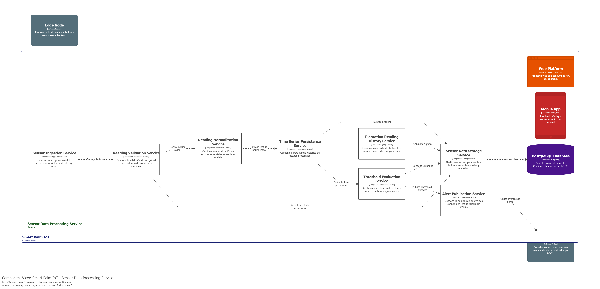
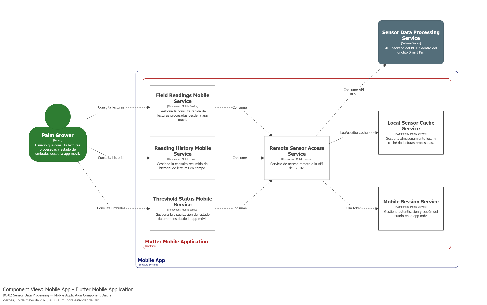

### 4.2.2. Bounded Context: Sensor Data Processing

El bounded context **Sensor Data Processing** se encarga de recibir, validar y almacenar las lecturas enviadas por los nodos IoT desplegados en el cultivo. Además, evalúa si los valores capturados superan los umbrales agronómicos definidos para variables como humedad, temperatura, luz o PH. Cuando detecta una anomalía o una lectura fuera de rango, genera eventos que permiten activar alertas y apoyar la toma de decisiones dentro del sistema SmartPalm IoT.

#### 4.2.2.1. Domain Layer

La **Domain Layer** del bounded context **Sensor Data Processing** representa el núcleo del dominio encargado del procesamiento de lecturas sensoriales capturadas por los dispositivos IoT. En esta capa se ubican las clases que modelan la recepción, persistencia y evaluación de umbrales agronómicos para las variables monitoreadas en campo.

Para este bounded context, el dominio se encuentra compuesto por un aggregate root (`SensorReading`), una entidad (`AgronomicThreshold`), factories, servicios de dominio, interfaces de repositorio e interfaces de servicios de aplicación. Esta organización permite representar de forma clara las reglas de negocio asociadas a las lecturas sensoriales sin mezclar detalles de infraestructura o integración con otros contextos.

---

##### 1. SensorReading

| Campo | Detalle |
|---|---|
| **Nombre** | SensorReading |
| **Categoría** | Aggregate Root |
| **Propósito** | Representar una lectura capturada por un sensor IoT dentro del bounded context Sensor Data Processing. |

**Atributos**

| Nombre | Tipo de dato | Visibilidad | Descripción |
|---|---|---|---|
| Id | int | public | Identificador auto-generado de la lectura del sensor. |
| EdgeDeviceMacAddress | string | public | Dirección MAC del edge gateway que retransmitió la lectura. |
| IotDeviceMacAddress | string | public | Dirección MAC del dispositivo IoT que generó la lectura. |
| SensorType | SensorType | public | Tipo de variable agronómica medida (Humidity, PH, Luminosity, Temperature, SoilMoisture). |
| Value | double | public | Valor numérico de la lectura capturada. |
| MeasureUnit | MeasureUnit | public | Unidad de medida asociada al valor (Percent, Centimeter, Meter, Unknown). |
| MeasuredAt | DateTime | public | Fecha y hora en que la lectura fue registrada por el dispositivo. |

**Métodos**

| Nombre | Tipo de retorno | Visibilidad | Descripción |
|---|---|---|---|
| SensorReading | — | public | Constructor que inicializa todos los campos de la lectura. |

---

##### 2. AgronomicThreshold

| Campo | Detalle |
|---|---|
| **Nombre** | AgronomicThreshold |
| **Categoría** | Entity |
| **Propósito** | Representar el rango permitido de una variable agronómica para un dispositivo IoT específico. |

**Atributos**

| Nombre | Tipo de dato | Visibilidad | Descripción |
|---|---|---|---|
| Id | int | public | Identificador auto-generado del umbral agronómico. |
| EdgeDeviceMacAddress | string | public | Dirección MAC del edge gateway al que pertenece el dispositivo. |
| IotDeviceMacAddress | string | public | Dirección MAC del dispositivo IoT asociado. |
| SensorType | SensorType | public | Tipo de variable agronómica evaluada (Humidity, PH, Luminosity, Temperature, SoilMoisture). |
| MinValue | double | public | Valor mínimo permitido para la variable. |
| MaxValue | double | public | Valor máximo permitido para la variable. |
| Description | string | public | Descripción opcional del umbral. |

**Métodos**

| Nombre | Tipo de retorno | Visibilidad | Descripción |
|---|---|---|---|
| AgronomicThreshold | — | public | Constructor que inicializa todos los campos del umbral. |
| IsExceededBy | bool | public | Determinar si un valor supera el rango permitido. |
| IsThresholdSet | bool | public | Determinar si el umbral tiene valores definidos (min != max). |
| Update | bool | public | Actualizar parcialmente los valores min, max y/o description. Retorna true si hubo cambios. |

---

##### 3. SensorReadingTypeFactory

| Campo | Detalle |
|---|---|
| **Nombre** | SensorReadingTypeFactory |
| **Categoría** | Factory |
| **Propósito** | Crear instancias de SensorReading según el tipo de sensor, asignando la unidad de medida correcta para cada tipo. |

**Métodos**

| Nombre | Tipo de retorno | Visibilidad | Descripción |
|---|---|---|---|
| DefaultSensorReading | SensorReading | public | Crear una lectura determinando el MeasureUnit según el SensorType (Percent para Humidity/SoilMoisture, Unknown para los demás). |

---

##### 4. AgronomicThresholdTypeFactory

| Campo | Detalle |
|---|---|
| **Nombre** | AgronomicThresholdTypeFactory |
| **Categoría** | Factory |
| **Propósito** | Crear instancias de AgronomicThreshold con valores por defecto para cada tipo de sensor. |

**Métodos**

| Nombre | Tipo de retorno | Visibilidad | Descripción |
|---|---|---|---|
| DefaultThreshold | AgronomicThreshold | public | Crear un umbral por defecto según el SensorType, con rangos predeterminados (ej: Temperature 10–40, SoilMoisture 20–80). |

---

##### 5. ISensorReadingRepository

| Campo | Detalle |
|---|---|
| **Nombre** | ISensorReadingRepository |
| **Categoría** | Repository Interface |
| **Propósito** | Abstraer la persistencia y consulta de lecturas sensoriales. Extiende IBaseRepository<SensorReading>. |

**Métodos**

| Nombre | Tipo de retorno | Visibilidad | Descripción |
|---|---|---|---|
| FindByEdgeDeviceMacAddressAndMeasureTimeRange | List<SensorReading> | public | Buscar lecturas por MAC de edge gateway, rango de fechas, filtro opcional por IoT device, con paginación. |
| FindByIotDeviceMacAddressAndMeasureTimeRange | List<SensorReading> | public | Buscar lecturas por MAC de dispositivo IoT, rango de fechas y paginación. |

---

##### 6. IAgronomicThresholdRepository

| Campo | Detalle |
|---|---|
| **Nombre** | IAgronomicThresholdRepository |
| **Categoría** | Repository Interface |
| **Propósito** | Abstraer la persistencia y consulta de umbrales agronómicos. Extiende IBaseRepository<AgronomicThreshold>. |

**Métodos**

| Nombre | Tipo de retorno | Visibilidad | Descripción |
|---|---|---|---|
| FindByEdgeDeviceMacAddress | List<AgronomicThreshold> | public | Obtener umbrales por MAC de edge gateway. |
| FindByIotDeviceMacAddress | List<AgronomicThreshold> | public | Obtener umbrales por MAC de dispositivo IoT. |
| FindByIotDeviceMacAddressAndSensorType | AgronomicThreshold? | public | Obtener un umbral específico por dispositivo IoT y tipo de sensor. |
| ExistsByIotDeviceMacAddress | bool | public | Verificar si existen umbrales para un dispositivo IoT (sirve como comprobante de existencia del dispositivo). |

---

##### 7. ISensorReadingCommandService

| Campo | Detalle |
|---|---|
| **Nombre** | ISensorReadingCommandService |
| **Categoría** | Command Service Interface |
| **Propósito** | Definir los casos de uso de escritura para lecturas de sensores y umbrales. |

**Métodos**

| Nombre | Tipo de retorno | Visibilidad | Descripción |
|---|---|---|---|
| Handle(ReadDeviceSensorsDataCommand) | Task | public | Procesar un lote de lecturas sensoriales enviadas por un edge gateway. |
| Handle(UpdateAgronomicThresholdCommand) | Task | public | Actualizar un umbral agronómico existente o crearlo si no existe. |

---

##### 8. ISensorReadingQueryService

| Campo | Detalle |
|---|---|
| **Nombre** | ISensorReadingQueryService |
| **Categoría** | Query Service Interface |
| **Propósito** | Definir los casos de uso de consulta para lecturas de sensores. |

**Métodos**

| Nombre | Tipo de retorno | Visibilidad | Descripción |
|---|---|---|---|
| Handle(SensorReadingQuery) | List<SensorReading> | public | Consultar lecturas por edge gateway con filtros y paginación. |
| Handle(DeviceSensorReadingQuery) | List<SensorReading> | public | Consultar lecturas por dispositivo IoT con filtros y paginación. |

---

##### 9. IAgronomicThresholdQueryService

| Campo | Detalle |
|---|---|
| **Nombre** | IAgronomicThresholdQueryService |
| **Categoría** | Query Service Interface |
| **Propósito** | Definir el caso de uso de consulta para umbrales agronómicos. |

**Métodos**

| Nombre | Tipo de retorno | Visibilidad | Descripción |
|---|---|---|---|
| Handle(AgronomicThresholdQuery) | List<AgronomicThreshold> | public | Obtener todos los umbrales configurados para un dispositivo IoT. |

---

##### 10. IThresholdEvaluationService

| Campo | Detalle |
|---|---|
| **Nombre** | IThresholdEvaluationService |
| **Categoría** | Domain Service Interface |
| **Propósito** | Evaluar si una lectura supera los umbrales agronómicos definidos. |

**Métodos**

| Nombre | Tipo de retorno | Visibilidad | Descripción |
|---|---|---|---|
| IsThresholdExceeded | bool | public | Determinar si una lectura excede el rango definido en el umbral. |

---

##### 11. Domain Events (Consumidos desde Shared Kernel)

| Evento | Propósito |
|---|---|
| IotDeviceRegisteredEvent | Notifica que un nuevo dispositivo IoT ha sido registrado. El handler en este BC crea los umbrales por defecto para cada SensorType. |
| IotDeviceSynchronizationEvent | Notifica que un edge gateway ha enviado datos de sincronización. El handler convierte el evento en un ReadDeviceSensorsDataCommand y lo procesa. |

#### 4.2.2.2. Interface Layer

La **Interface Layer** del bounded context **Sensor Data Processing** agrupa las clases encargadas de recibir solicitudes HTTP relacionadas con las lecturas de sensores y umbrales agronómicos, y derivarlas hacia la capa de aplicación. Su función principal es actuar como punto de entrada del bounded context, exponiendo endpoints REST para la ingesta y consulta de datos sensoriales.

En este bounded context, la capa de interfaz se encuentra compuesta por tres controladores, recursos (DTOs) y assemblers para la transformación entre recursos y comandos/consultas.

---

##### 1. ReadDeviceSensorDataController

| Campo | Detalle |
|---|---|
| **Nombre** | ReadDeviceSensorDataController |
| **Categoría** | Controller |
| **Propósito** | Exponer endpoints para recibir lecturas de sensores desde edge gateways y consultar el historial de lecturas por edge gateway. |
| **Ruta base** | api/v1/edge-gateways |

**Atributos**

| Nombre | Tipo de dato | Visibilidad | Descripción |
|---|---|---|---|
| sensorReadingCommandService | ISensorReadingCommandService | private | Servicio de aplicación encargado de procesar comandos de escritura de lecturas. |
| sensorReadingQueryService | ISensorReadingQueryService | private | Servicio de aplicación encargado de ejecutar consultas de lecturas. |

**Métodos**

| Nombre | Tipo de retorno | Visibilidad | Descripción |
|---|---|---|---|
| SubmitSensorReadings | IActionResult | public | POST /{gateway-mac}/sensor-readings — Recibir un lote de lecturas sensoriales desde un edge gateway. |
| GetSensorReadings | IActionResult | public | GET /{gateway-mac}/sensor-readings — Obtener el historial de lecturas de un edge gateway con filtros por fecha, dispositivo IoT y paginación. |

---

##### 2. DeviceSensorReadingsController

| Campo | Detalle |
|---|---|
| **Nombre** | DeviceSensorReadingsController |
| **Categoría** | Controller |
| **Propósito** | Exponer endpoints para consultar lecturas de sensores por dispositivo IoT individual. |
| **Ruta base** | api/v1/devices |

**Atributos**

| Nombre | Tipo de dato | Visibilidad | Descripción |
|---|---|---|---|
| sensorReadingQueryService | ISensorReadingQueryService | private | Servicio de aplicación encargado de ejecutar consultas de lecturas. |

**Métodos**

| Nombre | Tipo de retorno | Visibilidad | Descripción |
|---|---|---|---|
| GetSensorReadings | IActionResult | public | GET /{device-mac}/sensor-readings — Obtener el historial de lecturas de un dispositivo IoT específico con filtros por fecha y paginación. |

---

##### 3. AgronomicThresholdController

| Campo | Detalle |
|---|---|
| **Nombre** | AgronomicThresholdController |
| **Categoría** | Controller |
| **Propósito** | Exponer endpoints para consultar y actualizar umbrales agronómicos de dispositivos IoT. |
| **Ruta base** | api/v1/devices |

**Atributos**

| Nombre | Tipo de dato | Visibilidad | Descripción |
|---|---|---|---|
| sensorReadingCommandService | ISensorReadingCommandService | private | Servicio de aplicación encargado de procesar comandos de escritura de umbrales. |
| agronomicThresholdQueryService | IAgronomicThresholdQueryService | private | Servicio de aplicación encargado de ejecutar consultas de umbrales. |

**Métodos**

| Nombre | Tipo de retorno | Visibilidad | Descripción |
|---|---|---|---|
| GetThreshold | IActionResult | public | GET /{device-mac}/thresholds — Obtener todos los umbrales agronómicos configurados para un dispositivo IoT. |
| UpdateThreshold | IActionResult | public | PATCH /{device-mac}/thresholds — Actualizar parcialmente un umbral (min, max, description). Crea el umbral si no existe. |

##### Resources (DTOs)

| Resource | Propósito |
|---|---|
| ReadDeviceSensorsDataResource | DTO de entrada para el endpoint POST de lecturas. Contiene una lista de lecturas agrupadas por dispositivo y la fecha de sincronización. |
| SensorReadingViewResource | DTO de salida para respuestas de lecturas. Contiene edge MAC, IoT MAC, tipo de sensor, valor, unidad y fecha de medición. |
| UpdateAgronomicThresholdResource | DTO de entrada para el endpoint PATCH de umbrales. Contiene tipo de sensor y valores opcionales min, max y description. |
| AgronomicThresholdViewResource | DTO de salida para respuestas de umbrales. Contiene edge MAC, IoT MAC, min, max, description y tipo de sensor. |

##### Assemblers (Transform)

| Assembler | Propósito |
|---|---|
| ReadDeviceSensorsDataCommandFromResourceAssembly | Transforma ReadDeviceSensorsDataResource + gateway MAC en ReadDeviceSensorsDataCommand. |
| SensorReadingViewResourceFromAggregateAssembler | Transforma lista de SensorReading en lista de SensorReadingViewResource. |
| UpdateAgronomicThresholdCommandFromResourceAssembly | Transforma device MAC + UpdateAgronomicThresholdResource en UpdateAgronomicThresholdCommand. |
| AgronomicThresholdQueryFromResourceAssembly | Transforma device MAC en AgronomicThresholdQuery. |
| AgronomicThresholdViewResourceFromAggregateAssembler | Transforma lista de AgronomicThreshold en lista de AgronomicThresholdViewResource. |

#### 4.2.2.3. Application Layer

La **Application Layer** del bounded context **Sensor Data Processing** se encarga de coordinar los flujos de negocio relacionados con la recepción, persistencia y evaluación de lecturas sensoriales, así como la gestión de umbrales agronómicos. Su responsabilidad principal es recibir las solicitudes provenientes de la Interface Layer, transformarlas en flujos de aplicación y orquestar la ejecución de los casos de uso del contexto.

En esta capa se ubican los servicios de comando, servicios de consulta, servicios de dominio y manejadores de eventos que representan los casos de uso del bounded context.

---

##### 1. SensorReadingCommandService

| Campo | Detalle |
|---|---|
| **Nombre** | SensorReadingCommandService |
| **Categoría** | Command Service |
| **Propósito** | Procesar los comandos de escritura del bounded context: ingesta de lecturas sensoriales y actualización de umbrales agronómicos. |

**Atributos**

| Nombre | Tipo de dato | Visibilidad | Descripción |
|---|---|---|---|
| uow | IUnitOfWork | private | Unidad de trabajo para coordinar la persistencia. |
| mediator | IMediator | private | Mediator para publicar eventos de dominio. |
| sensorReadingRepository | ISensorReadingRepository | private | Repositorio de lecturas sensoriales. |
| agronomicThresholdRepository | IAgronomicThresholdRepository | private | Repositorio de umbrales agronómicos. |
| thresholdEvaluationService | IThresholdEvaluationService | private | Servicio de dominio para evaluar umbrales. |

**Métodos**

| Nombre | Tipo de retorno | Visibilidad | Descripción |
|---|---|---|---|
| Handle(ReadDeviceSensorsDataCommand) | Task | public | Procesar un lote de lecturas: crea cada SensorReading vía factory, evalúa umbrales y publica eventos ThresholdExceededEvent y SensorReadingsIngestedEvent. |
| Handle(UpdateAgronomicThresholdCommand) | Task | public | Actualizar un umbral existente o crearlo si no existe usando la factory. |

---

##### 2. SensorReadingQueryService

| Campo | Detalle |
|---|---|
| **Nombre** | SensorReadingQueryService |
| **Categoría** | Query Service |
| **Propósito** | Ejecutar consultas de lecturas sensoriales por edge gateway o por dispositivo IoT. |

**Atributos**

| Nombre | Tipo de dato | Visibilidad | Descripción |
|---|---|---|---|
| sensorReadingRepository | ISensorReadingRepository | private | Repositorio de lecturas sensoriales. |
| agronomicThresholdRepository | IAgronomicThresholdRepository | private | Repositorio de umbrales (usado para validar existencia del dispositivo). |

**Métodos**

| Nombre | Tipo de retorno | Visibilidad | Descripción |
|---|---|---|---|
| Handle(SensorReadingQuery) | List<SensorReading> | public | Consultar lecturas por MAC de edge gateway con filtro por IoT device, rango de fechas y paginación. |
| Handle(DeviceSensorReadingQuery) | List<SensorReading> | public | Consultar lecturas por MAC de dispositivo IoT con rango de fechas y paginación. Lanza KeyNotFoundException si el dispositivo no existe. |

---

##### 3. AgronomicThresholdQueryService

| Campo | Detalle |
|---|---|
| **Nombre** | AgronomicThresholdQueryService |
| **Categoría** | Query Service |
| **Propósito** | Ejecutar consultas de umbrales agronómicos por dispositivo IoT. |

**Atributos**

| Nombre | Tipo de dato | Visibilidad | Descripción |
|---|---|---|---|
| agronomicThresholdRepository | IAgronomicThresholdRepository | private | Repositorio de umbrales agronómicos. |

**Métodos**

| Nombre | Tipo de retorno | Visibilidad | Descripción |
|---|---|---|---|
| Handle(AgronomicThresholdQuery) | List<AgronomicThreshold> | public | Obtener todos los umbrales configurados para un dispositivo IoT. Lanza KeyNotFoundException si no existen umbrales. |

---

##### 4. ThresholdEvaluationService

| Campo | Detalle |
|---|---|
| **Nombre** | ThresholdEvaluationService |
| **Categoría** | Domain Service |
| **Propósito** | Evaluar si una lectura sensorial supera el rango definido en un umbral agronómico. |

**Métodos**

| Nombre | Tipo de retorno | Visibilidad | Descripción |
|---|---|---|---|
| IsThresholdExceeded | bool | public | Delegar en AgronomicThreshold.IsExceededBy comparando el valor de la lectura con el rango del umbral. |

---

##### 5. IotDeviceRegisteredEventHandler

| Campo | Detalle |
|---|---|
| **Nombre** | IotDeviceRegisteredEventHandler |
| **Categoría** | Event Handler (MediatR) |
| **Propósito** | Manejar el evento IotDeviceRegisteredEvent para crear umbrales agronómicos por defecto para cada SensorType del nuevo dispositivo IoT. |

**Atributos**

| Nombre | Tipo de dato | Visibilidad | Descripción |
|---|---|---|---|
| uow | IUnitOfWork | private | Unidad de trabajo para coordinar la persistencia. |
| agronomicThresholdRepository | IAgronomicThresholdRepository | private | Repositorio de umbrales agronómicos. |

**Métodos**

| Nombre | Tipo de retorno | Visibilidad | Descripción |
|---|---|---|---|
| Handle(IotDeviceRegisteredEvent) | Task | public | Crear un AgronomicThreshold para cada valor del enum SensorType usando AgronomicThresholdTypeFactory. |

---

##### 6. IotDeviceSynchronizationEventHandler

| Campo | Detalle |
|---|---|
| **Nombre** | IotDeviceSynchronizationEventHandler |
| **Categoría** | Event Handler (MediatR) |
| **Propósito** | Manejar el evento IotDeviceSynchronizationEvent convirtiéndolo en un ReadDeviceSensorsDataCommand y delegando su procesamiento al SensorReadingCommandService. |

**Atributos**

| Nombre | Tipo de dato | Visibilidad | Descripción |
|---|---|---|---|
| sensorReadingCommandService | ISensorReadingCommandService | private | Servicio de comando encargado de procesar las lecturas. |

**Métodos**

| Nombre | Tipo de retorno | Visibilidad | Descripción |
|---|---|---|---|
| Handle(IotDeviceSynchronizationEvent) | Task | public | Transformar el evento en comando vía assembler y ejecutar el flujo de ingesta de lecturas. |

#### 4.2.2.4. Infrastructure Layer

La **Infrastructure Layer** del bounded context **Sensor Data Processing** agrupa las clases responsables de la persistencia de lecturas sensoriales y umbrales agronómicos. En esta capa se implementan las abstracciones de repositorios definidas en el dominio utilizando Entity Framework Core.

A diferencia de las capas de dominio y aplicación, esta capa no define reglas de negocio, sino que implementa detalles técnicos concretos para almacenar y consultar datos sensoriales.

---

##### 1. SensorReadingRepository

| Campo | Detalle |
|---|---|
| **Nombre** | SensorReadingRepository |
| **Categoría** | Repository Implementation |
| **Propósito** | Implementar la persistencia de lecturas de sensores. Extiende BaseRepository<SensorReading> e implementa ISensorReadingRepository. |
| **Tabla** | sensor_readings |

**Métodos**

| Nombre | Tipo de retorno | Visibilidad | Descripción |
|---|---|---|---|
| FindByEdgeDeviceMacAddressAndMeasureTimeRange | List<SensorReading> | public | Buscar lecturas por edge MAC con filtro por IoT device, rango de fechas y paginación, ordenadas por fecha descendente. |
| FindByIotDeviceMacAddressAndMeasureTimeRange | List<SensorReading> | public | Buscar lecturas por IoT MAC con rango de fechas y paginación, ordenadas por fecha descendente. |

---

##### 2. AgronomicThresholdRepository

| Campo | Detalle |
|---|---|
| **Nombre** | AgronomicThresholdRepository |
| **Categoría** | Repository Implementation |
| **Propósito** | Implementar la persistencia de umbrales agronómicos. Extiende BaseRepository<AgronomicThreshold> e implementa IAgronomicThresholdRepository. |
| **Tabla** | agronomic_thresholds |

**Métodos**

| Nombre | Tipo de retorno | Visibilidad | Descripción |
|---|---|---|---|
| FindByEdgeDeviceMacAddress | List<AgronomicThreshold> | public | Obtener umbrales por MAC de edge gateway. |
| FindByIotDeviceMacAddressAndSensorType | AgronomicThreshold? | public | Obtener un umbral específico por dispositivo IoT y tipo de sensor. |
| FindByIotDeviceMacAddress | List<AgronomicThreshold> | public | Obtener umbrales por MAC de dispositivo IoT. |
| ExistsByIotDeviceMacAddress | bool | public | Verificar si existen umbrales para un dispositivo IoT. |

#### 4.2.2.5. Bounded Context Software Architecture Component Level Diagrams

Diagrama 1: Component Level — Backend API (ASP.NET Core)  
Este diagrama muestra la arquitectura de componentes del backend del BC-02 Sensor Data Processing dentro del monolito Smart Palm. Se organiza en servicios de recepción, validación, normalización, persistencia histórica, evaluación de umbrales, publicación de alertas y consulta de historial sensorial.

Diagrama 2: Component Level — Web Platform (Angular)  
Este diagrama muestra la arquitectura de componentes de la plataforma web para el BC-02 Sensor Data Processing. Se organiza en servicios orientados al análisis histórico, visualización consolidada por plantación y seguimiento de umbrales, apoyados por un servicio central de consumo de API y gestión de sesión web.

Diagrama 3: Component Level — Mobile Application (Flutter)  
Este diagrama muestra la arquitectura de componentes de la aplicación móvil para el BC-02 Sensor Data Processing. Se organiza en servicios orientados a la consulta rápida de lecturas procesadas, historial resumido y estado de umbrales en campo, apoyados por servicios de acceso remoto, sesión móvil y almacenamiento local.

#### 4.2.2.6. Bounded Context Software Architecture Code Level Diagrams

##### 4.2.2.6.1. Bounded Context Domain Layer Class Diagrams

##### 4.2.2.6.2. Bounded Context Database Design Diagram

