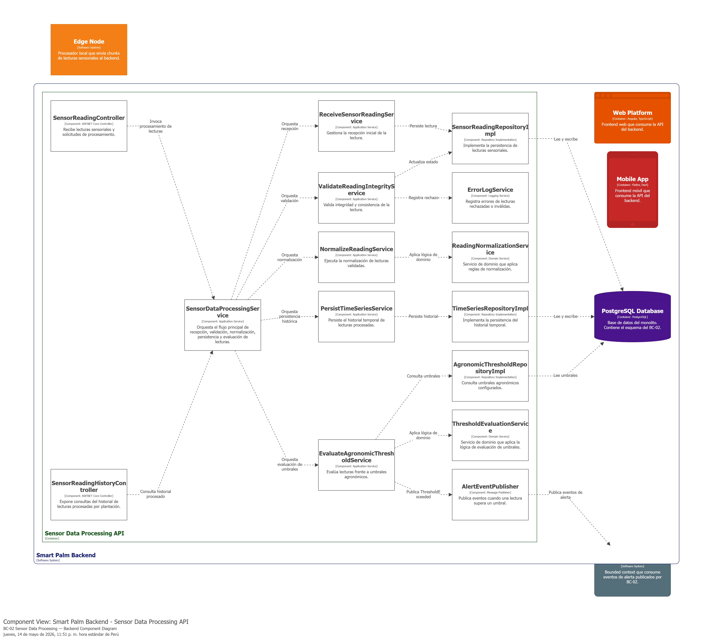
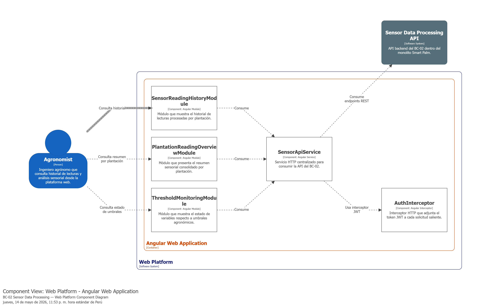
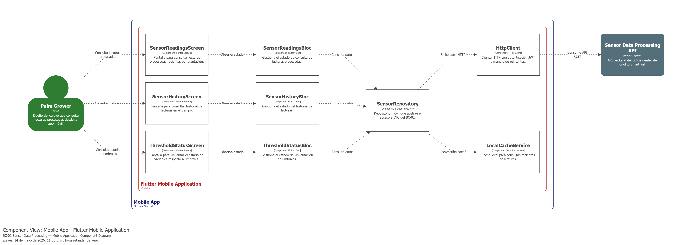

### 4.2.2. Bounded Context: Sensor Data Processing

El bounded context **Sensor Data Processing** se encarga de recibir, validar, normalizar y almacenar las lecturas enviadas por los nodos IoT desplegados en el cultivo. Además, evalúa si los valores capturados superan los umbrales agronómicos definidos para variables como humedad, temperatura, luz o indicadores asociados al estado de la planta. Cuando detecta una anomalía o una lectura fuera de rango, genera eventos que permiten activar alertas y apoyar la toma de decisiones dentro del sistema SmartPalm IoT.

#### 4.2.2.1. Domain Layer

La **Domain Layer** del bounded context **Sensor Data Processing** representa el núcleo del dominio encargado del procesamiento de lecturas sensoriales capturadas por los dispositivos IoT. En esta capa se ubican las clases que modelan la recepción, validación, normalización, persistencia histórica y evaluación de umbrales agronómicos para las variables monitoreadas en campo.

Para este bounded context, el dominio se encuentra compuesto por una entidad principal que actúa como *aggregate root*, complementada por un objeto de valor, entidades auxiliares, servicios de dominio y abstracciones de persistencia mediante repositorios. Esta organización permite representar de forma clara las reglas de negocio asociadas a las lecturas sensoriales sin mezclar detalles de infraestructura o integración con otros contextos.

---

##### 1. SensorReading

| Campo | Detalle |
|---|---|
| **Nombre** | SensorReading |
| **Categoría** | Entity / Aggregate Root |
| **Propósito** | Representar una lectura capturada por un sensor IoT dentro del bounded context Sensor Data Processing. |

**Atributos**

| Nombre | Tipo de dato | Visibilidad | Descripción |
|---|---|---|---|
| ReadingId | UUID | private | Identificador único de la lectura del sensor. |
| DeviceId | UUID | private | Identificador del dispositivo IoT que generó la lectura. |
| PlantationId | UUID | private | Identificador de la plantación asociada a la lectura. |
| VariableType | string | private | Tipo de variable agronómica medida, como humedad, temperatura o luz. |
| RawValue | decimal | private | Valor original recibido desde el sensor antes de cualquier normalización. |
| Unit | string | private | Unidad de medida de la lectura capturada. |
| RecordedAt | datetime | private | Fecha y hora en que la lectura fue registrada por el dispositivo. |
| Status | string | private | Estado actual de la lectura, por ejemplo recibida, validada, rechazada o normalizada. |

**Métodos**

| Nombre | Tipo de retorno | Visibilidad | Descripción |
|---|---|---|---|
| RegisterReading | void | public | Registrar una nueva lectura recibida desde el dispositivo IoT. |
| MarkAsValidated | void | public | Marcar la lectura como validada después de verificar su integridad. |
| MarkAsRejected | void | public | Marcar la lectura como rechazada cuando no cumple con los criterios de validación. |
| MarkAsNormalized | void | public | Marcar la lectura como normalizada luego de aplicar las reglas de transformación necesarias. |

---

##### 2. ReadingValue

| Campo | Detalle |
|---|---|
| **Nombre** | ReadingValue |
| **Categoría** | Value Object |
| **Propósito** | Representar el valor medido por un sensor junto con su unidad de medida. |

**Atributos**

| Nombre | Tipo de dato | Visibilidad | Descripción |
|---|---|---|---|
| Value | decimal | private | Valor numérico registrado por el sensor. |
| Unit | string | private | Unidad de medida asociada al valor capturado. |

**Métodos**

| Nombre | Tipo de retorno | Visibilidad | Descripción |
|---|---|---|---|
| IsValid | bool | public | Validar que el valor se encuentre dentro de un formato aceptable. |
| Normalize | decimal | public | Obtener una versión normalizada del valor para su posterior procesamiento. |

---

##### 3. AgronomicThreshold

| Campo | Detalle |
|---|---|
| **Nombre** | AgronomicThreshold |
| **Categoría** | Entity |
| **Propósito** | Representar el rango permitido de una variable agronómica según la condición monitoreada. |

**Atributos**

| Nombre | Tipo de dato | Visibilidad | Descripción |
|---|---|---|---|
| ThresholdId | UUID | private | Identificador único del umbral agronómico. |
| VariableType | string | private | Tipo de variable agronómica evaluada. |
| MinValue | decimal | private | Valor mínimo permitido para la variable. |
| MaxValue | decimal | private | Valor máximo permitido para la variable. |
| Condition | string | private | Condición o contexto agronómico al que aplica el umbral. |

**Métodos**

| Nombre | Tipo de retorno | Visibilidad | Descripción |
|---|---|---|---|
| IsExceededBy | bool | public | Determinar si una lectura supera el rango permitido. |
| IsWithinRange | bool | public | Determinar si una lectura se encuentra dentro del rango esperado. |

---

##### 4. TimeSeriesRecord

| Campo | Detalle |
|---|---|
| **Nombre** | TimeSeriesRecord |
| **Categoría** | Entity |
| **Propósito** | Almacenar el registro histórico de una lectura procesada para análisis temporal. |

**Atributos**

| Nombre | Tipo de dato | Visibilidad | Descripción |
|---|---|---|---|
| RecordId | UUID | private | Identificador único del registro histórico. |
| ReadingId | UUID | private | Identificador de la lectura procesada asociada. |
| PlantationId | UUID | private | Identificador de la plantación a la que corresponde el registro. |
| NormalizedValue | decimal | private | Valor normalizado de la lectura. |
| Unit | string | private | Unidad de medida del valor normalizado. |
| RecordedAt | datetime | private | Fecha y hora asociada al registro histórico. |

**Métodos**

| Nombre | Tipo de retorno | Visibilidad | Descripción |
|---|---|---|---|
| CreateRecord | void | public | Crear un nuevo registro histórico a partir de una lectura procesada. |

---

##### 5. ReadingNormalizationService

| Campo | Detalle |
|---|---|
| **Nombre** | ReadingNormalizationService |
| **Categoría** | Domain Service |
| **Propósito** | Aplicar reglas de normalización a las lecturas sensoriales recibidas. |

**Métodos**

| Nombre | Tipo de retorno | Visibilidad | Descripción |
|---|---|---|---|
| NormalizeReading | decimal | public | Aplicar la lógica de normalización a una lectura recibida. |

---

##### 6. ThresholdEvaluationService

| Campo | Detalle |
|---|---|
| **Nombre** | ThresholdEvaluationService |
| **Categoría** | Domain Service |
| **Propósito** | Evaluar si una lectura supera o no los umbrales agronómicos definidos. |

**Métodos**

| Nombre | Tipo de retorno | Visibilidad | Descripción |
|---|---|---|---|
| EvaluateThreshold | bool | public | Evaluar una lectura frente al umbral agronómico correspondiente. |

---

##### 7. ISensorReadingRepository

| Campo | Detalle |
|---|---|
| **Nombre** | ISensorReadingRepository |
| **Categoría** | Repository |
| **Propósito** | Persistir y consultar lecturas sensoriales dentro del bounded context. |

**Métodos**

| Nombre | Tipo de retorno | Visibilidad | Descripción |
|---|---|---|---|
| Add | void | public | Persistir una nueva lectura del sensor. |
| FindById | SensorReading | public | Buscar una lectura por su identificador. |
| Update | void | public | Actualizar el estado o contenido de una lectura existente. |

---

##### 8. ITimeSeriesRepository

| Campo | Detalle |
|---|---|
| **Nombre** | ITimeSeriesRepository |
| **Categoría** | Repository |
| **Propósito** | Persistir y consultar registros históricos de series de tiempo por plantación. |

**Métodos**

| Nombre | Tipo de retorno | Visibilidad | Descripción |
|---|---|---|---|
| Add | void | public | Persistir un nuevo registro histórico de serie de tiempo. |
| FindByPlantationId | List<TimeSeriesRecord> | public | Obtener el historial de lecturas procesadas para una plantación específica. |

#### 4.2.2.2. Interface Layer

La **Interface Layer** del bounded context **Sensor Data Processing** agrupa las clases encargadas de recibir solicitudes, eventos o mensajes relacionados con las lecturas de sensores y derivarlos hacia la capa de aplicación. Su función principal es actuar como punto de entrada del bounded context, permitiendo el ingreso de nuevas lecturas y la consulta del historial de datos procesados.

En este bounded context, la capa de interfaz se encuentra compuesta principalmente por clases del tipo **Controller**, ya que la interacción se da tanto desde servicios internos del sistema como desde componentes que consultan la información histórica de lecturas.

---

##### 1. SensorReadingController

| Campo | Detalle |
|---|---|
| **Nombre** | SensorReadingController |
| **Categoría** | Controller |
| **Propósito** | Recibir lecturas enviadas por dispositivos o servicios externos y derivarlas hacia la capa de aplicación para su procesamiento. |

**Atributos**

| Nombre | Tipo de dato | Visibilidad | Descripción |
|---|---|---|---|
| SensorDataProcessingService | SensorDataProcessingService | private | Servicio de aplicación encargado de coordinar el procesamiento de lecturas de sensores. |

**Métodos**

| Nombre | Tipo de retorno | Visibilidad | Descripción |
|---|---|---|---|
| ReceiveSensorReading | HttpResponse | public | Recibir una lectura proveniente de un dispositivo IoT y derivarla al flujo de procesamiento. |
| ValidateReading | HttpResponse | public | Invocar el proceso de validación de integridad de una lectura recibida. |

---

##### 2. SensorReadingHistoryController

| Campo | Detalle |
|---|---|
| **Nombre** | SensorReadingHistoryController |
| **Categoría** | Controller |
| **Propósito** | Exponer consultas relacionadas con el historial de lecturas sensoriales procesadas por plantación. |

**Atributos**

| Nombre | Tipo de dato | Visibilidad | Descripción |
|---|---|---|---|
| SensorDataProcessingService | SensorDataProcessingService | private | Servicio de aplicación encargado de recuperar el historial de lecturas procesadas. |

**Métodos**

| Nombre | Tipo de retorno | Visibilidad | Descripción |
|---|---|---|---|
| GetSensorReadingHistoryByPlantation | HttpResponse | public | Obtener el historial de lecturas procesadas asociado a una plantación. |

#### 4.2.2.3. Application Layer

La **Application Layer** del bounded context **Sensor Data Processing** se encarga de coordinar los flujos de negocio relacionados con la recepción, validación, normalización, persistencia y evaluación de lecturas sensoriales. Su responsabilidad principal es recibir las solicitudes provenientes de la Interface Layer, transformarlas en flujos de aplicación y orquestar la ejecución de los casos de uso del contexto.

En esta capa se ubican las clases que representan los *capabilities* del bounded context, permitiendo gestionar de manera organizada el procesamiento de datos enviados desde los sensores IoT antes de ser consumidos por otros contextos o por las funcionalidades analíticas de la plataforma.

---

##### 1. SensorDataProcessingService

| Campo | Detalle |
|---|---|
| **Nombre** | SensorDataProcessingService |
| **Categoría** | Application Service |
| **Propósito** | Coordinar los principales casos de uso del bounded context Sensor Data Processing y servir como punto de orquestación entre la Interface Layer y los servicios de aplicación especializados. |

**Atributos**

| Nombre | Tipo de dato | Visibilidad | Descripción |
|---|---|---|---|
| ReceiveSensorReadingService | ReceiveSensorReadingService | private | Servicio encargado de gestionar la recepción inicial de la lectura. |
| ValidateReadingIntegrityService | ValidateReadingIntegrityService | private | Servicio encargado de validar la integridad y consistencia de la lectura. |
| NormalizeReadingService | NormalizeReadingService | private | Servicio encargado de normalizar la lectura recibida. |
| PersistTimeSeriesService | PersistTimeSeriesService | private | Servicio encargado de persistir la lectura procesada en el historial temporal. |
| EvaluateAgronomicThresholdService | EvaluateAgronomicThresholdService | private | Servicio encargado de evaluar la lectura frente a los umbrales agronómicos. |

**Métodos**

| Nombre | Tipo de retorno | Visibilidad | Descripción |
|---|---|---|---|
| ProcessSensorReading | void | public | Coordinar el flujo completo de procesamiento de una nueva lectura sensorial. |
| GetPlantationReadingHistory | List<TimeSeriesRecord> | public | Obtener el historial de lecturas procesadas de una plantación. |

---

##### 2. ReceiveSensorReadingService

| Campo | Detalle |
|---|---|
| **Nombre** | ReceiveSensorReadingService |
| **Categoría** | Application Service |
| **Propósito** | Gestionar la recepción inicial de una lectura de sensor dentro del bounded context. |

**Atributos**

| Nombre | Tipo de dato | Visibilidad | Descripción |
|---|---|---|---|
| ISensorReadingRepository | ISensorReadingRepository | private | Repositorio encargado de persistir la lectura recibida. |

**Métodos**

| Nombre | Tipo de retorno | Visibilidad | Descripción |
|---|---|---|---|
| Handle | void | public | Procesar la recepción inicial de una lectura de sensor. |

---

##### 3. ValidateReadingIntegrityService

| Campo | Detalle |
|---|---|
| **Nombre** | ValidateReadingIntegrityService |
| **Categoría** | Application Service |
| **Propósito** | Validar que la lectura recibida tenga formato, estructura y contenido consistentes. |

**Atributos**

| Nombre | Tipo de dato | Visibilidad | Descripción |
|---|---|---|---|
| ISensorReadingRepository | ISensorReadingRepository | private | Repositorio utilizado para actualizar el estado de validación de la lectura. |

**Métodos**

| Nombre | Tipo de retorno | Visibilidad | Descripción |
|---|---|---|---|
| Handle | void | public | Ejecutar el proceso de validación de integridad de la lectura sensorial. |

---

##### 4. NormalizeReadingService

| Campo | Detalle |
|---|---|
| **Nombre** | NormalizeReadingService |
| **Categoría** | Application Service |
| **Propósito** | Gestionar la normalización de las lecturas sensoriales antes de su almacenamiento histórico. |

**Atributos**

| Nombre | Tipo de dato | Visibilidad | Descripción |
|---|---|---|---|
| ReadingNormalizationService | ReadingNormalizationService | private | Servicio de dominio encargado de aplicar la lógica de normalización. |

**Métodos**

| Nombre | Tipo de retorno | Visibilidad | Descripción |
|---|---|---|---|
| Handle | void | public | Ejecutar la normalización de una lectura previamente validada. |

---

##### 5. PersistTimeSeriesService

| Campo | Detalle |
|---|---|
| **Nombre** | PersistTimeSeriesService |
| **Categoría** | Application Service |
| **Propósito** | Persistir las lecturas procesadas dentro del historial temporal asociado a una plantación. |

**Atributos**

| Nombre | Tipo de dato | Visibilidad | Descripción |
|---|---|---|---|
| ITimeSeriesRepository | ITimeSeriesRepository | private | Repositorio encargado de persistir registros históricos de lecturas procesadas. |

**Métodos**

| Nombre | Tipo de retorno | Visibilidad | Descripción |
|---|---|---|---|
| Handle | void | public | Persistir un nuevo registro de serie de tiempo a partir de una lectura procesada. |

---

##### 6. EvaluateAgronomicThresholdService

| Campo | Detalle |
|---|---|
| **Nombre** | EvaluateAgronomicThresholdService |
| **Categoría** | Application Service |
| **Propósito** | Evaluar si una lectura procesada supera o no los umbrales agronómicos definidos para la variable monitoreada. |

**Atributos**

| Nombre | Tipo de dato | Visibilidad | Descripción |
|---|---|---|---|
| ThresholdEvaluationService | ThresholdEvaluationService | private | Servicio de dominio encargado de aplicar la lógica de evaluación de umbrales. |

**Métodos**

| Nombre | Tipo de retorno | Visibilidad | Descripción |
|---|---|---|---|
| Handle | void | public | Ejecutar la evaluación de una lectura procesada frente a los umbrales agronómicos correspondientes. |

#### 4.2.2.4. Infrastructure Layer

La **Infrastructure Layer** del bounded context **Sensor Data Processing** agrupa las clases responsables de la persistencia, integración y comunicación con servicios externos necesarios para soportar el procesamiento de lecturas sensoriales. En esta capa se implementan las abstracciones de repositorios definidas en el dominio y se gestionan mecanismos de publicación de eventos y registro de errores.

A diferencia de las capas de dominio y aplicación, esta capa no define reglas de negocio, sino que implementa detalles técnicos concretos para almacenar lecturas, consultar umbrales agronómicos, publicar eventos de alerta y registrar errores de procesamiento.

---

##### 1. SensorReadingRepositoryImpl

| Campo | Detalle |
|---|---|
| **Nombre** | SensorReadingRepositoryImpl |
| **Categoría** | Repository Implementation |
| **Propósito** | Implementar la persistencia de lecturas de sensores dentro del sistema. |

**Métodos**

| Nombre | Tipo de retorno | Visibilidad | Descripción |
|---|---|---|---|
| Add | void | public | Persistir una nueva lectura sensorial. |
| FindById | SensorReading | public | Recuperar una lectura específica por su identificador. |
| Update | void | public | Actualizar el estado o contenido de una lectura existente. |

---

##### 2. TimeSeriesRepositoryImpl

| Campo | Detalle |
|---|---|
| **Nombre** | TimeSeriesRepositoryImpl |
| **Categoría** | Repository Implementation |
| **Propósito** | Implementar la persistencia de registros históricos de series de tiempo. |

**Métodos**

| Nombre | Tipo de retorno | Visibilidad | Descripción |
|---|---|---|---|
| Add | void | public | Persistir un nuevo registro histórico de lectura procesada. |
| FindByPlantationId | List<TimeSeriesRecord> | public | Recuperar el historial de lecturas procesadas para una plantación. |

---

##### 3. AgronomicThresholdRepositoryImpl

| Campo | Detalle |
|---|---|
| **Nombre** | AgronomicThresholdRepositoryImpl |
| **Categoría** | Repository Implementation |
| **Propósito** | Consultar los umbrales agronómicos configurados para cada variable monitoreada. |

**Métodos**

| Nombre | Tipo de retorno | Visibilidad | Descripción |
|---|---|---|---|
| FindByVariableType | AgronomicThreshold | public | Recuperar el umbral agronómico correspondiente al tipo de variable evaluada. |

---

##### 4. AlertEventPublisher

| Campo | Detalle |
|---|---|
| **Nombre** | AlertEventPublisher |
| **Categoría** | Message Publisher |
| **Propósito** | Publicar eventos cuando una lectura supera los umbrales agronómicos permitidos. |

**Métodos**

| Nombre | Tipo de retorno | Visibilidad | Descripción |
|---|---|---|---|
| PublishThresholdExceeded | void | public | Publicar un evento de superación de umbral para ser consumido por otros bounded contexts. |

---

##### 5. ErrorLogService

| Campo | Detalle |
|---|---|
| **Nombre** | ErrorLogService |
| **Categoría** | Logging Service |
| **Propósito** | Registrar errores cuando una lectura es rechazada o no cumple con los criterios de validación. |

**Métodos**

| Nombre | Tipo de retorno | Visibilidad | Descripción |
|---|---|---|---|
| LogRejectedReading | void | public | Registrar un error relacionado con una lectura rechazada durante el procesamiento. |

#### 4.2.2.5. Bounded Context Software Architecture Component Level Diagrams

Diagrama 1: Component Level — Backend API (ASP.NET Core)  
Este diagrama muestra la arquitectura de componentes del backend del BC-02 Sensor Data Processing dentro del monolito Smart Palm. Se organiza en controladores REST, servicios de aplicación, servicios de dominio, repositorios, publicadores de eventos y servicios técnicos de soporte. Además, representa la integración con el Edge Node, la base de datos y el bounded context BC-03 Alert & Notification.

Diagrama 2: Component Level — Web Platform (Angular)  
Este diagrama muestra la arquitectura de componentes de la plataforma web para el BC-02 Sensor Data Processing. Se organiza en módulos Angular orientados a la consulta del historial de lecturas, visualización del resumen sensorial por plantación y seguimiento de umbrales, apoyados por un servicio HTTP y un interceptor JWT.

Diagrama 3: Component Level — Mobile Application (Flutter)  
Este diagrama muestra la arquitectura de componentes de la aplicación móvil para el BC-02 Sensor Data Processing. Se organiza en pantallas, blocs, repositorio móvil, cliente HTTP y caché local, permitiendo al productor consultar lecturas procesadas, historial y alertas derivadas de umbrales agronómicos.

#### 4.2.2.6. Bounded Context Software Architecture Code Level Diagrams

##### 4.2.2.6.1. Bounded Context Domain Layer Class Diagrams

##### 4.2.2.6.2. Bounded Context Database Design Diagram

