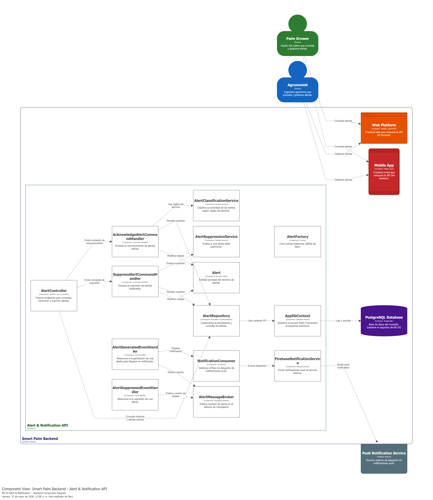
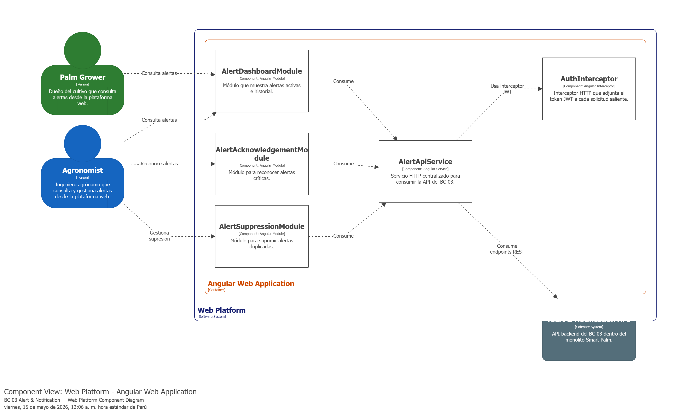
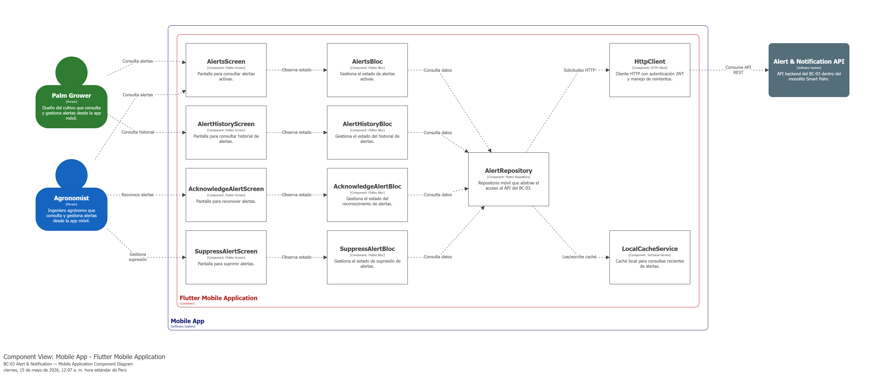
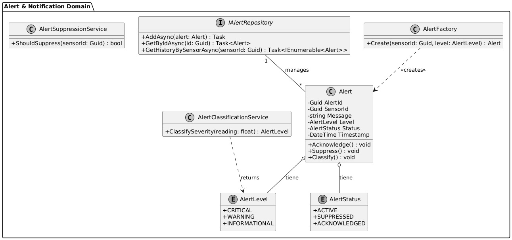
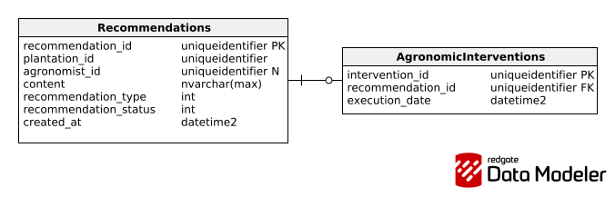

### 4.2.3. Bounded Context: Alert & Notification

Este Bounded Context es el encargado de gestionar el ciclo de vida completo de las alertas generadas por el sistema de monitoreo. Su propósito principal es supervisar los datos provenientes de los dispositivos IoT, evaluar si estos superan los umbrales agronómicos definidos por el INIA, clasificar la severidad de los eventos, suprimir notificaciones duplicadas y permitir que los usuarios (dueños de cultivos o agrónomos) reconozcan y gestionen las alertas críticas.

#### 4.2.3.1. Domain Layer.

A continuación, se describen las entidades, objetos de valor, servicios de dominio, factorías y repositorios que componen la lógica central de este contexto.

#### Clase: Alert

| Nombre: | Alert |
| :--- | :--- |
| **Categoría:** | Entity |
| **Propósito:** | Representar una notificación generada ante una condición crítica detectada en una zona de monitoreo. |

**Atributos**

| Nombre | Tipo de dato | Visibilidad | Descripción |
| :--- | :--- | :--- | :--- |
| AlertId | Guid | private | Identificador único de la alerta |
| SensorId | Guid | private | Identificador del nodo IoT relacionado |
| Message | string | private | Descripción del evento detectado |
| Level | AlertLevel | private | Severidad de la alerta |
| Status | AlertStatus | private | Estado actual del ciclo de vida |
| Timestamp | DateTime | private | Fecha y hora del registro |

**Métodos**

| Nombre | Tipo de retorno | Visibilidad | Descripción |
| :--- | :--- | :--- | :--- |
| Acknowledge | void | public | Cambia el estado a reconocido por el usuario |
| Suppress | void | public | Cambia el estado a suprimido |
| Classify | void | public | Asigna el nivel de severidad según reglas |

---

#### Clase: AlertLevel

| Nombre: | AlertLevel |
| :--- | :--- |
| **Categoría:** | Value Object |
| **Propósito:** | Definir la jerarquía de severidad de la alerta (Critical, Warning, Informational). |

**Atributos**

| Nombre | Tipo de dato | Visibilidad | Descripción |
| :--- | :--- | :--- | :--- |
| Name | string | private | Nombre del nivel de severidad |
| Priority | int | private | Valor numérico para priorización |

---

#### Clase: AlertStatus

| Nombre: | AlertStatus |
| :--- | :--- |
| **Categoría:** | Value Object |
| **Propósito:** | Definir los estados válidos de la alerta (Active, Suppressed, Acknowledged). |

**Atributos**

| Nombre | Tipo de dato | Visibilidad | Descripción |
| :--- | :--- | :--- | :--- |
| Value | string | private | Nombre del estado actual |

---

#### Clase: AlertClassificationService

| Nombre: | AlertClassificationService |
| :--- | :--- |
| **Categoría:** | Domain Service |
| **Propósito:** | Lógica de negocio para clasificar alertas basándose en parámetros agronómicos locales. |

**Métodos**

| Nombre | Tipo de retorno | Visibilidad | Descripción |
| :--- | :--- | :--- | :--- |
| ClassifySeverity | AlertLevel | public | Analiza lecturas frente a umbrales INIA |

---

#### Clase: AlertSuppressionService

| Nombre: | AlertSuppressionService |
| :--- | :--- |
| **Categoría:** | Domain Service |
| **Propósito:** | Evitar la generación de alertas duplicadas en un intervalo de tiempo específico. |

**Métodos**

| Nombre | Tipo de retorno | Visibilidad | Descripción |
| :--- | :--- | :--- | :--- |
| ShouldSuppress | bool | public | Verifica si ya existe una alerta activa similar |

---

#### Clase: IAlertRepository

| Nombre: | IAlertRepository |
| :--- | :--- |
| **Categoría:** | Repository |
| **Propósito:** | Definir el contrato para la persistencia de las alertas en la base de datos. |

**Métodos**

| Nombre | Tipo de retorno | Visibilidad | Descripción |
| :--- | :--- | :--- | :--- |
| AddAsync | Task | public | Registra una nueva alerta en el sistema |
| GetByIdAsync | Task<Alert> | public | Recupera una alerta por identificador |
| GetHistoryBySensorAsync | Task<IEnumerable<Alert>> | public | Lista historial de alertas de un sensor |

---

#### Clase: AlertFactory

| Nombre: | AlertFactory |
| :--- | :--- |
| **Categoría:** | Factory |
| **Propósito:** | Centralizar la lógica de creación e instanciación de una nueva alerta. |

**Métodos**

| Nombre | Tipo de retorno | Visibilidad | Descripción |
| :--- | :--- | :--- | :--- |
| Create | Alert | public | Valida datos y crea una nueva instancia de alerta |

#### 4.2.3.2. Interface Layer.

En esta sección se presentan las clases que conforman la capa de interfaz del Bounded Context **Alert & Notification**. Esta capa es fundamental para exponer las funcionalidades de monitoreo del cultivo de palma aceitera a las aplicaciones móviles de los usuarios (Palm Growers y Agrónomos) y gestionar la comunicación con servicios externos de mensajería.

#### Controller: AlertController

| Nombre: | AlertController |
| :--- | :--- |
| **Categoría:** | Controller |
| **Propósito:** | Servir como intermediario entre las aplicaciones móviles (del Palm Grower y Agrónomo) y la lógica de negocio de alertas, permitiendo la consulta y gestión de notificaciones. |

**Métodos**

| Nombre | Tipo de retorno | Visibilidad | Descripción |
| :--- | :--- | :--- | :--- |
| GetAlerts | Task<IEnumerable<AlertResponse>> | public | Listar las alertas activas por plantación |
| AcknowledgeAlert | Task<IActionResult> | public | Registrar la confirmación de una alerta por el usuario |
| GetAlertHistory | Task<IEnumerable<AlertResponse>> | public | Obtener el historial cronológico de alertas |
| SuppressAlert | Task<IActionResult> | public | Suprimir una alerta para evitar notificaciones duplicadas |

---

#### Consumer: NotificationConsumer

| Nombre: | NotificationConsumer |
| :--- | :--- |
| **Categoría:** | Consumer |
| **Propósito:** | Gestionar el despacho de notificaciones push hacia el servicio externo de mensajería cuando el sistema genera una alerta crítica. |

**Métodos**

| Nombre | Tipo de retorno | Visibilidad | Descripción |
| :--- | :--- | :--- | :--- |
| DispatchPushNotification | Task | public | Enviar notificación push |
| ProcessAlertEvent | Task | public | Escuchar eventos de alertas internas para disparar el flujo de notificación |

#### 4.2.3.3. Application Layer.

La capa de aplicación es responsable de orquestar los flujos de procesos del negocio, coordinando las interacciones entre la capa de interfaz (Interface Layer) y el núcleo del dominio. Aquí se implementan los casos de uso a través de **Command Handlers**, que procesan las intenciones de los usuarios, y **Event Handlers**, que reaccionan a los eventos del dominio para disparar procesos secundarios (como notificaciones o actualizaciones de estado).

#### Command Handlers

| Nombre: | AcknowledgeAlertCommandHandler |
| :--- | :--- |
| **Categoría:** | Command Handler |
| **Propósito:** | Procesar la intención del usuario de reconocer una alerta crítica recibida. |

**Métodos**

| Nombre | Tipo de retorno | Visibilidad | Descripción |
| :--- | :--- | :--- | :--- |
| Handle | Task | public | Ejecuta la lógica de reconocimiento de una alerta específica |

---

| Nombre: | SuppressAlertCommandHandler |
| :--- | :--- |
| **Categoría:** | Command Handler |
| **Propósito:** | Procesar la petición de suprimir una alerta para evitar notificaciones duplicadas en el cultivo. |

**Métodos**

| Nombre | Tipo de retorno | Visibilidad | Descripción |
| :--- | :--- | :--- | :--- |
| Handle | Task | public | Valida y marca la alerta como suprimida en el repositorio |

---

#### Event Handlers

| Nombre: | AlertGeneratedEventHandler |
| :--- | :--- |
| **Categoría:** | Event Handler |
| **Propósito:** | Reaccionar ante la creación de una nueva alerta para disparar el proceso de notificación inmediata. |

**Métodos**

| Nombre | Tipo de retorno | Visibilidad | Descripción |
| :--- | :--- | :--- | :--- |
| Handle | Task | public | Invoca al NotificationConsumer para enviar la notificación push al usuario |

---

| Nombre: | AlertSuppressedEventHandler |
| :--- | :--- |
| **Categoría:** | Event Handler |
| **Propósito:** | Actualizar el estado del dashboard cuando una alerta ha sido suprimida por el sistema o usuario. |

**Métodos**

| Nombre | Tipo de retorno | Visibilidad | Descripción |
| :--- | :--- | :--- | :--- |
| Handle | Task | public | Notifica al dashboard sobre el cambio de estado de la alerta |

#### 4.2.3.4. Infrastructure Layer.

Esta capa contiene la implementación técnica necesaria para que el sistema interactúe con servicios externos. Aquí se implementan las interfaces definidas en la Domain Layer (como los repositorios) y se gestiona la integración con sistemas de persistencia (Base de Datos) y sistemas de mensajería/notificaciones externas.

#### Clase: AlertRepository (Implementación)

| Nombre: | AlertRepository |
| :--- | :--- |
| **Categoría:** | Repository Implementation |
| **Propósito:** | Implementación de la interfaz `IAlertRepository` para persistir y recuperar alertas desde la base de datos. |

**Métodos**

| Nombre | Tipo de retorno | Visibilidad | Descripción |
| :--- | :--- | :--- | :--- |
| AddAsync | Task | public | Inserta una nueva entidad Alert en la base de datos |
| GetByIdAsync | Task<Alert> | public | Consulta una alerta específica usando Entity Framework |
| GetHistoryBySensorAsync | Task<IEnumerable<Alert>> | public | Ejecuta una query para obtener alertas históricas filtradas por sensor |

---

#### Clase: FirebaseNotificationService

| Nombre: | FirebaseNotificationService |
| :--- | :--- |
| **Categoría:** | External Service |
| **Propósito:** | Implementar la lógica para el envío de notificaciones push utilizando la API externa. |

**Métodos**

| Nombre | Tipo de retorno | Visibilidad | Descripción |
| :--- | :--- | :--- | :--- |
| SendNotificationAsync | Task | public | Envía el payload de la alerta al servicio externo. |

---

#### Clase: AlertMessageBroker

| Nombre: | AlertMessageBroker |
| :--- | :--- |
| **Categoría:** | Messaging System |
| **Propósito:** | Gestionar el envío de alertas a una cola de mensajes (Message Broker) para desacoplar el procesamiento del sistema de notificaciones. |

**Métodos**

| Nombre | Tipo de retorno | Visibilidad | Descripción |
| :--- | :--- | :--- | :--- |
| PublishAlertEvent | Task | public | Publica un evento de alerta en el bus de mensajes para consumo asíncrono |

---

#### Clase: AppDbContext

| Nombre: | AppDbContext |
| :--- | :--- |
| **Categoría:** | Database Access |
| **Propósito:** | Clase de contexto de Entity Framework encargada de mapear las entidades del dominio al esquema relacional de la base de datos. |

**Atributos**

| Nombre | Tipo de dato | Visibilidad | Descripción |
| :--- | :--- | :--- | :--- |
| Alerts | DbSet<Alert> | private | Colección mapeada a la tabla de alertas en la base de datos. |

#### 4.2.3.5. Bounded Context Software Architecture Component Level Diagrams.

Diagrama 1: Component Level — Backend API (ASP.NET Core)  
Este diagrama muestra la arquitectura de componentes del backend del BC-03 Alert & Notification dentro del monolito Smart Palm. Se organiza en controladores REST, consumidores, command handlers, event handlers, servicios de dominio, repositorios, mensajería e integración con el servicio externo de notificaciones push.

Diagrama 2: Component Level — Web Platform (Angular)  
Este diagrama muestra la arquitectura de componentes de la plataforma web para el BC-03 Alert & Notification. Se organiza en módulos Angular orientados a la consulta, reconocimiento y supresión de alertas, apoyados por un servicio HTTP y un interceptor JWT.

Diagrama 3: Component Level — Mobile Application (Flutter)  
Este diagrama muestra la arquitectura de componentes de la aplicación móvil para el BC-03 Alert & Notification. Se organiza en pantallas, blocs, repositorio móvil, cliente HTTP y caché local, permitiendo al usuario consultar, reconocer y gestionar alertas desde la app móvil.

#### 4.2.3.6. Bounded Context Software Architecture Code Level Diagrams.

##### 4.2.3.6.1. Bounded Context Domain Layer Class Diagrams.

##### 4.2.3.6.2. Bounded Context Database Design Diagram.

