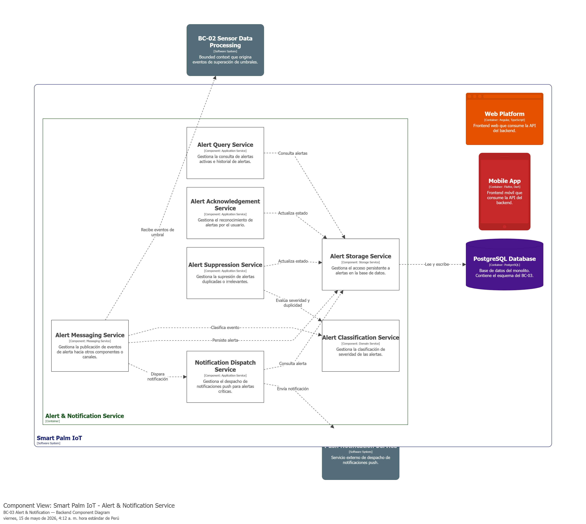
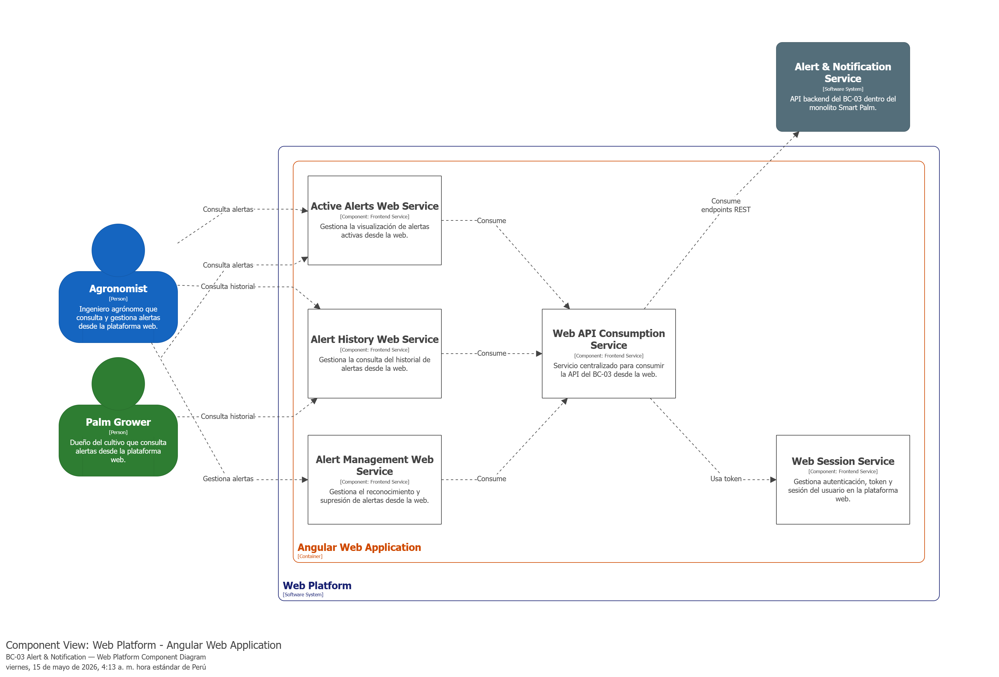
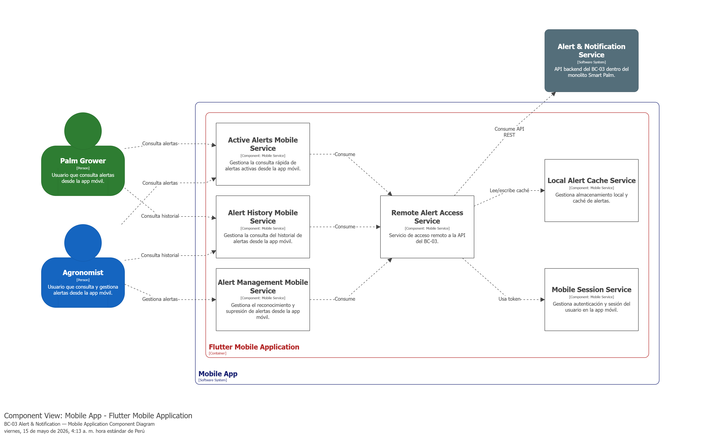

### 4.2.3. Bounded Context: Alert & Notification

Este Bounded Context es el encargado de gestionar el ciclo de vida completo de las alertas generadas por el sistema de monitoreo. Su propósito principal es supervisar los datos provenientes de los dispositivos IoT, evaluar si estos superan los umbrales agronómicos definidos por el INIA, clasificar la severidad de los eventos, suprimir notificaciones duplicadas y permitir que los usuarios (dueños de cultivos o agrónomos) reconozcan y gestionen las alertas críticas.

#### 4.2.3.1. Domain Layer.

A continuación, se describen las entidades, servicios de dominio, repositorios y enumeraciones que componen la lógica central de este contexto.

#### Aggregate: Alert

| Nombre: | Alert |
| :--- | :--- |
| **Categoría:** | Entity / Aggregate Root |
| **Propósito:** | Representar una alerta generada cuando una lectura de sensor excede los umbrales agronómicos definidos. |

**Atributos**

| Nombre | Tipo de dato | Visibilidad | Descripción |
| :--- | :--- | :--- | :--- |
| Id | Guid | private | Identificador único de la alerta |
| SensorType | SensorType | private | Tipo de sensor asociado (del Shared Kernel) |
| UserId | int | private | Identificador del usuario destino (0 para alertas del sistema) |
| Message | string | private | Descripción del evento detectado |
| Level | AlertLevel | private | Severidad de la alerta (Informational, Warning, Critical) |
| Status | AlertStatus | private | Estado actual del ciclo de vida (Active, Acknowledged, Suppressed) |
| Timestamp | DateTime | private | Fecha y hora del registro |

**Métodos**

| Nombre | Tipo de retorno | Visibilidad | Descripción |
| :--- | :--- | :--- | :--- |
| Acknowledge | void | public | Cambia el estado a Acknowledged si está Active |

---

#### Enum: AlertLevel

| Nombre: | AlertLevel |
| :--- | :--- |
| **Categoría:** | Enum |
| **Propósito:** | Definir la jerarquía de severidad de la alerta. |

**Valores**

| Nombre | Valor | Descripción |
| :--- | :--- | :--- |
| Informational | 0 | Desviación menor al 10% del punto medio del umbral |
| Warning | 1 | Desviación entre 10% y 30% del punto medio del umbral |
| Critical | 2 | Desviación superior al 30% del punto medio del umbral |

---

#### Enum: AlertStatus

| Nombre: | AlertStatus |
| :--- | :--- |
| **Categoría:** | Enum |
| **Propósito:** | Definir los estados válidos del ciclo de vida de una alerta. |

**Valores**

| Nombre | Valor | Descripción |
| :--- | :--- | :--- |
| Active | 0 | Alerta activa, aún no reconocida |
| Acknowledged | 1 | Alerta reconocida por el usuario |
| Suppressed | 2 | Alerta suprimida (reservado para uso futuro) |

---

#### Clase: AlertClassificationService

| Nombre: | AlertClassificationService |
| :--- | :--- |
| **Categoría:** | Domain Service |
| **Propósito:** | Clasificar la severidad de una alerta basándose en la desviación de la lectura respecto al punto medio del umbral agronómico. |

**Métodos**

| Nombre | Tipo de retorno | Visibilidad | Descripción |
| :--- | :--- | :--- | :--- |
| ClassifySeverity | AlertLevel | public | Calcula la desviación relativa y retorna Informational (<10%), Warning (<30%) o Critical (>=30%) |

---

#### Clase: IAlertRepository

| Nombre: | IAlertRepository |
| :--- | :--- |
| **Categoría:** | Repository |
| **Propósito:** | Definir el contrato para la persistencia de las alertas en la base de datos. |

**Métodos**

| Nombre | Tipo de retorno | Visibilidad | Descripción |
| :--- | :--- | :--- | :--- |
| AddAsync | Task | public | Registra una nueva alerta en el sistema |
| FindByGuidAsync | Task<Alert?> | public | Busca una alerta por su identificador único |
| FindByUserIdAsync | Task<IEnumerable<Alert>> | public | Lista las alertas asociadas a un usuario |
| FindBySensorTypeAsync | Task<IEnumerable<Alert>> | public | Lista las alertas filtradas por tipo de sensor |

---

#### Entity: UserAlertSetting

| Nombre: | UserAlertSetting |
| :--- | :--- |
| **Categoría:** | Entity |
| **Propósito:** | Representar la preferencia de un usuario para silenciar alertas de un tipo de sensor específico. |

**Atributos**

| Nombre | Tipo de dato | Visibilidad | Descripción |
| :--- | :--- | :--- | :--- |
| Id | int | private | Identificador único autogenerado |
| UserId | int | private | Identificador del usuario |
| SensorType | SensorType | private | Tipo de sensor al que aplica la configuración |
| IsMuted | bool | private | Indica si las alertas de este sensor están silenciadas |

**Métodos**

| Nombre | Tipo de retorno | Visibilidad | Descripción |
| :--- | :--- | :--- | :--- |
| UpdateMute | void | public | Actualiza el estado de silencio |

Nota: La tabla `user_alert_settings` tiene un índice único compuesto en (UserId, SensorType).

---

#### Clase: IUserAlertSettingRepository

| Nombre: | IUserAlertSettingRepository |
| :--- | :--- |
| **Categoría:** | Repository |
| **Propósito:** | Definir el contrato para la persistencia de las configuraciones de alertas por usuario. |

**Métodos**

| Nombre | Tipo de retorno | Visibilidad | Descripción |
| :--- | :--- | :--- | :--- |
| AddAsync | Task | public | Registra una nueva configuración |
| Update | void | public | Actualiza una configuración existente |
| FindByUserIdAndSensorTypeAsync | Task<UserAlertSetting?> | public | Busca configuración por usuario y tipo de sensor |
| FindByUserIdAsync | Task<IEnumerable<UserAlertSetting>> | public | Lista configuraciones de un usuario |

#### 4.2.3.2. Interface Layer.

En esta sección se presentan las clases que conforman la capa de interfaz del Bounded Context **Alert & Notification**. Esta capa es fundamental para exponer las funcionalidades de monitoreo del cultivo de palma aceitera a las aplicaciones móviles de los usuarios (Palm Growers y Agrónomos) y gestionar la comunicación con servicios externos de mensajería.

#### Controller: AlertController

| Nombre: | AlertController |
| :--- | :--- |
| **Categoría:** | Controller |
| **Propósito:** | Exponer endpoints para consultar y reconocer alertas. |

**Métodos**

| Nombre | Tipo de retorno | Visibilidad | Descripción |
| :--- | :--- | :--- | :--- |
| GetAlerts | Task<IActionResult> | public | GET /api/v1/alerts?userId=N — Lista alertas por usuario |
| AcknowledgeAlert | Task<IActionResult> | public | POST /api/v1/alerts/acknowledge — Reconoce una alerta por ID |

---

#### Controller: UserAlertSettingsController

| Nombre: | UserAlertSettingsController |
| :--- | :--- |
| **Categoría:** | Controller |
| **Propósito:** | Exponer endpoints para gestionar la configuración de notificaciones por tipo de sensor para cada usuario. |

**Métodos**

| Nombre | Tipo de retorno | Visibilidad | Descripción |
| :--- | :--- | :--- | :--- |
| GetAll | Task<IActionResult> | public | GET /api/v1/users/{userId}/alert-settings — Lista configuraciones del usuario |
| GetBySensorType | Task<IActionResult> | public | GET /api/v1/users/{userId}/alert-settings/{sensorType} — Obtiene configuración por sensor |
| Update | Task<IActionResult> | public | PUT /api/v1/users/{userId}/alert-settings/{sensorType} — Crea o actualiza mute/unmute |

#### 4.2.3.3. Application Layer.

La capa de aplicación es responsable de orquestar los flujos de procesos del negocio, coordinando las interacciones entre la capa de interfaz (Interface Layer) y el núcleo del dominio. Aquí se implementan los casos de uso a través de **Command Services** y **Query Services**, que procesan las intenciones de los usuarios, y **Event Handlers**, que reaccionan a los eventos del dominio para disparar procesos secundarios (como notificaciones).

#### Command Services

| Nombre: | AlertCommandService |
| :--- | :--- |
| **Categoría:** | Command Service |
| **Propósito:** | Procesar comandos relacionados con alertas (reconocimiento). |

**Métodos**

| Nombre | Tipo de retorno | Visibilidad | Descripción |
| :--- | :--- | :--- | :--- |
| Handle | Task<Alert> | public | Ejecuta la lógica de reconocimiento de una alerta a partir de un AcknowledgeAlertCommand |

---

| Nombre: | UserAlertSettingCommandService |
| :--- | :--- |
| **Categoría:** | Command Service |
| **Propósito:** | Procesar comandos para actualizar la configuración de alertas por usuario y tipo de sensor. |

**Métodos**

| Nombre | Tipo de retorno | Visibilidad | Descripción |
| :--- | :--- | :--- | :--- |
| Handle | Task<UserAlertSetting> | public | Crea o actualiza el estado IsMuted para un usuario y sensor específicos |

---

#### Query Services

| Nombre: | AlertQueryService |
| :--- | :--- |
| **Categoría:** | Query Service |
| **Propósito:** | Ejecutar consultas relacionadas con alertas. |

**Métodos**

| Nombre | Tipo de retorno | Visibilidad | Descripción |
| :--- | :--- | :--- | :--- |
| Handle (GetAlertsByUserIdQuery) | Task<IEnumerable<Alert>> | public | Retorna las alertas asociadas a un usuario |
| Handle (GetAlertByIdQuery) | Task<Alert?> | public | Retorna una alerta por su identificador |

---

| Nombre: | UserAlertSettingQueryService |
| :--- | :--- |
| **Categoría:** | Query Service |
| **Propósito:** | Ejecutar consultas sobre configuraciones de alertas de usuario. |

**Métodos**

| Nombre | Tipo de retorno | Visibilidad | Descripción |
| :--- | :--- | :--- | :--- |
| Handle (userId) | Task<IEnumerable<UserAlertSetting>> | public | Retorna todas las configuraciones de un usuario |
| Handle (userId, sensorType) | Task<UserAlertSetting?> | public | Retorna la configuración para un usuario y sensor específicos |

---

#### Event Handlers

| Nombre: | ThresholdExceededEventHandler |
| :--- | :--- |
| **Categoría:** | Event Handler (MediatR) |
| **Propósito:** | Reaccionar ante un ThresholdExceededEvent del Shared Kernel, creando una alerta, verificando la configuración de mute del usuario y enviando notificación push vía Firebase. |

**Métodos**

| Nombre | Tipo de retorno | Visibilidad | Descripción |
| :--- | :--- | :--- | :--- |
| Handle | Task | public | Clasifica severidad con AlertClassificationService, crea y persiste la alerta, chequea UserAlertSetting.IsMuted y envía notificación push |

---

| Nombre: | AlertGeneratedEventHandler |
| :--- | :--- |
| **Categoría:** | Event Handler (application service) |
| **Propósito:** | Enviar notificación push cuando se genera una alerta de forma programática. |

**Métodos**

| Nombre | Tipo de retorno | Visibilidad | Descripción |
| :--- | :--- | :--- | :--- |
| Handle | Task | public | Envía la notificación push al servicio Firebase para una alerta dada |

#### 4.2.3.4. Infrastructure Layer.

Esta capa contiene la implementación técnica necesaria para que el sistema interactúe con servicios externos. Aquí se implementan las interfaces definidas en la Domain Layer (como los repositorios) y se gestiona la integración con sistemas de persistencia (Base de Datos) y sistemas de mensajería/notificaciones externas.

#### Clase: AlertRepository (Implementación)

| Nombre: | AlertRepository |
| :--- | :--- |
| **Categoría:** | Repository Implementation |
| **Propósito:** | Implementación de `IAlertRepository` usando Entity Framework Core con la tabla `alerts`. |

**Métodos**

| Nombre | Tipo de retorno | Visibilidad | Descripción |
| :--- | :--- | :--- | :--- |
| AddAsync | Task | public | Inserta una nueva alerta en la tabla `alerts` |
| FindByGuidAsync | Task<Alert?> | public | Busca una alerta por su Id |
| FindByUserIdAsync | Task<IEnumerable<Alert>> | public | Obtiene alertas de un usuario ordenadas por fecha descendente |
| FindBySensorTypeAsync | Task<IEnumerable<Alert>> | public | Obtiene alertas filtradas por tipo de sensor |

---

#### Clase: UserAlertSettingRepository (Implementación)

| Nombre: | UserAlertSettingRepository |
| :--- | :--- |
| **Categoría:** | Repository Implementation |
| **Propósito:** | Implementación de `IUserAlertSettingRepository` usando Entity Framework Core con la tabla `user_alert_settings`. |

**Métodos**

| Nombre | Tipo de retorno | Visibilidad | Descripción |
| :--- | :--- | :--- | :--- |
| AddAsync | Task | public | Inserta una nueva configuración en la tabla `user_alert_settings` |
| Update | void | public | Actualiza una configuración existente |
| FindByUserIdAndSensorTypeAsync | Task<UserAlertSetting?> | public | Busca configuración por usuario y tipo de sensor |
| FindByUserIdAsync | Task<IEnumerable<UserAlertSetting>> | public | Lista configuraciones de un usuario |

---

#### Clase: FirebaseNotificationService

| Nombre: | FirebaseNotificationService |
| :--- | :--- |
| **Categoría:** | External Service |
| **Propósito:** | Enviar notificaciones push vía Firebase Cloud Messaging (FCM) al tópico "alerts". |

**Métodos**

| Nombre | Tipo de retorno | Visibilidad | Descripción |
| :--- | :--- | :--- | :--- |
| SendNotificationAsync | Task | public | Envía notificación push al tópico "alerts" con título = severidad y cuerpo = mensaje |

Nota: Si no se encuentra la variable de entorno `FIREBASE_CREDENTIALS_JSON` ni el archivo `firebase-credentials.json`, el servicio se inicializa sin credenciales y omite silenciosamente el envío de notificaciones sin lanzar error.

#### 4.2.3.5. Bounded Context Software Architecture Component Level Diagrams.

Diagrama 1: Component Level — Backend API (ASP.NET Core)  
Este diagrama muestra la arquitectura de componentes del backend del BC-03 Alert & Notification dentro del monolito Smart Palm. Se organiza en servicios de consulta, reconocimiento, supresión, clasificación, despacho de notificaciones y publicación de eventos de alerta.

Diagrama 2: Component Level — Web Platform (Angular)  
Este diagrama muestra la arquitectura de componentes de la plataforma web para el BC-03 Alert & Notification. Se organiza en servicios orientados a la consulta, revisión y gestión de alertas desde la web, apoyados por un servicio central de consumo de API y gestión de sesión web.

Diagrama 3: Component Level — Mobile Application (Flutter)  
Este diagrama muestra la arquitectura de componentes de la aplicación móvil para el BC-03 Alert & Notification. Se organiza en servicios orientados a la consulta rápida de alertas activas, historial y gestión básica de alertas desde la app móvil, apoyados por servicios de acceso remoto, sesión móvil y almacenamiento local.

#### 4.2.3.6. Bounded Context Software Architecture Code Level Diagrams.

##### 4.2.3.6.1. Bounded Context Domain Layer Class Diagrams.

##### 4.2.3.6.2. Bounded Context Database Design Diagram.

