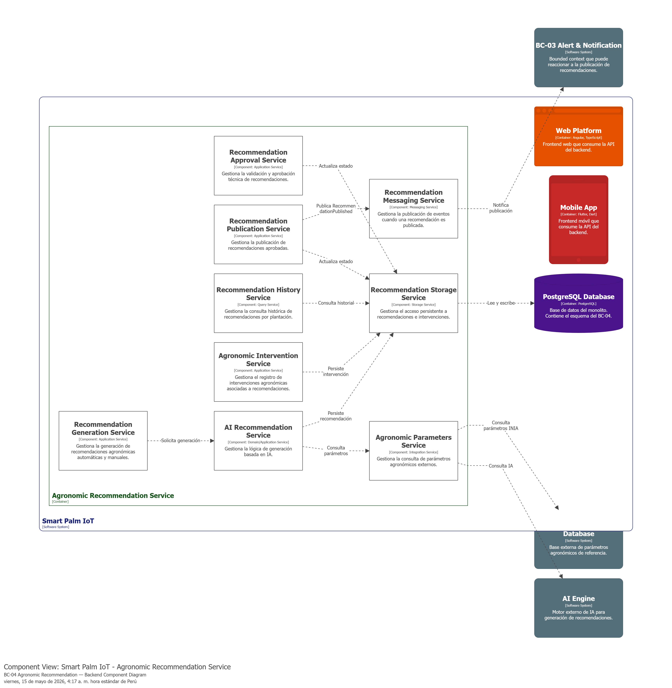
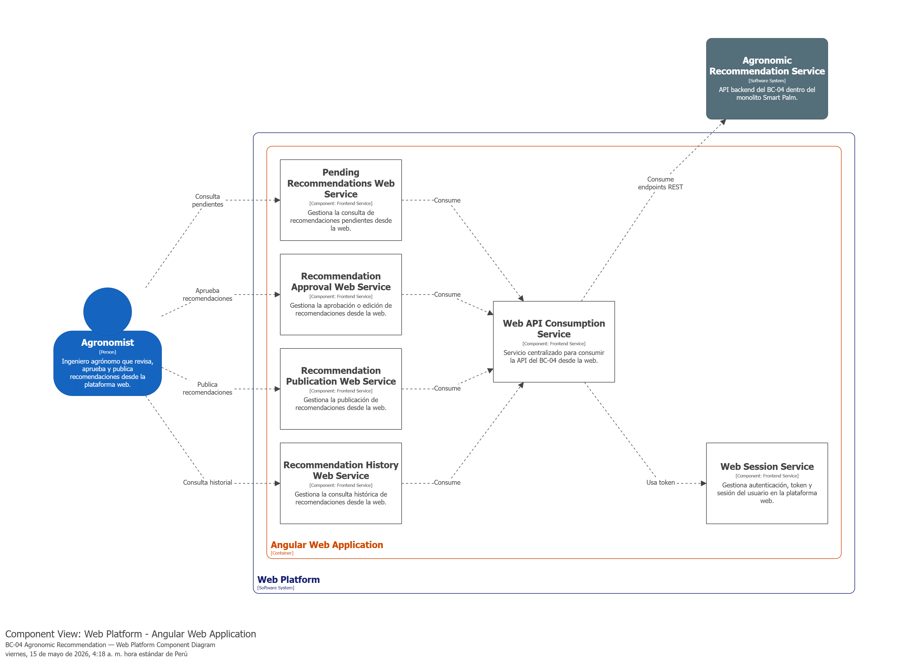
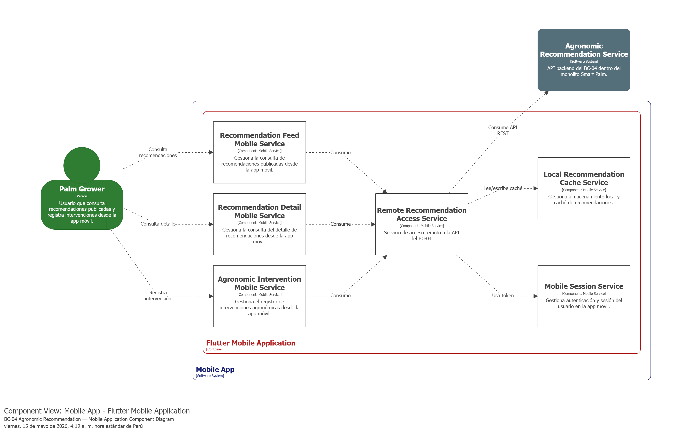

### 4.2.4. Bounded Context: Agronomic Recommendation

Esta capa contiene las entidades y reglas de negocio necesarias para gestionar la generación, aprobación y publicación de recomendaciones agronómicas.

#### 4.2.4.1. Domain Layer.

#### Clase: Recommendation (Aggregate Root)

| Nombre: | Recommendation |
| :--- | :--- |
| **Categoría:** | Entity / Aggregate Root |
| **Propósito:** | Representar una propuesta de manejo para el cultivo, generada ya sea por IA o de forma manual por un agrónomo. |

**Atributos**

| Nombre | Tipo de dato | Visibilidad | Descripción |
| :--- | :--- | :--- | :--- |
| Id | int | private | Identificador único de la recomendación |
| PlantationId | int | private | Identificador de la plantación objetivo |
| AgronomistId | int | private | Identificador del agrónomo responsable |
| Content | string | private | Detalle de la recomendación técnica |
| Type | RecommendationType | private | Origen (AI o Manual) |
| Status | RecommendationStatus | private | Estado del ciclo de vida |
| CreatedAt | DateTime | private | Fecha de generación |
| ApprovedAt | DateTime? | private | Fecha de aprobación |
| PublishedAt | DateTime? | private | Fecha de publicación |

**Métodos**

| Nombre | Tipo de retorno | Visibilidad | Descripción |
| :--- | :--- | :--- | :--- |
| Approve | void | public | Cambia el estado a Aprobado y registra ApprovedAt |
| Publish | void | public | Cambia el estado a Publicado y registra PublishedAt |
| UpdateContent | void | public | Permite edición manual del contenido |

---

#### Clase: RecommendationStatus (Enumeration)

| Nombre: | RecommendationStatus |
| :--- | :--- |
| **Categoría:** | Enumeration |
| **Propósito:** | Definir los estados del flujo de la recomendación. |

**Valores**

| Nombre | Valor | Descripción |
| :--- | :--- | :--- |
| Pending | 0 | Recomendación pendiente de aprobación |
| Approved | 1 | Recomendación aprobada por el agrónomo |
| Published | 2 | Recomendación publicada y visible para el Palm Grower |

---

#### Clase: RecommendationType (Enumeration)

| Nombre: | RecommendationType |
| :--- | :--- |
| **Categoría:** | Enumeration |
| **Propósito:** | Diferenciar si la recomendación fue generada por el AI Engine o un Agrónomo. |

**Valores**

| Nombre | Valor | Descripción |
| :--- | :--- | :--- |
| Manual | 0 | Recomendación creada manualmente por un agrónomo |

---

#### Clase: AgronomicIntervention (Entity)

| Nombre: | AgronomicIntervention |
| :--- | :--- |
| **Categoría:** | Entity |
| **Propósito:** | Registrar la acción tomada por el Palm Grower tras recibir una recomendación. |

**Atributos**

| Nombre | Tipo de dato | Visibilidad | Descripción |
| :--- | :--- | :--- | :--- |
| Id | int | private | Identificador único |
| RecommendationId | int | private | Referencia a la recomendación base |
| Description | string | private | Descripción de la intervención realizada |
| PerformedBy | string | private | Nombre de quien realizó la intervención |
| ExecutionDate | DateTime | private | Fecha real de ejecución |
| CreatedAt | DateTime | private | Fecha de registro del sistema |

---

#### Clase: IRecommendationRepository (Interface)

| Nombre: | IRecommendationRepository |
| :--- | :--- |
| **Categoría:** | Repository (Interface) |
| **Propósito:** | Definir las operaciones para persistir y consultar las recomendaciones en el sistema. |

**Métodos**

| Nombre | Tipo de retorno | Visibilidad | Descripción |
| :--- | :--- | :--- | :--- |
| AddAsync | Task | public | Guarda una recomendación en persistencia |
| FindByIdAsync | Task<Recommendation?> | public | Recupera recomendación por ID |
| FindPendingAsync | Task<IEnumerable<Recommendation>> | public | Lista las pendientes de aprobación |
| FindByPlantationIdAsync | Task<IEnumerable<Recommendation>> | public | Lista recomendaciones por plantación |
| FindByAgronomistIdAsync | Task<IEnumerable<Recommendation>> | public | Lista recomendaciones por agrónomo |
| FindByPlantationIdAndStatusAsync | Task<IEnumerable<Recommendation>> | public | Lista recomendaciones por plantación y estado |
| FindByPlantationIdAndAgronomistIdAsync | Task<IEnumerable<Recommendation>> | public | Lista recomendaciones por plantación y agrónomo |
| FindByPlantationIdAgronomistIdAndStatusAsync | Task<IEnumerable<Recommendation>> | public | Lista recomendaciones por plantación, agrónomo y estado |
| AddInterventionAsync | Task | public | Guarda una intervención agronómica |
| FindInterventionsByRecommendationIdAsync | Task<IEnumerable<AgronomicIntervention>> | public | Recupera intervenciones por ID de recomendación |

#### 4.2.4.2. Interface Layer.

#### Controller: RecommendationsController

| Nombre: | RecommendationsController |
| :--- | :--- |
| **Categoría:** | Controller |
| **Propósito:** | Servir como interfaz para que los Agrónomos gestionen el ciclo de vida de las recomendaciones y los Palm Growers consulten y registren intervenciones. |

**Métodos**

| Nombre | Tipo de retorno | Visibilidad | Descripción |
| :--- | :--- | :--- | :--- |
| GetRecommendationById | Task<IActionResult> | public | Obtiene una recomendación por ID |
| GetRecommendations | Task<IActionResult> | public | Lista recomendaciones de una plantación, filtrable por status y/o agronomistId |
| CreateRecommendation | Task<IActionResult> | public | Crea una nueva recomendación |
| UpdateRecommendationContent | Task<IActionResult> | public | Actualiza el contenido de una recomendación |
| ApproveRecommendation | Task<IActionResult> | public | Aprueba una recomendación (Pending -> Approved) |
| PublishRecommendation | Task<IActionResult> | public | Publica una recomendación (Approved -> Published) |
| RegisterIntervention | Task<IActionResult> | public | Registra una intervención agronómica |
| GetInterventionsByRecommendationId | Task<IActionResult> | public | Lista las intervenciones de una recomendación |

#### 4.2.4.3. Application Layer.

#### Application Services
Estos componentes gestionan las solicitudes de los usuarios (Agrónomos o Palm Growers) y ejecutan las acciones en el modelo de dominio.

| Nombre: | RecommendationCommandService |
| :--- | :--- |
| **Categoría:** | Command Service |
| **Propósito:** | Procesar comandos de escritura sobre recomendaciones e intervenciones. |

**Métodos**

| Nombre | Tipo de retorno | Visibilidad | Descripción |
| :--- | :--- | :--- | :--- |
| Handle(CreateRecommendationCommand) | Task<Recommendation> | public | Crea una nueva recomendación |
| Handle(UpdateRecommendationContentCommand) | Task<Recommendation> | public | Actualiza el contenido de una recomendación |
| Handle(ApproveRecommendationCommand) | Task<Recommendation> | public | Cambia el estado a "Approved" |
| Handle(PublishRecommendationCommand) | Task<Recommendation> | public | Cambia el estado a "Published" |
| Handle(RegisterAgronomicInterventionCommand) | Task<AgronomicIntervention> | public | Registra una intervención en campo |

---

| Nombre: | RecommendationQueryService |
| :--- | :--- |
| **Categoría:** | Query Service |
| **Propósito:** | Ejecutar consultas sobre recomendaciones e intervenciones. |

**Métodos**

| Nombre | Tipo de retorno | Visibilidad | Descripción |
| :--- | :--- | :--- | :--- |
| Handle(GetPlantationRecommendationsQuery) | Task<IEnumerable<Recommendation>> | public | Lista recomendaciones por plantación con filtros opcionales |
| Handle(GetRecommendationByIdQuery) | Task<Recommendation?> | public | Obtiene una recomendación por ID |
| Handle(GetInterventionsByRecommendationIdQuery) | Task<IEnumerable<AgronomicIntervention>> | public | Lista intervenciones de una recomendación |

#### 4.2.4.4. Infrastructure Layer.

#### Clase: RecommendationRepository (Implementación)

| Nombre: | RecommendationRepository |
| :--- | :--- |
| **Categoría:** | Repository Implementation |
| **Propósito:** | Implementar la interfaz `IRecommendationRepository` para gestionar la persistencia de recomendaciones en la base de datos SQL. Extiende `BaseRepository<Recommendation>` y utiliza `AppDbContext`. |

**Métodos**

| Nombre | Tipo de retorno | Visibilidad | Descripción |
| :--- | :--- | :--- | :--- |
| AddAsync | Task | public | Persiste la nueva recomendación en la tabla `recommendations` |
| FindPendingAsync | Task<IEnumerable<Recommendation>> | public | Consulta recomendaciones con estado 'Pending' |
| FindByPlantationIdAsync | Task<IEnumerable<Recommendation>> | public | Consulta recomendaciones por plantación |
| FindByAgronomistIdAsync | Task<IEnumerable<Recommendation>> | public | Consulta recomendaciones por agrónomo |
| FindByPlantationIdAndStatusAsync | Task<IEnumerable<Recommendation>> | public | Consulta recomendaciones por plantación y estado |
| FindByPlantationIdAndAgronomistIdAsync | Task<IEnumerable<Recommendation>> | public | Consulta recomendaciones por plantación y agrónomo |
| FindByPlantationIdAgronomistIdAndStatusAsync | Task<IEnumerable<Recommendation>> | public | Consulta recomendaciones por plantación, agrónomo y estado |
| AddInterventionAsync | Task | public | Persiste una intervención en la tabla `agronomic_interventions` |
| FindInterventionsByRecommendationIdAsync | Task<IEnumerable<AgronomicIntervention>> | public | Consulta intervenciones por ID de recomendación |

---

#### Clase: AppDbContext (Shared Database Context)

| Nombre: | AppDbContext |
| :--- | :--- |
| **Categoría:** | Database Access |
| **Propósito:** | Contexto de persistencia compartido que mapea las entidades del dominio de recomendaciones a tablas de la base de datos. |

**Tablas configuradas**

| Tabla | Entidad | Descripción |
| :--- | :--- | :--- |
| `recommendations` | Recommendation | Almacena el historial de recomendaciones |
| `agronomic_interventions` | AgronomicIntervention | Almacena las intervenciones registradas en campo |

AppDbContext es el DbContext compartido de toda la aplicación, configurado en `Shared/Infrastructure/Persistence/EFC/Configuration/AppDbContext`. Las entidades de este BC se configuran dentro del método `OnModelCreating` con `ToTable()`, `HasConversion<string>()` para enums, y `UseSnakeCaseNamingConvention()`.

#### 4.2.4.5. Bounded Context Software Architecture Component Level Diagrams.

Diagrama 1: Component Level — Backend API (ASP.NET Core)  
Este diagrama muestra la arquitectura de componentes del backend del BC-04 Agronomic Recommendation dentro del monolito Smart Palm. Se organiza en servicios de generación, aprobación, publicación, consulta histórica, registro de intervenciones, integración con IA y parámetros agronómicos, y publicación de eventos de recomendación.

Diagrama 2: Component Level — Web Platform (Angular)  
Este diagrama muestra la arquitectura de componentes de la plataforma web para el BC-04 Agronomic Recommendation. Se organiza en servicios orientados a la revisión, aprobación, publicación y consulta histórica de recomendaciones, apoyados por un servicio central de consumo de API y gestión de sesión web.

Diagrama 3: Component Level — Mobile Application (Flutter)  
Este diagrama muestra la arquitectura de componentes de la aplicación móvil para el BC-04 Agronomic Recommendation. Se organiza en servicios orientados a la consulta de recomendaciones publicadas, revisión de detalle y registro de intervenciones agronómicas, apoyados por servicios de acceso remoto, sesión móvil y almacenamiento local.

#### 4.2.4.6. Bounded Context Software Architecture Code Level Diagrams.

##### 4.2.4.6.1. Bounded Context Domain Layer Class Diagrams.

##### 4.2.4.6.2. Bounded Context Database Design Diagram.

---

