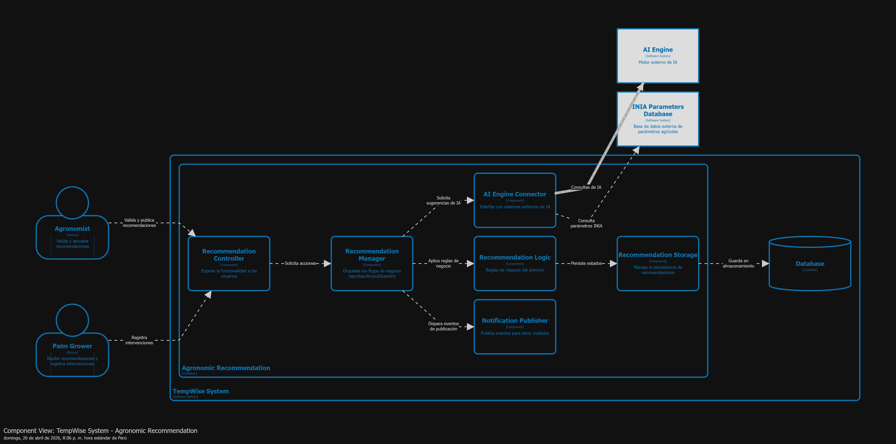
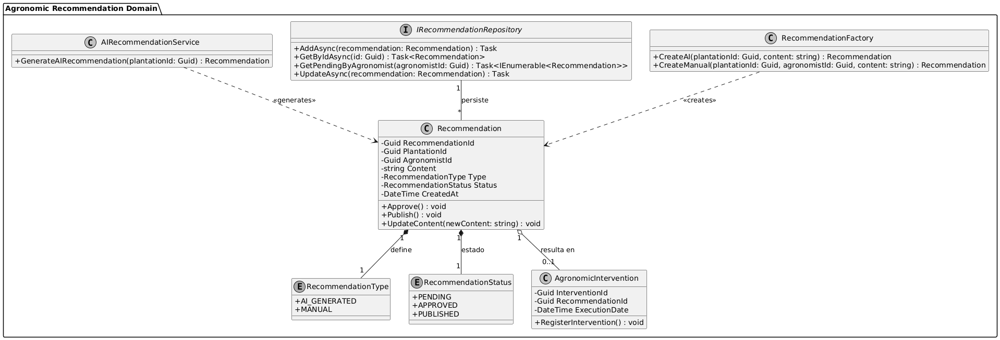
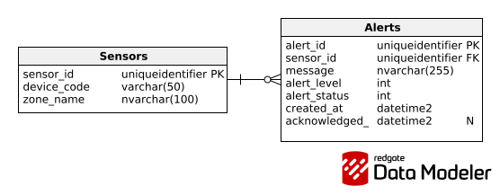

### 4.2.4. Bounded Context: Agronomic Recommendation

Esta capa contiene las entidades y reglas de negocio necesarias para gestionar la generación, aprobación y publicación de recomendaciones agronómicas.

#### 4.2.4.1. Domain Layer.

#### Clase: Recommendation (Aggregate Root)

| Nombre: | Recommendation |
| :--- | :--- |
| **Categoría:** | Entity / Aggregate Root |
| **Propósito:** | Representar una propuesta de manejo para el cultivo, generada ya sea por IA o de forma manual por un agrónomo. |

**Atributos**

| Nombre | Tipo de dato | Visibilidad | Descripción |
| :--- | :--- | :--- | :--- |
| RecommendationId | Guid | private | Identificador único de la recomendación |
| PlantationId | Guid | private | Identificador de la plantación objetivo |
| AgronomistId | Guid | private | Identificador del agrónomo responsable |
| Content | string | private | Detalle de la recomendación técnica |
| Type | RecommendationType | private | Origen (AI o Manual) |
| Status | RecommendationStatus | private | Estado del ciclo de vida |
| CreatedAt | DateTime | private | Fecha de generación |

**Métodos**

| Nombre | Tipo de retorno | Visibilidad | Descripción |
| :--- | :--- | :--- | :--- |
| Approve | void | public | Cambia el estado a Aprobado |
| Publish | void | public | Cambia el estado a Publicado y notifica |
| UpdateContent | void | public | Permite edición manual del contenido |

---

#### Clase: RecommendationStatus (Value Object)

| Nombre: | RecommendationStatus |
| :--- | :--- |
| **Categoría:** | Value Object |
| **Propósito:** | Definir los estados del flujo de la recomendación (Pending, Approved, Published). |

**Atributos**

| Nombre | Tipo de dato | Visibilidad | Descripción |
| :--- | :--- | :--- | :--- |
| Value | string | private | Nombre del estado |

---

#### Clase: RecommendationType (Value Object)

| Nombre: | RecommendationType |
| :--- | :--- |
| **Categoría:** | Value Object |
| **Propósito:** | Diferenciar si la recomendación fue generada por el AI Engine o un Agrónomo. |

**Atributos**

| Nombre | Tipo de dato | Visibilidad | Descripción |
| :--- | :--- | :--- | :--- |
| TypeName | string | private | Identificador del tipo (AI o Manual) |

---

#### Clase: AIRecommendationService (Domain Service)

| Nombre: | AIRecommendationService |
| :--- | :--- |
| **Categoría:** | Domain Service |
| **Propósito:** | Lógica de negocio para invocar el motor de IA y generar recomendaciones basadas en datos de sensores. |

**Métodos**

| Nombre | Tipo de retorno | Visibilidad | Descripción |
| :--- | :--- | :--- | :--- |
| GenerateAIRecommendation | Recommendation | public | Procesa inputs y genera la recomendación automática |

---

#### Clase: RecommendationFactory (Factory)

| Nombre: | RecommendationFactory |
| :--- | :--- |
| **Categoría:** | Factory |
| **Propósito:** | Encapsular la lógica de instanciación de recomendaciones según su origen. |

**Métodos**

| Nombre | Tipo de retorno | Visibilidad | Descripción |
| :--- | :--- | :--- | :--- |
| CreateAI | Recommendation | public | Crea recomendación basada en el motor de IA |
| CreateManual | Recommendation | public | Crea recomendación basada en entrada del Agrónomo |

---

#### Clase: AgronomicIntervention (Entity)

| Nombre: | AgronomicIntervention |
| :--- | :--- |
| **Categoría:** | Entity |
| **Propósito:** | Registrar la acción tomada por el Palm Grower tras recibir una recomendación. |

**Atributos**

| Nombre | Tipo de dato | Visibilidad | Descripción |
| :--- | :--- | :--- | :--- |
| InterventionId | Guid | private | Identificador único |
| RecommendationId | Guid | private | Referencia a la recomendación base |
| ExecutionDate | DateTime | private | Fecha real de ejecución |

**Métodos**

| Nombre | Tipo de retorno | Visibilidad | Descripción |
| :--- | :--- | :--- | :--- |
| RegisterIntervention | void | public | Guarda el registro de la actividad realizada en campo |

---

#### Clase: IRecommendationRepository (Interface)

| Nombre: | IRecommendationRepository |
| :--- | :--- |
| **Categoría:** | Repository (Interface) |
| **Propósito:** | Definir las operaciones para persistir y consultar las recomendaciones en el sistema. |

**Métodos**

| Nombre | Tipo de retorno | Visibilidad | Descripción |
| :--- | :--- | :--- | :--- |
| AddAsync | Task | public | Guarda una recomendación en persistencia |
| GetByIdAsync | Task<Recommendation> | public | Recupera recomendación por ID |
| GetPendingByAgronomist | Task<IEnumerable<Recommendation>> | public | Lista las pendientes de aprobación |

#### 4.2.4.2. Interface Layer.

#### Controller: RecommendationController

| Nombre: | RecommendationController |
| :--- | :--- |
| **Categoría:** | Controller |
| **Propósito:** | Servir como interfaz para que los Agrónomos gestionen el flujo de aprobación y para que los Palm Growers consulten sus recomendaciones. |

**Métodos**

| Nombre | Tipo de retorno | Visibilidad | Descripción |
| :--- | :--- | :--- | :--- |
| GetPendingRecommendations | Task<IEnumerable<RecommendationResponse>> | public | Lista todas las recomendaciones pendientes de validación por el agrónomo |
| ApproveRecommendation | Task<IActionResult> | public | Registra la aprobación de una recomendación específica |
| UpdateRecommendation | Task<IActionResult> | public | Modifica el contenido de una recomendación (manual o IA) |
| GetPlantationHistory | Task<IEnumerable<RecommendationResponse>> | public | Obtiene el historial de recomendaciones de una plantación |

---

#### Consumer: AIRecommendationConsumer

| Nombre: | AIRecommendationConsumer |
| :--- | :--- |
| **Categoría:** | Consumer |
| **Propósito:** | Escuchar eventos de entrada provenientes del Motor de IA y disparar el proceso de creación de una nueva recomendación en el sistema. |

**Métodos**

| Nombre | Tipo de retorno | Visibilidad | Descripción |
| :--- | :--- | :--- | :--- |
| ProcessAIEvent | Task | public | Consume el evento de "Predicción generada" y llama a la lógica de aplicación para registrar la recomendación |

#### 4.2.4.3. Application Layer.

#### Command Handlers
Estos componentes gestionan las solicitudes de los usuarios (Agrónomos o Palm Growers) y ejecutan las acciones en el modelo de dominio.

| Nombre: | ApproveRecommendationCommandHandler |
| :--- | :--- |
| **Categoría:** | Command Handler |
| **Propósito:** | Procesar la aprobación de una recomendación generada por IA o manual. |

---

**Métodos**

| Nombre | Tipo de retorno | Visibilidad | Descripción |
| :--- | :--- | :--- | :--- |
| Handle | Task | public | Cambia el estado de la recomendación a "Approved" tras la validación técnica |

---

| Nombre: | PublishRecommendationCommandHandler |
| :--- | :--- |
| **Categoría:** | Command Handler |
| **Propósito:** | Ejecutar la publicación de la recomendación para que sea visible al Palm Grower. |

---

**Métodos**

| Nombre | Tipo de retorno | Visibilidad | Descripción |
| :--- | :--- | :--- | :--- |
| Handle | Task | public | Cambia el estado a "Published" y activa las notificaciones |

---

| Nombre: | RegisterAgronomicInterventionCommandHandler |
| :--- | :--- |
| **Categoría:** | Command Handler |
| **Propósito:** | Registrar la intervención realizada en campo por el Palm Grower. |

---

**Métodos**

| Nombre | Tipo de retorno | Visibilidad | Descripción |
| :--- | :--- | :--- | :--- |
| Handle | Task | public | Crea un registro de intervención asociado a una recomendación previa |

---

#### Event Handlers
Estos componentes reaccionan a los eventos del sistema para disparar procesos secundarios de forma asíncrona.

| Nombre: | AlertTriggeredEventHandler |
| :--- | :--- |
| **Categoría:** | Event Handler |
| **Propósito:** | Reaccionar a alertas disparadas para iniciar automáticamente la generación de recomendaciones IA. |

---

**Métodos**

| Nombre | Tipo de retorno | Visibilidad | Descripción |
| :--- | :--- | :--- | :--- |
| Handle | Task | public | Invoca al servicio de IA para procesar la alerta entrante |

---

| Nombre: | RecommendationPublishedEventHandler |
| :--- | :--- |
| **Categoría:** | Event Handler |
| **Propósito:** | Disparar notificaciones al Palm Grower inmediatamente después de la publicación. |

---

**Métodos**

| Nombre | Tipo de retorno | Visibilidad | Descripción |
| :--- | :--- | :--- | :--- |
| Handle | Task | public | Envía notificación push al usuario final con la recomendación |

---

#### 4.2.4.4. Infrastructure Layer.

#### Clase: RecommendationRepository (Implementación)

| Nombre: | RecommendationRepository |
| :--- | :--- |
| **Categoría:** | Repository Implementation |
| **Propósito:** | Implementar la interfaz `IRecommendationRepository` para gestionar la persistencia de recomendaciones en la base de datos SQL. |

**Métodos**

| Nombre | Tipo de retorno | Visibilidad | Descripción |
| :--- | :--- | :--- | :--- |
| AddAsync | Task | public | Persiste la nueva recomendación en la tabla `Recommendations` |
| GetPendingByAgronomistAsync | Task<IEnumerable<Recommendation>> | public | Consulta recomendaciones con estado 'Pending' usando LINQ/EF |
| UpdateAsync | Task | public | Actualiza el estado o contenido de una recomendación |

---

#### Clase: AIEngineClient (External Service)

| Nombre: | AIEngineClient |
| :--- | :--- |
| **Categoría:** | External Service |
| **Propósito:** | Actuar como cliente para comunicarse con el "AI Engine" externo y obtener las sugerencias agronómicas basadas en parámetros INIA. |

**Métodos**

| Nombre | Tipo de retorno | Visibilidad | Descripción |
| :--- | :--- | :--- | :--- |
| GetSuggestionAsync | Task<string> | public | Realiza llamada HTTP/gRPC al servicio de IA externo para obtener sugerencias |

---

#### Clase: RecommendationMessageBroker (Messaging System)

| Nombre: | RecommendationMessageBroker |
| :--- | :--- |
| **Categoría:** | Messaging System |
| **Propósito:** | Implementar la infraestructura de mensajería para publicar el evento `RecommendationPublished`, permitiendo que otros contextos (como Notificaciones) reaccionen. |

**Métodos**

| Nombre | Tipo de retorno | Visibilidad | Descripción |
| :--- | :--- | :--- | :--- |
| PublishRecommendationEventAsync | Task | public | Publica el evento de recomendación publicada en el Message Bus |

---

#### Clase: RecommendationDbContext

| Nombre: | RecommendationDbContext |
| :--- | :--- |
| **Categoría:** | Database Access |
| **Propósito:** | Contexto de persistencia que mapea las entidades del dominio de recomendaciones a tablas de la base de datos. |

**Atributos**

| Nombre | Tipo de dato | Visibilidad | Descripción |
| :--- | :--- | :--- | :--- |
| Recommendations | DbSet<Recommendation> | private | Tabla que almacena el historial de recomendaciones |
| Interventions | DbSet<AgronomicIntervention> | private | Tabla que almacena las intervenciones registradas en campo |

#### 4.2.4.5. Bounded Context Software Architecture Component Level Diagrams.

#### 4.2.4.6. Bounded Context Software Architecture Code Level Diagrams.

##### 4.2.4.6.1. Bounded Context Domain Layer Class Diagrams.

##### 4.2.4.6.2. Bounded Context Database Design Diagram.

---

