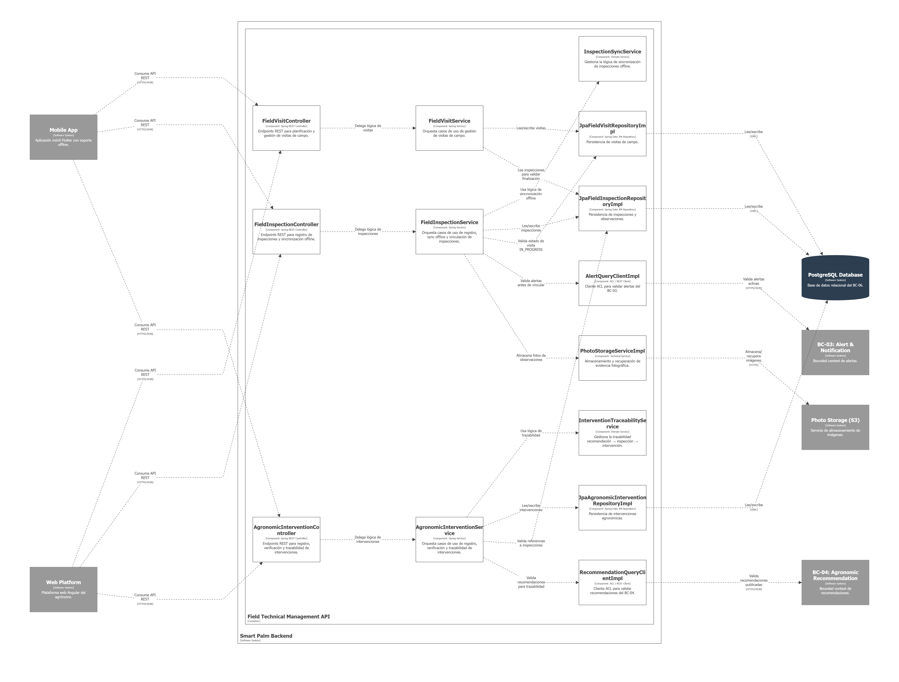
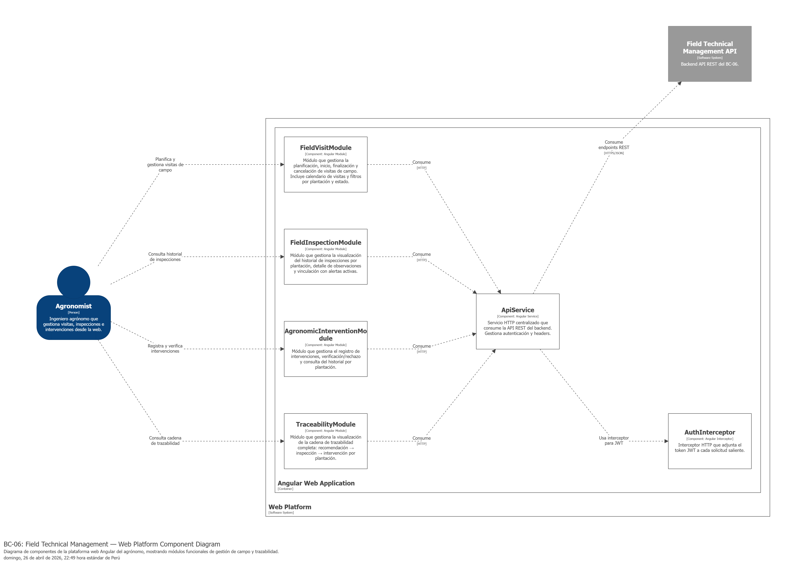
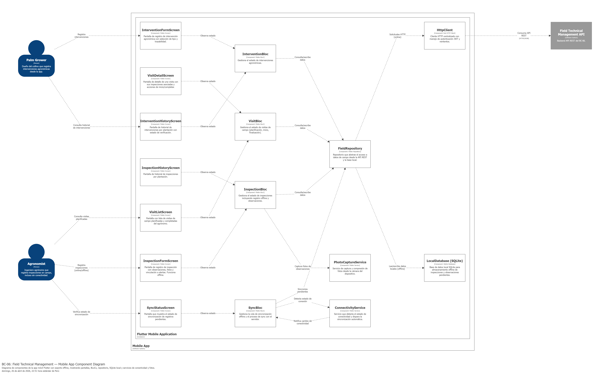
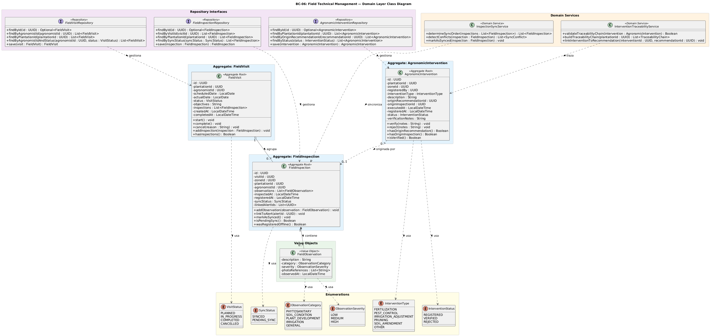
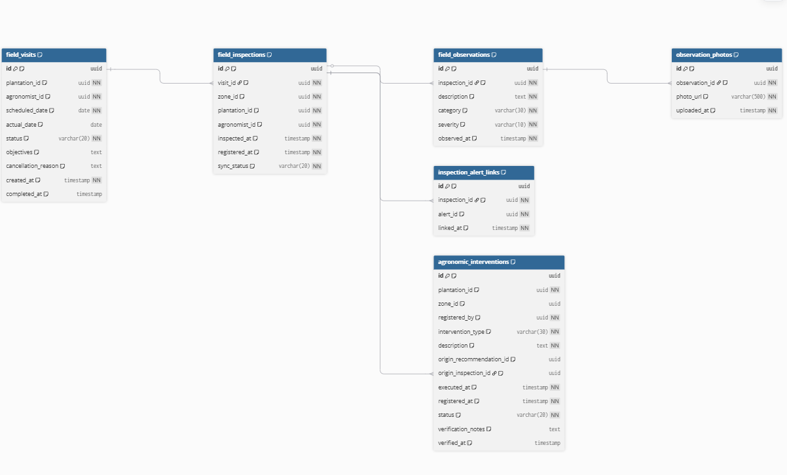

### 4.2.6. Bounded Context: Field Technical Management

Este bounded context se encarga de gestionar las actividades técnicas de campo realizadas por el ingeniero agrónomo: planificación de visitas, registro de inspecciones presenciales, vinculación de observaciones con alertas activas y registro de intervenciones agronómicas con trazabilidad hacia las recomendaciones que las originaron. Interactúa con los bounded contexts de Alert & Notification (BC-03) como fuente de alertas activas, Agronomic Recommendation (BC-04) como origen de las recomendaciones que motivan intervenciones, y Crop Monitoring Dashboard (BC-05) como destino de los datos de inspección para visualización. Incorpora soporte offline para registro de inspecciones en campo sin conectividad, resolviendo el pain point identificado en el EventStorming.

 

#### 4.2.6.1. Domain Layer

Contiene la lógica de negocio pura y las entidades principales relacionadas con la planificación de visitas de campo, el registro de inspecciones y observaciones, la vinculación con alertas activas y el registro de intervenciones agronómicas con trazabilidad completa.

---

 

**Aggregate 1: FieldVisit**

| Nombre     | Categoría              | Descripción                                                                                                                                                                                                                           |
| ---------- | ----------------------- | -------------------------------------------------------------------------------------------------------------------------------------------------------------------------------------------------------------------------------------- |
| FieldVisit | Entity (Aggregate Root) | Representa una visita de campo planificada o ejecutada por el ingeniero agrónomo a una plantación. Gestiona el ciclo de vida desde la planificación hasta la finalización, y agrupa las inspecciones realizadas durante la visita. |

 

**Attributes**

| Nombre        | Tipo de dato            | Visibilidad | Descripción                                                          |
| ------------- | ----------------------- | ----------- | --------------------------------------------------------------------- |
| id            | UUID                    | Private     | Identificador único de la visita de campo.                           |
| plantationId  | UUID                    | Private     | Identificador de la plantación a visitar.                            |
| agronomistId  | UUID                    | Private     | Identificador del agrónomo responsable de la visita.                 |
| scheduledDate | LocalDate               | Private     | Fecha planificada para la visita.                                     |
| actualDate    | LocalDate               | Private     | Fecha real en que se ejecutó la visita (null si aún no se ejecuta). |
| status        | VisitStatus (enum)      | Private     | Estado de la visita: PLANNED, IN_PROGRESS, COMPLETED, CANCELLED.      |
| objectives    | String                  | Private     | Objetivos de la visita definidos por el agrónomo.                    |
| inspections   | List\<FieldInspection\> | Private     | Lista de inspecciones registradas durante la visita.                  |
| createdAt     | LocalDateTime           | Private     | Fecha de creación del registro.                                      |
| completedAt   | LocalDateTime           | Private     | Fecha de finalización de la visita.                                  |

 

**Methods**

| Nombre                                     | Tipo de retorno | Visibilidad | Descripción                                                                                      |
| ------------------------------------------ | --------------- | ----------- | ------------------------------------------------------------------------------------------------- |
| start()                                    | Void            | Public      | Inicia la visita cambiando su estado de PLANNED a IN_PROGRESS y registra la fecha actual.         |
| complete()                                 | Void            | Public      | Finaliza la visita cambiando su estado a COMPLETED. Requiere al menos una inspección registrada. |
| cancel(reason: String)                     | Void            | Public      | Cancela la visita. Solo permitido en estado PLANNED.                                              |
| addInspection(inspection: FieldInspection) | Void            | Public      | Agrega una inspección a la visita. Solo permitido en estado IN_PROGRESS.                         |
| hasInspections()                           | Boolean         | Public      | Indica si la visita tiene inspecciones registradas.                                               |

---

 

**Aggregate 2: FieldInspection**

| Nombre          | Categoría              | Descripción                                                                                                                                                                                                                                                      |
| --------------- | ----------------------- | ----------------------------------------------------------------------------------------------------------------------------------------------------------------------------------------------------------------------------------------------------------------- |
| FieldInspection | Entity (Aggregate Root) | Representa una inspección técnica realizada por el agrónomo en una zona de monitoreo durante una visita de campo. Contiene observaciones, evidencia fotográfica y puede vincularse a alertas activas. Soporta registro offline con sincronización posterior. |

 

**Attributes**

| Nombre         | Tipo de dato             | Visibilidad | Descripción                                                                           |
| -------------- | ------------------------ | ----------- | -------------------------------------------------------------------------------------- |
| id             | UUID                     | Private     | Identificador único de la inspección.                                                |
| visitId        | UUID                     | Private     | Identificador de la visita de campo a la que pertenece.                                |
| zoneId         | UUID                     | Private     | Identificador de la zona de monitoreo inspeccionada.                                   |
| plantationId   | UUID                     | Private     | Identificador de la plantación.                                                       |
| agronomistId   | UUID                     | Private     | Identificador del agrónomo que realizó la inspección.                               |
| observations   | List\<FieldObservation\> | Private     | Observaciones registradas durante la inspección.                                      |
| inspectedAt    | LocalDateTime            | Private     | Fecha y hora de la inspección en campo.                                               |
| registeredAt   | LocalDateTime            | Private     | Fecha y hora de registro en el sistema (puede diferir de inspectedAt en caso offline). |
| syncStatus     | SyncStatus (enum)        | Private     | Estado de sincronización: SYNCED, PENDING_SYNC.                                       |
| linkedAlertIds | List\<UUID\>             | Private     | Identificadores de alertas activas vinculadas a esta inspección.                      |

 

**Methods**

| Nombre                                        | Tipo de retorno | Visibilidad | Descripción                                                                           |
| --------------------------------------------- | --------------- | ----------- | -------------------------------------------------------------------------------------- |
| addObservation(observation: FieldObservation) | Void            | Public      | Agrega una observación a la inspección.                                              |
| linkToAlert(alertId: UUID)                    | Void            | Public      | Vincula la inspección a una alerta activa del BC-03.                                  |
| markAsSynced()                                | Void            | Public      | Marca la inspección como sincronizada con el servidor.                                |
| isPendingSync()                               | Boolean         | Public      | Indica si la inspección está pendiente de sincronización.                           |
| wasRegisteredOffline()                        | Boolean         | Public      | Indica si la inspección fue registrada offline (inspectedAt difiere de registeredAt). |

---

 

**Value Object: FieldObservation**

| Nombre           | Categoría   | Descripción                                                                             |
| ---------------- | ------------ | ---------------------------------------------------------------------------------------- |
| FieldObservation | Value Object | Observación técnica individual registrada durante una inspección de campo. Inmutable. |

 

**Attributes**

| Nombre          | Tipo de dato               | Visibilidad | Descripción                                                                       |
| --------------- | -------------------------- | ----------- | ---------------------------------------------------------------------------------- |
| description     | String                     | Private     | Descripción textual de la observación.                                           |
| category        | ObservationCategory (enum) | Private     | Categoría: PHYTOSANITARY, SOIL_CONDITION, PLANT_DEVELOPMENT, IRRIGATION, GENERAL. |
| severity        | ObservationSeverity (enum) | Private     | Severidad: LOW, MEDIUM, HIGH.                                                      |
| photoReferences | List\<String\>             | Private     | Referencias a evidencia fotográfica (URLs o IDs de archivos).                     |
| observedAt      | LocalDateTime              | Private     | Momento en que se realizó la observación.                                        |

---

 

**Aggregate 3: AgronomicIntervention**

| Nombre                | Categoría              | Descripción                                                                                                                                                                                                                                                               |
| --------------------- | ----------------------- | -------------------------------------------------------------------------------------------------------------------------------------------------------------------------------------------------------------------------------------------------------------------------- |
| AgronomicIntervention | Entity (Aggregate Root) | Representa una intervención agronómica ejecutada en una zona o plantación como resultado de una recomendación. Mantiene trazabilidad hacia la recomendación que la originó y la inspección que la motivó, cerrando el ciclo recomendación → acción → registro. |

 

**Attributes**

| Nombre                 | Tipo de dato              | Visibilidad | Descripción                                                                                           |
| ---------------------- | ------------------------- | ----------- | ------------------------------------------------------------------------------------------------------ |
| id                     | UUID                      | Private     | Identificador único de la intervención.                                                              |
| plantationId           | UUID                      | Private     | Identificador de la plantación intervenida.                                                           |
| zoneId                 | UUID                      | Private     | Identificador de la zona intervenida (opcional si aplica a toda la plantación).                       |
| registeredBy           | UUID                      | Private     | Identificador del usuario que registró la intervención (agrónomo o dueño del cultivo).             |
| interventionType       | InterventionType (enum)   | Private     | Tipo: FERTILIZATION, PEST_CONTROL, IRRIGATION_ADJUSTMENT, PRUNING, SOIL_AMENDMENT, OTHER.              |
| description            | String                    | Private     | Descripción detallada de la intervención realizada.                                                  |
| originRecommendationId | UUID                      | Private     | Identificador de la recomendación del BC-04 que originó esta intervención (null si es espontánea). |
| originInspectionId     | UUID                      | Private     | Identificador de la inspección que motivó la intervención (null si no aplica).                      |
| executedAt             | LocalDateTime             | Private     | Fecha y hora de ejecución de la intervención.                                                        |
| registeredAt           | LocalDateTime             | Private     | Fecha y hora de registro en el sistema.                                                                |
| status                 | InterventionStatus (enum) | Private     | Estado: REGISTERED, VERIFIED, REJECTED.                                                                |
| verificationNotes      | String                    | Private     | Notas del agrónomo al verificar la intervención.                                                     |

 

**Methods**

| Nombre                    | Tipo de retorno | Visibilidad | Descripción                                                            |
| ------------------------- | --------------- | ----------- | ----------------------------------------------------------------------- |
| verify(notes: String)     | Void            | Public      | El agrónomo verifica que la intervención fue ejecutada correctamente. |
| reject(notes: String)     | Void            | Public      | El agrónomo rechaza la intervención como incorrecta o insuficiente.   |
| hasOriginRecommendation() | Boolean         | Public      | Indica si la intervención fue originada por una recomendación.        |
| hasOriginInspection()     | Boolean         | Public      | Indica si la intervención fue motivada por una inspección.            |
| isVerified()              | Boolean         | Public      | Indica si la intervención ha sido verificada.                          |

---

 

**Enumeraciones**

**Enum: VisitStatus**

| Código     | Descripción                                    |
| ----------- | ----------------------------------------------- |
| PLANNED     | Visita planificada, pendiente de ejecución.    |
| IN_PROGRESS | Visita en curso.                                |
| COMPLETED   | Visita finalizada con inspecciones registradas. |
| CANCELLED   | Visita cancelada antes de su ejecución.        |

 

**Enum: SyncStatus**

| Código      | Descripción                                     |
| ------------ | ------------------------------------------------ |
| SYNCED       | Registro sincronizado con el servidor.           |
| PENDING_SYNC | Registro pendiente de sincronización (offline). |

 

**Enum: ObservationCategory**

| Código           | Descripción                                       |
| ----------------- | -------------------------------------------------- |
| PHYTOSANITARY     | Observación fitosanitaria (plagas, enfermedades). |
| SOIL_CONDITION    | Condición del suelo.                              |
| PLANT_DEVELOPMENT | Desarrollo de la planta.                           |
| IRRIGATION        | Estado del riego.                                  |
| GENERAL           | Observación general.                              |

 

**Enum: ObservationSeverity**

| Código | Descripción                                |
| ------- | ------------------------------------------- |
| LOW     | Severidad baja, informativa.                |
| MEDIUM  | Severidad media, requiere seguimiento.      |
| HIGH    | Severidad alta, requiere acción inmediata. |

 

**Enum: InterventionType**

| Código               | Descripción                      |
| --------------------- | --------------------------------- |
| FERTILIZATION         | Aplicación de fertilizantes.     |
| PEST_CONTROL          | Control de plagas o enfermedades. |
| IRRIGATION_ADJUSTMENT | Ajuste del sistema de riego.      |
| PRUNING               | Poda de plantas.                  |
| SOIL_AMENDMENT        | Enmienda o corrección del suelo. |
| OTHER                 | Otro tipo de intervención.       |

 

**Enum: InterventionStatus**

| Código    | Descripción                                          |
| ---------- | ----------------------------------------------------- |
| REGISTERED | Intervención registrada, pendiente de verificación. |
| VERIFIED   | Intervención verificada por el agrónomo.            |
| REJECTED   | Intervención rechazada por el agrónomo.             |

---

 

**Domain Services**

| Nombre                          | Descripción                                                                                                                                                                                                 |
| ------------------------------- | ------------------------------------------------------------------------------------------------------------------------------------------------------------------------------------------------------------ |
| InspectionSyncService           | Servicio de dominio que gestiona la lógica de sincronización de inspecciones registradas offline. Determina el orden de sincronización, detecta conflictos y marca los registros como sincronizados.      |
| InterventionTraceabilityService | Servicio de dominio que gestiona la trazabilidad entre intervenciones, recomendaciones e inspecciones. Valida que las referencias cruzadas sean consistentes y construye la cadena de trazabilidad completa. |

---

 

**Repository Interfaces (Domain contracts)**

| Nombre                          | Descripción                                                                                                |
| ------------------------------- | ----------------------------------------------------------------------------------------------------------- |
| FieldVisitRepository            | Contrato para persistir y consultar visitas de campo por agrónomo, plantación y estado.                   |
| FieldInspectionRepository       | Contrato para persistir y consultar inspecciones por visita, zona, plantación y estado de sincronización. |
| AgronomicInterventionRepository | Contrato para persistir y consultar intervenciones por plantación, zona, tipo y estado de verificación.   |

---

 

#### 4.2.6.2. Interface Layer

Esta capa es responsable de la recepción y formato de peticiones/respuestas externas (API REST), validación básica del formato y los datos de entrada, manejo de errores a nivel de API y delegación de la lógica de negocio a la capa de Aplicación. Expone los endpoints consumidos por la plataforma web del agrónomo y la aplicación móvil del dueño del cultivo.

---

 

**Controller 1: FieldVisitController**

| Nombre               | Categoría | Descripción                                                                                                     |
| -------------------- | ---------- | ---------------------------------------------------------------------------------------------------------------- |
| FieldVisitController | Controller | Controlador para los endpoints de planificación y gestión del ciclo de vida de visitas de campo del agrónomo. |

 

**Attributes**

| Nombre            | Tipo de dato      | Visibilidad | Descripción                                                            |
| ----------------- | ----------------- | ----------- | ----------------------------------------------------------------------- |
| fieldVisitService | FieldVisitService | Private     | Servicio de la capa de Aplicación para lógica de gestión de visitas. |
| visitMapper       | FieldVisitMapper  | Private     | Mapper para convertir entre entidades de dominio y DTOs de respuesta.   |

 

**Endpoints**

| Ruta                                 | Método | Descripción                                                                                                             |
| ------------------------------------ | ------- | ------------------------------------------------------------------------------------------------------------------------ |
| /api/field/visits                    | POST    | Planifica una nueva visita de campo a una plantación.                                                                   |
| /api/field/visits                    | GET     | Retorna las visitas de campo del agrónomo autenticado con filtros opcionales por plantación, estado y rango de fechas. |
| /api/field/visits/{visitId}          | GET     | Retorna el detalle de una visita de campo específica con sus inspecciones asociadas.                                    |
| /api/field/visits/{visitId}/start    | PUT     | Inicia una visita planificada, cambiando su estado a IN_PROGRESS.                                                        |
| /api/field/visits/{visitId}/complete | PUT     | Finaliza una visita en curso, cambiando su estado a COMPLETED.                                                           |
| /api/field/visits/{visitId}/cancel   | PUT     | Cancela una visita planificada.                                                                                          |

---

 

**Controller 2: FieldInspectionController**

| Nombre                    | Categoría | Descripción                                                                                                                       |
| ------------------------- | ---------- | ---------------------------------------------------------------------------------------------------------------------------------- |
| FieldInspectionController | Controller | Controlador para los endpoints de registro de inspecciones de campo, incluyendo soporte para sincronización de registros offline. |

 

**Attributes**

| Nombre                 | Tipo de dato           | Visibilidad | Descripción                                                                 |
| ---------------------- | ---------------------- | ----------- | ---------------------------------------------------------------------------- |
| fieldInspectionService | FieldInspectionService | Private     | Servicio de la capa de Aplicación para lógica de gestión de inspecciones. |
| inspectionMapper       | FieldInspectionMapper  | Private     | Mapper para convertir entre entidades de dominio y DTOs de respuesta.        |

 

**Endpoints**

| Ruta                                               | Método | Descripción                                                                                                    |
| -------------------------------------------------- | ------- | --------------------------------------------------------------------------------------------------------------- |
| /api/field/visits/{visitId}/inspections            | POST    | Registra una nueva inspección de campo dentro de una visita en curso.                                          |
| /api/field/inspections/sync                        | POST    | Sincroniza un lote de inspecciones registradas offline. Acepta una lista de inspecciones con sus observaciones. |
| /api/field/inspections/{inspectionId}              | GET     | Retorna el detalle de una inspección específica con sus observaciones y alertas vinculadas.                   |
| /api/field/inspections/{inspectionId}/observations | POST    | Agrega una observación a una inspección existente.                                                            |
| /api/field/inspections/{inspectionId}/link-alert   | POST    | Vincula una inspección a una alerta activa del sistema.                                                        |
| /api/field/plantations/{plantationId}/inspections  | GET     | Retorna el historial de inspecciones de una plantación con filtros opcionales por zona y rango de fechas.      |

---

 

**Controller 3: AgronomicInterventionController**

| Nombre                          | Categoría | Descripción                                                                                                                                               |
| ------------------------------- | ---------- | ---------------------------------------------------------------------------------------------------------------------------------------------------------- |
| AgronomicInterventionController | Controller | Controlador para los endpoints de registro, verificación y consulta de intervenciones agronómicas con trazabilidad hacia recomendaciones e inspecciones. |

 

**Attributes**

| Nombre              | Tipo de dato                 | Visibilidad | Descripción                                                                   |
| ------------------- | ---------------------------- | ----------- | ------------------------------------------------------------------------------ |
| interventionService | AgronomicInterventionService | Private     | Servicio de la capa de Aplicación para lógica de gestión de intervenciones. |
| interventionMapper  | AgronomicInterventionMapper  | Private     | Mapper para convertir entre entidades de dominio y DTOs de respuesta.          |

 

**Endpoints**

| Ruta                                                | Método | Descripción                                                                                                     |
| --------------------------------------------------- | ------- | ---------------------------------------------------------------------------------------------------------------- |
| /api/field/interventions                            | POST    | Registra una nueva intervención agronómica en una plantación o zona.                                          |
| /api/field/interventions/{interventionId}           | GET     | Retorna el detalle de una intervención específica con su trazabilidad completa.                                |
| /api/field/interventions/{interventionId}/verify    | PUT     | El agrónomo verifica que la intervención fue ejecutada correctamente.                                          |
| /api/field/interventions/{interventionId}/reject    | PUT     | El agrónomo rechaza la intervención como incorrecta o insuficiente.                                            |
| /api/field/plantations/{plantationId}/interventions | GET     | Retorna el historial de intervenciones de una plantación con filtros por zona, tipo, estado y rango de fechas.  |
| /api/field/plantations/{plantationId}/traceability  | GET     | Retorna la cadena de trazabilidad completa: recomendación → inspección → intervención para una plantación. |

---

 

**DTOs**

| Nombre                               | Descripción                                                                                                                                                                                                                                                       |
| ------------------------------------ | ------------------------------------------------------------------------------------------------------------------------------------------------------------------------------------------------------------------------------------------------------------------ |
| PlanFieldVisitRequestDto             | { plantationId: UUID, scheduledDate: LocalDate, objectives: String }                                                                                                                                                                                               |
| FieldVisitResponseDto                | { id: UUID, plantationId: UUID, agronomistId: UUID, scheduledDate: LocalDate, actualDate: LocalDate, status: String, objectives: String, inspectionCount: Integer, createdAt: DateTime, completedAt: DateTime }                                                    |
| FieldVisitListResponseDto            | { visits: List\<FieldVisitResponseDto\>, totalCount: Integer }                                                                                                                                                                                                     |
| CancelVisitRequestDto                | { reason: String }                                                                                                                                                                                                                                                 |
| RegisterInspectionRequestDto         | { zoneId: UUID, observations: List\<FieldObservationDto\>, inspectedAt: DateTime, linkedAlertIds: List\<UUID\> }                                                                                                                                                   |
| SyncInspectionsRequestDto            | { inspections: List\<RegisterInspectionRequestDto\>, visitId: UUID }                                                                                                                                                                                               |
| SyncInspectionsResponseDto           | { syncedCount: Integer, failedCount: Integer, failedIds: List\<UUID\>, syncedAt: DateTime }                                                                                                                                                                        |
| FieldInspectionResponseDto           | { id: UUID, visitId: UUID, zoneId: UUID, plantationId: UUID, agronomistId: UUID, observations: List\<FieldObservationDto\>, inspectedAt: DateTime, registeredAt: DateTime, syncStatus: String, linkedAlertIds: List\<UUID\>, wasOffline: Boolean }                 |
| FieldInspectionListResponseDto       | { inspections: List\<FieldInspectionResponseDto\>, totalCount: Integer }                                                                                                                                                                                           |
| FieldObservationDto                  | { description: String, category: String, severity: String, photoReferences: List\<String\>, observedAt: DateTime }                                                                                                                                                 |
| AddObservationRequestDto             | { description: String, category: String, severity: String, photoReferences: List\<String\> }                                                                                                                                                                       |
| LinkAlertRequestDto                  | { alertId: UUID }                                                                                                                                                                                                                                                  |
| RegisterInterventionRequestDto       | { plantationId: UUID, zoneId: UUID, interventionType: String, description: String, originRecommendationId: UUID, originInspectionId: UUID, executedAt: DateTime }                                                                                                  |
| VerifyInterventionRequestDto         | { verificationNotes: String }                                                                                                                                                                                                                                      |
| RejectInterventionRequestDto         | { verificationNotes: String }                                                                                                                                                                                                                                      |
| AgronomicInterventionResponseDto     | { id: UUID, plantationId: UUID, zoneId: UUID, registeredBy: UUID, interventionType: String, description: String, originRecommendationId: UUID, originInspectionId: UUID, executedAt: DateTime, registeredAt: DateTime, status: String, verificationNotes: String } |
| AgronomicInterventionListResponseDto | { interventions: List\<AgronomicInterventionResponseDto\>, totalCount: Integer }                                                                                                                                                                                   |
| TraceabilityChainResponseDto         | { plantationId: UUID, chains: List\<TraceabilityItemDto\> }                                                                                                                                                                                                        |
| TraceabilityItemDto                  | { recommendationId: UUID, recommendationContent: String, inspectionId: UUID, inspectedAt: DateTime, interventionId: UUID, interventionType: String, interventionStatus: String, executedAt: DateTime }                                                             |

---

 

#### 4.2.6.3. Application Layer

En la capa de Application Layer se ubican los servicios que orquestan los casos de uso del bounded context Field Technical Management. Estos servicios coordinan la lógica de negocio delegando a las entidades y servicios de dominio, gestionan transacciones y actúan como intermediarios entre la capa de Interface y la capa de Domain.

---

 

**Service 1: FieldVisitService**

| Nombre            | Categoría          | Descripción                                                                                                                         |
| ----------------- | ------------------- | ------------------------------------------------------------------------------------------------------------------------------------ |
| FieldVisitService | Application Service | Servicio de aplicación responsable de los casos de uso de planificación, inicio, finalización y cancelación de visitas de campo. |

 

**Dependencies**

| Nombre                    | Tipo de Objeto            | Visibilidad | Descripción                                                    |
| ------------------------- | ------------------------- | ----------- | --------------------------------------------------------------- |
| fieldVisitRepository      | FieldVisitRepository      | Private     | Acceso a la persistencia de visitas de campo.                   |
| fieldInspectionRepository | FieldInspectionRepository | Private     | Acceso a inspecciones para validar requisitos de finalización. |
| visitMapper               | FieldVisitMapper          | Private     | Mapper para convertir entre entidades de dominio y DTOs.        |

 

**Methods**

| Nombre                                                  | Tipo de retorno           | Visibilidad | Descripción                                              |
| ------------------------------------------------------- | ------------------------- | ----------- | --------------------------------------------------------- |
| planVisit(PlanVisitCommand command)                     | FieldVisitResponseDto     | Public      | Planifica una nueva visita de campo a una plantación.    |
| getVisitsByAgronomist(GetVisitsByAgronomistQuery query) | FieldVisitListResponseDto | Public      | Retorna las visitas del agrónomo con filtros opcionales. |
| getVisitById(GetVisitByIdQuery query)                   | FieldVisitResponseDto     | Public      | Retorna el detalle de una visita específica.             |
| startVisit(StartVisitCommand command)                   | FieldVisitResponseDto     | Public      | Inicia una visita planificada.                            |
| completeVisit(CompleteVisitCommand command)             | FieldVisitResponseDto     | Public      | Finaliza una visita en curso.                             |
| cancelVisit(CancelVisitCommand command)                 | FieldVisitResponseDto     | Public      | Cancela una visita planificada.                           |

---

 

**Service 2: FieldInspectionService**

| Nombre                 | Categoría          | Descripción                                                                                                                                                    |
| ---------------------- | ------------------- | --------------------------------------------------------------------------------------------------------------------------------------------------------------- |
| FieldInspectionService | Application Service | Servicio de aplicación responsable de los casos de uso de registro de inspecciones, sincronización offline, vinculación con alertas y consulta de historial. |

 

**Dependencies**

| Nombre                    | Tipo de Objeto            | Visibilidad | Descripción                                                 |
| ------------------------- | ------------------------- | ----------- | ------------------------------------------------------------ |
| fieldInspectionRepository | FieldInspectionRepository | Private     | Acceso a la persistencia de inspecciones.                    |
| fieldVisitRepository      | FieldVisitRepository      | Private     | Acceso a visitas para validar estado IN_PROGRESS.            |
| inspectionSyncService     | InspectionSyncService     | Private     | Servicio de dominio para lógica de sincronización offline. |
| alertQueryClient          | AlertQueryClient          | Private     | Cliente ACL para validar alertas del BC-03.                  |
| inspectionMapper          | FieldInspectionMapper     | Private     | Mapper para convertir entre entidades de dominio y DTOs.     |

 

**Methods**

| Nombre                                                            | Tipo de retorno                | Visibilidad | Descripción                                                  |
| ----------------------------------------------------------------- | ------------------------------ | ----------- | ------------------------------------------------------------- |
| registerInspection(RegisterInspectionCommand command)             | FieldInspectionResponseDto     | Public      | Registra una nueva inspección dentro de una visita en curso. |
| syncOfflineInspections(SyncOfflineInspectionsCommand command)     | SyncInspectionsResponseDto     | Public      | Sincroniza un lote de inspecciones registradas offline.       |
| getInspectionById(GetInspectionByIdQuery query)                   | FieldInspectionResponseDto     | Public      | Retorna el detalle de una inspección específica.            |
| addObservation(AddObservationCommand command)                     | FieldInspectionResponseDto     | Public      | Agrega una observación a una inspección existente.          |
| linkInspectionToAlert(LinkInspectionToAlertCommand command)       | FieldInspectionResponseDto     | Public      | Vincula una inspección a una alerta activa.                  |
| getInspectionsByPlantation(GetInspectionsByPlantationQuery query) | FieldInspectionListResponseDto | Public      | Retorna el historial de inspecciones de una plantación.      |

---

 

**Service 3: AgronomicInterventionService**

| Nombre                       | Categoría          | Descripción                                                                                                                                                     |
| ---------------------------- | ------------------- | ---------------------------------------------------------------------------------------------------------------------------------------------------------------- |
| AgronomicInterventionService | Application Service | Servicio de aplicación responsable de los casos de uso de registro, verificación, rechazo y consulta de intervenciones agronómicas con trazabilidad completa. |

 

**Dependencies**

| Nombre                          | Tipo de Objeto                  | Visibilidad | Descripción                                             |
| ------------------------------- | ------------------------------- | ----------- | -------------------------------------------------------- |
| interventionRepository          | AgronomicInterventionRepository | Private     | Acceso a la persistencia de intervenciones.              |
| interventionTraceabilityService | InterventionTraceabilityService | Private     | Servicio de dominio para gestionar trazabilidad.         |
| recommendationQueryClient       | RecommendationQueryClient       | Private     | Cliente ACL para validar recomendaciones del BC-04.      |
| fieldInspectionRepository       | FieldInspectionRepository       | Private     | Acceso a inspecciones para validar referencias.          |
| interventionMapper              | AgronomicInterventionMapper     | Private     | Mapper para convertir entre entidades de dominio y DTOs. |

 

**Methods**

| Nombre                                                                | Tipo de retorno                      | Visibilidad | Descripción                                                   |
| --------------------------------------------------------------------- | ------------------------------------ | ----------- | -------------------------------------------------------------- |
| registerIntervention(RegisterInterventionCommand command)             | AgronomicInterventionResponseDto     | Public      | Registra una nueva intervención agronómica con trazabilidad. |
| verifyIntervention(VerifyInterventionCommand command)                 | AgronomicInterventionResponseDto     | Public      | Verifica que la intervención fue ejecutada correctamente.     |
| rejectIntervention(RejectInterventionCommand command)                 | AgronomicInterventionResponseDto     | Public      | Rechaza la intervención como incorrecta o insuficiente.       |
| getInterventionById(GetInterventionByIdQuery query)                   | AgronomicInterventionResponseDto     | Public      | Retorna el detalle de una intervención específica.           |
| getInterventionsByPlantation(GetInterventionsByPlantationQuery query) | AgronomicInterventionListResponseDto | Public      | Retorna el historial de intervenciones de una plantación.     |
| getTraceabilityChain(GetTraceabilityChainQuery query)                 | TraceabilityChainResponseDto         | Public      | Retorna la cadena de trazabilidad completa de una plantación. |

---

 

**Commands**

| Nombre                        | Atributos                                                                                                                                                                                        | Descripción                                               |
| ----------------------------- | ------------------------------------------------------------------------------------------------------------------------------------------------------------------------------------------------ | ---------------------------------------------------------- |
| PlanVisitCommand              | plantationId: UUID, agronomistId: UUID, scheduledDate: LocalDate, objectives: String                                                                                                             | Comando para planificar una nueva visita de campo.         |
| StartVisitCommand             | visitId: UUID, agronomistId: UUID                                                                                                                                                                | Comando para iniciar una visita planificada.               |
| CompleteVisitCommand          | visitId: UUID, agronomistId: UUID                                                                                                                                                                | Comando para finalizar una visita en curso.                |
| CancelVisitCommand            | visitId: UUID, agronomistId: UUID, reason: String                                                                                                                                                | Comando para cancelar una visita planificada.              |
| RegisterInspectionCommand     | visitId: UUID, zoneId: UUID, agronomistId: UUID, observations: List\<FieldObservationDto\>, inspectedAt: LocalDateTime, linkedAlertIds: List\<UUID\>                                             | Comando para registrar una inspección de campo.           |
| SyncOfflineInspectionsCommand | visitId: UUID, agronomistId: UUID, inspections: List\<RegisterInspectionCommand\>                                                                                                                | Comando para sincronizar inspecciones offline en lote.     |
| AddObservationCommand         | inspectionId: UUID, description: String, category: ObservationCategory, severity: ObservationSeverity, photoReferences: List\<String\>                                                           | Comando para agregar una observación a una inspección.   |
| LinkInspectionToAlertCommand  | inspectionId: UUID, alertId: UUID                                                                                                                                                                | Comando para vincular una inspección a una alerta activa. |
| RegisterInterventionCommand   | plantationId: UUID, zoneId: UUID, registeredBy: UUID, interventionType: InterventionType, description: String, originRecommendationId: UUID, originInspectionId: UUID, executedAt: LocalDateTime | Comando para registrar una intervención agronómica.      |
| VerifyInterventionCommand     | interventionId: UUID, agronomistId: UUID, verificationNotes: String                                                                                                                              | Comando para verificar una intervención.                  |
| RejectInterventionCommand     | interventionId: UUID, agronomistId: UUID, verificationNotes: String                                                                                                                              | Comando para rechazar una intervención.                   |

 

**Queries**

| Nombre                            | Atributos                                                                                                                                                                                                 | Descripción                                                |
| --------------------------------- | --------------------------------------------------------------------------------------------------------------------------------------------------------------------------------------------------------- | ----------------------------------------------------------- |
| GetVisitsByAgronomistQuery        | agronomistId: UUID, plantationId: UUID (opcional), status: VisitStatus (opcional), startDate: LocalDate (opcional), endDate: LocalDate (opcional)                                                         | Consulta de visitas del agrónomo con filtros.              |
| GetVisitByIdQuery                 | visitId: UUID                                                                                                                                                                                             | Consulta de detalle de una visita.                          |
| GetInspectionByIdQuery            | inspectionId: UUID                                                                                                                                                                                        | Consulta de detalle de una inspección.                     |
| GetInspectionsByPlantationQuery   | plantationId: UUID, zoneId: UUID (opcional), startDate: LocalDateTime (opcional), endDate: LocalDateTime (opcional)                                                                                       | Consulta de historial de inspecciones de una plantación.   |
| GetInterventionByIdQuery          | interventionId: UUID                                                                                                                                                                                      | Consulta de detalle de una intervención.                   |
| GetInterventionsByPlantationQuery | plantationId: UUID, zoneId: UUID (opcional), interventionType: InterventionType (opcional), status: InterventionStatus (opcional), startDate: LocalDateTime (opcional), endDate: LocalDateTime (opcional) | Consulta de historial de intervenciones de una plantación. |
| GetTraceabilityChainQuery         | plantationId: UUID                                                                                                                                                                                        | Consulta de la cadena de trazabilidad completa.             |

---

#### 4.2.6.4. Infrastructure Layer

En la capa de Infrastructure Layer se encuentran las implementaciones concretas de los contratos definidos en las capas de dominio y aplicación. Incluye los repositorios JPA, los clientes de integración con otros bounded contexts (Anti-Corruption Layer) y los servicios técnicos de almacenamiento.

---

**JpaFieldVisitRepositoryImpl**

| Nombre                      | Categoría                | Implementa           | Descripción                                                                                                                                                                          |
| --------------------------- | ------------------------- | -------------------- | ------------------------------------------------------------------------------------------------------------------------------------------------------------------------------------- |
| JpaFieldVisitRepositoryImpl | Repository Implementation | FieldVisitRepository | Implementación concreta de la interfaz FieldVisitRepository utilizando JPA y Spring Data JPA. Maneja el mapeo entre el agregado de dominio FieldVisit y la base de datos relacional. |

**Funcionalidad clave**

- Busca y carga agregados FieldVisit por ID, agronomistId y plantationId.
- Guarda (inserta/actualiza) agregados FieldVisit con sus inspecciones asociadas.
- Filtra visitas por estado (PLANNED, IN_PROGRESS, COMPLETED, CANCELLED) y rango de fechas.
- Cuenta visitas por plantación y agrónomo para estadísticas.
- Lista visitas ordenadas por fecha programada descendente.

---

**JpaFieldInspectionRepositoryImpl**

| Nombre                           | Categoría                | Implementa                | Descripción                                                                                                                                                                                                                               |
| -------------------------------- | ------------------------- | ------------------------- | ------------------------------------------------------------------------------------------------------------------------------------------------------------------------------------------------------------------------------------------ |
| JpaFieldInspectionRepositoryImpl | Repository Implementation | FieldInspectionRepository | Implementación concreta de la interfaz FieldInspectionRepository utilizando JPA y Spring Data JPA. Maneja el mapeo entre el agregado de dominio FieldInspection y la base de datos, incluyendo observaciones y vinculaciones con alertas. |

**Funcionalidad clave**

- Busca y carga agregados FieldInspection por ID, visitId, zoneId y plantationId.
- Guarda (inserta/actualiza) agregados FieldInspection con sus FieldObservation embebidas.
- Filtra inspecciones por estado de sincronización (SYNCED, PENDING_SYNC).
- Lista inspecciones por plantación con filtros por zona y rango de fechas.
- Consulta inspecciones pendientes de sincronización para el proceso de sync offline.

---

**JpaAgronomicInterventionRepositoryImpl**

| Nombre                                 | Categoría                | Implementa                      | Descripción                                                                                                                                                                                     |
| -------------------------------------- | ------------------------- | ------------------------------- | ------------------------------------------------------------------------------------------------------------------------------------------------------------------------------------------------ |
| JpaAgronomicInterventionRepositoryImpl | Repository Implementation | AgronomicInterventionRepository | Implementación concreta de la interfaz AgronomicInterventionRepository utilizando JPA y Spring Data JPA. Maneja el mapeo entre el agregado de dominio AgronomicIntervention y la base de datos. |

**Funcionalidad clave**

- Busca y carga agregados AgronomicIntervention por ID, plantationId y zoneId.
- Guarda (inserta/actualiza) agregados AgronomicIntervention.
- Filtra intervenciones por tipo (InterventionType), estado (InterventionStatus) y rango de fechas.
- Consulta intervenciones por originRecommendationId para construir cadenas de trazabilidad.
- Lista intervenciones ordenadas por fecha de ejecución descendente.

---

**AlertQueryClientImpl**

| Nombre               | Categoría                   | Implementa       | Descripción                                                                                                                                                                          |
| -------------------- | ---------------------------- | ---------------- | ------------------------------------------------------------------------------------------------------------------------------------------------------------------------------------- |
| AlertQueryClientImpl | Anti-Corruption Layer Client | AlertQueryClient | Implementación concreta del cliente de integración con el BC-03 (Alert & Notification). Valida la existencia de alertas activas antes de permitir la vinculación con inspecciones. |

**Funcionalidad clave**

- Valida que un alertId corresponda a una alerta activa en el BC-03 antes de vincularla a una inspección.
- Consulta detalles de alertas activas por plantación para facilitar la vinculación durante la inspección.
- Maneja errores de comunicación retornando respuestas de validación negativas en caso de indisponibilidad del BC-03.

---

**RecommendationQueryClientImpl**

| Nombre                        | Categoría                   | Implementa                | Descripción                                                                                                                                                                                         |
| ----------------------------- | ---------------------------- | ------------------------- | ---------------------------------------------------------------------------------------------------------------------------------------------------------------------------------------------------- |
| RecommendationQueryClientImpl | Anti-Corruption Layer Client | RecommendationQueryClient | Implementación concreta del cliente de integración con el BC-04 (Agronomic Recommendation). Valida la existencia de recomendaciones y obtiene su contenido para construir cadenas de trazabilidad. |

**Funcionalidad clave**

- Valida que un originRecommendationId corresponda a una recomendación publicada en el BC-04.
- Obtiene el contenido resumido de recomendaciones para incluir en la cadena de trazabilidad.
- Maneja errores de comunicación permitiendo el registro de intervenciones sin recomendación vinculada en caso de indisponibilidad.

---

**PhotoStorageServiceImpl**

| Nombre                  | Categoría        | Implementa          | Descripción                                                                                                                                                                                           |
| ----------------------- | ----------------- | ------------------- | ------------------------------------------------------------------------------------------------------------------------------------------------------------------------------------------------------ |
| PhotoStorageServiceImpl | Technical Service | PhotoStorageService | Implementación concreta del servicio de almacenamiento de evidencia fotográfica de inspecciones. Gestiona la subida, almacenamiento y recuperación de imágenes asociadas a observaciones de campo. |

**Funcionalidad clave**

- Almacena imágenes en un servicio de almacenamiento de objetos (S3/Azure Blob) y retorna la URL de referencia.
- Comprime imágenes antes del almacenamiento para optimizar espacio y ancho de banda.
- Genera URLs pre-firmadas para acceso temporal a las imágenes.
- Maneja almacenamiento local temporal en el dispositivo del agrónomo durante operaciones offline, con sincronización posterior.

---

#### 4.2.6.5. Bounded Context Software Architecture Component Level Diagrams

Los diagramas de componentes del bounded context Field Technical Management se elaboraron utilizando el modelo C4 en la herramienta Structurizr. Muestran la arquitectura interna del backend (API) y la aplicación móvil del agrónomo con soporte offline.

##### Diagrama 1: Component Level — Backend API (Spring Boot)

##### Diagrama 2: Component Level — Web Platform (Angular)

##### Diagrama 3: Component Level — Mobile Application (Flutter)

#### 4.2.6.6. Bounded Context Software Architecture Code Level Diagrams

##### 4.2.6.6.1. Bounded Context Domain Layer Class Diagrams

El diagrama de clases del Domain Layer del bounded context Field Technical Management se elaboró utilizando PlantUML. Muestra las entidades, value objects, enumeraciones, servicios de dominio e interfaces de repositorio.

---

**Descripción del diagrama:**

El diagrama muestra el diseño del Domain Layer del bounded context Field Technical Management, compuesto por tres agregados principales:

- **FieldVisit** es la entidad raíz que modela el ciclo de vida de una visita de campo (PLANNED → IN_PROGRESS → COMPLETED/CANCELLED). Agrupa las inspecciones realizadas durante la visita y valida que solo se puedan agregar inspecciones cuando la visita está en curso.
- **FieldInspection** modela una inspección técnica realizada en una zona de monitoreo. Contiene una lista de **FieldObservation** (value object) con categoría, severidad y evidencia fotográfica. Incorpora soporte offline mediante el enum **SyncStatus**, resolviendo el pain point identificado en el EventStorming. Puede vincularse a alertas activas del BC-03.
- **AgronomicIntervention** modela una intervención ejecutada como resultado de una recomendación. Mantiene trazabilidad bidireccional hacia la recomendación del BC-04 que la originó y la inspección que la motivó. Soporta un ciclo de verificación por parte del agrónomo (REGISTERED → VERIFIED/REJECTED).

Los **Domain Services** encapsulan la lógica de sincronización offline (InspectionSyncService) y la construcción de cadenas de trazabilidad recomendación → inspección → intervención (InterventionTraceabilityService).

##### 4.2.6.6.2. Bounded Context Database Design Diagram

---

**Descripción del diagrama:**

El modelo relacional del bounded context Field Technical Management está compuesto por 6 tablas que reflejan los 3 agregados del Domain Layer y sus relaciones:

- **field_visits** almacena las visitas de campo con su ciclo de vida (PLANNED → IN_PROGRESS → COMPLETED/CANCELLED). Los índices compuestos por `agronomist_id + status` y `plantation_id + scheduled_date` optimizan las consultas del panel del agrónomo.
- **field_inspections** almacena las inspecciones técnicas con soporte offline. El campo `sync_status` controla el estado de sincronización, y la diferencia entre `inspected_at` y `registered_at` permite identificar registros offline. La FK a `field_visits` garantiza que cada inspección pertenezca a una visita.
- **field_observations** contiene las observaciones categorizadas por tipo y severidad dentro de cada inspección. El índice compuesto `(inspection_id, category)` facilita filtrados por categoría.
- **observation_photos** almacena las referencias a evidencia fotográfica. Las imágenes físicas residen en almacenamiento de objetos externo (S3/Azure Blob), y esta tabla solo guarda las URLs.
- **inspection_alert_links** es la tabla intermedia que vincula inspecciones con alertas activas del BC-03. La restricción `unique(inspection_id, alert_id)` evita duplicados.
- **agronomic_interventions** almacena las intervenciones con trazabilidad completa. Los campos `origin_recommendation_id` (referencia lógica al BC-04) y `origin_inspection_id` (FK a `field_inspections`) construyen la cadena de trazabilidad recomendación → inspección → intervención. Los índices por `origin_recommendation_id` y `origin_inspection_id` optimizan las consultas de trazabilidad.

---