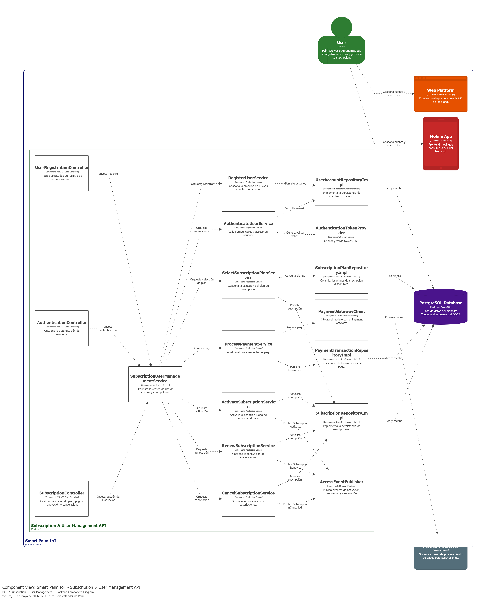
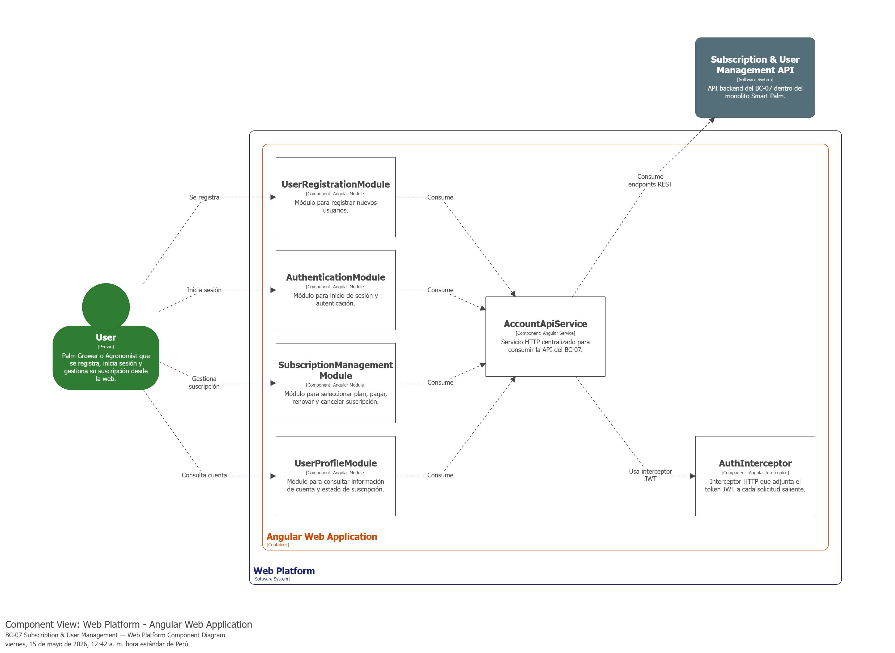
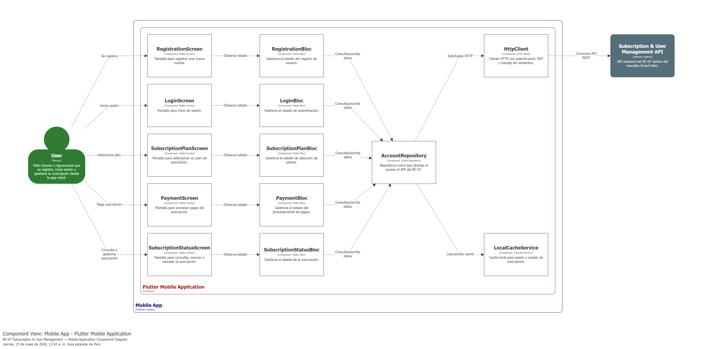
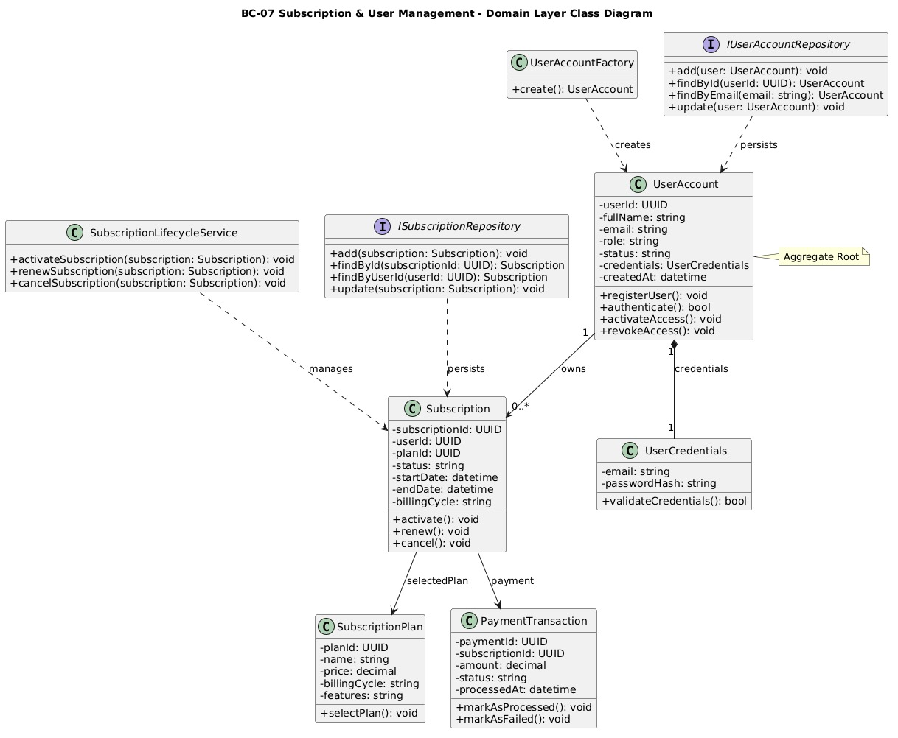
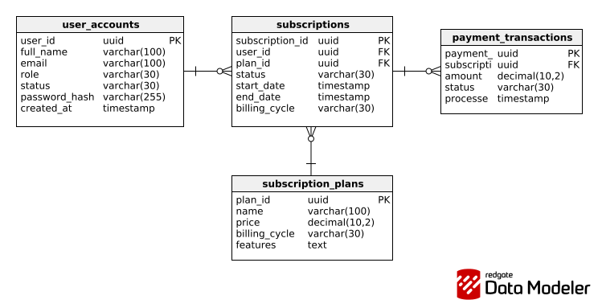

### 4.2.7. Bounded Context: Subscription & User Management

El bounded context **Subscription & User Management** se encarga de gestionar el registro, autenticación y acceso de los usuarios, así como la selección, activación, renovación y cancelación de suscripciones dentro de SmartPalm IoT. Además, integra el procesamiento de pagos mediante un **Payment Gateway** y controla la habilitación de acceso a la plataforma según el estado del plan contratado. Este contexto cumple un rol transversal, ya que una suscripción activa habilita el uso de los demás bounded contexts, mientras que su cancelación restringe el acceso al finalizar el ciclo de facturación.

#### 4.2.7.1. Domain Layer

La **Domain Layer** del bounded context **Subscription & User Management** representa el núcleo del dominio encargado de gestionar la identidad del usuario, su autenticación y el ciclo de vida de la suscripción dentro de SmartPalm IoT. En esta capa se ubican las clases que modelan el registro del usuario, la validación de credenciales, la selección de planes, el procesamiento lógico de la suscripción y las reglas relacionadas con su activación, renovación y cancelación.

Para este bounded context, el dominio puede organizarse alrededor de una entidad principal que representa la cuenta del usuario, complementada por entidades asociadas a la suscripción, objetos de valor para credenciales, una *factory*, repositorios y un servicio de dominio encargado de aplicar las reglas de transición del ciclo de suscripción.

---

##### 1. UserAccount

| Campo | Detalle |
|---|---|
| **Nombre** | UserAccount |
| **Categoría** | Entity / Aggregate Root |
| **Propósito** | Representar la cuenta del usuario dentro de la plataforma y gestionar su identidad y acceso. |

 

**Atributos**

| Nombre | Tipo de dato | Visibilidad | Descripción |
|---|---|---|---|
| UserId | UUID | private | Identificador único del usuario. |
| FullName | string | private | Nombre completo del usuario registrado. |
| Email | string | private | Correo electrónico utilizado como identificador de acceso. |
| Role | string | private | Rol asignado al usuario dentro de la plataforma. |
| Status | string | private | Estado actual de la cuenta del usuario. |
| Credentials | UserCredentials | private | Credenciales asociadas a la cuenta del usuario. |
| CreatedAt | datetime | private | Fecha y hora de creación de la cuenta. |

 

**Métodos**

| Nombre | Tipo de retorno | Visibilidad | Descripción |
|---|---|---|---|
| RegisterUser | void | public | Registrar una nueva cuenta de usuario en la plataforma. |
| Authenticate | bool | public | Validar las credenciales de acceso del usuario. |
| ActivateAccess | void | public | Habilitar el acceso del usuario a la plataforma. |
| RevokeAccess | void | public | Revocar el acceso del usuario según el estado de la suscripción. |

---

 

##### 2. UserCredentials

| Campo | Detalle |
|---|---|
| **Nombre** | UserCredentials |
| **Categoría** | Value Object |
| **Propósito** | Representar las credenciales de autenticación asociadas a la cuenta del usuario. |

 

**Atributos**

| Nombre | Tipo de dato | Visibilidad | Descripción |
|---|---|---|---|
| Email | string | private | Correo electrónico del usuario. |
| PasswordHash | string | private | Contraseña cifrada o hasheada para autenticación. |

 

**Métodos**

| Nombre | Tipo de retorno | Visibilidad | Descripción |
|---|---|---|---|
| ValidateCredentials | bool | public | Validar que las credenciales proporcionadas sean correctas. |

---

 

##### 3. Subscription

| Campo | Detalle |
|---|---|
| **Nombre** | Subscription |
| **Categoría** | Entity |
| **Propósito** | Representar la suscripción activa o histórica asociada a un usuario dentro de la plataforma. |

 

**Atributos**

| Nombre | Tipo de dato | Visibilidad | Descripción |
|---|---|---|---|
| SubscriptionId | UUID | private | Identificador único de la suscripción. |
| UserId | UUID | private | Identificador del usuario propietario de la suscripción. |
| PlanId | UUID | private | Identificador del plan contratado. |
| Status | string | private | Estado actual de la suscripción. |
| StartDate | datetime | private | Fecha de inicio de la suscripción. |
| EndDate | datetime | private | Fecha de fin del ciclo de facturación o vigencia. |
| BillingCycle | string | private | Tipo de ciclo de facturación de la suscripción. |

 

**Métodos**

| Nombre | Tipo de retorno | Visibilidad | Descripción |
|---|---|---|---|
| Activate | void | public | Activar la suscripción después de confirmar el pago. |
| Renew | void | public | Renovar la suscripción para un nuevo ciclo de facturación. |
| Cancel | void | public | Cancelar la suscripción manteniendo acceso hasta el cierre del ciclo vigente. |

---

 

##### 4. SubscriptionPlan

| Campo | Detalle |
|---|---|
| **Nombre** | SubscriptionPlan |
| **Categoría** | Entity |
| **Propósito** | Representar un plan de suscripción disponible para contratación en la plataforma. |

 

**Atributos**

| Nombre | Tipo de dato | Visibilidad | Descripción |
|---|---|---|---|
| PlanId | UUID | private | Identificador único del plan. |
| Name | string | private | Nombre del plan de suscripción. |
| Price | decimal | private | Precio asociado al plan. |
| BillingCycle | string | private | Periodicidad de cobro del plan. |
| Features | string | private | Conjunto de funcionalidades habilitadas por el plan. |

 

**Métodos**

| Nombre | Tipo de retorno | Visibilidad | Descripción |
|---|---|---|---|
| SelectPlan | void | public | Asociar el plan seleccionado al proceso de suscripción del usuario. |

---

 

##### 5. PaymentTransaction

| Campo | Detalle |
|---|---|
| **Nombre** | PaymentTransaction |
| **Categoría** | Entity |
| **Propósito** | Representar una transacción de pago asociada a la activación o renovación de una suscripción. |

 

**Atributos**

| Nombre | Tipo de dato | Visibilidad | Descripción |
|---|---|---|---|
| PaymentId | UUID | private | Identificador único de la transacción. |
| SubscriptionId | UUID | private | Identificador de la suscripción asociada. |
| Amount | decimal | private | Monto procesado en la transacción. |
| Status | string | private | Estado del pago procesado. |
| ProcessedAt | datetime | private | Fecha y hora en que se procesó la transacción. |

 

**Métodos**

| Nombre | Tipo de retorno | Visibilidad | Descripción |
|---|---|---|---|
| MarkAsProcessed | void | public | Marcar la transacción como procesada exitosamente. |
| MarkAsFailed | void | public | Marcar la transacción como fallida. |

---

 

##### 6. UserAccountFactory

| Campo | Detalle |
|---|---|
| **Nombre** | UserAccountFactory |
| **Categoría** | Factory |
| **Propósito** | Crear nuevas instancias válidas de cuentas de usuario con sus credenciales iniciales. |

**Métodos**

| Nombre | Tipo de retorno | Visibilidad | Descripción |
|---|---|---|---|
| Create | UserAccount | public | Crear una nueva cuenta de usuario con los datos requeridos. |

---

 

##### 7. SubscriptionLifecycleService

| Campo | Detalle |
|---|---|
| **Nombre** | SubscriptionLifecycleService |
| **Categoría** | Domain Service |
| **Propósito** | Aplicar las reglas de negocio asociadas a la activación, renovación y cancelación de suscripciones. |

 

**Métodos**

| Nombre | Tipo de retorno | Visibilidad | Descripción |
|---|---|---|---|
| ActivateSubscription | void | public | Aplicar la lógica de activación de una suscripción. |
| RenewSubscription | void | public | Aplicar la lógica de renovación de una suscripción. |
| CancelSubscription | void | public | Aplicar la lógica de cancelación de una suscripción. |

---

 

##### 8. IUserAccountRepository

| Campo | Detalle |
|---|---|
| **Nombre** | IUserAccountRepository |
| **Categoría** | Repository |
| **Propósito** | Persistir y consultar cuentas de usuario dentro del bounded context. |

 

**Métodos**

| Nombre | Tipo de retorno | Visibilidad | Descripción |
|---|---|---|---|
| Add | void | public | Persistir una nueva cuenta de usuario. |
| FindById | UserAccount | public | Buscar una cuenta por su identificador. |
| FindByEmail | UserAccount | public | Buscar una cuenta por su correo electrónico. |
| Update | void | public | Actualizar la información de una cuenta existente. |

---

 

##### 9. ISubscriptionRepository

| Campo | Detalle |
|---|---|
| **Nombre** | ISubscriptionRepository |
| **Categoría** | Repository |
| **Propósito** | Persistir y consultar suscripciones asociadas a los usuarios. |

 

**Métodos**

| Nombre | Tipo de retorno | Visibilidad | Descripción |
|---|---|---|---|
| Add | void | public | Persistir una nueva suscripción. |
| FindById | Subscription | public | Buscar una suscripción por su identificador. |
| FindByUserId | Subscription | public | Obtener la suscripción asociada a un usuario. |
| Update | void | public | Actualizar el estado o vigencia de una suscripción existente. |

 

#### 4.2.7.2. Interface Layer

La **Interface Layer** del bounded context **Subscription & User Management** agrupa las clases encargadas de recibir solicitudes relacionadas con el registro, autenticación y gestión de suscripciones. Su función principal es actuar como punto de entrada del bounded context, derivando las solicitudes hacia la capa de aplicación para su procesamiento.

En este bounded context, la capa de interfaz se encuentra compuesta principalmente por clases del tipo **Controller**, ya que las interacciones del usuario se realizan desde la plataforma web y requieren exponer operaciones relacionadas con acceso y suscripción.

---

 

##### 1. UserRegistrationController

| Campo | Detalle |
|---|---|
| **Nombre** | UserRegistrationController |
| **Categoría** | Controller |
| **Propósito** | Gestionar las solicitudes relacionadas con el registro de nuevos usuarios. |

 

**Atributos**

| Nombre | Tipo de dato | Visibilidad | Descripción |
|---|---|---|---|
| SubscriptionUserManagementService | SubscriptionUserManagementService | private | Servicio de aplicación encargado de coordinar el registro del usuario. |

 

**Métodos**

| Nombre | Tipo de retorno | Visibilidad | Descripción |
|---|---|---|---|
| RegisterUser | HttpResponse | public | Recibir la solicitud de registro de un nuevo usuario. |

---

 

##### 2. AuthenticationController

| Campo | Detalle |
|---|---|
| **Nombre** | AuthenticationController |
| **Categoría** | Controller |
| **Propósito** | Gestionar las solicitudes de autenticación de usuarios en la plataforma. |

 

**Atributos**

| Nombre | Tipo de dato | Visibilidad | Descripción |
|---|---|---|---|
| SubscriptionUserManagementService | SubscriptionUserManagementService | private | Servicio de aplicación encargado de coordinar la autenticación del usuario. |

 

**Métodos**

| Nombre | Tipo de retorno | Visibilidad | Descripción |
|---|---|---|---|
| AuthenticateUser | HttpResponse | public | Recibir las credenciales del usuario y derivar la autenticación. |

---

 

##### 3. SubscriptionController

| Campo | Detalle |
|---|---|
| **Nombre** | SubscriptionController |
| **Categoría** | Controller |
| **Propósito** | Gestionar las solicitudes relacionadas con selección de plan, activación, renovación y cancelación de suscripciones. |

 

**Atributos**

| Nombre | Tipo de dato | Visibilidad | Descripción |
|---|---|---|---|
| SubscriptionUserManagementService | SubscriptionUserManagementService | private | Servicio de aplicación encargado de coordinar los procesos de suscripción. |

 

**Métodos**

| Nombre | Tipo de retorno | Visibilidad | Descripción |
|---|---|---|---|
| SelectSubscriptionPlan | HttpResponse | public | Recibir la selección de un plan de suscripción. |
| ProcessPayment | HttpResponse | public | Recibir la solicitud de procesamiento de pago. |
| RenewSubscription | HttpResponse | public | Recibir la solicitud de renovación de suscripción. |
| CancelSubscription | HttpResponse | public | Recibir la solicitud de cancelación de suscripción. |

 

#### 4.2.7.3. Application Layer

La **Application Layer** del bounded context **Subscription & User Management** se encarga de coordinar los flujos de negocio relacionados con el registro, autenticación y gestión de suscripciones. Su responsabilidad principal es recibir las solicitudes provenientes de la Interface Layer, transformarlas en flujos de aplicación y orquestar la ejecución de los casos de uso del contexto.

En esta capa se ubican las clases que representan los *capabilities* del bounded context, permitiendo gestionar de manera organizada la creación de usuarios, la validación de acceso, la selección de planes, el procesamiento de pagos y la actualización del estado de la suscripción.

---

 

##### 1. SubscriptionUserManagementService

| Campo | Detalle |
|---|---|
| **Nombre** | SubscriptionUserManagementService |
| **Categoría** | Application Service |
| **Propósito** | Coordinar los principales casos de uso del bounded context Subscription & User Management y servir como punto de orquestación entre la Interface Layer y los servicios de aplicación especializados. |

 

**Atributos**

| Nombre | Tipo de dato | Visibilidad | Descripción |
|---|---|---|---|
| RegisterUserService | RegisterUserService | private | Servicio encargado de gestionar el registro de usuarios. |
| AuthenticateUserService | AuthenticateUserService | private | Servicio encargado de validar las credenciales de acceso. |
| SelectSubscriptionPlanService | SelectSubscriptionPlanService | private | Servicio encargado de gestionar la selección de planes. |
| ProcessPaymentService | ProcessPaymentService | private | Servicio encargado de coordinar el procesamiento de pagos. |
| ActivateSubscriptionService | ActivateSubscriptionService | private | Servicio encargado de activar la suscripción luego del pago. |
| RenewSubscriptionService | RenewSubscriptionService | private | Servicio encargado de renovar suscripciones. |
| CancelSubscriptionService | CancelSubscriptionService | private | Servicio encargado de cancelar suscripciones. |

 

**Métodos**

| Nombre | Tipo de retorno | Visibilidad | Descripción |
|---|---|---|---|
| RegisterUser | void | public | Coordinar el flujo completo de registro de un nuevo usuario. |
| AuthenticateUser | bool | public | Coordinar el flujo de autenticación del usuario. |
| SelectPlan | void | public | Coordinar la selección del plan de suscripción. |
| ProcessSubscriptionPayment | void | public | Coordinar el procesamiento del pago asociado a la suscripción. |
| RenewUserSubscription | void | public | Coordinar la renovación de la suscripción del usuario. |
| CancelUserSubscription | void | public | Coordinar la cancelación de la suscripción del usuario. |

---

 

##### 2. RegisterUserService

| Campo | Detalle |
|---|---|
| **Nombre** | RegisterUserService |
| **Categoría** | Application Service |
| **Propósito** | Gestionar el flujo de creación de una nueva cuenta de usuario en la plataforma. |

 

**Atributos**

| Nombre | Tipo de dato | Visibilidad | Descripción |
|---|---|---|---|
| IUserAccountRepository | IUserAccountRepository | private | Repositorio encargado de persistir la cuenta del usuario. |
| UserAccountFactory | UserAccountFactory | private | Factory encargada de construir una cuenta válida de usuario. |

 

**Métodos**

| Nombre | Tipo de retorno | Visibilidad | Descripción |
|---|---|---|---|
| Handle | void | public | Procesar la creación y persistencia de una nueva cuenta de usuario. |

---

 

##### 3. AuthenticateUserService

| Campo | Detalle |
|---|---|
| **Nombre** | AuthenticateUserService |
| **Categoría** | Application Service |
| **Propósito** | Validar las credenciales del usuario y determinar si el acceso a la plataforma es permitido. |

 

**Atributos**

| Nombre | Tipo de dato | Visibilidad | Descripción |
|---|---|---|---|
| IUserAccountRepository | IUserAccountRepository | private | Repositorio utilizado para recuperar la cuenta del usuario. |

 

**Métodos**

| Nombre | Tipo de retorno | Visibilidad | Descripción |
|---|---|---|---|
| Handle | bool | public | Procesar la autenticación de un usuario a partir de sus credenciales. |

---

 

##### 4. SelectSubscriptionPlanService

| Campo | Detalle |
|---|---|
| **Nombre** | SelectSubscriptionPlanService |
| **Categoría** | Application Service |
| **Propósito** | Gestionar la asociación de un plan de suscripción a un usuario. |

 

**Atributos**

| Nombre | Tipo de dato | Visibilidad | Descripción |
|---|---|---|---|
| ISubscriptionRepository | ISubscriptionRepository | private | Repositorio utilizado para persistir la selección del plan. |

 

**Métodos**

| Nombre | Tipo de retorno | Visibilidad | Descripción |
|---|---|---|---|
| Handle | void | public | Procesar la selección de un plan de suscripción. |

---

 

##### 5. ProcessPaymentService

| Campo | Detalle |
|---|---|
| **Nombre** | ProcessPaymentService |
| **Categoría** | Application Service |
| **Propósito** | Coordinar el procesamiento del pago asociado a la contratación o renovación de una suscripción. |

 

**Métodos**

| Nombre | Tipo de retorno | Visibilidad | Descripción |
|---|---|---|---|
| Handle | void | public | Procesar la transacción de pago asociada a una suscripción. |

---

 

##### 6. ActivateSubscriptionService

| Campo | Detalle |
|---|---|
| **Nombre** | ActivateSubscriptionService |
| **Categoría** | Application Service |
| **Propósito** | Activar la suscripción del usuario luego de confirmar el pago correspondiente. |

 

**Atributos**

| Nombre | Tipo de dato | Visibilidad | Descripción |
|---|---|---|---|
| ISubscriptionRepository | ISubscriptionRepository | private | Repositorio utilizado para actualizar el estado de la suscripción. |
| SubscriptionLifecycleService | SubscriptionLifecycleService | private | Servicio de dominio encargado de aplicar la lógica de activación. |

 

**Métodos**

| Nombre | Tipo de retorno | Visibilidad | Descripción |
|---|---|---|---|
| Handle | void | public | Procesar la activación de la suscripción del usuario. |

---

 

##### 7. RenewSubscriptionService

| Campo | Detalle |
|---|---|
| **Nombre** | RenewSubscriptionService |
| **Categoría** | Application Service |
| **Propósito** | Gestionar la renovación de una suscripción activa para un nuevo ciclo de facturación. |

 

**Atributos**

| Nombre | Tipo de dato | Visibilidad | Descripción |
|---|---|---|---|
| ISubscriptionRepository | ISubscriptionRepository | private | Repositorio utilizado para actualizar la vigencia de la suscripción. |
| SubscriptionLifecycleService | SubscriptionLifecycleService | private | Servicio de dominio encargado de aplicar la lógica de renovación. |

 

**Métodos**

| Nombre | Tipo de retorno | Visibilidad | Descripción |
|---|---|---|---|
| Handle | void | public | Procesar la renovación de la suscripción del usuario. |

---

 

##### 8. CancelSubscriptionService

| Campo | Detalle |
|---|---|
| **Nombre** | CancelSubscriptionService |
| **Categoría** | Application Service |
| **Propósito** | Gestionar la cancelación de una suscripción activa respetando el ciclo de facturación vigente. |

 

**Atributos**

| Nombre | Tipo de dato | Visibilidad | Descripción |
|---|---|---|---|
| ISubscriptionRepository | ISubscriptionRepository | private | Repositorio utilizado para actualizar el estado de la suscripción. |
| SubscriptionLifecycleService | SubscriptionLifecycleService | private | Servicio de dominio encargado de aplicar la lógica de cancelación. |

 

**Métodos**

| Nombre | Tipo de retorno | Visibilidad | Descripción |
|---|---|---|---|
| Handle | void | public | Procesar la cancelación de la suscripción del usuario. |

 

#### 4.2.7.4. Infrastructure Layer

La **Infrastructure Layer** del bounded context **Subscription & User Management** agrupa las clases responsables de la persistencia, integración y comunicación con servicios externos necesarios para soportar la gestión de usuarios, autenticación y suscripciones. En esta capa se implementan las abstracciones de repositorios definidas en el dominio y se gestionan mecanismos de integración con servicios de pago y control de acceso.

A diferencia de las capas de dominio y aplicación, esta capa no define reglas de negocio, sino que implementa detalles técnicos concretos para almacenar cuentas de usuario, suscripciones, transacciones de pago y eventos relacionados con la habilitación o revocación del acceso a la plataforma.

---

 

##### 1. UserAccountRepositoryImpl

| Campo | Detalle |
|---|---|
| **Nombre** | UserAccountRepositoryImpl |
| **Categoría** | Repository Implementation |
| **Propósito** | Implementar la persistencia de cuentas de usuario dentro del sistema. |

 

**Métodos**

| Nombre | Tipo de retorno | Visibilidad | Descripción |
|---|---|---|---|
| Add | void | public | Persistir una nueva cuenta de usuario. |
| FindById | UserAccount | public | Recuperar una cuenta de usuario por su identificador. |
| FindByEmail | UserAccount | public | Recuperar una cuenta de usuario por su correo electrónico. |
| Update | void | public | Actualizar la información o el estado de una cuenta existente. |

---

 

##### 2. SubscriptionRepositoryImpl

| Campo | Detalle |
|---|---|
| **Nombre** | SubscriptionRepositoryImpl |
| **Categoría** | Repository Implementation |
| **Propósito** | Implementar la persistencia de suscripciones asociadas a los usuarios. |

 

**Métodos**

| Nombre | Tipo de retorno | Visibilidad | Descripción |
|---|---|---|---|
| Add | void | public | Persistir una nueva suscripción. |
| FindById | Subscription | public | Recuperar una suscripción por su identificador. |
| FindByUserId | Subscription | public | Obtener la suscripción asociada a un usuario. |
| Update | void | public | Actualizar la vigencia o el estado de una suscripción. |

---

 

##### 3. SubscriptionPlanRepositoryImpl

| Campo | Detalle |
|---|---|
| **Nombre** | SubscriptionPlanRepositoryImpl |
| **Categoría** | Repository Implementation |
| **Propósito** | Consultar los planes de suscripción disponibles en la plataforma. |

 

**Métodos**

| Nombre | Tipo de retorno | Visibilidad | Descripción |
|---|---|---|---|
| FindById | SubscriptionPlan | public | Recuperar un plan de suscripción por su identificador. |
| FindAll | List<SubscriptionPlan> | public | Obtener la lista de planes disponibles para contratación. |

---

 

##### 4. PaymentGatewayClient

| Campo | Detalle |
|---|---|
| **Nombre** | PaymentGatewayClient |
| **Categoría** | External Service Client |
| **Propósito** | Integrarse con el Payment Gateway para procesar pagos asociados a la activación o renovación de suscripciones. |

 

**Métodos**

| Nombre | Tipo de retorno | Visibilidad | Descripción |
|---|---|---|---|
| ProcessPayment | bool | public | Enviar la solicitud de cobro al servicio externo de pagos. |
| ValidatePaymentStatus | string | public | Consultar el estado de una transacción procesada. |

---

 

##### 5. PaymentTransactionRepositoryImpl

| Campo | Detalle |
|---|---|
| **Nombre** | PaymentTransactionRepositoryImpl |
| **Categoría** | Repository Implementation |
| **Propósito** | Persistir y consultar transacciones de pago asociadas a las suscripciones. |

 

**Métodos**

| Nombre | Tipo de retorno | Visibilidad | Descripción |
|---|---|---|---|
| Add | void | public | Persistir una nueva transacción de pago. |
| FindById | PaymentTransaction | public | Recuperar una transacción de pago por su identificador. |
| Update | void | public | Actualizar el estado de una transacción existente. |

---

 

##### 6. AccessEventPublisher

| Campo | Detalle |
|---|---|
| **Nombre** | AccessEventPublisher |
| **Categoría** | Message Publisher |
| **Propósito** | Publicar eventos relacionados con la activación o revocación de acceso para que otros bounded contexts puedan reaccionar según el estado de la suscripción. |

 

**Métodos**

| Nombre | Tipo de retorno | Visibilidad | Descripción |
|---|---|---|---|
| PublishSubscriptionActivated | void | public | Publicar el evento de activación de suscripción. |
| PublishSubscriptionRenewed | void | public | Publicar el evento de renovación de suscripción. |
| PublishSubscriptionCancelled | void | public | Publicar el evento de cancelación de suscripción. |

---

 

##### 7. AuthenticationTokenProvider

| Campo | Detalle |
|---|---|
| **Nombre** | AuthenticationTokenProvider |
| **Categoría** | Security Service |
| **Propósito** | Generar y validar tokens de autenticación para el acceso seguro de los usuarios a la plataforma. |

 

**Métodos**

| Nombre | Tipo de retorno | Visibilidad | Descripción |
|---|---|---|---|
| GenerateToken | string | public | Generar un token de autenticación para un usuario autenticado. |
| ValidateToken | bool | public | Validar la vigencia y autenticidad de un token de acceso. |

 

#### 4.2.7.5. Bounded Context Software Architecture Component Level Diagrams

Diagrama 1: Component Level — Backend API (ASP.NET Core)  
Este diagrama muestra la arquitectura de componentes del backend del BC-07 Subscription & User Management dentro del monolito Smart Palm. Se organiza en controladores REST, servicios de aplicación, repositorios, clientes de integración con pagos, mensajería y servicios de seguridad para autenticación.

Diagrama 2: Component Level — Web Platform (Angular)  
Este diagrama muestra la arquitectura de componentes de la plataforma web para el BC-07 Subscription & User Management. Se organiza en módulos Angular orientados al registro, autenticación y gestión de suscripciones, apoyados por un servicio HTTP y un interceptor JWT.

Diagrama 3: Component Level — Mobile Application (Flutter)  
Este diagrama muestra la arquitectura de componentes de la aplicación móvil para el BC-07 Subscription & User Management. Se organiza en pantallas, blocs, repositorio móvil, cliente HTTP y caché local, permitiendo al usuario registrarse, autenticarse y gestionar su suscripción desde la app móvil.

#### 4.2.7.6. Bounded Context Software Architecture Code Level Diagrams

##### 4.2.7.6.1. Bounded Context Domain Layer Class Diagrams

##### 4.2.7.6.2. Bounded Context Database Design Diagram

---