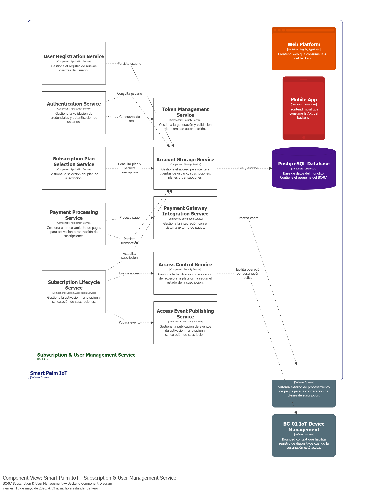
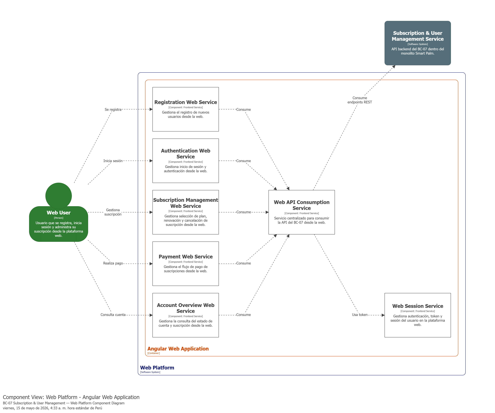
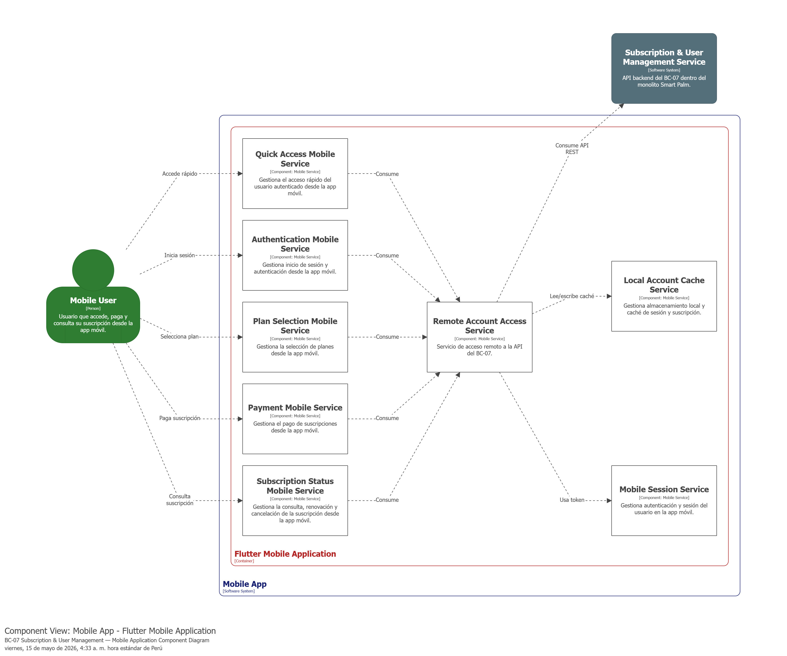

### 4.2.7. Bounded Context: Subscription & User Management

El bounded context **Subscription & User Management** se encarga de gestionar el registro, autenticación y acceso de los usuarios, así como la selección, activación, renovación y cancelación de suscripciones dentro de SmartPalm IoT. Además, integra el procesamiento de pagos mediante un **Payment Gateway** y controla la habilitación de acceso a la plataforma según el estado del plan contratado. Este contexto cumple un rol transversal, ya que una suscripción activa habilita el uso de los demás bounded contexts, mientras que su cancelación restringe el acceso al finalizar el ciclo de facturación.

#### 4.2.7.1. Domain Layer

La **Domain Layer** del bounded context **Subscription & User Management** representa el núcleo del dominio encargado de gestionar la identidad del usuario, su autenticación y el ciclo de vida de la suscripción dentro de SmartPalm IoT. En esta capa se ubican las clases que modelan el registro del usuario, la validación de credenciales, la selección de planes, el procesamiento lógico de la suscripción y las reglas relacionadas con su activación, renovación y cancelación.

Para este bounded context, el dominio puede organizarse alrededor de una entidad principal que representa la cuenta del usuario (*aggregate root*), complementada por entidades asociadas a la suscripción, objetos de valor para planes, *enums*, una *factory*, repositorios y servicios de dominio encargados de aplicar las reglas de negocio del ciclo de suscripción.

---

##### 1. User

| Campo | Detalle |
|---|---|
| **Nombre** | User |
| **Categoría** | Aggregate Root (partial class con UserAudit) |
| **Propósito** | Representar la cuenta del usuario dentro de la plataforma y gestionar su identidad, autenticación y acceso. |

 

**Atributos**

| Nombre | Tipo de dato | Visibilidad | Descripción |
|---|---|---|---|
| Id | int | private | Identificador único del usuario. |
| Username | string | private | Nombre de usuario utilizado para el inicio de sesión. |
| PasswordHash | string | private | Hash de la contraseña del usuario (ignorado en serialización JSON). |
| Email | string | private | Correo electrónico del usuario. |
| FullName | string | private | Nombre completo del usuario registrado. |
| Role | UserRole | private | Rol asignado al usuario dentro de la plataforma. |
| Status | UserStatus | private | Estado actual de la cuenta del usuario. |
| SubscriptionId | int? | private | Identificador de la suscripción asociada (nullable). |
| CreatedDate | DateTimeOffset? | private | Fecha y hora de creación de la cuenta (auditoría). |
| UpdatedDate | DateTimeOffset? | private | Fecha y hora de la última actualización (auditoría). |

 

**Métodos**

| Nombre | Tipo de retorno | Visibilidad | Descripción |
|---|---|---|---|
| UpdateUsername | User | public | Actualizar el nombre de usuario. |
| UpdatePasswordHash | User | public | Actualizar el hash de la contraseña. |
| UpdateProfile | User | public | Actualizar el nombre completo y correo electrónico. |
| UpdateSubscription | User | public | Asignar o desvincular una suscripción al usuario. |
| ActivateAccess | void | public | Habilitar el acceso del usuario a la plataforma. |
| RevokeAccess | void | public | Revocar el acceso del usuario. |

 

La clase `UserAudit` (partial class) implementa `IEntityWithCreatedUpdatedDate` de `EntityFrameworkCore.CreatedUpdatedDate` y agrega las propiedades de auditoría `CreatedDate` y `UpdatedDate` mapeadas a las columnas `CreatedAt` y `UpdatedAt`.

---

 

##### 2. UserRole (Enum)

| Campo | Detalle |
|---|---|
| **Nombre** | UserRole |
| **Categoría** | Enum |
| **Propósito** | Definir los roles de usuario dentro de la plataforma. |

 

| Valor | Descripción |
|---|---|
| Administrator = 0 | Acceso total a la plataforma. |
| Agronomist = 1 | Acceso a funcionalidades agronómicas. |
| PalmGrower = 2 | Acceso limitado para productores de palma. |

---

 

##### 3. Subscription

| Campo | Detalle |
|---|---|
| **Nombre** | Subscription |
| **Categoría** | Entity |
| **Propósito** | Representar la suscripción activa o histórica asociada a un usuario dentro de la plataforma. |

 

**Atributos**

| Nombre | Tipo de dato | Visibilidad | Descripción |
|---|---|---|---|
| Id | int | private | Identificador único de la suscripción. |
| UserId | int | private | Identificador del usuario propietario de la suscripción. |
| PlanType | PlanType | private | Tipo de plan contratado (Seed, Harvest). |
| PlanName | string | private | Nombre del plan de suscripción. |
| Price | decimal | private | Precio asociado al plan. |
| MaxHectares | int? | private | Máximo de hectáreas permitidas (nullable). |
| MaxSensors | int? | private | Máximo de sensores permitidos (nullable). |
| Status | SubscriptionStatus | private | Estado actual de la suscripción. |
| StartDate | DateTime | private | Fecha de inicio de la suscripción. |
| EndDate | DateTime | private | Fecha de fin del ciclo de facturación. |
| BillingCycle | BillingCycle | private | Ciclo de facturación (Monthly, Yearly). |
| CreatedAt | DateTime | private | Fecha y hora de creación del registro. |

 

**Métodos**

| Nombre | Tipo de retorno | Visibilidad | Descripción |
|---|---|---|---|
| Activate | Subscription | public | Activar la suscripción (solo desde estado Pending). |
| Cancel | Subscription | public | Cancelar la suscripción (solo desde estado Active). |
| Renew | Subscription | public | Renovar la suscripción para un nuevo ciclo. |
| IsExpired | bool | public | Verificar si la suscripción ha expirado. |
| MarkExpired | Subscription | public | Marcar la suscripción como expirada. |

---

 

##### 4. PlanType, BillingCycle, SubscriptionStatus, UserStatus, PaymentStatus (Enums)

| Nombre | Categoría | Propósito |
|---|---|---|
| PlanType | Enum | Definir los tipos de plan: Seed = 0, Harvest = 1. |
| BillingCycle | Enum | Definir el ciclo de facturación: Monthly = 0, Yearly = 1. |
| SubscriptionStatus | Enum | Definir los estados de suscripción: Pending = 0, Active = 1, Cancelled = 2, Expired = 3. |
| UserStatus | Enum | Definir los estados de usuario: Active = 0, Inactive = 1, Suspended = 2. |
| PaymentStatus | Enum | Definir los estados de pago: Pending = 0, Completed = 1, Failed = 2, Refunded = 3. |

---

 

##### 5. SubscriptionPlan (Value Object)

| Campo | Detalle |
|---|---|
| **Nombre** | SubscriptionPlan |
| **Categoría** | Value Object (record) |
| **Propósito** | Representar un plan de suscripción disponible para contratación en la plataforma con sus características y precio. |

 

**Atributos**

| Nombre | Tipo de dato | Visibilidad | Descripción |
|---|---|---|---|
| Type | PlanType | public | Tipo de plan (Seed, Harvest). |
| Name | string | public | Nombre del plan. |
| Description | string | public | Descripción del plan. |
| Price | decimal | public | Precio mensual del plan. |
| Cycle | BillingCycle | public | Ciclo de facturación. |
| MaxHectares | int? | public | Máximo de hectáreas incluidas. |
| MaxSensors | int? | public | Máximo de sensores incluidos. |

 

**Planes disponibles**

| Plan | Precio | Usuarios | Características |
|---|---|---|---|
| Seed | $149/mes | 1 usuario | Monitoreo de hasta 50 hectáreas con 20 sensores, reportes básicos. |
| Harvest | $349/mes | 5 usuarios | Hectáreas y sensores ilimitados, reportes avanzados y soporte prioritario. |

 

La clase estática `SubscriptionPlanProvider` expone los métodos `GetPlan(PlanType)` y `GetAll()` para obtener los planes disponibles.

---

 

##### 6. PaymentTransaction

| Campo | Detalle |
|---|---|
| **Nombre** | PaymentTransaction |
| **Categoría** | Entity |
| **Propósito** | Representar una transacción de pago asociada a la activación o renovación de una suscripción. |

 

**Atributos**

| Nombre | Tipo de dato | Visibilidad | Descripción |
|---|---|---|---|
| Id | int | private | Identificador único de la transacción. |
| UserId | int | private | Identificador del usuario asociado. |
| PlanName | string | private | Nombre del plan asociado al pago. |
| PeriodStart | DateTime | private | Inicio del período facturado. |
| PeriodEnd | DateTime | private | Fin del período facturado. |
| Amount | decimal | private | Monto procesado en la transacción. |
| TransactionId | string? | private | Identificador de la transacción externa (nullable). |
| Status | PaymentStatus | private | Estado del pago procesado. |
| ProcessedAt | DateTime | private | Fecha y hora en que se procesó la transacción. |

 

**Métodos**

| Nombre | Tipo de retorno | Visibilidad | Descripción |
|---|---|---|---|
| Complete | PaymentTransaction | public | Marcar la transacción como completada con un identificador externo. |
| Fail | PaymentTransaction | public | Marcar la transacción como fallida. |
| Refund | PaymentTransaction | public | Marcar la transacción como reembolsada (solo desde Completed). |

---

 

##### 7. SubscriptionFactory

| Campo | Detalle |
|---|---|
| **Nombre** | SubscriptionFactory |
| **Categoría** | Factory (static) |
| **Propósito** | Crear nuevas instancias válidas de suscripciones a partir de un usuario y un tipo de plan. |

 

**Métodos**

| Nombre | Tipo de retorno | Visibilidad | Descripción |
|---|---|---|---|
| CreateSubscription | Subscription | public | Crear una nueva suscripción para un usuario con el plan especificado. |

---

 

##### 8. IUserRepository

| Campo | Detalle |
|---|---|
| **Nombre** | IUserRepository |
| **Categoría** | Repository Interface (extends IBaseRepository<User>) |
| **Propósito** | Persistir y consultar usuarios dentro del bounded context. |

 

**Métodos**

| Nombre | Tipo de retorno | Visibilidad | Descripción |
|---|---|---|---|
| AddAsync | Task | public | Persistir un nuevo usuario. |
| FindByIdAsync | Task\<User?\> | public | Buscar un usuario por su identificador. |
| FindByUsernameAsync | Task\<User?\> | public | Buscar un usuario por su nombre de usuario. |
| FindByEmailAsync | Task\<User?\> | public | Buscar un usuario por su correo electrónico. |
| ExistsByUsername | bool | public | Verificar si existe un usuario con el nombre de usuario dado. |
| ExistsByEmail | bool | public | Verificar si existe un usuario con el correo electrónico dado. |
| ListAsync | Task\<IEnumerable\<User\>\> | public | Obtener todos los usuarios. |
| Update | void | public | Actualizar la información de un usuario existente. |
| Remove | void | public | Eliminar un usuario. |

---

 

##### 9. ISubscriptionRepository

| Campo | Detalle |
|---|---|
| **Nombre** | ISubscriptionRepository |
| **Categoría** | Repository Interface (extends IBaseRepository<Subscription>) |
| **Propósito** | Persistir y consultar suscripciones asociadas a los usuarios. |

 

**Métodos**

| Nombre | Tipo de retorno | Visibilidad | Descripción |
|---|---|---|---|
| AddAsync | Task | public | Persistir una nueva suscripción. |
| FindByIdAsync | Task\<Subscription?\> | public | Buscar una suscripción por su identificador. |
| FindByUserIdAsync | Task\<Subscription?\> | public | Obtener la suscripción asociada a un usuario. |
| ListAsync | Task\<IEnumerable\<Subscription\>\> | public | Obtener todas las suscripciones. |
| Update | void | public | Actualizar el estado o vigencia de una suscripción existente. |
| Remove | void | public | Eliminar una suscripción. |

---

 

##### 10. IPaymentTransactionRepository

| Campo | Detalle |
|---|---|
| **Nombre** | IPaymentTransactionRepository |
| **Categoría** | Repository Interface (extends IBaseRepository<PaymentTransaction>) |
| **Propósito** | Persistir y consultar transacciones de pago asociadas a las suscripciones. |

 

**Métodos**

| Nombre | Tipo de retorno | Visibilidad | Descripción |
|---|---|---|---|
| AddAsync | Task | public | Persistir una nueva transacción de pago. |
| FindByIdAsync | Task\<PaymentTransaction?\> | public | Buscar una transacción por su identificador. |
| FindByUserIdAsync | Task\<IEnumerable\<PaymentTransaction\>\> | public | Obtener las transacciones de pago de un usuario. |
| ListAsync | Task\<IEnumerable\<PaymentTransaction\>\> | public | Obtener todas las transacciones. |
| Update | void | public | Actualizar el estado de una transacción existente. |
| Remove | void | public | Eliminar una transacción. |

---

 

##### 11. IUserCommandService

| Campo | Detalle |
|---|---|
| **Nombre** | IUserCommandService |
| **Categoría** | Domain Service Interface |
| **Propósito** | Definir el contrato para gestionar los comandos de registro e inicio de sesión de usuarios. |

 

**Métodos**

| Nombre | Tipo de retorno | Visibilidad | Descripción |
|---|---|---|---|
| Handle(SignInCommand) | Task\<(User user, string token)\> | public | Autenticar un usuario y generar un token JWT. |
| Handle(SignUpCommand) | Task | public | Registrar un nuevo usuario en la plataforma. |

---

 

##### 12. IUserQueryService

| Campo | Detalle |
|---|---|
| **Nombre** | IUserQueryService |
| **Categoría** | Domain Service Interface |
| **Propósito** | Definir el contrato para las consultas de usuarios. |

 

**Métodos**

| Nombre | Tipo de retorno | Visibilidad | Descripción |
|---|---|---|---|
| Handle(GetUserByIdQuery) | Task\<User?\> | public | Obtener un usuario por su identificador. |
| Handle(GetAllUsersQuery) | Task\<IEnumerable\<User\>\> | public | Obtener todos los usuarios. |
| Handle(GetUserByUsernameQuery) | Task\<User?\> | public | Obtener un usuario por su nombre de usuario. |

---

 

##### 13. ISubscriptionCommandService / ISubscriptionQueryService

| Nombre | Categoría | Propósito |
|---|---|---|
| ISubscriptionCommandService | Domain Service Interface | Definir el contrato para comandos de suscripción (crear, cancelar). |
| ISubscriptionQueryService | Domain Service Interface | Definir el contrato para consultas de suscripción (por usuario, por ID). |

---

 

##### 14. IPaymentCommandService / IPaymentQueryService

| Nombre | Categoría | Propósito |
|---|---|---|
| IPaymentCommandService | Domain Service Interface | Definir el contrato para procesar pagos. |
| IPaymentQueryService | Domain Service Interface | Definir el contrato para consultar transacciones de pago por usuario. |

---

 

##### 15. ISubscriptionLifecycleDomainService / IPaymentStrategy

| Nombre | Categoría | Propósito |
|---|---|---|
| ISubscriptionLifecycleDomainService | Domain Service Interface | Aplicar reglas de negocio para renovación y cancelación de suscripciones. |
| IPaymentStrategy | Domain Service Interface (Strategy Pattern) | Definir el contrato para procesar pagos a través de diferentes proveedores. |

 

**Comandos del dominio**

| Nombre | Propiedades |
|---|---|
| SignUpCommand | Username, Password, Email, FullName, Role |
| SignInCommand | Username, Password |
| CreateSubscriptionCommand | UserId, PlanType |
| CancelSubscriptionCommand | UserId |
| ProcessPaymentCommand | UserId, Amount |

 

**Consultas del dominio**

| Nombre | Propiedades |
|---|---|
| GetAllUsersQuery | — |
| GetUserByIdQuery | Id |
| GetUserByUsernameQuery | Username |
| GetSubscriptionByUserIdQuery | UserId |
| GetSubscriptionByIdQuery | SubscriptionId |
| GetPaymentsByUserIdQuery | UserId |

 

#### 4.2.7.2. Interface Layer

La **Interface Layer** del bounded context **Subscription & User Management** agrupa las clases encargadas de recibir solicitudes relacionadas con el registro, autenticación y gestión de suscripciones. Su función principal es actuar como punto de entrada del bounded context, derivando las solicitudes hacia la capa de aplicación para su procesamiento.

En este bounded context, la capa de interfaz se encuentra compuesta por clases del tipo **Controller**, ya que las interacciones del usuario se realizan desde la plataforma web y requieren exponer operaciones relacionadas con acceso y suscripción.

---

 

##### 1. AuthenticationController

| Campo | Detalle |
|---|---|
| **Nombre** | AuthenticationController |
| **Categoría** | Controller |
| **Propósito** | Gestionar las solicitudes de registro e inicio de sesión de usuarios en la plataforma. |

 

**Atributos**

| Nombre | Tipo de dato | Visibilidad | Descripción |
|---|---|---|---|
| UserCommandService | IUserCommandService | private | Servicio de aplicación encargado de manejar los comandos de usuario (sign-in, sign-up). |

 

**Endpoints**

| Método | Ruta | Atributos | Request Body | Response | Descripción |
|---|---|---|---|---|---|
| SignIn | POST /api/v1/authentication/sign-in | [AllowAnonymous] | SignInResource | AuthenticatedUserResource (200) | Iniciar sesión con credenciales. |
| SignUp | POST /api/v1/authentication/sign-up | [AllowAnonymous] | SignUpResource | mensaje (200) | Registrar un nuevo usuario. |

---

 

##### 2. UsersController

| Campo | Detalle |
|---|---|
| **Nombre** | UsersController |
| **Categoría** | Controller |
| **Propósito** | Gestionar las solicitudes de consulta de usuarios (solo administradores). |

 

**Atributos**

| Nombre | Tipo de dato | Visibilidad | Descripción |
|---|---|---|---|
| UserQueryService | IUserQueryService | private | Servicio de aplicación encargado de las consultas de usuarios. |

 

**Endpoints**

| Método | Ruta | Atributos | Response | Descripción |
|---|---|---|---|---|
| GetAllUsers | GET /api/v1/users | [Authorize(Roles = "Administrator")] | IEnumerable\<UserResource\> (200) | Listar todos los usuarios. |
| GetUserById | GET /api/v1/users/{id} | [Authorize(Roles = "Administrator")] | UserResource (200) | Obtener un usuario por su ID. |

---

 

##### 3. SubscriptionPlansController

| Campo | Detalle |
|---|---|
| **Nombre** | SubscriptionPlansController |
| **Categoría** | Controller |
| **Propósito** | Exponer los planes de suscripción disponibles para contratación. |

 

**Endpoints**

| Método | Ruta | Atributos | Response | Descripción |
|---|---|---|---|---|
| ListPlans | GET /api/v1/subscriptions/plans | [AllowAnonymous] | IEnumerable\<PlanResource\> (200) | Obtener la lista de planes disponibles. |

---

 

##### 4. UserSubscriptionController

| Campo | Detalle |
|---|---|
| **Nombre** | UserSubscriptionController |
| **Categoría** | Controller |
| **Propósito** | Gestionar las solicitudes relacionadas con suscripciones y pagos de un usuario específico. |

 

**Atributos**

| Nombre | Tipo de dato | Visibilidad | Descripción |
|---|---|---|---|
| SubscriptionCommandService | ISubscriptionCommandService | private | Servicio de comandos de suscripción. |
| SubscriptionQueryService | ISubscriptionQueryService | private | Servicio de consultas de suscripción. |
| PaymentCommandService | IPaymentCommandService | private | Servicio de comandos de pago. |
| PaymentQueryService | IPaymentQueryService | private | Servicio de consultas de pago. |

 

**Endpoints**

| Método | Ruta | Request Body | Response | Descripción |
|---|---|---|---|---|
| CreateSubscription | POST /api/v1/users/{userId}/subscription | CreateSubscriptionResource | SubscriptionResource (201) | Crear una suscripción para un usuario. |
| GetSubscription | GET /api/v1/users/{userId}/subscription | — | SubscriptionResource (200) | Obtener la suscripción del usuario. |
| CancelSubscription | DELETE /api/v1/users/{userId}/subscription | — | mensaje (200) | Cancelar la suscripción del usuario. |
| ListPayments | GET /api/v1/users/{userId}/subscription/payments | — | IEnumerable\<PaymentTransactionResource\> (200) | Listar pagos del usuario. |
| ProcessPayment | POST /api/v1/users/{userId}/subscription/payments | ProcessPaymentResource | PaymentTransactionResource (201) | Procesar un pago. |

---

 

**Resources**

| Nombre | Propiedades |
|---|---|
| SignUpResource | username, password, email, fullName, role |
| SignInResource | Username, Password |
| AuthenticatedUserResource | Username, Token |
| UserResource | username, email, fullName, role, status |
| CreateSubscriptionResource | planType |
| SubscriptionResource | planType, planName, price, maxHectares, maxSensors, status, startDate, endDate, billingCycle, createdAt |
| PlanResource | type, name, description, price, billingCycle, maxHectares, maxSensors |
| ProcessPaymentResource | amount |
| PaymentTransactionResource | planName, periodStart, periodEnd, amount, status, processedAt |

 

#### 4.2.7.3. Application Layer

La **Application Layer** del bounded context **Subscription & User Management** se encarga de coordinar los flujos de negocio relacionados con el registro, autenticación y gestión de suscripciones. Su responsabilidad principal es recibir las solicitudes provenientes de la Interface Layer, transformarlas en flujos de aplicación y orquestar la ejecución de los casos de uso del contexto.

En esta capa se ubican los servicios de aplicación que implementan los interfaces definidos en el dominio, organizados en *command services*, *query services*, *domain services* y *outbound services*.

---

 

##### 1. UserCommandService

| Campo | Detalle |
|---|---|
| **Nombre** | UserCommandService |
| **Categoría** | Application Command Service |
| **Propósito** | Implementar el flujo de registro e inicio de sesión de usuarios, incluyendo validación de credenciales y generación de tokens JWT. |

 

**Atributos**

| Nombre | Tipo de dato | Visibilidad | Descripción |
|---|---|---|---|
| UserRepository | IUserRepository | private | Repositorio para persistir y consultar usuarios. |
| TokenService | ITokenService | private | Servicio para generar y validar tokens JWT. |
| HashingService | IHashingService | private | Servicio para hashear y verificar contraseñas. |
| UnitOfWork | IUnitOfWork | private | Unidad de trabajo para transacciones. |

 

**Métodos**

| Nombre | Tipo de retorno | Visibilidad | Descripción |
|---|---|---|---|
| Handle(SignInCommand) | Task\<(User, string)\> | public | Autenticar al usuario y retornar un token JWT. |
| Handle(SignUpCommand) | Task | public | Crear un nuevo usuario con contraseña hasheada y rol validado. |

---

 

##### 2. UserQueryService

| Campo | Detalle |
|---|---|
| **Nombre** | UserQueryService |
| **Categoría** | Application Query Service |
| **Propósito** | Implementar las consultas de usuarios delegando en el repositorio correspondiente. |

 

**Atributos**

| Nombre | Tipo de dato | Visibilidad | Descripción |
|---|---|---|---|
| UserRepository | IUserRepository | private | Repositorio para consultar usuarios. |

 

**Métodos**

| Nombre | Tipo de retorno | Visibilidad | Descripción |
|---|---|---|---|
| Handle(GetUserByIdQuery) | Task\<User?\> | public | Obtener un usuario por su ID. |
| Handle(GetAllUsersQuery) | Task\<IEnumerable\<User\>\> | public | Obtener todos los usuarios. |
| Handle(GetUserByUsernameQuery) | Task\<User?\> | public | Obtener un usuario por su nombre de usuario. |

---

 

##### 3. SubscriptionCommandService

| Campo | Detalle |
|---|---|
| **Nombre** | SubscriptionCommandService |
| **Categoría** | Application Command Service |
| **Propósito** | Implementar la creación y cancelación de suscripciones, validando reglas de negocio a través del servicio de dominio. |

 

**Atributos**

| Nombre | Tipo de dato | Visibilidad | Descripción |
|---|---|---|---|
| SubscriptionRepository | ISubscriptionRepository | private | Repositorio para persistir suscripciones. |
| UserRepository | IUserRepository | private | Repositorio para validar la existencia del usuario. |
| LifecycleDomainService | ISubscriptionLifecycleDomainService | private | Servicio de dominio para reglas de ciclo de vida. |
| UnitOfWork | IUnitOfWork | private | Unidad de trabajo para transacciones. |

 

**Métodos**

| Nombre | Tipo de retorno | Visibilidad | Descripción |
|---|---|---|---|
| Handle(CreateSubscriptionCommand) | Task\<Subscription\> | public | Crear una nueva suscripción usando SubscriptionFactory. |
| Handle(CancelSubscriptionCommand) | Task\<Subscription\> | public | Cancelar una suscripción activa. |

---

 

##### 4. SubscriptionQueryService

| Campo | Detalle |
|---|---|
| **Nombre** | SubscriptionQueryService |
| **Categoría** | Application Query Service |
| **Propósito** | Implementar las consultas de suscripciones delegando en el repositorio correspondiente. |

 

**Métodos**

| Nombre | Tipo de retorno | Visibilidad | Descripción |
|---|---|---|---|
| Handle(GetSubscriptionByUserIdQuery) | Task\<Subscription?\> | public | Obtener la suscripción de un usuario. |
| Handle(GetSubscriptionByIdQuery) | Task\<Subscription?\> | public | Obtener una suscripción por su ID. |

---

 

##### 5. PaymentCommandService

| Campo | Detalle |
|---|---|
| **Nombre** | PaymentCommandService |
| **Categoría** | Application Command Service |
| **Propósito** | Implementar el procesamiento de pagos, integrando la estrategia de pago y actualizando el estado de la transacción y suscripción. |

 

**Atributos**

| Nombre | Tipo de dato | Visibilidad | Descripción |
|---|---|---|---|
| PaymentTransactionRepository | IPaymentTransactionRepository | private | Repositorio para persistir transacciones de pago. |
| SubscriptionRepository | ISubscriptionRepository | private | Repositorio para actualizar la suscripción. |
| PaymentStrategy | IPaymentStrategy | private | Estrategia de procesamiento de pago (Strategy Pattern). |
| UnitOfWork | IUnitOfWork | private | Unidad de trabajo para transacciones. |

 

**Métodos**

| Nombre | Tipo de retorno | Visibilidad | Descripción |
|---|---|---|---|
| Handle(ProcessPaymentCommand) | Task\<PaymentTransaction\> | public | Procesar un pago y activar la suscripción si es exitoso. |

---

 

##### 6. PaymentQueryService

| Campo | Detalle |
|---|---|
| **Nombre** | PaymentQueryService |
| **Categoría** | Application Query Service |
| **Propósito** | Implementar las consultas de transacciones de pago por usuario. |

 

**Métodos**

| Nombre | Tipo de retorno | Visibilidad | Descripción |
|---|---|---|---|
| Handle(GetPaymentsByUserIdQuery) | Task\<IEnumerable\<PaymentTransaction\>\> | public | Obtener todas las transacciones de pago de un usuario. |

---

 

##### 7. Application Domain Services

| Nombre | Categoría | Propósito |
|---|---|---|
| SubscriptionLifecycleDomainService | Application Domain Service | Implementar ISubscriptionLifecycleDomainService con reglas de renovación y cancelación. |
| LocalPaymentStrategy | Application Domain Service | Implementar IPaymentStrategy para procesar pagos localmente (simulado). |
| StripePaymentStrategy | Application Domain Service | Implementar IPaymentStrategy para procesar pagos a través de Stripe. |

---

 

##### 8. Outbound Services

| Nombre | Categoría | Propósito | Tecnología |
|---|---|---|---|
| IHashingService | Application Outbound Service | Definir contrato para hashear y verificar contraseñas. | BCrypt.Net-Next |
| ITokenService | Application Outbound Service | Definir contrato para generar y validar tokens JWT. | Microsoft.IdentityModel.JsonWebTokens |

 

#### 4.2.7.4. Infrastructure Layer

La **Infrastructure Layer** del bounded context **Subscription & User Management** agrupa las clases responsables de la persistencia, integración y comunicación con servicios externos necesarios para soportar la gestión de usuarios, autenticación y suscripciones. En esta capa se implementan las abstracciones definidas en el dominio y la aplicación.

A diferencia de las capas de dominio y aplicación, esta capa no define reglas de negocio, sino que implementa detalles técnicos concretos para almacenar cuentas de usuario, suscripciones, transacciones de pago y mecanismos de seguridad como hashing de contraseñas, generación de tokens JWT y middleware de autorización.

---

 

##### 1. UserRepository

| Campo | Detalle |
|---|---|
| **Nombre** | UserRepository |
| **Categoría** | Repository Implementation |
| **Propósito** | Implementar la persistencia de usuarios extendiendo BaseRepository\<User\> e implementando IUserRepository. |

 

**Métodos**

| Nombre | Tipo de retorno | Visibilidad | Descripción |
|---|---|---|---|
| FindByUsernameAsync | Task\<User?\> | public | Buscar un usuario por su nombre de usuario. |
| FindByEmailAsync | Task\<User?\> | public | Buscar un usuario por su correo electrónico. |
| ExistsByUsername | bool | public | Verificar si existe un usuario con el username dado. |
| ExistsByEmail | bool | public | Verificar si existe un usuario con el email dado. |

 *(Hereda métodos CRUD de BaseRepository\<User\>)*

---

 

##### 2. SubscriptionRepository

| Campo | Detalle |
|---|---|
| **Nombre** | SubscriptionRepository |
| **Categoría** | Repository Implementation |
| **Propósito** | Implementar la persistencia de suscripciones extendiendo BaseRepository\<Subscription\> e implementando ISubscriptionRepository. |

 

**Métodos**

| Nombre | Tipo de retorno | Visibilidad | Descripción |
|---|---|---|---|
| FindByUserIdAsync | Task\<Subscription?\> | public | Obtener la suscripción asociada a un usuario. |

 *(Hereda métodos CRUD de BaseRepository\<Subscription\>)*

---

 

##### 3. PaymentTransactionRepository

| Campo | Detalle |
|---|---|
| **Nombre** | PaymentTransactionRepository |
| **Categoría** | Repository Implementation |
| **Propósito** | Implementar la persistencia de transacciones de pago extendiendo BaseRepository\<PaymentTransaction\> e implementando IPaymentTransactionRepository. |

 

**Métodos**

| Nombre | Tipo de retorno | Visibilidad | Descripción |
|---|---|---|---|
| FindByUserIdAsync | Task\<IEnumerable\<PaymentTransaction\>\> | public | Obtener las transacciones de pago de un usuario. |

 *(Hereda métodos CRUD de BaseRepository\<PaymentTransaction\>)*

---

 

##### 4. HashingService

| Campo | Detalle |
|---|---|
| **Nombre** | HashingService |
| **Categoría** | Security Service (BCrypt) |
| **Propósito** | Implementar IHashingService utilizando BCrypt.Net-Next para hashear y verificar contraseñas. |

 

**Métodos**

| Nombre | Tipo de retorno | Visibilidad | Descripción |
|---|---|---|---|
| HashPassword | string | public | Generar el hash BCrypt de una contraseña. |
| VerifyPassword | bool | public | Verificar una contraseña contra su hash. |

---

 

##### 5. TokenService

| Campo | Detalle |
|---|---|
| **Nombre** | TokenService |
| **Categoría** | Security Service (JWT) |
| **Propósito** | Implementar ITokenService utilizando Microsoft.IdentityModel.JsonWebTokens para generar y validar tokens JWT con expiración de 7 días y claims Sid (UserId) y Name (Username). |

 

**Atributos**

| Nombre | Tipo de dato | Visibilidad | Descripción |
|---|---|---|---|
| TokenSettings | TokenSettings | private | Configuración obtenida mediante Options Pattern que contiene la clave secreta. |

 

**Métodos**

| Nombre | Tipo de retorno | Visibilidad | Descripción |
|---|---|---|---|
| GenerateToken | string | public | Generar un token JWT con claims Sid y Name, expiración a 7 días. |
| ValidateToken | Task\<int?\> | public | Validar un token JWT y retornar el ID del usuario si es válido. |

---

 

##### 6. TokenSettings

| Campo | Detalle |
|---|---|
| **Nombre** | TokenSettings |
| **Categoría** | Configuration (Options Pattern) |
| **Propósito** | Almacenar la configuración del JWT (clave secreta) desde appsettings.json. |

 

**Atributos**

| Nombre | Tipo de dato | Visibilidad | Descripción |
|---|---|---|---|
| Secret | string | public |Clave secreta utilizada para firmar los tokens JWT. |

---

 

##### 7. Middleware de Autorización

| Nombre | Categoría | Propósito |
|---|---|---|
| RequestAuthorizationMiddleware | Middleware Component | Middleware personalizado que extrae el token JWT del header Authorization, lo valida mediante TokenService y establece el usuario en HttpContext.Items["User"] para su uso posterior. |
| AuthorizeAttribute | Custom Attribute | Filtro de autorización personalizado que verifica la presencia del usuario en el contexto y opcionalmente valida roles específicos. Retorna 401 si no hay usuario y 403 si el rol no coincide. |
| AllowAnonymousAttribute | Custom Attribute | Marcador para omitir la autorización en acciones o controladores específicos. |

 

#### 4.2.7.5. Bounded Context Software Architecture Component Level Diagrams

Diagrama 1: Component Level — Backend API (ASP.NET Core)  
Este diagrama muestra la arquitectura de componentes del backend del BC-07 Subscription & User Management dentro del monolito Smart Palm. Se organiza en servicios de registro, autenticación, gestión de suscripción, procesamiento de pagos, control de acceso y publicación de eventos de ciclo de suscripción.

Diagrama 2: Component Level — Web Platform (Angular)  
Este diagrama muestra la arquitectura de componentes de la plataforma web para el BC-07 Subscription & User Management. Se organiza en servicios orientados al registro de usuarios, autenticación, selección de planes, pagos y administración de la suscripción, apoyados por un servicio central de consumo de API y gestión de sesión web.

Diagrama 3: Component Level — Mobile Application (Flutter)  
Este diagrama muestra la arquitectura de componentes de la aplicación móvil para el BC-07 Subscription & User Management. Se organiza en servicios orientados al acceso rápido del usuario, autenticación, selección de plan, pago y consulta del estado de la suscripción, apoyados por servicios de acceso remoto, sesión móvil y almacenamiento local.

#### 4.2.7.6. Bounded Context Software Architecture Code Level Diagrams

##### 4.2.7.6.1. Bounded Context Domain Layer Class Diagrams

##### 4.2.7.6.2. Bounded Context Database Design Diagram

---
