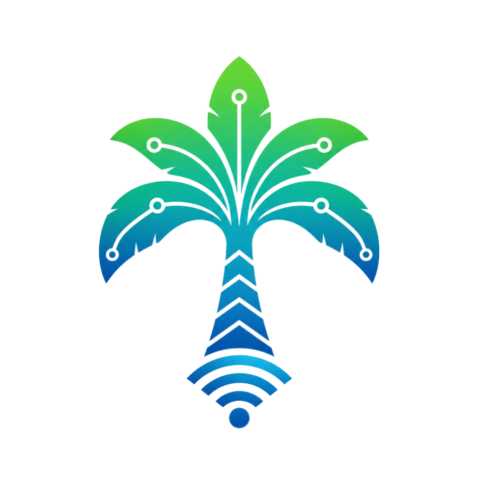
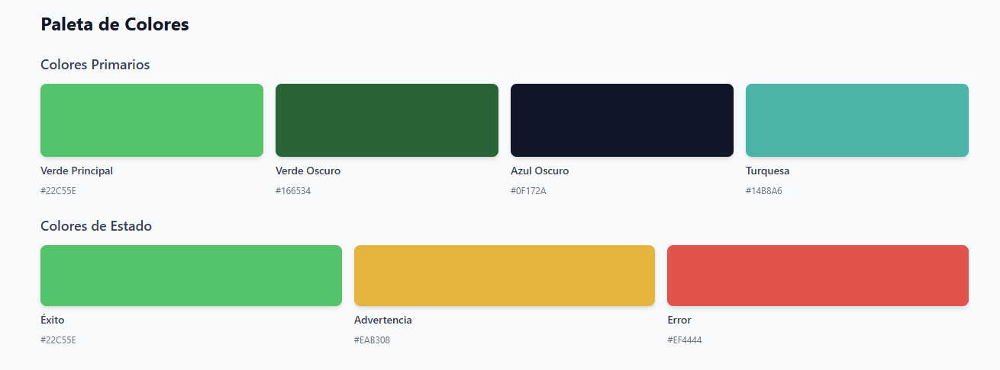
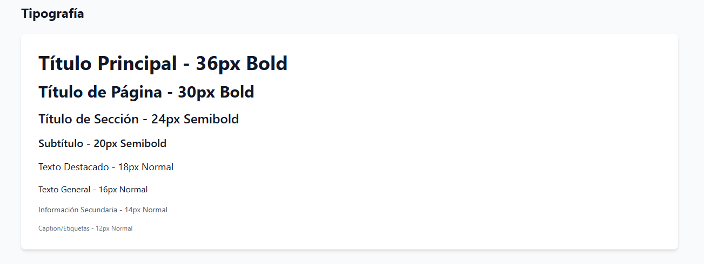
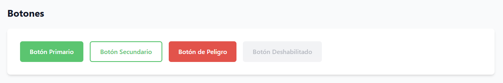
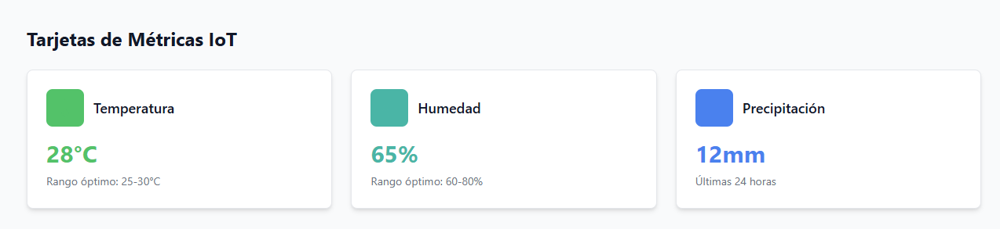
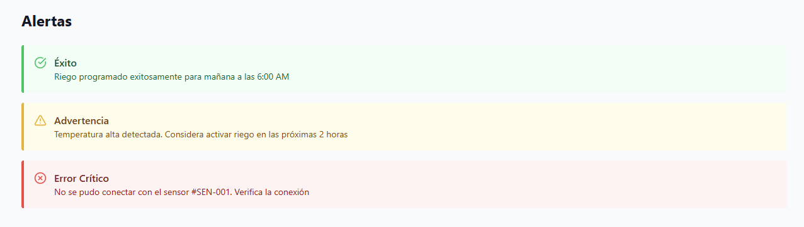
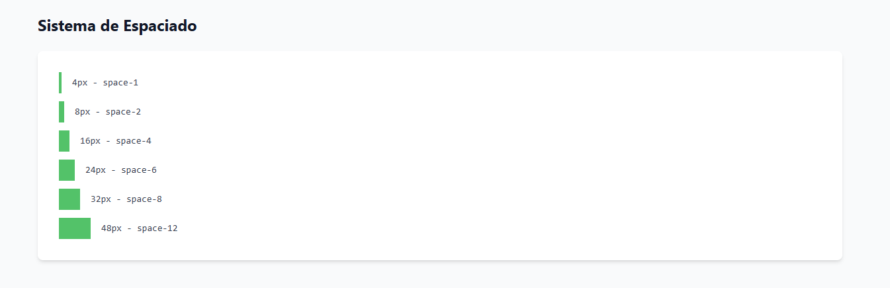

# 5.1. Style Guidelines

---

# 5.1.1. General Style Guidelines

El diseño visual de SmartPalm fue desarrollado siguiendo una línea gráfica orientada al sector Agronomo-Tecnologico, utilizando una identidad moderna, tecnológica y alineada con el contexto agrícola amazónico. Para la construcción de la interfaz se tomó como referencia la fauna amazonica, manteniendo consistencia visual y comunicacional entre la plataforma web, la aplicación móvil y los componentes IoT.

La propuesta visual priorizó la claridad de la información, la legibilidad en entornos rurales y la facilidad de interpretación de datos agronómicos críticos. Asimismo, se aplicó un enfoque minimalista orientado a dashboards y sistemas de monitoreo, reduciendo elementos visuales innecesarios y destacando únicamente la información relevante para el usuario.

La interfaz mantiene coherencia en todos los componentes mediante un sistema uniforme de tipografías, colores, espaciados y componentes reutilizables. Esto permitió construir una experiencia consistente tanto para productores agrícolas como para ingenieros agrónomos.

Las directrices generales de estilo definieron los elementos visuales base utilizados en toda la solución SmartPalm. Estas directrices permitieron mantener uniformidad gráfica y facilitar la identificación de la marca dentro de los distintos entornos digitales del sistema.

## Paleta de colores

Se utilizó una paleta basada principalmente en tonalidades verdes, turquesas y azules oscuros, debido a su asociación directa con agricultura, naturaleza, tecnología y monitoreo inteligente. Los colores secundarios fueron utilizados para estados visuales como alertas, advertencias y confirmaciones.

| Elemento | Color | Uso |
|---|---|---|
| Verde principal | `#22C55E` | Botones principales y elementos activos |
| Verde oscuro | `#166534` | Encabezados y navegación |
| Azul oscuro | `#0F172A` | Fondos de dashboard |
| Turquesa | `#14B8A6` | Indicadores IoT y métricas |
| Amarillo | `#EAB308` | Advertencias |
| Rojo | `#EF4444` | Alertas críticas |

## Tipografía

Se empleó una tipografía sans-serif moderna orientada a interfaces digitales, priorizando legibilidad en dispositivos móviles y pantallas de monitoreo.

| Elemento | Tamaño |
|---|---|
| Títulos principales | 32px |
| Subtítulos | 24px |
| Texto general | 16px |
| Información secundaria | 14px |

## Componentes visuales

Se definieron componentes reutilizables para tarjetas, dashboards, alertas, gráficos y botones. Los bordes redondeados, sombras suaves y espaciados amplios permitieron generar una interfaz limpia y moderna.

### Botones

### Metricas

### Alertas

## Iconografía

la iconografía utilizada estuvo orientada al monitoreo agrícola y dispositivos iot, incorporando símbolos relacionados con sensores, clima, temperatura, humedad, alertas y cultivos.

## espaciados

Los espaciados se utilizaron para separar elementos de forma clara y uniforme, proporcionando una coherencia visual en la interfaz. Estos espaciados incluían espaciados entre elementos, espaciados en relación con el texto, espaciados en relación con los bordes y espaciados en relación con los bordes de los elementos.

---

# 5.1.2. Web, Mobile and IoT Style Guidelines

La solución SmartPalm fue diseñada considerando tres entornos principales: plataforma web, aplicación móvil y dispositivos IoT de monitoreo en campo. Cada uno mantuvo consistencia visual con la identidad general del producto, adaptando la experiencia según el contexto de uso.

## Plataforma Web

La interfaz web estuvo orientada principalmente a ingenieros agrónomos y usuarios técnicos que requieren supervisar múltiples plantaciones simultáneamente. Se utilizaron dashboards con visualización de métricas, mapas, gráficas históricas y paneles administrativos.

El diseño priorizó:

- Distribución modular de información.
- Uso de gráficos de alto contraste.
- Navegación lateral persistente.
- Visualización simultánea de múltiples métricas.

## Aplicación Mobile

La aplicación móvil fue diseñada para productores agrícolas con conectividad limitada y menor experiencia tecnológica. La interfaz priorizó simplicidad, accesibilidad y rapidez de interpretación.

Se implementaron:

- Botones grandes y visibles.
- Alertas rápidas en tiempo real.
- Navegación simplificada.
- Información resumida y priorizada.

Asimismo, se redujo la cantidad de pasos necesarios para acceder a información crítica del cultivo.

## Dispositivos IoT

Los dispositivos IoT mantuvieron una identidad visual alineada al ecosistema SmartPalm mediante indicadores LED, carcasa resistente y etiquetado técnico simplificado.

El diseño físico consideró:

- Resistencia a humedad y altas temperaturas.
- Facilidad de instalación en campo.
- Identificación rápida de estado operativo.
- Bajo consumo energético.
