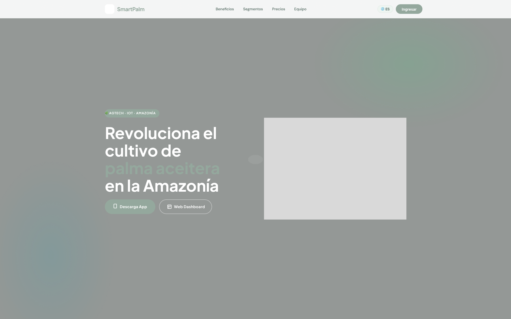
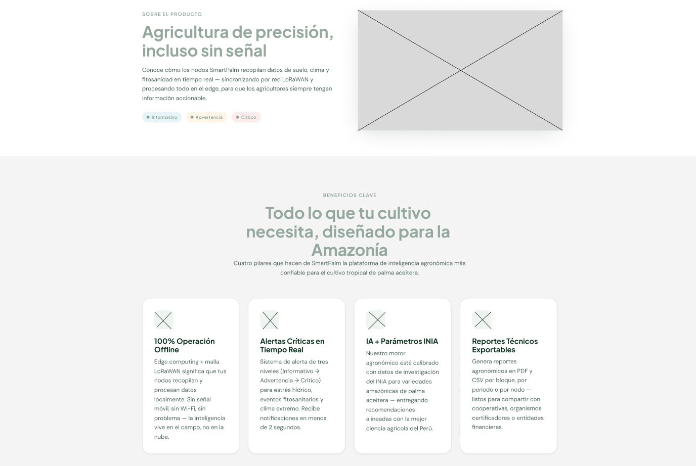
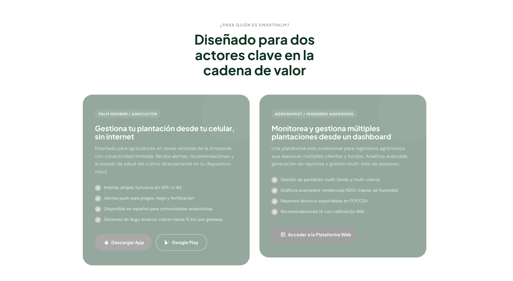
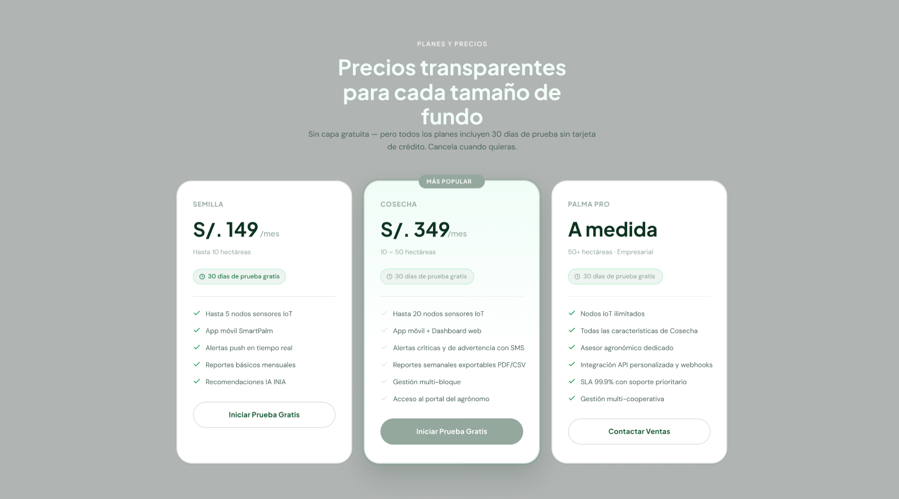
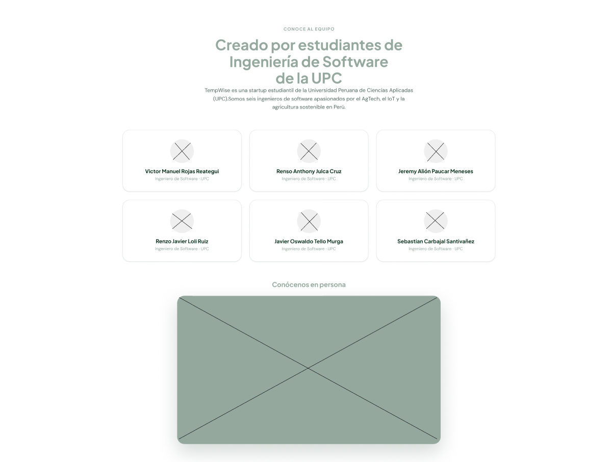
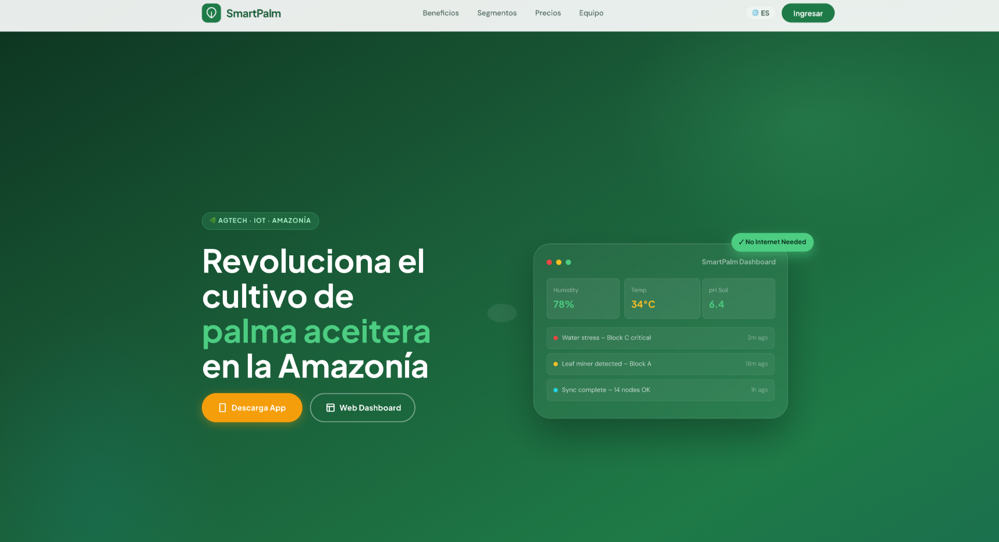
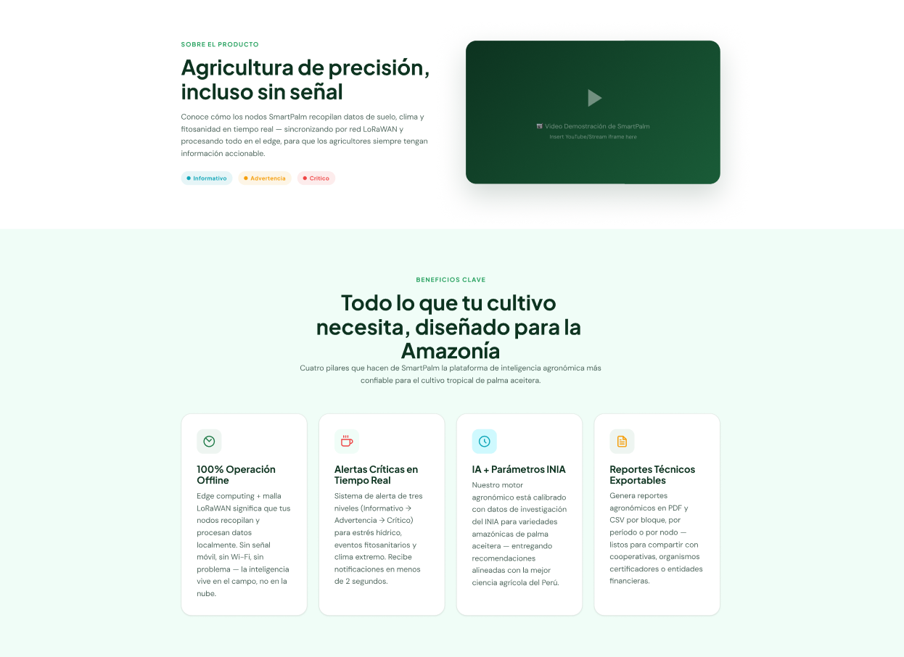
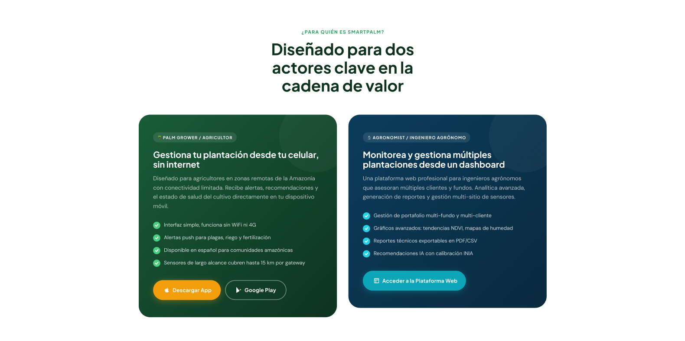
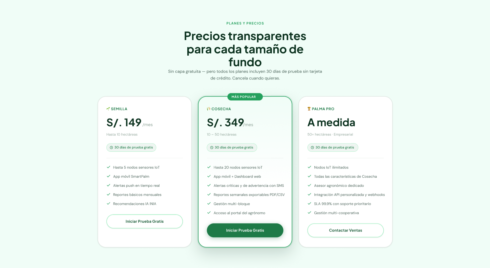
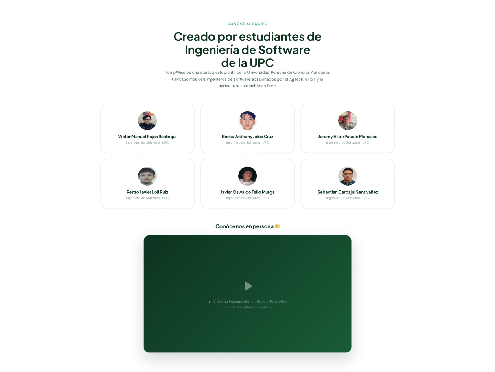

# 5.3. Landing Page UI Design.

En esta sección, el equipo presenta la propuesta de diseño de la interfaz de usuario (UI) para el Landing Page de TempWise y su producto central, SmartPalm. Las decisiones de arquitectura de la información se han traducido en una estructura secuencial y de jerarquía visual clara, diseñada para guiar al visitante a lo largo de nuestra propuesta de valor. El recorrido inicia con un Hero Section que establece el propósito de revolucionar el cultivo de palma aceitera en la Amazonía ("Revolutionize palm oil farming in the Amazon"), seguido de secciones estratégicas que detallan los beneficios tecnológicos (como la operación 100% offline mediante edge computing y LoRaWAN, el sistema de alertas críticas y el motor agronómico calibrado por el INIA). Esta organización de la información permite canalizar de manera eficiente a nuestros dos segmentos objetivos hacia sus respectivos Call-to-Actions (CTAs): invitando al dueño del cultivo (Palm Grower) a descargar la aplicación móvil y al ingeniero agrónomo (Agronomist) a acceder al dashboard analítico de la plataforma web.

Asimismo, las decisiones de diseño visual se fundamentan en la aplicación estricta de los principios de Material Design, garantizando que la experiencia interactiva sea consistente, limpia y moderna, reflejando la identidad tecnológica (AgTech) de la startup. Se ha puesto especial énfasis en la aplicación de principios de diseño inclusivo, estructurando el contenido para que sea altamente legible y accesible bajo estándares de accesibilidad visual y estructural. Además, en alineación con las restricciones del proyecto, la propuesta visual incorpora características de internacionalización (i18n), estableciendo el inglés como idioma estructural por defecto, pero contemplando la adaptabilidad funcional al español latinoamericano para asegurar la inclusión de los productores amazónicos.

## 5.3.1. Landing Page Wireframe.

### Header y Hero Section (Inicio de la página)

### Sección de Beneficios y "About the Product"

### Sección de Segmentos

### Sección de Pricing 

### About the Team

### Footer (Pie de página)

## 5.3.2. Landing Page Mock-up.

### Header y Hero Section (Inicio de la página)

### Sección de Beneficios y "About the Product"

### Sección de Segmentos

### Sección de Pricing 

### About the Team

### Footer (Pie de página)

