## 5.4. Applications UX/UI Design

### 5.4.1. Applications Wireframes

#### Web Application

##### Login

Pantalla de inicio de sesión donde el usuario —ingeniero agrónomo o dueño de cultivo— ingresa sus credenciales para acceder a la plataforma SmartPalm.

##### Register

Pantalla de registro para nuevos usuarios que desean crear una cuenta en SmartPalm, solicitando datos básicos como nombre, correo electrónico y tipo de usuario (ingeniero agrónomo o dueño de cultivo).

---

##### Dashboard

Panel principal que muestra una vista general del estado de las plantaciones, con indicadores clave como alertas activas, visitas programadas, condiciones actuales del cultivo y accesos rápidos a las funcionalidades principales.

##### Schedule

Pantalla de planificación donde el ingeniero agrónomo organiza su calendario de visitas de campo, seleccionando la plantación, fecha y definiendo los objetivos de cada visita programada.

---

##### History

Historial de inspecciones realizadas, intervenciones agronómicas ejecutadas y alertas registradas. Permite filtrar por plantación, zona de monitoreo y rango de fechas para consultar el detalle de cada registro.

##### Settings

Pantalla de configuración de la cuenta del usuario, donde se gestionan las preferencias de notificación, parámetros de la aplicación y datos del perfil personal.

---

##### Support

Pantalla de soporte y ayuda donde el usuario puede consultar la documentación de la plataforma, reportar incidencias técnicas y contactar al equipo de soporte de SmartPalm.

---

#### Mobile Application

##### Login

Pantalla de inicio de sesión donde el usuario, dueño de cultivo, ingresa sus credenciales para acceder a la plataforma SmartPalm.

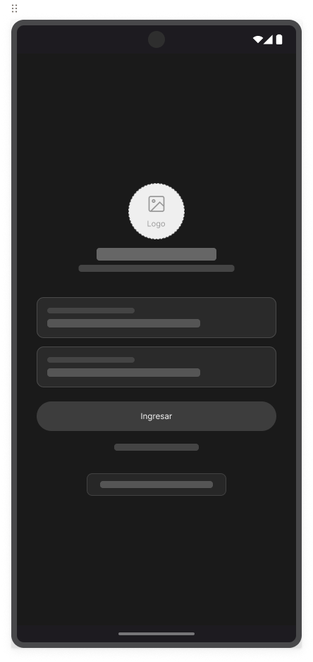

##### Dashboard

Panel principal que muestra una vista general del estado de las plantaciones, con indicadores clave como resumen de las parcelas de su propiedad, alertas activas, condiciones actuales del cultivo y accesos rápidos a las funcionalidades principales.

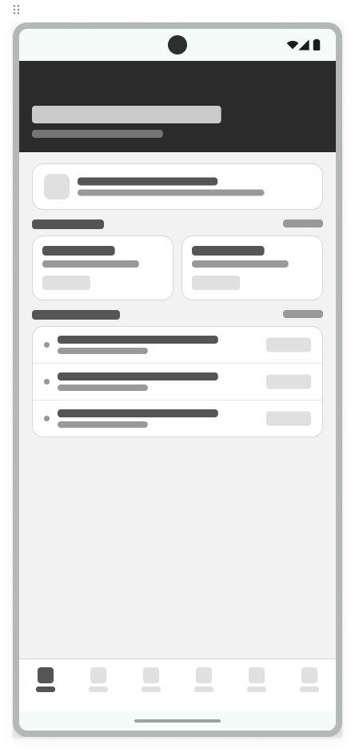

##### Plantations

Pantalla de visualización de las plantaciones registradas por el usuario, mostrando información de cada predio, sus zonas de monitoreo y el estado fitosanitario actual. Permite acceder al detalle de cada plantación para consultar su historial y recomendaciones específicas.

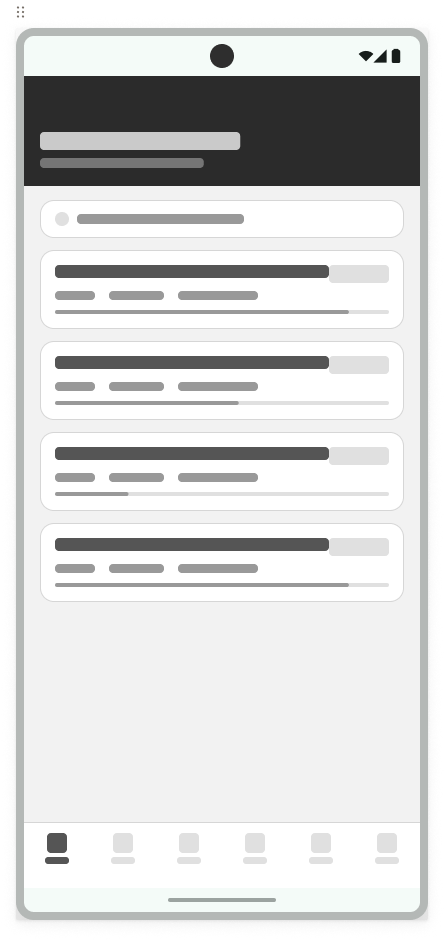

---

##### Plantation Details

Pantalla de detalle de una plantación específica, mostrando información del estado actual del cultivo. Permite al usuario consultar la trazabilidad completa de cada registro asociado a la plantación.

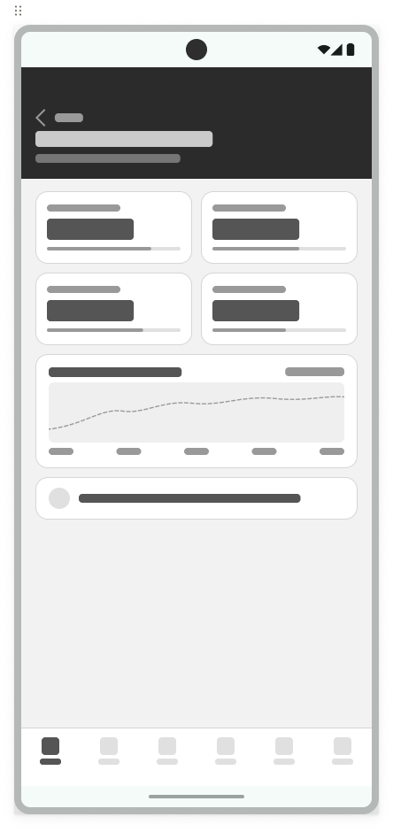

##### Warnings

Pantalla de alertas activas por plantación, con nivel de severidad, fecha de detección y estado de atención. Permite al usuario consultar el detalle de cada alerta y las recomendaciones asociadas para su atención.

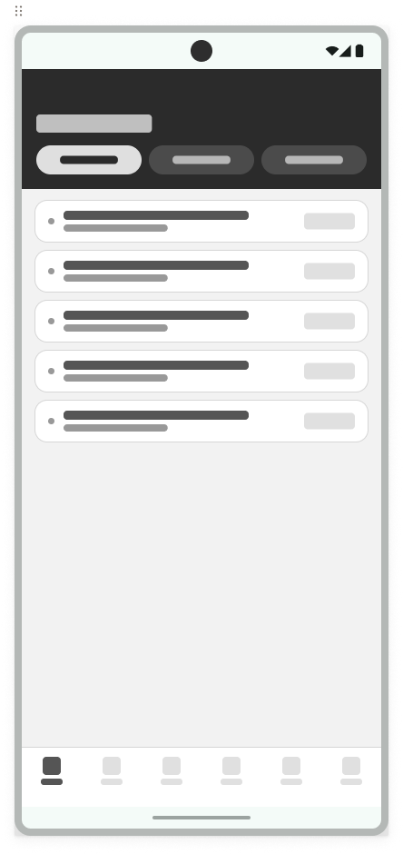

---

##### IoT Sensors

Pantalla de gestión de dispositivos IoT instalados en campo y el estado de la conexión que presentan vinculados a cada plantación para el monitoreo continuo del cultivo.

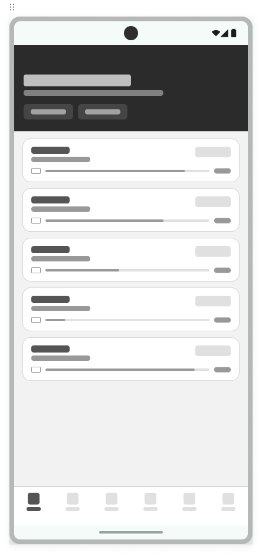

---

##### Reports

Pantalla de generación y visualización de informes relacionados con el rendimiento de las plantaciones, alertas y actividades agronómicas. Permite al usuario exportar los reportes en diferentes formatos para su análisis y toma de decisiones.

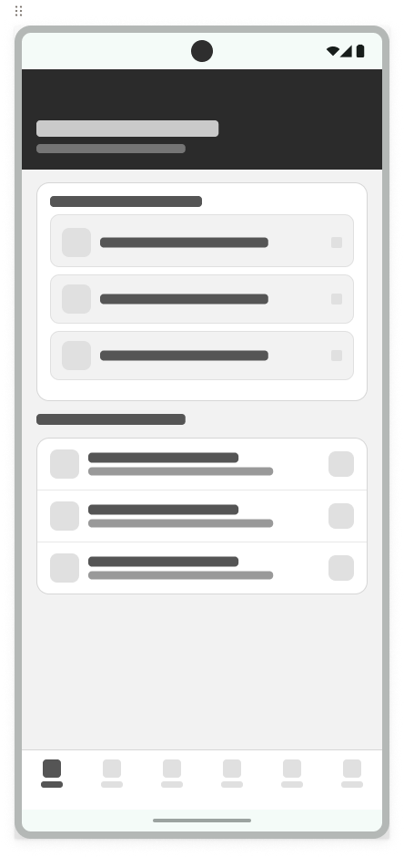

---

##### Profile

Pantalla de perfil del usuario, donde puede gestionar su información personal, preferencias y configuraciones.

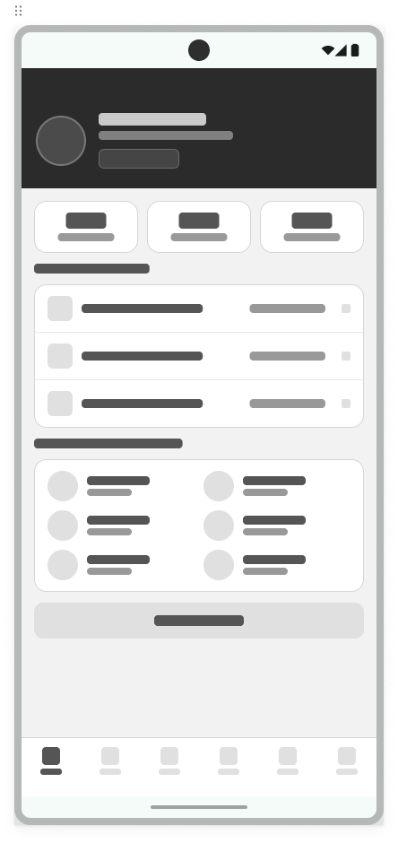

---

### 5.4.2. Applications Wireflow Diagrams

#### Web Application

##### Register

Flujo de registro de nuevo usuario: ingreso de datos personales → validación de correo → selección de tipo de cuenta (ingeniero agrónomo o dueño de cultivo) → confirmación → redirección al dashboard principal.

##### Login

Flujo de autenticación: ingreso de credenciales → validación contra el sistema → redirección al dashboard con vista personalizada según el rol del usuario (ingeniero agrónomo o dueño de cultivo).

##### Schedule

Flujo de planificación de visita de campo: selección de plantación → elección de fecha en el calendario → definición de objetivos de la visita → confirmación y registro de la visita programada.

##### History

Flujo de consulta de historial: selección de plantación → aplicación de filtros por zona y rango de fechas → visualización del listado de inspecciones e intervenciones → acceso al detalle de cada registro con trazabilidad completa.

---

##### Settings

Flujo de configuración de cuenta: navegación a la sección de ajustes → modificación de preferencias de notificación y parámetros de la aplicación → guardado de cambios → confirmación visual de la actualización.

##### Support

Flujo de soporte al usuario: acceso a la sección de ayuda → consulta de documentación frecuente o envío de ticket de incidencia → confirmación de recepción y seguimiento del caso.

---

### Mobile Application

##### Login exitoso

Flujo de autenticación: ingreso de credenciales → redirección al dashboard con vista deldueño de cultivo.

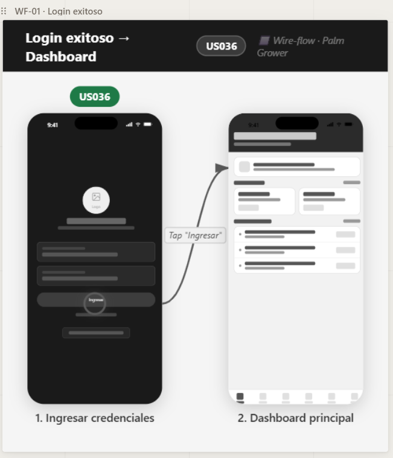

##### Monitoreo Cultivo

Flujo de monitoreo: acceso al dashboard → lista parcelas → visualización del estado actual del cultivo.

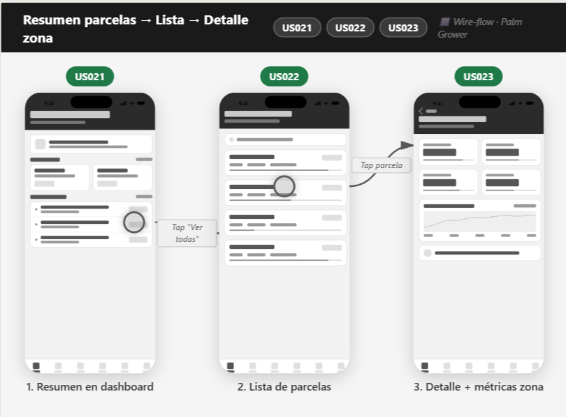

#### Visualización Alertas

Flujo de consulta de alertas: acceso al dashboard → alerta critica → visualización de alertas activas.

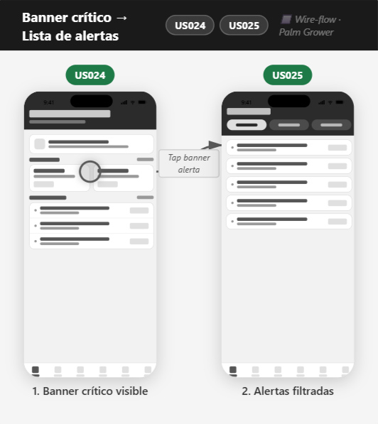

#### Recomendaciones Agronómicas

Flujo de consulta de recomendaciones: acceso al dashboard → selección de cultivo → visualización de recomendaciones asociadas al cultivo.

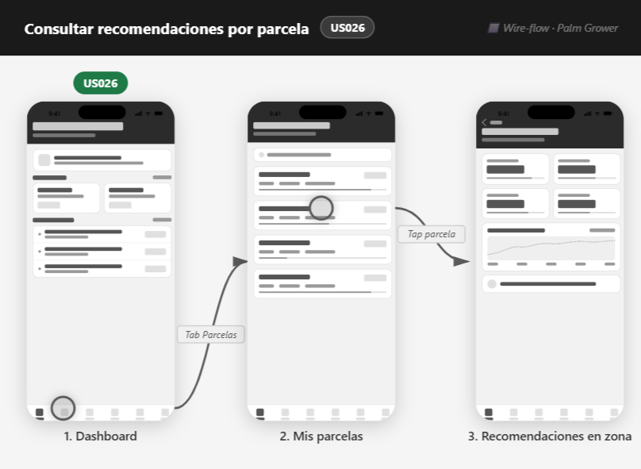

### 5.4.3. Applications Mock-ups

#### Web Application

##### Login

Mockup del inicio de sesión, donde el usuario ingresa sus credenciales para acceder al panel principal según su rol (ingeniero agrónomo o dueño de cultivo).

##### Dashboard

Panel principal con indicadores clave: alertas activas, visitas programadas, estado de plantaciones y accesos rápidos a las funcionalidades del sistema.

---

##### Plantaciones

Vista de gestión de plantaciones registradas, mostrando información de cada predio, sus zonas de monitoreo y el estado fitosanitario actual.

##### Alertas

Listado de alertas activas por plantación, con nivel de severidad, fecha de detección y estado de atención, vinculadas al bounded context de Alert & Notification.

---

##### Dispositivos

Gestión de dispositivos IoT instalados en campo: sensores de humedad, temperatura y estaciones meteorológicas vinculadas a cada plantación para el monitoreo continuo del cultivo.

##### Recomendaciones

Recomendaciones agronómicas generadas por el sistema para cada plantación, con trazabilidad hacia las alertas que las originaron y las intervenciones ejecutadas.

---

##### Reportes

Reportes y estadísticas del cultivo: evolución de condiciones, frecuencia de alertas por plantación, historial de intervenciones y tendencias en el tiempo.

##### Suscripción

Gestión del plan de suscripción del usuario: estado del plan contratado, fecha de renovación y acceso a funcionalidades según el nivel de suscripción activa.

---

#### Mobile Application

##### Login

Mockup del inicio de sesión, donde el usuario ingresa sus credenciales para acceder al panel principal según su rol (ingeniero agrónomo o dueño de cultivo).

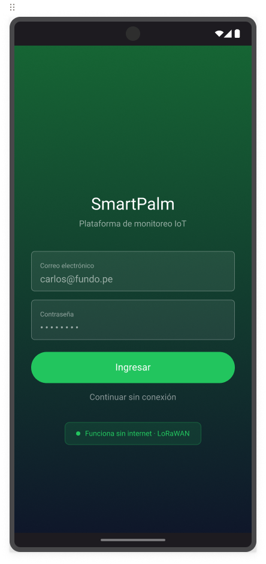

##### Dashboard

Panel principal con indicadores clave: resumen de las parcelas de su propiedad, alertas activas, condiciones actuales del cultivo y accesos rápidos a las funcionalidades principales.

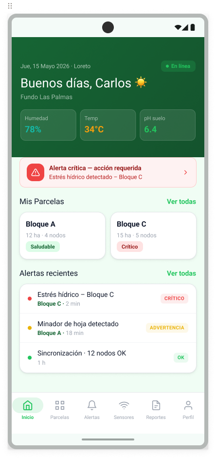

##### Plantations

Vista de gestión de plantaciones registradas, mostrando información de cada predio, sus zonas de monitoreo y el estado fitosanitario actual. Permite acceder al detalle de cada plantación para consultar su historial y recomendaciones específicas.

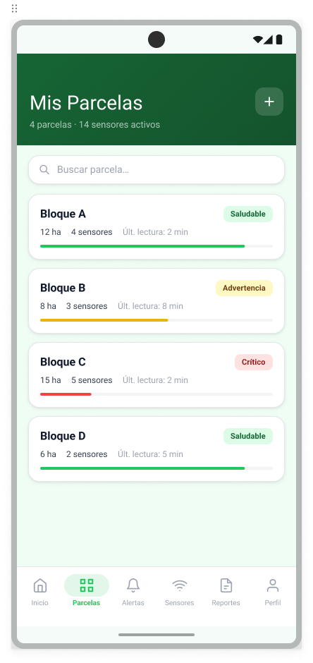

---

##### Plantation Details

Pantalla de detalle de una plantación específica, mostrando información del estado actual del cultivo. Permite al usuario consultar la trazabilidad completa de cada registro asociado a la plantación.

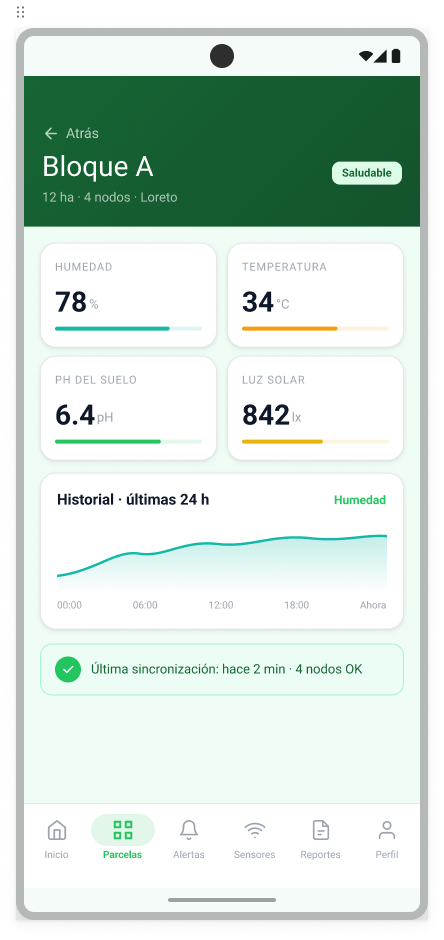

##### Warnings

Pantalla de alertas activas por plantación, con nivel de severidad, fecha de detección y estado de atención. Permite al usuario consultar el detalle de cada alerta y las recomendaciones asociadas para su atención.

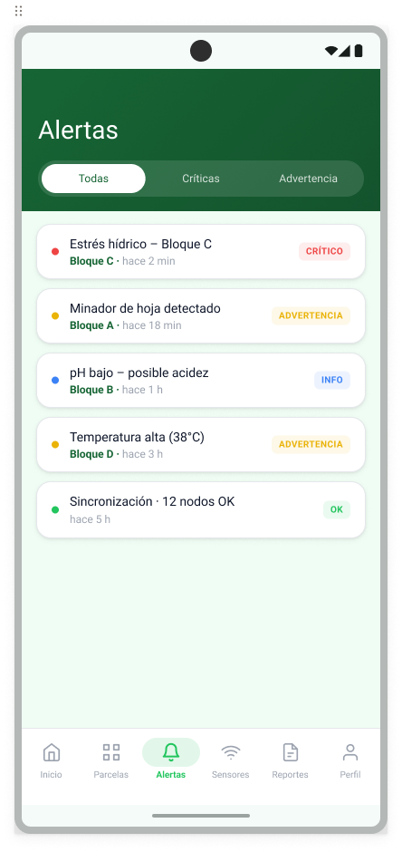

---

##### IoT Sensors

Pantalla de gestión de dispositivos IoT instalados en campo y el estado de la conexión que presentan vinculados a cada plantación para el monitoreo continuo del cultivo.

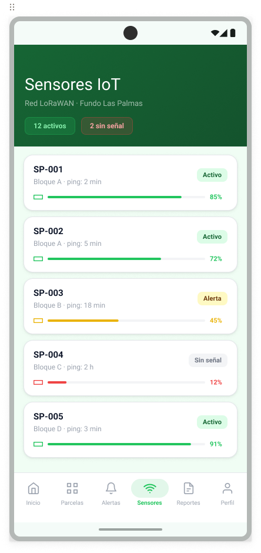

---

##### Reports

Pantalla de generación y visualización de informes relacionados con el rendimiento de las plantaciones, alertas y actividades agronómicas. Permite al usuario exportar los reportes en diferentes formatos para su análisis y toma de decisiones.

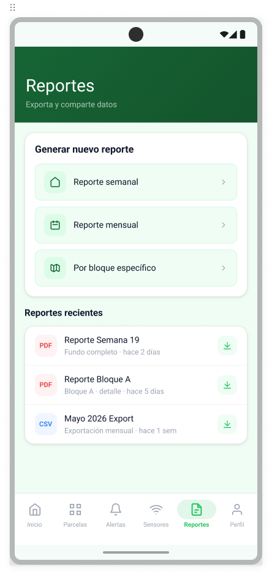

---

##### Profile

Pantalla de perfil del usuario, donde puede gestionar su información personal, preferencias y configuraciones.

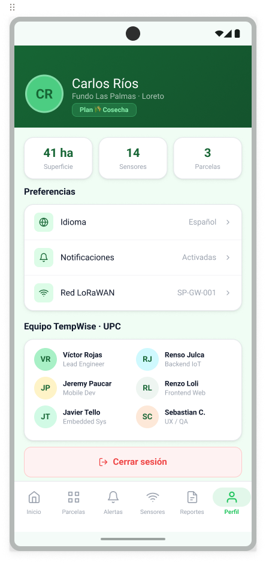

---

### 5.4.4. Applications User Flow Diagrams

#### Mobile Application

##### Login exitoso

Flujo de autenticación: ingreso de credenciales → redirección al dashboard con vista del dueño de cultivo.

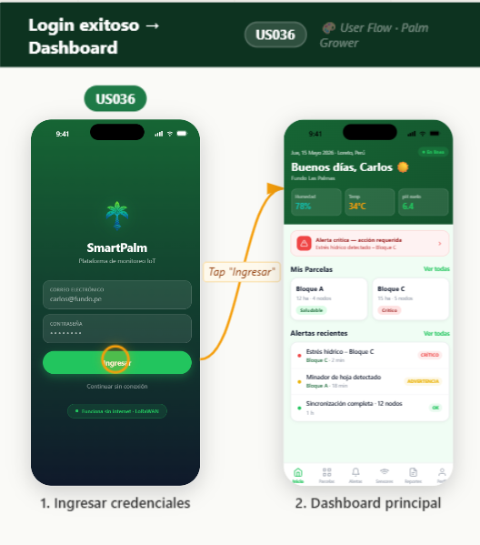

##### Visualización Detalles del Cultivo

Flujo de monitoreo: acceso al dashboard → lista parcelas → visualización del estado actual del cultivo.

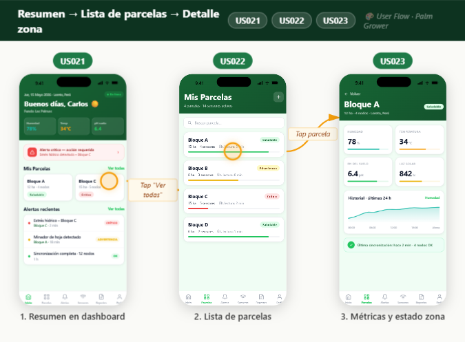

##### Monitoreo de sensores IoT

Flujo de monitoreo de sensores: acceso al dashboard → selección de plantación → visualización del estado de los dispositivos IoT vinculados.

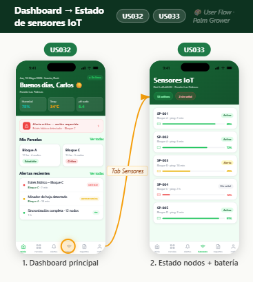

