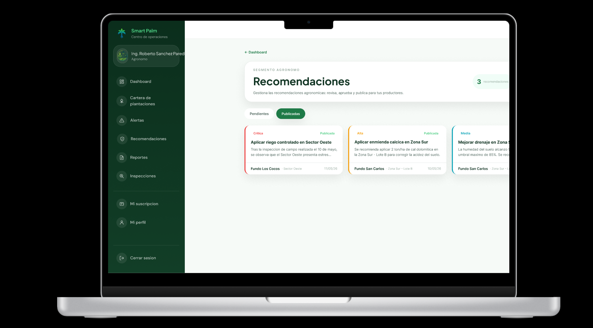
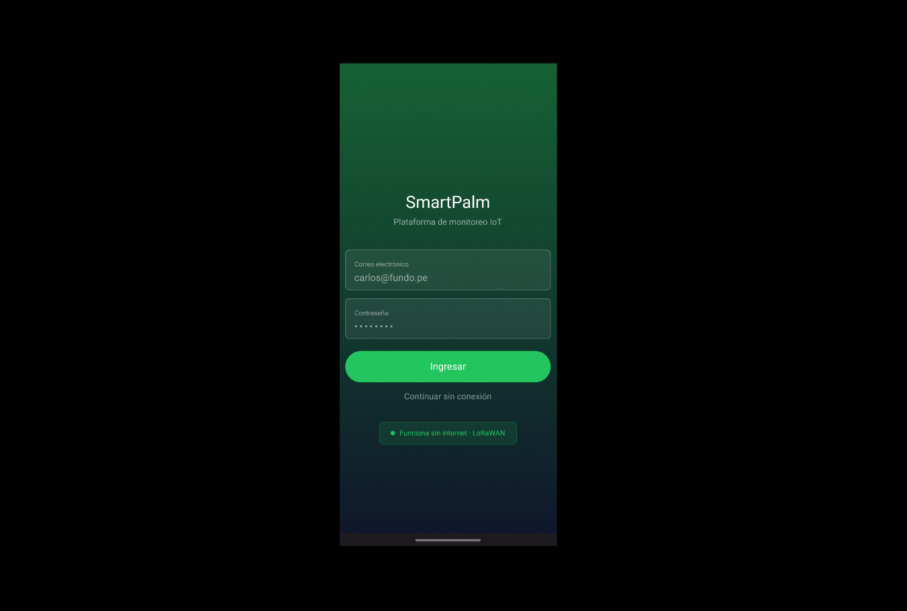

### 5.5. Applications Prototyping

#### Web Application

A continuación, se presenta el prototipo interactivo de la aplicación web SmartPalm, donde se evidencia el flujo de usuario completo: autenticación, panel de control, gestión de plantaciones, consulta de alertas y generación de reportes.

- **Prototipo (Figma):** [Web App - SmartPalm](https://www.figma.com/proto/bFDv7p60jPElSFuoSRZF1H/WebApp?node-id=2072-1742&p=f&t=c8TbbdnJ2ZNXnFD4-1&scaling=scale-down&content-scaling=fixed&page-id=0%3A1&starting-point-node-id=2072%3A75)

- **Video demostrativo (SharePoint):** [Web App - Recorrido completo](https://upcedupe-my.sharepoint.com/:v:/g/personal/u201719449_upc_edu_pe/IQDRFTcIoRRKSIPuibljwKbuATifjeCvBUGp_ySdt9_s_Kg?nav=eyJyZWZlcnJhbEluZm8iOnsicmVmZXJyYWxBcHAiOiJPbmVEcml2ZUZvckJ1c2luZXNzIiwicmVmZXJyYWxBcHBQbGF0Zm9ybSI6IldlYiIsInJlZmVycmFsTW9kZSI6InZpZXciLCJyZWZlcnJhbFZpZXciOiJNeUZpbGVzTGlua0NvcHkifX0&e=r0SlD2)

---

#### Mobile Application

A continuación, se presenta el prototipo interactivo de la aplicación móvil SmartPalm, mostrando el flujo de trabajo del ingeniero agrónomo en campo: registro de inspecciones offline, vinculación con alertas y consulta de recomendaciones.

- **Prototipo (Figma):** [Mobile App - SmartPalm](https://www.figma.com/proto/bFDv7p60jPElSFuoSRZF1H/WebApp?node-id=2130-1315&t=xzRfPwco60kkRz7v-1&scaling=scale-down&content-scaling=fixed&page-id=1%3A2)

- **Video demostrativo (SharePoint):** [Mobile App - Flujo en campo](https://upcedupe-my.sharepoint.com/:v:/g/personal/u202123655_upc_edu_pe/IQBfFDjXYvXKTp_ACx7jbW9vAZsRtsfsN1FCyODVzu_AbgU?nav=eyJyZWZlcnJhbEluZm8iOnsicmVmZXJyYWxBcHAiOiJPbmVEcml2ZUZvckJ1c2luZXNzIiwicmVmZXJyYWxBcHBQbGF0Zm9ybSI6IldlYiIsInJlZmVycmFsTW9kZSI6InZpZXciLCJyZWZlcnJhbFZpZXciOiJNeUZpbGVzTGlua0NvcHkifX0&e=AFnE0X)