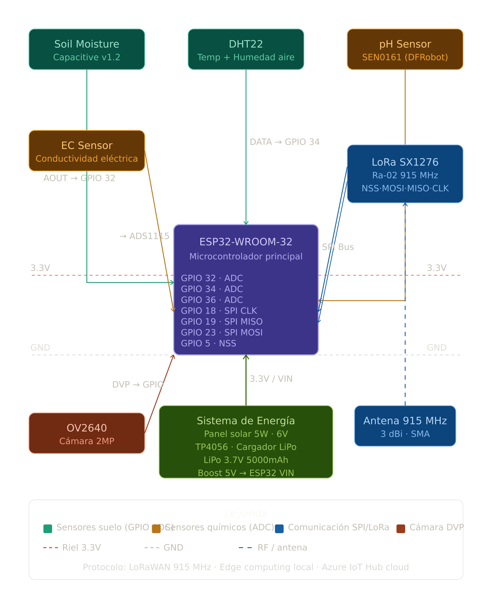
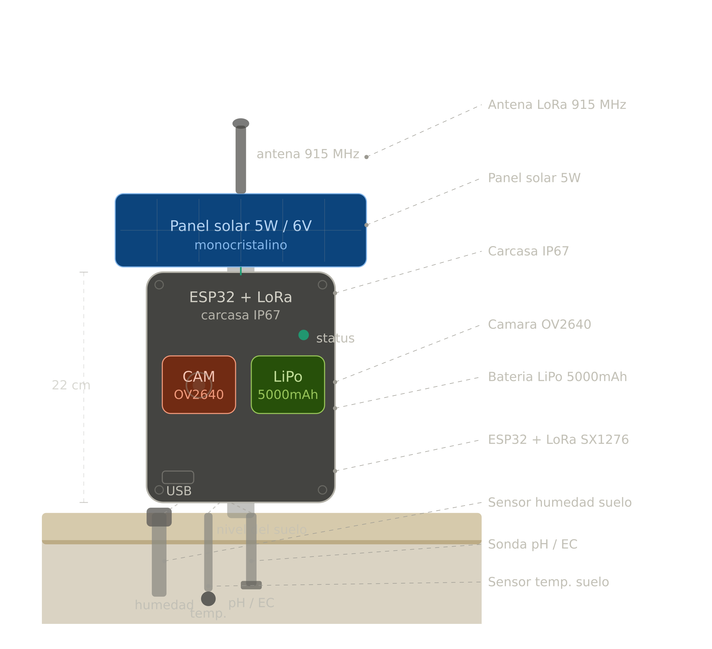

# 5.6 Device Design

## Introducción

###### En esta sección presentamos el diseño e implementación del dispositivo IoT desarrollado en Wokwi para SmartPalm.
---

## Circuit Design



### Componentes del sistema

| Componente | Modelo | Función | Interfaz |
|---|---|---|---|
| Microcontrolador | ESP32-WROOM-32 | Unidad central de procesamiento | — |
| Sensor temp/humedad aire | DHT22 | Temperatura y humedad ambiental | GPIO 34 (ADC) |
| Sensor temperatura suelo | DS18B20 | Temperatura del suelo | GPIO 33 (1-Wire) |
| Sensor humedad suelo | Capacitive v1.2 | Humedad volumétrica del suelo | GPIO 32 (ADC) |
| Sensor pH | SEN0161 (DFRobot) | pH del suelo | GPIO 35 (ADC) |
| Sensor EC | Analógico genérico | Conductividad eléctrica del suelo | GPIO 36 (ADC) |
| Módulo LoRa | SX1276 / Ra-02 915 MHz | Comunicación LoRaWAN | SPI (GPIO 18/19/23/5/14) |
| Display | LCD 1602 I2C | Visualización local de lecturas | I2C (GPIO 21/22) |
| Sistema de energía | Panel solar 5W + TP4056 + LiPo 5000mAh | Alimentación autónoma | VIN / 3.3V |

### Diagrama de circuito (Wokwi)

El esquemático fue implementado en Wokwi usando el ESP32 DevKit V1 como microcontrolador central. Los sensores analógicos (humedad de suelo, pH y EC) se conectan a los canales ADC de 12 bits del ESP32. El DHT22 usa un pin digital con resistencia pull-up de 10kΩ a 3.3V. El módulo LoRa SX1276 se comunica mediante el bus SPI completo. El LCD 1602 usa comunicación I2C con dirección 0x27.


###  Tabla de pin mapping

| Pin ESP32 | Función | Componente |
|---|---|---|
| GPIO 34 | ADC / Digital | DHT22 (data) |
| GPIO 32 | ADC | Soil Moisture (AOUT) |
| GPIO 33 | 1-Wire | DS18B20 (DQ) |
| GPIO 35 | ADC | pH Sensor (AOUT) |
| GPIO 36 | ADC | EC Sensor (AOUT) |
| GPIO 18 | SPI SCK | LoRa SX1276 |
| GPIO 19 | SPI MISO | LoRa SX1276 |
| GPIO 23 | SPI MOSI | LoRa SX1276 |
| GPIO 5 | SPI NSS/CS | LoRa SX1276 |
| GPIO 14 | RST | LoRa SX1276 |
| GPIO 2 | DIO0 | LoRa SX1276 |
| GPIO 21 | I2C SDA | LCD 1602 |
| GPIO 22 | I2C SCL | LCD 1602 |
| 3.3V | VCC | DHT22, Soil, pH, EC, LoRa |
| VIN (5V) | VCC | LCD, Boost converter |
| GND | GND | Todos los componentes |

###  Descripción del circuit design

El circuit design del SmartPalm Edge Node organiza los componentes en capas funcionales alrededor del ESP32 como unidad central. En la capa superior se encuentran los tres sensores de campo (DHT22, sensor de humedad de suelo y pH) que envían señales analógicas a los canales ADC del ESP32, el cual las convierte a valores digitales de 12 bits. En la capa izquierda se ubica el sensor EC, también analógico, separado por operar en una sonda independiente enterrada en el suelo. En la capa derecha se encuentra el módulo LoRa SX1276, conectado mediante el bus SPI de cuatro hilos (SCK, MISO, MOSI, NSS), que constituye la radio responsable de transmitir los datos a kilómetros de distancia hasta el gateway sin requerir infraestructura de internet. En la capa inferior se encuentra el sistema de energía compuesto por el panel solar, el módulo cargador TP4056 y la batería LiPo, que otorgan al dispositivo autonomía completa en campo remoto. Los rieles de alimentación de 3.3V y GND recorren el diagrama en color rojo y negro respectivamente, mientras que los cables de señal de cada sensor se diferencian por color. El flujo del sistema es: los sensores capturan los parámetros del cultivo, el ESP32 los procesa localmente aplicando lógica de edge computing, y el módulo LoRa transmite el resultado al gateway, todo alimentado de forma autónoma por energía solar.

---

##  Physical Device Design

###  Descripción física

El dispositivo físico SmartPalm consiste en una carcasa de ABS con protección IP67 (resistente a polvo e inmersión hasta 1 metro), montada sobre un poste de aluminio de 1.5 metros de altura. Esta protección es crítica para operar en las condiciones de alta pluviosidad de la Amazonia peruana (hasta 3500mm/año de precipitaciones).

**Dimensiones de la carcasa:** 22cm × 15cm × 10cm



###  Componentes físicos y su ubicación

| Componente | Ubicación física |
|---|---|
| Panel solar 5W monocristalino | Panel superior, inclinación 15° hacia el norte |
| Antena LoRa 3dBi / SMA 915 MHz | Parte superior de la carcasa, exterior |
| Carcasa IP67 (ESP32 + LoRa + LiPo) | Cuerpo principal, sellada herméticamente |
| Cámara OV2640 2MP | Frente de la carcasa, protegida con vidrio |
| LED de estado | Frente de la carcasa |
| Puerto USB de configuración | Base de la carcasa, con tapa sellada |
| Sensor humedad suelo (capacitivo) | Sonda subterránea a 20cm de profundidad |
| Sensor temperatura suelo DS18B20 | Sonda subterránea a 15cm de profundidad |
| Sonda pH / EC | Sonda subterránea a 25cm de profundidad |

Las sondas subterráneas salen de la base de la carcasa mediante prensaestopas sellados, garantizando la estanqueidad del sistema. Los cables de los sensores van protegidos por manguera corrugada UV-resistente.

###  Diagrama físico


---

##  Implementación del Firmware (Wokwi)

###  Descripción de la simulación

En esta sección presentamos el diseño e implementación del dispositivo IoT desarrollado en Wokwi para SmartPalm. El sistema integra cinco sensores principales: un sensor de temperatura y humedad ambiental DHT22, un sensor de temperatura de suelo DS18B20, un sensor capacitivo de humedad de suelo, y dos sensores analógicos para medición de pH y conductividad eléctrica (EC) del suelo. Los datos son visualizados en tiempo real a través de una pantalla LCD 16x2 con interfaz I2C, la cual rota automáticamente entre cuatro vistas: temperatura y humedad del aire, temperatura y humedad del suelo, pH y EC, y estado general de alertas.

El sistema cuenta con un módulo de edge computing que evalúa cada lectura contra los umbrales agronómicos definidos por el INIA para la región Ucayali: humedad de suelo menor a 30% activa alerta de sequía, pH fuera del rango 4.5–6.5 indica condición ácida o alcalina crítica, y temperatura del aire superior a 35°C señala estrés térmico en el cultivo. Ante cualquier condición crítica, el LCD muestra el mensaje de alerta y el payload de transmisión incluye el flag correspondiente.

La comunicación LoRaWAN es simulada mediante el Serial Monitor, donde cada 15 segundos se genera un payload JSON comprimido con todas las lecturas del ciclo activo, el número de ciclo, el flag de alerta y la confirmación de envío al gateway con su respectivo ACK hacia Azure IoT Hub. La simulación fue desarrollada en Wokwi con un ESP32 DevKit V1, permitiendo validar el comportamiento completo del firmware — lectura de sensores, procesamiento edge y transmisión — antes de pasar a la implementación física del dispositivo en campo.

###  Librerías utilizadas

| Librería | Versión | Uso |
|---|---|---|
| DHT sensor library (Adafruit) | latest | Lectura DHT22 |
| Adafruit Unified Sensor | latest | Dependencia Adafruit |
| LiquidCrystal I2C (Frank de Brabander) | 1.1.2 | Display LCD I2C |
| OneWire | latest | Bus 1-Wire DS18B20 |
| DallasTemperature | latest | Lectura DS18B20 |

###  Estructura del payload LoRaWAN

```json
{
  "c": 1,
  "ta": 28.4,
  "ha": 72.1,
  "ts": 27.1,
  "hs": 65.3,
  "ph": 5.82,
  "ec": 412,
  "al": 0
}
```

| Campo | Descripción | Unidad |
|---|---|---|
| `c` | Número de ciclo | — |
| `ta` | Temperatura del aire | °C |
| `ha` | Humedad del aire | % |
| `ts` | Temperatura del suelo | °C |
| `hs` | Humedad del suelo | % |
| `ph` | pH del suelo | 0–14 |
| `ec` | Conductividad eléctrica | µS/cm |
| `al` | Flag de alerta (0=OK, 1=alerta) | — |


---

## Los 12 Steps del Device Design

**Step 1 — Definición del problema del dispositivo**  
El Edge Node de SmartPalm debe monitorear en tiempo real parámetros críticos del cultivo de palma aceitera en zonas remotas de la Amazonia peruana, donde no existe conectividad a internet, las condiciones ambientales son extremas (humedad >85%, temperatura 24–32°C, lluvias de hasta 3500mm/año) y el acceso técnico es infrecuente. El dispositivo debe operar de forma completamente autónoma.

**Step 2 — Selección del microcontrolador**  
Se seleccionó el ESP32-WROOM-32 como unidad de procesamiento principal. Justificación: procesador dual-core Xtensa LX6 a 240MHz, ADC de 12 bits con múltiples canales analógicos, bajo consumo energético con soporte para deep sleep (<10µA), Wi-Fi y Bluetooth integrados para configuración inicial, y compatibilidad nativa con el bus SPI para el módulo LoRa. Su costo (~$4 USD) y disponibilidad en el mercado peruano lo hacen viable para producción.

**Step 3 — Selección de sensores**  
Los sensores fueron seleccionados según los parámetros agronómicos críticos definidos por el INIA para la región Ucayali: DHT22 para temperatura ambiente (−40 a 80°C, ±0.5°C) y humedad relativa del aire (0–100%, ±2–5%); DS18B20 para temperatura del suelo con interfaz 1-Wire y resolución de 12 bits; sensor capacitivo de humedad de suelo v1.2 con salida analógica resistente a corrosión; SEN0161 (DFRobot) para pH del suelo en rango 0–14; sensor EC analógico para conductividad eléctrica del suelo en µS/cm; y OV2640 módulo de cámara 2MP para captura visual del estado fitosanitario.

**Step 4 — Selección del protocolo de comunicación**  
Se adoptó LoRaWAN 915 MHz (banda ISM libre en Perú) sobre alternativas como 2G/3G, WiFi o Zigbee. Ventajas determinantes: alcance de 2–15 km en terreno abierto, consumo de transmisión de apenas 30–50mA, operación sin infraestructura de internet, y capacidad de penetración en vegetación densa. El módulo Ra-02 (SX1276) se integra vía SPI al ESP32.

**Step 5 — Diseño del sistema de energía**  
El sistema de energía consta de un panel solar monocristalino de 5W/6V, un módulo cargador TP4056 con protección de sobrecarga/descarga, una batería LiPo de 3.7V/5000mAh y un convertidor boost MT3608 que eleva a 5V para alimentar el ESP32. La autonomía estimada es de 3–5 días sin luz solar (modo de bajo consumo con deep sleep cada 15 minutos), garantizando operación continua en períodos de alta pluviosidad amazónica.

**Step 6 — Circuit Design**  
Se diseñó el esquemático completo del Edge Node en Wokwi, incluyendo todas las conexiones GPIO, el bus SPI para LoRa, el bus I2C para el display LCD de diagnóstico, los rieles de alimentación 3.3V/5V y las resistencias de pull-up necesarias para el DHT22 (10kΩ) y el DS18B20. Ver sección 2 y archivo `diagram.json`.

**Step 7 — Pin Mapping e interfaz de pines**  
Ver tabla completa de pin mapping en la sección 2.3.

**Step 8 — Physical Device Design**  
El dispositivo físico consiste en una carcasa de ABS con protección IP67, montada sobre un poste de aluminio de 1.5m de altura. El panel solar se instala en el panel superior con inclinación de 15° hacia el norte. La antena LoRa de 3dBi con conector SMA se ubica en la parte superior de la carcasa. Las sondas de suelo salen selladas por la base mediante prensaestopas, penetrando el suelo hasta 30cm. Dimensiones de la carcasa: 22cm × 15cm × 10cm. Ver sección 3.

**Step 9 — Arquitectura del firmware**  
El firmware sigue un ciclo de operación: (1) wake-up del deep sleep → (2) inicialización de sensores → (3) lectura de todos los parámetros → (4) procesamiento edge local (validación de rangos, detección de anomalías) → (5) empaquetado del payload JSON → (6) transmisión LoRaWAN → (7) confirmación ACK o almacenamiento en buffer local → (8) vuelta a deep sleep por 15 minutos. El ciclo completo consume menos de 30 segundos activos.

**Step 10 — Lógica de Edge Computing**  
El ESP32 procesa localmente los datos antes de transmitir, aplicando los umbrales agronómicos del INIA: humedad suelo <30% → alerta sequía, pH <4.5 o >6.5 → alerta acidez/alcalinidad, temperatura >35°C → alerta estrés térmico. Solo se transmiten alertas y resúmenes estadísticos, reduciendo el payload de ~500B a ~120B por transmisión. En modo offline, los datos se almacenan en la flash del ESP32 (hasta 72h de buffer) y se sincronizan al recuperar conectividad.

**Step 11 — Diseño de transmisión de datos**  
El payload LoRa se estructura como JSON comprimido (ver sección 4.3). La frecuencia de transmisión es cada 15 minutos en modo normal y cada 5 minutos ante alertas activas. Se usa LoRaWAN Class A con ventanas de recepción para confirmación ACK. El gateway LoRa (Raspberry Pi + RAK2245) reenvía los datos a Azure IoT Hub via MQTT.

**Step 12 — Plan de pruebas y validación**  
Las pruebas se estructuran en tres fases: (1) pruebas de banco — verificación de lecturas de cada sensor contra instrumentos calibrados, pruebas de consumo energético con multímetro; (2) pruebas de integración — verificación del ciclo completo del firmware, alcance LoRa en entorno simulado, autonomía de batería en ciclo continuo de 72h; (3) pruebas de campo en Ucayali — validación de lecturas contra parámetros INIA, prueba de resistencia a lluvia intensa, medición de alcance LoRa real en vegetación amazónica, verificación de autonomía solar en período nublado. Criterio de aceptación: tasa de entrega de paquetes superior al 90% durante 30 días consecutivos.


---

##  Conclusiones

El diseño del Edge Node SmartPalm integra de forma coherente la selección de hardware, el diseño del circuito, la arquitectura del firmware y el diseño físico para responder a las condiciones específicas de los cultivos de palma aceitera en la Amazonia peruana. La elección del ESP32 con LoRaWAN permite operar de forma autónoma en zonas sin conectividad, mientras que el sistema de energía solar garantiza operación continua sin intervención técnica. La simulación en Wokwi valida el comportamiento del firmware y la lógica de edge computing antes de la implementación física, reduciendo el riesgo técnico del prototipo.
