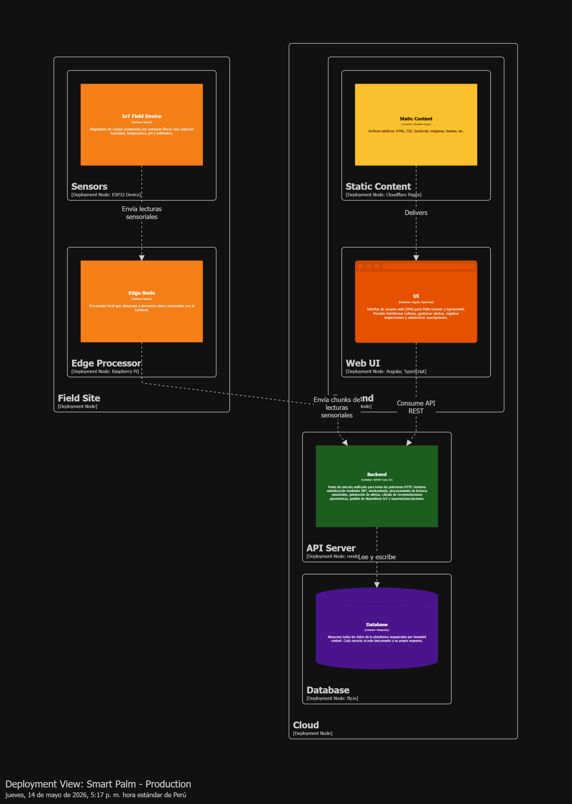

# Capítulo VI: Product Implementation, Validation & Deployment

## 6.1. Software Configuration Management

Este capítulo documenta la configuración técnica, las herramientas, las convenciones y el proceso de despliegue adoptado por el equipo TempWise para el desarrollo de SmartPalm. El objetivo es establecer un marco ordenado y trazable que sustente la implementación del producto digital y del dispositivo IoT en condiciones reales de la Amazonia peruana.

---

### 6.1.1. Software Development Environment Configuration

El equipo TempWise utilizó un conjunto de herramientas seleccionadas en función de la naturaleza del proyecto: una plataforma SaaS de monitoreo agrícola con componentes web, móvil, backend RESTful y firmware IoT embebido. La siguiente tabla consolida las herramientas, su propósito y los enlaces de acceso.

| Herramienta | Uso en el proyecto | Enlace de acceso |
| :--- | :--- | :--- |
| **GitHub** | Control de versiones, repositorios de código y colaboración del equipo | [github.com/TempWise-DesarrolloIoT-202610](https://github.com/TempWise-DesarrolloIoT-202610) |
| **Netlify** | Despliegue continuo del Landing Page | [lading-page-smartpalm.netlify.app](https://lading-page-smartpalm.netlify.app) |
| **Cloudflare Pages** | Despliegue continuo de la Web Application | [webapp-9sf.pages.dev](https://webapp-9sf.pages.dev) |
| **Render** | Despliegue de la Mock API RESTful | [smartpalm-mock-api.onrender.com](https://smartpalm-mock-api.onrender.com) |
| **Miro** | Modelado colaborativo (Big Picture EventStorming y Design-Level EventStorming) | [Tablero Big Picture](https://miro.com/app/board/uXjVK2R7nV4=/?share_link_id=837305751989) / [Tablero Design-Level](https://miro.com/app/board/uXjVHdJ_3Wo=/?share_link_id=547546845690) |
| **UXPressia** | Creación de User Personas, User Journey Maps y Empathy Maps | *(Enlace pendiente)* |
| **Figma** | Diseño de interfaces, wireframes, mock-ups y wireflows | *(Enlace pendiente)* |
| **Visual Studio / VS Code** | Entorno de desarrollo integrado para frontend, backend y firmware | *(Enlace pendiente)* |
| **Angular** | Framework de desarrollo de la Web Application | [angular.io](https://angular.io) |
| **ASP.NET Core** | Framework del backend RESTful y del Edge API | [dotnet.microsoft.com](https://dotnet.microsoft.com) |
| **Flutter** | Framework de desarrollo de la Mobile Application | [flutter.dev](https://flutter.dev) |
| **Arduino IDE / PlatformIO** | Desarrollo del firmware embebido para ESP32 | [arduino.cc](https://www.arduino.cc) |
| **Postman / Swagger UI** | Pruebas manuales y documentación automática de endpoints de la API | *(Enlace pendiente)* |
| **PlantUML** | Elaboración de diagramas de clases del Domain Layer (tactical DDD) | [plantuml.com](https://plantuml.com) |
| **Wokwi** | Simulación de circuito del dispositivo IoT antes del despliegue físico | [wokwi.com](https://wokwi.com) |

---

### 6.1.2. Source Code Management

El equipo utiliza Git como sistema de control de versiones y GitHub como plataforma de hosting remoto. La organización del código se estructura en repositorios separados para cada producto digital, siguiendo el principio de separación de responsabilidades.

#### Repositorios del proyecto

| Producto digital | Repositorio | Enlace |
| :--- | :--- | :--- |
| **Reporte del proyecto** | `upc-Desarrollo-IoT-Report` | [GitHub Repo](https://github.com/TempWise-DesarrolloIoT-202610/upc-Desarrollo-IoT-Report) |
| **Landing Page** | `smartpalm-landing-page` | *(Repositorio por crear)* |
| **Web Application** | `webapp-test` | [GitHub Repo](https://github.com/upc-202601-1asi0572-6779-teamwise/webapp-test) |
| **RESTful API / Backend** | `smartpalm-api` | *(Repositorio por crear)* |
| **Mobile Application** | `smartpalm-mobile-app` | *(Repositorio por crear)* |
| **Edge API** | `smartpalm-edge-api` | *(Repositorio por crear)* |
| **Embedded Application (IoT Firmware)** | `smartpalm-iot-firmware` | *(Repositorio por crear)* |

#### Estrategia de ramas: GitFlow

El equipo adopta el modelo GitFlow para gestionar el ciclo de vida del código. La estructura de ramas es la siguiente:

| Rama | Propósito |
| :--- | :--- |
| `main` | Código estable en producción. Solo recibe merge desde `release/*` o `hotfix/*`. |
| `develop` | Rama de integración continua. Recibe los merge de las ramas `feature/*` y se sincroniza periódicamente. |
| `feature/<descripción>` | Rama para el desarrollo de una funcionalidad o capítulo del reporte. Se crea desde `develop` y se mergea mediante Pull Request. |
| `release/vX.Y.Z` | Rama de preparación para una versión estable. Se crea desde `develop` y se mergea a `main`. |
| `hotfix/<descripción>` | Rama para correcciones urgentes en producción. Se crea desde `main` y se mergea a `main` y `develop`. |

#### Convención de commits: Conventional Commits

Los mensajes de commit siguen el estándar Conventional Commits para mantener trazabilidad y generar changelogs automáticos.

| Prefijo | Uso | Ejemplo |
| :--- | :--- | :--- |
| `feat:` | Nueva funcionalidad | `feat: add login form for agronomist` |
| `fix:` | Corrección de error | `fix: correct sensor reading validation` |
| `docs:` | Documentación | `docs: update API documentation` |
| `test:` | Pruebas | `test: add unit tests for device service` |
| `refactor:` | Refactorización de código | `refactor: simplify threshold evaluation logic` |
| `style:` | Cambios de formato | `style: adjust indentation in dashboard component` |
| `chore:` | Tareas de mantenimiento | `chore: update dependencies` |

#### Versionado semántico

El proyecto utiliza Semantic Versioning (`vMAJOR.MINOR.PATCH`):

| Versión | Significado |
| :--- | :--- |
| `v1.0.0` | Primera versión estable con funcionalidades del Sprint 1 desplegadas. |
| `v1.1.0` | Nuevas funcionalidades (minor) agregadas en Sprint 2. |
| `v1.1.1` | Corrección de errores (patch) sobre la versión 1.1.0. |

---

### 6.1.3. Source Code Style Guide & Coding Conventions

El equipo TempWise acordó estándares de escritura de código para cada lenguaje involucrado en la solución, con el fin de garantizar legibilidad, mantenibilidad y consistencia entre los integrantes.

#### Lenguajes y guías de referencia

| Lenguaje / Framework | Guía de estilo de referencia |
| :--- | :--- |
| **TypeScript** (Angular) | Google TypeScript Style Guide, Angular Style Guide |
| **C#** (ASP.NET Core) | Microsoft C# Coding Conventions, Framework Design Guidelines |
| **Dart** (Flutter) | Effective Dart Style Guide |
| **C++** (Arduino / ESP32) | Google C++ Style Guide (adaptado a microcontroladores) |
| **HTML / CSS** | Google HTML/CSS Style Guide |
| **Gherkin** (BDD / Acceptance Tests) | Cucumber Gherkin Reference |

#### Convenciones de nomenclatura

| Elemento | Convención | Ejemplo |
| :--- | :--- | :--- |
| Clases / Interfaces | PascalCase | `SensorReading`, `AgronomicThreshold` |
| Métodos / Funciones | camelCase | `evaluateThreshold()`, `registerDevice()` |
| Variables locales | camelCase | `currentReading`, `alertLevel` |
| Constantes | UPPER_SNAKE_CASE | `MAX_OFFLINE_STORAGE_HOURS` |
| Archivos TypeScript / Dart | kebab-case | `sensor-reading.service.ts` |
| Archivos C# | PascalCase | `SensorReadingService.cs` |
| Nombres de ramas Git | kebab-case | `feature/add-login-form` |
| Commits | inglés, imperativo | `feat: add real-time alert dispatch` |

#### Reglas generales

- Todo el código fuente, comentarios técnicos y nombres de variables se redactan en **inglés**, salvo los textos visibles al usuario que se adaptan al idioma objetivo (español latinoamericano para el productor amazónico).
- Cada archivo fuente incluye un encabezado de copyright con el nombre del proyecto, el autor y la licencia.
- Se prohíbe el *hard-coding* de valores mágicos; deben declararse como constantes con nombres descriptivos.
- El código debe estar documentado con JSDoc (TypeScript), XML Documentation (C#) o DartDoc (Dart) para métodos públicos y clases del dominio.

---

### 6.1.4. Software Deployment Configuration

La estrategia de despliegue de SmartPalm se basa en una arquitectura cloud híbrida que integra servicios de hosting estático para el frontend, plataformas de backend as a service para la API, e infraestructura edge-fog para el dispositivo IoT.

#### Plataformas de despliegue por producto

| Producto digital | Plataforma | URL pública | Estado |
| :--- | :--- | :--- | :--- |
| **Landing Page** | Netlify | `https://lading-page-smartpalm.netlify.app` | Desplegado |
| **Web Application** | Cloudflare Pages | `https://webapp-9sf.pages.dev` | Desplegado (fase inicial) |
| **Mock API** | Render | `https://smartpalm-mock-api.onrender.com` | Desplegado |
| **Mobile Application** | Google Play / App Store | *(URL pendiente)* | Por desplegar |
| **Edge API** | Raspberry Pi (campo) + Render (nube) | *(URL interna pendiente)* | Por desplegar |
| **Embedded Application** | ESP32 (campo) | *(Conectividad LoRaWAN)* | Por desplegar |
| **Base de datos** | PostgreSQL (Render) / SQL Server (Azure) | *(URL interna pendiente)* | Por desplegar |

#### Diagrama de despliegue

El diagrama de despliegue de la arquitectura de SmartPalm fue elaborado en el Capítulo IV (Software Architecture) utilizando el modelo C4. A continuación se describe la configuración resumida:

- **Navegador del usuario** (Web App y Landing Page) se conecta a **Cloudflare Pages** (hosting estático).
- **Aplicación móvil** (Flutter) se conecta a la **API RESTful** desplegada en **Render**.
- **API RESTful** (ASP.NET Core) se conecta a la **base de datos** (PostgreSQL) y al **broker de mensajes** para sincronización con el Edge.
- **Edge Node** (Raspberry Pi en campo) ejecuta el Edge API y almacena datos localmente cuando no hay conectividad.
- **Dispositivo IoT** (ESP32) transmite lecturas sensoriales al Edge Node mediante **LoRaWAN**.

#### Variables de entorno

El sistema utiliza variables de entorno para separar configuraciones sensibles del código fuente. Las principales variables son:

| Variable | Descripción | Ejemplo |
| :--- | :--- | :--- |
| `DATABASE_CONNECTION_STRING` | Cadena de conexión a PostgreSQL | *(secreto)* |
| `JWT_SECRET_KEY` | Clave para firma de tokens JWT | *(secreto)* |
| `LORAWAN_APP_KEY` | Clave de aplicación para el módulo LoRa | *(secreto)* |
| `API_BASE_URL` | URL base de la API RESTful | `https://api.smartpalm.io` |
| `EDGE_API_BASE_URL` | URL base del Edge API en campo | `http://192.168.1.100:5000` |

---

## 6.2. Landing Page, Services & Applications Implementation

Esta sección documenta la evidencia de implementación del primer Sprint de desarrollo (Sprint 1), enfocado en la entrega funcional del Landing Page y la estructura inicial de la Web Application. El objetivo es validar la propuesta de valor ante los segmentos objetivo y habilitar la navegación básica del sistema.

---

### 6.2.1. Sprint 1

#### 6.2.1.1. Sprint Planning 1

| Campo | Detalle |
| :--- | :--- |
| **Sprint** | Sprint 1 |
| **Fecha** | 14-05-2026 |
| **Hora** | 19:30 |
| **Lugar / Medio** | Discord / Zoom / Presencial |
| **Prepared by** | Victor Manuel Rojas Reategui |
| **Attendees** | Victor Rojas, Renso Julca, Javier Tello, Jeremy Paucar, Renzo Loli, Sebastian Carbajal |
| **Sprint Goal** | *Our focus is on delivering the first functional version of the Landing Page and the initial Web Application navigation. We believe it delivers early product visibility to visitors and allows users to understand the main value proposal. This will be confirmed when users can access the deployed Landing Page and navigate to the main Web Application views.* |
| **Sprint Velocity** | 25 Story Points |
| **Sum of Story Points** | 25 |

#### 6.2.1.2. Aspect Leaders and Collaborators

La siguiente matriz define los roles de liderazgo (L) y colaboración (C) de cada integrante del equipo durante el Sprint 1.

| Integrante | GitHub Username | Landing Page | Web App | API | Testing | Deployment |
| :--- | :--- | :--- | :--- | :--- | :--- | :--- |
| Rojas Reategui, Victor Manuel | `VRojas1603` | C | C | C | L | C |
| Tello Murga, Javier Oswaldo | `JavierTello20` | C | C | L | C | C |
| Loli Ruiz, Renzo Javier | `0renzo0loli0` | C | L | C | L | C |
| Julca Cruz, Renso Anthony | `Renso Julca` | L | C | C | C | C |
| Carbajal Santivañez, Sebastian | `Sebastian Carbajal Santivañez` | C | C | C | C | C |
| Paucar Meneses, Jeremy Alión | `asmip_10` | C | L | C | C | C |

#### 6.2.1.3. Sprint Backlog 1

El Sprint Backlog 1 se construyó a partir del Product Backlog priorizado del Capítulo III, seleccionando las historias de usuario del Epic EP001 (Landing Page) y las primeras historias del Epic EP002 (Web App para el Ingeniero Agrónomo) que forman el núcleo de la navegación inicial.

| # | User Story ID | User Story | Story Points | Estado |
| :--- | :--- | :--- | :--- | :--- |
| 1 | US001 | Presentar la propuesta de valor de Smart Palm | 2 | Done |
| 2 | US002 | Consultar los planes de suscripción disponibles | 2 | Done |
| 3 | US006 | Conocer información institucional sobre TempWise | 1 | Done |
| 4 | US003 | Iniciar el proceso de contratación de un plan | 3 | Done |
| 5 | US004 | Completar el registro asociado al plan contratado | 3 | Done |
| 6 | US005 | Completar el proceso de pago de la suscripción | 5 | Done |
| 7 | US007 | Visualizar el panel general de plantaciones asignadas | 3 | Done |
| 8 | US008 | Consultar el detalle técnico de una plantación | 3 | Done |
| 9 | US009 | Visualizar el estado del cultivo por zona | 3 | Done |
| **Total** | | | **25** | |

*Tablero de gestión del Sprint: URL de Trello/Jira pendiente.*

#### 6.2.1.4. Development Evidence for Sprint Review

Durante el Sprint 1, el equipo implementó las secciones principales del Landing Page y la estructura base de la Web Application. A continuación se presentan los commits principales del repositorio del reporte que evidencian la escritura y validación de los capítulos correspondientes.

| Repository | Branch | Commit ID | Commit Message | Commit Message Body | Author | Date |
| :--- | :--- | :--- | :--- | :--- | :--- | :--- |
| `upc-Desarrollo-IoT-Report` | `feature/10-startup-profile` | `93daf5f` | `docs: re-structure startup profile` | Restructuración del perfil de startup | `VRojas1603` | 2026-05-15 |
| `upc-Desarrollo-IoT-Report` | `feature/11-solution-profile` | `0018900` | `docs: re-structure solution profile` | Reestructuración del perfil de solución | `VRojas1603` | 2026-05-15 |
| `upc-Desarrollo-IoT-Report` | `feature/12-lean-ux-process` | `91de319` | `docs: re-structure lean ux process` | Reestructuración del proceso Lean UX | `VRojas1603` | 2026-05-15 |
| `upc-Desarrollo-IoT-Report` | `feature/13-target-segment` | `2a3a3b4` | `docs:re-structure target segment` | Reestructuración del segmento objetivo | `VRojas1603` | 2026-05-15 |
| `upc-Desarrollo-IoT-Report` | `feature/14-competitors` | `5f87e7d` | `Merge branch 'develop' into feature/14-competitors` | Merge de develop con análisis de competidores | `VRojas1603` | 2026-05-15 |
| `upc-Desarrollo-IoT-Report` | `feature/15-interviews` | `48f6485` | `Merge pull request #10` | Merge de entrevistas | `VRojas1603` | 2026-05-15 |
| `upc-Desarrollo-IoT-Report` | `feature/16-needfinding` | `995db68` | `Merge pull request #11` | Merge de needfinding | `VRojas1603` | 2026-05-15 |
| `upc-Desarrollo-IoT-Report` | `feature/17-big-picture-event-storming` | `05b58c6` | `Merge branch 'develop' into feature/17` | Merge de Big Picture EventStorming | `VRojas1603` | 2026-05-15 |
| `upc-Desarrollo-IoT-Report` | `feature/35-applications-ux-ui-design` | `3241a4e` | `docs: add mobile mockups` | Adición de mock-ups móviles | `VRojas1603` | 2026-05-15 |
| `upc-Desarrollo-IoT-Report` | `feature/35-applications-ux-ui-design` | `b55539f` | `docs: add mobile user flows` | Adición de user flows móviles | `VRojas1603` | 2026-05-15 |
| `upc-Desarrollo-IoT-Report` | `feature/37-iot-device-design` | `5e5e963` | `Create 37-iot-device-design.md` | Creación del capítulo de diseño IoT | `Sebastian Carbajal Santivañez` | 2026-05-15 |

#### 6.2.1.5. Testing Suite Evidence for Sprint Review

Durante el Sprint 1, el alcance del testing se centró en la validación estructural del reporte, la revisión de contenido académico y la verificación de la coherencia de los artefactos de diseño. Las pruebas formales de software (unit tests, integration tests, acceptance tests) corresponden al Sprint 2, cuando el backend y el frontend comiencen su implementación funcional.

| Test | Tipo | Relacionado con | Resultado | Evidencia |
| :--- | :--- | :--- | :--- | :--- |
| Revisión de estructura del reporte | Validación de documento | Capítulos 10–13 | Aprobado | Commits de reestructuración |
| Validación de diseño UX/UI | Revisión visual | Landing Page, Web App | Aprobado | Mock-ups y wireframes en Figma |
| Verificación de nombres de archivo y rutas | Validación de integridad | Assets del reporte | Aprobado | Corrección de rutas en commits |

#### 6.2.1.6. Execution Evidence for Sprint Review

El resultado ejecutable del Sprint 1 es el Landing Page desplegado en Netlify, que presenta la propuesta de valor de SmartPalm, los planes de suscripción y la información institucional de TempWise.

**URL desplegada del Landing Page:** [https://lading-page-smartpalm.netlify.app](https://lading-page-smartpalm.netlify.app)

**URL desplegada de la Web Application:** [https://webapp-9sf.pages.dev](https://webapp-9sf.pages.dev)

**Pantallas implementadas:**

1. **Hero Section:** Cabecera principal con el slogan "Revolutionize palm oil farming in the Amazon" y el call-to-action para descargar la app o acceder al dashboard.
2. **Sección de Beneficios:** Explicación de las ventajas del monitoreo IoT, alertas en tiempo real y recomendaciones agronómicas.
3. **Sección de Segmentos:** Diferenciación de la propuesta de valor para el dueño del cultivo y para el ingeniero agrónomo.
4. **Sección de Pricing:** Presentación de los planes Semilla, Cosecha y Palma Pro.
5. **Sección About the Team:** Perfiles del equipo TempWise.

*(Incluir capturas de pantalla del Landing Page desplegado en la URL pública)*

#### 6.2.1.7. Services Documentation Evidence for Sprint Review

Durante el Sprint 1, la documentación de servicios se limitó a la definición del contrato de la API RESTful (endpoints planificados) y a la documentación de los Bounded Contexts en el reporte. Se desplegó una Mock API provisional en Render para validar la estructura de respuestas del backend. La documentación completa con OpenAPI/Swagger se generará en el Sprint 2 cuando los endpoints estén implementados.

**URL de la Mock API:** [https://smartpalm-mock-api.onrender.com](https://smartpalm-mock-api.onrender.com)

| Método | Endpoint (planificado) | Parámetros | Descripción | Response |
| :--- | :--- | :--- | :--- | :--- |
| `GET` | `/api/plantations` | Ninguno | Lista las plantaciones del usuario autenticado | JSON con array de plantaciones |
| `GET` | `/api/plantations/{id}` | `id` (UUID) | Detalle técnico de una plantación | JSON con plantación y zonas |
| `GET` | `/api/zones/{id}` | `id` (UUID) | Estado actual de una zona de monitoreo | JSON con lecturas sensoriales |
| `POST` | `/api/auth/login` | Body JSON (email, password) | Autenticación de usuario | JSON con token JWT |

#### 6.2.1.8. Software Deployment Evidence for Sprint Review

| Producto | Plataforma | URL | Estado | Evidencia |
| :--- | :--- | :--- | :--- | :--- |
| **Landing Page** | Netlify | `https://lading-page-smartpalm.netlify.app` | Desplegado | Captura del sitio funcionando |
| **Web Application** | Cloudflare Pages | `https://webapp-9sf.pages.dev` | Desplegado (fase inicial) | Captura de navegación inicial |
| **Mock API** | Render | `https://smartpalm-mock-api.onrender.com` | Desplegado | Captura de endpoints funcionando |
| **Mobile Application** | Google Play / App Store | *(pendiente)* | Por desplegar | — |

**Pasos de despliegue (Netlify - Landing Page):**

1. Conectar el repositorio de GitHub a Netlify.
2. Seleccionar la rama `main` como fuente de despliegue.
3. Configurar el comando de build (`npm run build` o equivalente).
4. Establecer el directorio de publicación (`dist/` o `build/`).
5. Ejecutar el deploy; Netlify genera automáticamente la URL pública: `lading-page-smartpalm.netlify.app`.

**Pasos de despliegue (Cloudflare Pages - Web Application):**

1. Conectar el repositorio de GitHub a Cloudflare Pages.
2. Seleccionar la rama `main` o `develop` como fuente de despliegue.
3. Configurar el framework de compilación (Angular / React / Vanilla).
4. Establecer las variables de entorno necesarias (API_BASE_URL).
5. Ejecutar el build; Cloudflare Pages genera automáticamente la URL pública.

#### 6.2.1.9. Team Collaboration Insights during Sprint

Durante el Sprint 1, la colaboración del equipo se evidenció a través de los commits en el repositorio del reporte y la distribución de responsabilidades en los capítulos del producto.

**Distribución de commits por integrante:**

| Integrante | Commits en reporte | Rol principal en Sprint 1 |
| :--- | :--- | :--- |
| **Victor Rojas** (`VRojas1603`) | Mayoría de los merge de Pull Requests | Líder de integración, despliegue y Web App |
| **Javier Tello** (`JavierTello20`) | DDD táctico (caps. 25–29) | Líder del backend y diseño de bounded contexts |
| **Renzo Loli** (`0renzo0loli0`) | Modelo C4, plataformas de despliegue | Líder de arquitectura de software |
| **Sebastian Carbajal** | Diseño del dispositivo IoT (cap. 37) | Líder del firmware y hardware |
| **Renso Julca** | Landing Page (imágenes) | Colaborador en UI/UX |
| **Jeremy Paucar** (`asmip_10`) | Prototipado y UX | Colaborador en aplicaciones |

**Insights de GitHub:**

- El equipo utilizó Pull Requests para integrar cada capítulo del reporte a la rama `develop`, garantizando revisión por pares antes del merge.
- Se identificó un flujo de trabajo en cascada, donde cada rama `feature/*` fue creada desde `develop` después de que la anterior fue mergeada.
- La actividad de commits se concentró en la fecha del 15 de mayo de 2026, evidenciando un esfuerzo coordinado de entrega del proyecto.

*(Incluir capturas de GitHub Insights: Contributors, Commits over time, Network graph)*
