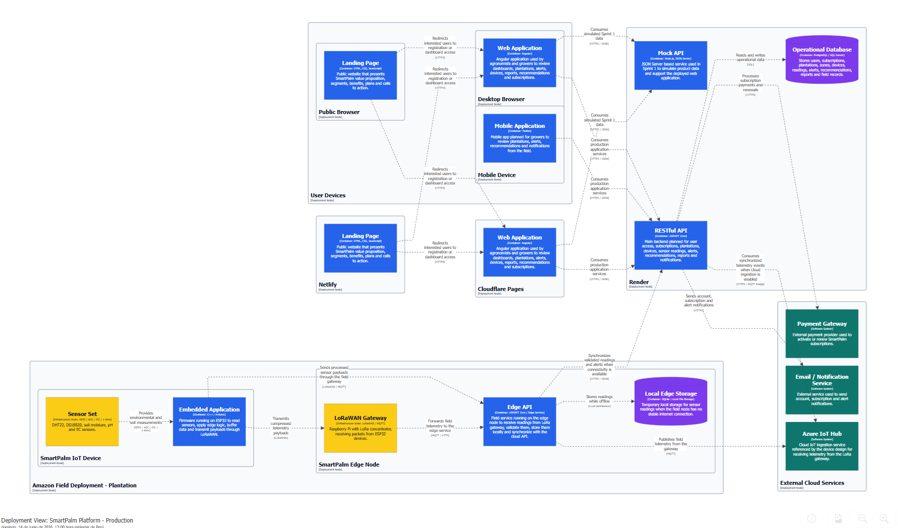
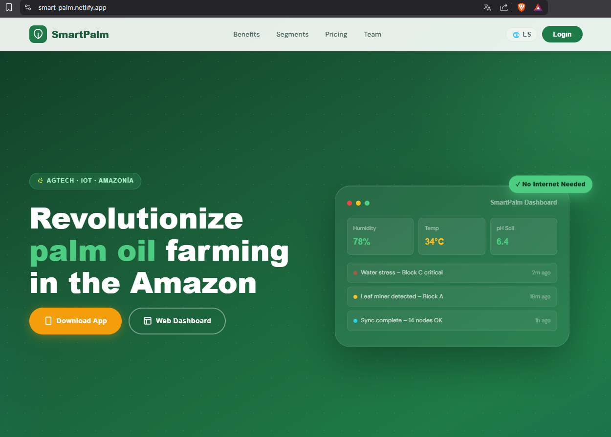
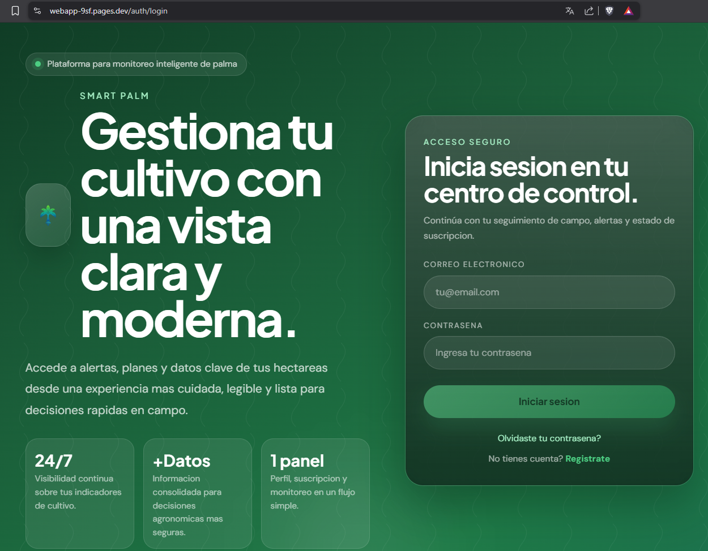
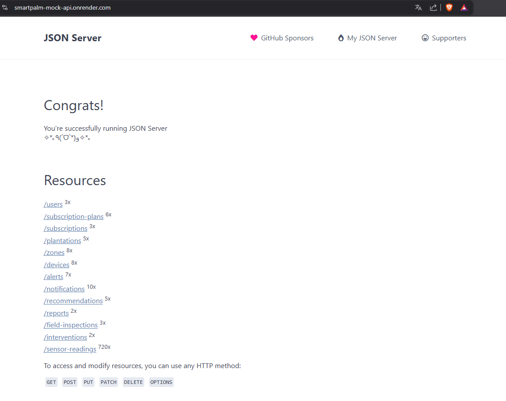
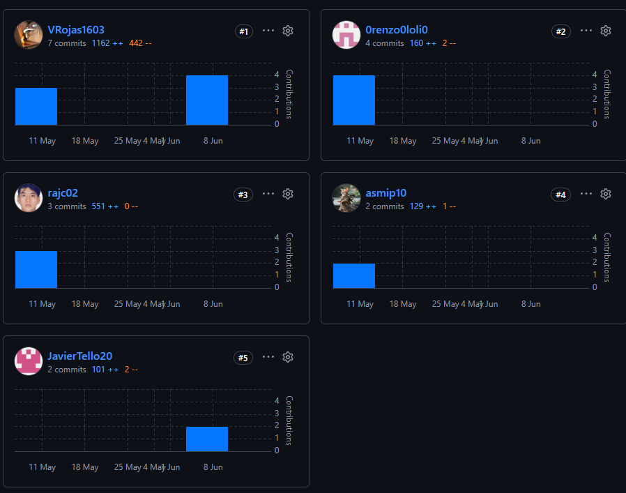
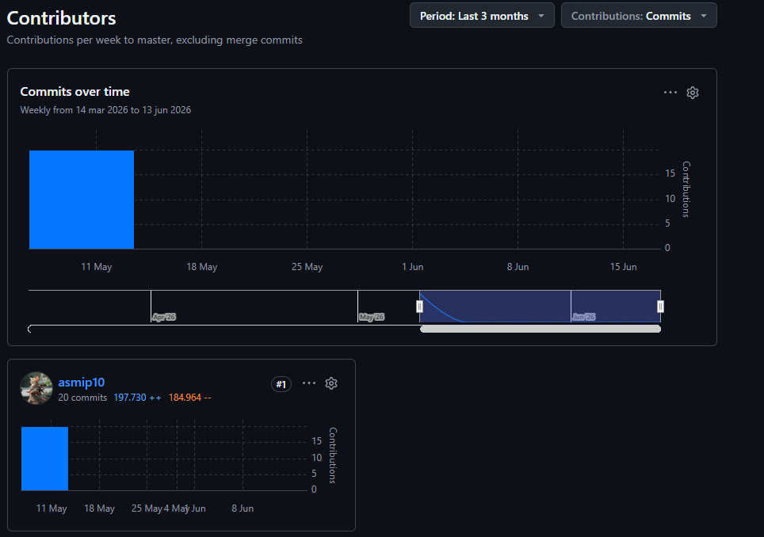
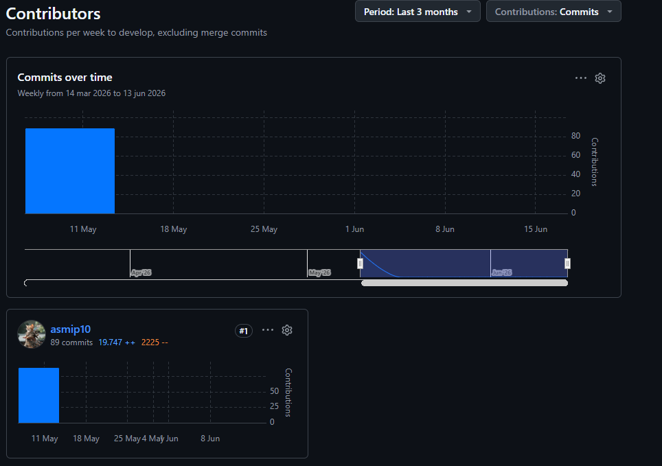
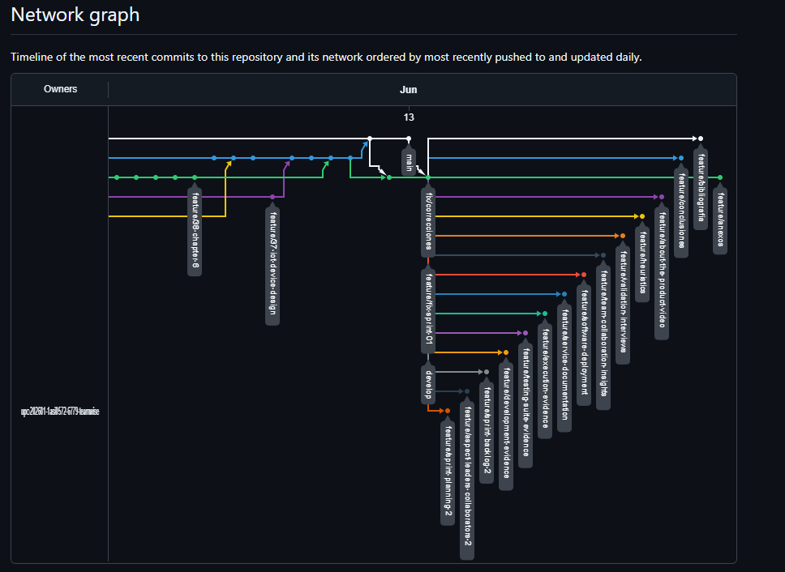
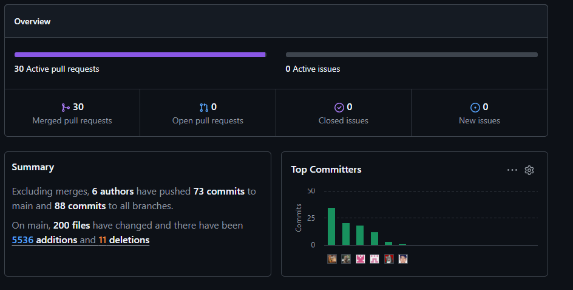

# Capítulo VI: Product Implementation, Validation & Deployment

## 6.1. Software Configuration Management

Este capítulo documenta la configuración técnica utilizada por el equipo TempWise para implementar y desplegar los productos trabajados durante el Sprint 1 de SmartPalm: Landing Page, Mock API y Web Application. El objetivo de esta sección es dejar evidencia clara de las herramientas, repositorios, convenciones y ambientes usados para construir la primera versión visible del producto.

### 6.1.1. Software Development Environment Configuration

Durante el Sprint 1, el equipo se enfocó en tres frentes de implementación. Primero, el Landing Page público de SmartPalm, orientado a presentar la propuesta de valor, beneficios, segmentos objetivo y planes de suscripción. Segundo, la Web Application, desarrollada en Angular para permitir la navegación inicial de usuarios, dashboard, plantaciones, alertas, recomendaciones, reportes, dispositivos y suscripciones. Tercero, una Mock API desplegada en Render para simular los recursos necesarios y permitir que la Web Application funcione con datos representativos.

| Category | Tool / Platform | Usage in Sprint 1 | Reference |
|---|---|---|---|
| Project Management | Trello | Organización de tareas, historias de usuario y seguimiento del sprint. | https://trello.com/b/HSjBsXFx/grupo-2-fundamentos-de-arquitectura-de-software |
| Source Code Management | Git + GitHub | Control de versiones, ramas, commits y colaboración del equipo. | https://github.com/upc-202601-1asi0572-6779-teamwise |
| Report Documentation | Markdown + GitHub | Documentación del avance del proyecto bajo enfoque Docs-as-Code. | https://github.com/upc-202601-1asi0572-6779-teamwise/smartpalm-report |
| UX/UI Design | Figma | Diseño de wireframes, mock-ups y flujos de Landing Page y Web Application. | https://www.figma.com/design/bFDv7p60jPElSFuoSRZF1H/WebApp?node-id=0-1&t=odRCfuqOyekerhH2-1 |
| Collaborative Modeling | Miro | Modelado colaborativo previo de procesos y dominio del producto. | https://miro.com/app/board/uXjVK2R7nV4=/ |
| Web Application Development | Angular | Desarrollo de la Web Application de SmartPalm. | https://angular.dev |
| Code Editor | Visual Studio Code | Edición de código fuente, archivos Markdown y configuración de proyecto. | https://code.visualstudio.com |
| Static Site Deployment | Netlify | Publicación del Landing Page. | https://lading-page-smartpalm.netlify.app |
| Web App Deployment | Cloudflare Pages | Publicación de la Web Application. | https://webapp-9sf.pages.dev |
| Mock Services Deployment | Render | Publicación de la Mock API usada por la Web Application. | https://smartpalm-mock-api.onrender.com |

### 6.1.2. Source Code Management

El equipo utiliza Git como sistema de control de versiones y GitHub como plataforma de alojamiento remoto. Para el Sprint 1, los repositorios relevantes corresponden al reporte, la Web Application, el Landing Page y la Mock API.

**GitHub Repositories**

| Product | Repository | Purpose | Status |
|---|---|---|---|
| Project Report | `smartpalm-report` | Contiene el informe, anexos y evidencias documentales del proyecto. | https://github.com/upc-202601-1asi0572-6779-teamwise/smartpalm-report |
| Landing Page | `website` | Contiene el sitio público de SmartPalm con propuesta de valor, segmentos, beneficios, pricing y equipo. | https://github.com/upc-202601-1asi0572-6779-teamwise/website |
| Web Application | `webapp-test` | Contiene la Web Application Angular implementada durante Sprint 1. | https://github.com/upc-202601-1asi0572-6779-teamwise/webapp-test |
| Mock API | `mock-api` | Contiene los datos y endpoints simulados consumidos por la Web Application. | https://github.com/upc-202601-1asi0572-6779-teamwise/mock-api |

**GitFlow Workflow**

El flujo de trabajo se organiza con ramas principales y ramas por funcionalidad. Esta estructura permite separar el código estable, la integración de avances y el desarrollo de funcionalidades específicas.

| Branch Type | Convention | Purpose |
|---|---|---|
| Main Branch | `main` | Contiene versiones estables o entregables finales. |
| Development Branch | `develop` | Integra los avances antes de pasar a una versión estable. |
| Feature Branches | `feature/<description>` | Agrupan funcionalidades o secciones específicas del producto. |
| Deployment Branch | `deploy` | Agrupa ajustes de publicación y configuración de despliegue cuando corresponde. |
| Hotfix Branches | `hotfix/<description>` | Corrigen errores críticos detectados en una versión publicada. |

**Semantic Versioning**

El equipo adopta Semantic Versioning con el formato `MAJOR.MINOR.PATCH` para identificar entregas del producto.

| Segment | Meaning |
|---|---|
| `MAJOR` | Cambios mayores o incompatibles. |
| `MINOR` | Nuevas funcionalidades compatibles. |
| `PATCH` | Correcciones menores o ajustes puntuales. |

**Conventional Commits**

Los commits siguen una estructura basada en Conventional Commits para mantener trazabilidad.

| Type | Usage | Example |
|---|---|---|
| `feat` | Nueva funcionalidad. | `feat(dashboard): replace placeholder with real dashboard and 5 widgets` |
| `fix` | Corrección de errores. | `fix(auth): improve login and registration feedback` |
| `docs` | Cambios de documentación. | `docs: update chapter 6 evidence` |
| `refactor` | Mejora interna sin cambiar la funcionalidad esperada. | `refactor(alerts): redesign list with left-border severity` |
| `style` | Ajustes visuales o de formato. | `style: adjust dashboard layout` |
| `chore` | Tareas de mantenimiento. | `chore: remove unused pipe imports` |
| `config` | Configuración de entorno o despliegue. | `config(cloudflare): add SPA fallback` |

### 6.1.3. Source Code Style Guide & Coding Conventions

El equipo define convenciones de código para mantener legibilidad, consistencia y trazabilidad entre los productos implementados durante el Sprint 1.

| Element | Convention | Example |
|---|---|---|
| Angular Components | PascalCase | `DashboardComponent`, `PlantationDetailComponent` |
| Services | PascalCase with `Service` suffix | `PlantationService`, `AlertService` |
| Methods and Variables | camelCase | `getActiveAlerts()`, `currentPlantation` |
| Constants | UPPER_SNAKE_CASE | `MAX_VISIBLE_ALERTS` |
| Files and Folders | kebab-case | `plantation-detail.component.ts` |
| Routes | Lowercase route paths | `/dashboard`, `/plantaciones`, `/alertas` |
| Branches | kebab-case | `feature/dashboard-redesign` |
| Commits | English and imperative | `feat(subscription): add role-aware plans` |

**General Rules**

- El código fuente, nombres técnicos y commits se redactan en inglés.
- Los textos visibles al usuario pueden estar en español cuando formen parte de la experiencia de SmartPalm.
- Las funcionalidades se organizan por módulo: `auth`, `dashboard`, `plantations`, `devices`, `alerts`, `recommendations`, `reports`, `inspections`, `profile` y `subscription`.
- Los servicios simulados de la Mock API deben mantener nombres consistentes con el dominio: users, subscriptions, plantations, zones, devices, readings, alerts, recommendations, reports e inspections.

**Project Boards and Design References**

| Resource | URL |
|---|---|
| Trello Board | https://trello.com/b/HSjBsXFx/grupo-2-fundamentos-de-arquitectura-de-software |
| Figma WebApp Design | https://www.figma.com/design/bFDv7p60jPElSFuoSRZF1H/WebApp?node-id=0-1&t=odRCfuqOyekerhH2-1 |

### 6.1.4. Software Deployment Configuration

La configuración de despliegue del Sprint 1 considera únicamente los artefactos implementados y publicados en esta iteración: Landing Page, Web Application y Mock API.

| Artifact | Platform | Public URL | Sprint 1 Status |
|---|---|---|---|
| Landing Page | Netlify | https://lading-page-smartpalm.netlify.app | Deployed |
| Web Application | Cloudflare Pages | https://webapp-9sf.pages.dev | Deployed |
| Mock API | Render | https://smartpalm-mock-api.onrender.com | Deployed |

**Deployment Configuration Summary**

| Artifact | Configuration |
|---|---|
| Landing Page | Publicación estática en Netlify desde el proyecto del Landing Page. |
| Web Application | Publicación de aplicación Angular en Cloudflare Pages. |
| Mock API | Publicación en Render para entregar datos simulados a la Web Application. |

**C4 Deployment Diagram - Structurizr DSL**

El siguiente código DSL representa el despliegue completo proyectado para SmartPalm. Incluye los artefactos ya desplegados en Sprint 1, como Landing Page, Web Application y Mock API, y también la arquitectura completa prevista para el producto: Mobile Application, RESTful API, base de datos, Edge API, gateway LoRaWAN, dispositivo ESP32 y sensores de campo.

## 6.2. Landing Page, Services & Applications Implementation

Esta sección documenta la implementación del Sprint 1. El alcance real de este sprint se limita a Landing Page, Mock API y Web Application.

### 6.2.1. Sprint 1

#### 6.2.1.1. Sprint Planning 1

| Field | Value |
|---|---|
| Sprint # | Sprint 1 |
| Sprint Planning Background | Primera entrega visible de SmartPalm, centrada en presentar el producto mediante el Landing Page, habilitar la navegación inicial de la Web Application y usar una Mock API para simular datos del dominio agrícola. |
| Date | 2026-05-14 |
| Prepared By | Victor Manuel Rojas Reategui |
| Attendees (to planning meeting) | Victor Rojas / Renso Julca / Javier Tello / Jeremy Paucar / Renzo Loli / Sebastian Carbajal |
| Sprint 0 Review Summary | No aplica. Sprint 1 corresponde a la primera entrega de implementación. |
| Sprint 0 Retrospective Summary | No aplica. No existió un sprint anterior cerrado. |
| Sprint Goal & User Stories | Entregar una primera experiencia funcional compuesta por Landing Page, Mock API y Web Application, cubriendo propuesta de valor, planes, registro inicial, suscripción, dashboard, plantaciones y monitoreo por zona. |
| Sprint 1 Goal | Our focus is on delivering the first public and navigable experience of SmartPalm. We believe it provides early product visibility for visitors and an initial operational view for agronomists and growers. This will be confirmed when the Landing Page is deployed, the Mock API provides representative data, and the Web Application allows navigation through the main crop monitoring views. |
| Sprint 1 Velocity | 25 |
| Sum of Story Points | 25 |

**Sprint Board:** https://trello.com/b/HSjBsXFx/grupo-2-fundamentos-de-arquitectura-de-software

**Figma WebApp Design:** https://www.figma.com/design/bFDv7p60jPElSFuoSRZF1H/WebApp?node-id=0-1&t=odRCfuqOyekerhH2-1

**User Stories included in Sprint 1**

| Order | User Story Id | Title | Description | Story Points |
|---:|---|---|---|---:|
| 1 | US001 | Presentar la propuesta de valor de Smart Palm | Como visitante interesado en mejorar la gestión de mi cultivo de palma aceitera, quiero conocer la propuesta de valor de Smart Palm, para entender cómo la plataforma puede ayudarme a monitorear y proteger mi plantación. | 2 |
| 2 | US002 | Consultar los planes de suscripción disponibles | Como visitante interesado en contratar Smart Palm, quiero conocer los planes de suscripción disponibles, para evaluar cuál se ajusta al tamaño y necesidades de mi operación. | 2 |
| 3 | US006 | Conocer información institucional sobre TempWise | Como visitante del Landing Page, quiero conocer información sobre la startup TempWise y el equipo detrás de Smart Palm, para evaluar la credibilidad y experiencia del proveedor de la solución. | 1 |
| 4 | US003 | Iniciar el proceso de contratación de un plan | Como visitante interesado en contratar Smart Palm, quiero iniciar el proceso de suscripción a un plan desde el Landing Page, para comenzar a utilizar la plataforma de manera oficial. | 3 |
| 5 | US004 | Completar el registro asociado al plan contratado | Como visitante que ha seleccionado un plan, quiero completar mi registro como usuario de la plataforma, para finalizar la contratación del plan y obtener acceso al producto. | 3 |
| 6 | US005 | Completar el proceso de pago de la suscripción | Como visitante que ha completado su registro, quiero completar el pago del plan seleccionado, para activar formalmente mi suscripción a Smart Palm. | 5 |
| 7 | US007 | Visualizar el panel general de plantaciones asignadas | Como ingeniero agrónomo, quiero visualizar un panel general de las plantaciones que superviso, para tener una vista consolidada del estado de todos los cultivos bajo mi responsabilidad. | 3 |
| 8 | US008 | Consultar el detalle técnico de una plantación | Como ingeniero agrónomo, quiero consultar el detalle técnico de una plantación en la aplicación web, para analizar sus zonas de monitoreo y las condiciones del cultivo. | 3 |
| 9 | US009 | Visualizar el estado del cultivo por zona | Como ingeniero agrónomo, quiero visualizar el estado de cada zona de monitoreo de una plantación, para identificar qué sectores presentan mejores o peores condiciones. | 3 |

#### 6.2.1.2. Aspect Leaders and Collaborators

| Team Member (Last Name, First Name) | GitHub Username | Landing Page | Mock API | Web Application | Deployment | Documentation |
|---|---|---|---|---|---|---|
| Rojas Reategui, Victor Manuel | `VRojas1603` | C | C | C | C | L |
| Julca Cruz, Renso Anthony | `Renso Julca` | L |  | C | C | C |
| Tello Murga, Javier Oswaldo | `JavierTello20` | C | C | C |  | C |
| Loli Ruiz, Renzo Javier | `0renzo0loli0` |  |  | C | C | C |
| Paucar Meneses, Jeremy Alión | `asmip_10` | C | L | L | L | C |
| Carbajal Santivañez, Sebastian | `Sebastian Carbajal Santivañez` | C |  | C |  | C |

#### 6.2.1.3. Sprint Backlog 1

El Sprint Backlog 1 se organizó a partir de las historias priorizadas del Product Backlog. La selección cubre la experiencia pública del Landing Page, el flujo comercial inicial y las primeras vistas funcionales de la Web Application usando datos simulados desde la Mock API.

| Sprint # | User Story Id | User Story Title | User Story Description | Story Points | Work-Item / Task Id | Work-Item / Task Title | Work-Item / Task Description | Estimation (Hours) | Assigned To | Status |
|---|---|---|---|---:|---|---|---|---:|---|---|
| Sprint 1 | US001 | Presentar la propuesta de valor de Smart Palm | Como visitante interesado en mejorar la gestión de mi cultivo de palma aceitera, quiero conocer la propuesta de valor de Smart Palm, para entender cómo la plataforma puede ayudarme a monitorear y proteger mi plantación. | 2 | TK01 | Landing Page: Hero y propuesta de valor | Implementar la cabecera principal con mensaje de SmartPalm, beneficios principales y llamados a la acción. | 5 | Renso Julca / Victor Rojas | Done |
| Sprint 1 | US002 | Consultar los planes de suscripción disponibles | Como visitante interesado en contratar Smart Palm, quiero conocer los planes de suscripción disponibles, para evaluar cuál se ajusta al tamaño y necesidades de mi operación. | 2 | TK02 | Landing Page: Pricing | Implementar la sección de planes de suscripción con diferencias por cobertura y funcionalidades. | 5 | Renso Julca | Done |
| Sprint 1 | US006 | Conocer información institucional sobre TempWise | Como visitante del Landing Page, quiero conocer información sobre la startup TempWise y el equipo detrás de Smart Palm, para evaluar la credibilidad y experiencia del proveedor de la solución. | 1 | TK03 | Landing Page: About Team | Implementar sección institucional y presentación del equipo TempWise. | 4 | Renso Julca / Sebastian Carbajal | Done |
| Sprint 1 | US003 | Iniciar el proceso de contratación de un plan | Como visitante interesado en contratar Smart Palm, quiero iniciar el proceso de suscripción a un plan desde el Landing Page, para comenzar a utilizar la plataforma de manera oficial. | 3 | TK04 | Landing Page: CTA de contratación | Conectar los llamados a la acción del Landing Page con la experiencia de registro o acceso. | 6 | Renso Julca / Jeremy Paucar | Done |
| Sprint 1 | US004 | Completar el registro asociado al plan contratado | Como visitante que ha seleccionado un plan, quiero completar mi registro como usuario de la plataforma, para finalizar la contratación del plan y obtener acceso al producto. | 3 | TK05 | Web Application: Registro | Implementar registro de usuario y flujo inicial de cuenta. | 8 | Jeremy Paucar | Done |
| Sprint 1 | US005 | Completar el proceso de pago de la suscripción | Como visitante que ha completado su registro, quiero completar el pago del plan seleccionado, para activar formalmente mi suscripción a Smart Palm. | 5 | TK06 | Web Application: Suscripciones | Implementar vistas de planes, suscripción actual y cambio de plan usando datos simulados. | 10 | Jeremy Paucar | Done |
| Sprint 1 | US007 | Visualizar el panel general de plantaciones asignadas | Como ingeniero agrónomo, quiero visualizar un panel general de las plantaciones que superviso, para tener una vista consolidada del estado de todos los cultivos bajo mi responsabilidad. | 3 | TK07 | Web Application: Dashboard | Implementar dashboard con resumen de plantaciones, alertas, recomendaciones y dispositivos. | 8 | Jeremy Paucar | Done |
| Sprint 1 | US008 | Consultar el detalle técnico de una plantación | Como ingeniero agrónomo, quiero consultar el detalle técnico de una plantación en la aplicación web, para analizar sus zonas de monitoreo y las condiciones del cultivo. | 3 | TK08 | Web Application: Detalle de plantación | Implementar vista de detalle con zonas, estado del cultivo y alertas asociadas. | 8 | Jeremy Paucar | Done |
| Sprint 1 | US009 | Visualizar el estado del cultivo por zona | Como ingeniero agrónomo, quiero visualizar el estado de cada zona de monitoreo de una plantación, para identificar qué sectores presentan mejores o peores condiciones. | 3 | TK09 | Web Application: Estado por zona | Mostrar datos simulados de zonas y lecturas relevantes desde la Mock API. | 8 | Jeremy Paucar | Done |

#### 6.2.1.4. Development Evidence for Sprint Review

Durante el Sprint 1 se implementaron los artefactos necesarios para validar la experiencia inicial de SmartPalm: Landing Page, Mock API y Web Application. La evidencia de desarrollo debe centrarse en los repositorios de producto, no en commits del reporte.

**Landing Page Repository:** https://github.com/upc-202601-1asi0572-6779-teamwise/website

| Repository | Branch | Commit Id | Commit Message | Commit Message Body | Committed on (Date) |
|---|---|---|---|---|---|
| landing-page | `feature/initial-landing-setup` | `cf26396` | `feat: add navigation header and styles` | Agrega navegación principal y estilos iniciales del Landing Page. | 2026-05-14 |
| landing-page | `feature/initial-landing-setup` | `80aa492` | `feat(landing): add core UI scripts, animations, and i18n logic` | Agrega scripts base, animaciones e internacionalización. | 2026-05-14 |
| landing-page | `feature/hero-section` | `847f996` | `feature: add hero section` | Implementa la sección Hero del Landing Page. | 2026-05-14 |
| landing-page | `feature/hero-section` | `cf0aa60` | `feature: apply style for the hero section` | Agrega estilos visuales para el Hero Section. | 2026-05-14 |
| landing-page | `feature/about-the-product` | `4d38d5c` | `feat: added about the product section` | Implementa la sección About the Product. | 2026-05-14 |
| landing-page | `feature/about-the-product` | `04c7de2` | `feat: added about the product styles` | Agrega estilos para About the Product. | 2026-05-14 |
| landing-page | `feature/benefits-section` | `bf80ac5` | `feature: added benefits / features section` | Implementa sección de beneficios y características. | 2026-05-15 |
| landing-page | `feature/pricing-section` | `a689f0b` | `feat(pricing): add pricing section markup with i18n keys` | Implementa estructura de pricing con claves i18n. | 2026-05-15 |
| landing-page | `feature/pricing-section` | `7e6d1cf` | `feat(pricing): add pricing styles and responsive layout` | Agrega estilos responsive para pricing. | 2026-05-15 |
| landing-page | `feature/segments` | `025cafc` | `feat: add segments section` | Implementa sección de segmentos objetivo. | 2026-06-12 |
| landing-page | `feature/about-the-team` | `90bad9e` | `feature: update about the team section` | Actualiza la sección del equipo. | 2026-06-12 |
| landing-page | `feature/footer` | `9e99d3a` | `feat:add footer section` | Implementa footer del Landing Page. | 2026-06-12 |

**Mock API Repository:** https://github.com/upc-202601-1asi0572-6779-teamwise/mock-api

| Repository | Branch | Commit Id | Commit Message | Commit Message Body | Committed on (Date) |
|---|---|---|---|---|---|
| mock-api | `master` | `cf2b191` | `feat: json-server mock API for IAM endpoints with 3 test users` | Crea Mock API base con endpoints IAM y usuarios de prueba. | 2026-05-12 |
| mock-api | `master` | `4c19996` | `feat(auth): add shared auth and role helpers` | Agrega helpers de autenticación y roles. | 2026-05-14 |
| mock-api | `master` | `306bc20` | `feat(plantations): add plantation and zone management endpoints` | Implementa endpoints de plantaciones y zonas. | 2026-05-14 |
| mock-api | `master` | `1e36d14` | `feat(devices): add device registration and assignment workflows` | Agrega flujos de registro y asignación de dispositivos. | 2026-05-14 |
| mock-api | `master` | `a56ea76` | `feat(subscriptions): filter plans by segment` | Agrega filtrado de planes por segmento. | 2026-05-14 |
| mock-api | `master` | `be9065d` | `feat(subscriptions): add subscription upgrade endpoint` | Implementa endpoint de actualización de suscripción. | 2026-05-14 |
| mock-api | `master` | `c664551` | `feat(alerts): add alert query and acknowledgement endpoints` | Implementa consulta y reconocimiento de alertas. | 2026-05-14 |
| mock-api | `master` | `50f8ad3` | `feat(notifications): add notification inbox endpoints` | Agrega endpoints de notificaciones. | 2026-05-14 |
| mock-api | `master` | `f6a75c8` | `feat(readings): add sensor readings query endpoint` | Agrega consulta de lecturas sensoriales. | 2026-05-14 |
| mock-api | `master` | `2303d0c` | `feat(recommendations): add recommendation lifecycle endpoints` | Implementa ciclo de vida de recomendaciones. | 2026-05-14 |
| mock-api | `master` | `dc783cc` | `feat(reports): add report generation and publication endpoints` | Agrega generación y publicación de reportes. | 2026-05-14 |
| mock-api | `master` | `20730e4` | `feat(inspections): add inspection and intervention query endpoints` | Agrega consulta de inspecciones e intervenciones. | 2026-05-14 |
| mock-api | `master` | `5f92f54` | `fix(deploy): read port from environment` | Ajusta el puerto para despliegue en Render. | 2026-05-14 |

**Web Application Repository:** https://github.com/upc-202601-1asi0572-6779-teamwise/webapp-test

| Repository | Branch | Commit Id | Commit Message | Commit Message Body | Committed on (Date) |
|---|---|---|---|---|---|
| web-application | `develop` | `56c8eb1` | `feat(sensors): add sensor reading model and service for BC-02` | Agrega modelo y servicio para lecturas sensoriales consumidas por la Web Application. | 2026-05-13 |
| web-application | `develop` | `1d6d241` | `feat(dashboard): replace placeholder with real dashboard and 5 widgets` | Implementa dashboard funcional con widgets principales. | 2026-05-13 |
| web-application | `develop` | `2b13890` | `feat(reports): add read-only report list and detail pages` | Agrega vistas de listado y detalle de reportes. | 2026-05-13 |
| web-application | `develop` | `6ed2631` | `feat(agronomist): add role-aware sidebar and agronomist guard` | Agrega navegación por rol para la experiencia del agrónomo. | 2026-05-13 |
| web-application | `develop` | `bd61006` | `feat(agronomist): add recommendation create, approve, publish flow with role tabs` | Implementa flujo de recomendaciones agronómicas. | 2026-05-13 |
| web-application | `develop` | `22891a9` | `feat(agronomist): add report generation, publish and sections display with role tabs` | Agrega generación y publicación de reportes. | 2026-05-13 |
| web-application | `develop` | `f3f7a6e` | `feat(agronomist): add field inspections feature with list and detail` | Agrega módulo de inspecciones de campo. | 2026-05-13 |
| web-application | `develop` | `05052a5` | `feat(subscription): add role-aware plans and subscription views with back navigation` | Agrega vistas de planes y suscripción por rol. | 2026-05-13 |
| web-application | `develop` | `9865b7b` | `refactor(alert-detail): full-width severity layout with visual range bar, spanish labels, and device context` | Mejora la vista de detalle de alerta. | 2026-05-14 |
| web-application | `deploy` | `1f1ed85` | `config(deploy): switch apiUrl to deployed Render mock API` | Configura la Web Application para consumir la Mock API desplegada. | 2026-05-14 |
| web-application | `deploy` | `e820d03` | `feat(sidebar): add active route highlighting with background, text color, and left border` | Mejora la navegación lateral. | 2026-05-14 |

#### 6.2.1.5. Execution Evidence for Sprint Review

El Sprint 1 dejó tres artefactos ejecutables: Landing Page, Web Application y Mock API. Estos permiten mostrar la propuesta de valor, navegar las vistas principales del producto y consumir datos simulados para validar la experiencia.

| Evidence | Implemented Result |
|---|---|
| Landing Page | Sitio público con Hero Section, beneficios, segmentos, planes de suscripción, información del equipo y footer. |
| Web Application | Aplicación Angular con login, registro, dashboard, plantaciones, dispositivos, alertas, recomendaciones, reportes, inspecciones, perfil y suscripciones. |
| Mock API | Servicio desplegado para entregar datos simulados a la Web Application. |

**Landing Page URL:** https://lading-page-smartpalm.netlify.app

**Web Application URL:** https://webapp-9sf.pages.dev

**Mock API URL:** https://smartpalm-mock-api.onrender.com

#### 6.2.1.6. Services Documentation Evidence for Sprint Review

En este sprint, la documentación de servicios corresponde únicamente a la Mock API. La Mock API permite simular los datos necesarios para que la Web Application muestre información de usuarios, suscripciones, plantaciones, zonas, dispositivos, lecturas, alertas, recomendaciones, reportes e inspecciones.

**Mock API URL:** https://smartpalm-mock-api.onrender.com

| Module | Mock Resource | Main Actions | Sprint Relevance |
|---|---|---|---|
| Access | `/api/v1/auth/register`, `/api/v1/auth/login`, `/api/v1/users/me` | Simular registro, login y consulta de perfil. | Permite navegar la Web Application con usuarios representativos. |
| Subscriptions | `/api/v1/subscriptions/plans`, `/api/v1/subscriptions/me`, `/api/v1/subscriptions/me/upgrade` | Consultar planes, suscripción actual y cambio de plan. | Soporta las historias de contratación y suscripción inicial. |
| Plantations | `/api/v1/plantations`, `/api/v1/plantations/:id`, `/api/v1/plantations/:plantationId/zones` | Consultar plantaciones, detalle técnico y zonas de monitoreo. | Soporta dashboard, listado y detalle de plantaciones. |
| Devices | `/api/v1/devices`, `/api/v1/devices/:id`, `/api/v1/devices/:id/zone` | Consultar dispositivos asociados a plantaciones y zonas. | Permite evidenciar el componente IoT dentro de la experiencia web. |
| Sensor Readings | `/api/v1/readings` | Consultar lecturas simuladas por variable, zona, dispositivo o plantación. | Alimenta la visualización del estado del cultivo. |
| Alerts | `/api/v1/alerts`, `/api/v1/alerts/:id`, `/api/v1/alerts/:id/acknowledge` | Consultar alertas activas, detalle de alerta y reconocimiento. | Permite priorizar condiciones críticas dentro de la Web Application. |
| Recommendations | `/api/v1/recommendations`, `/api/v1/recommendations/:id/approve`, `/api/v1/recommendations/:id/publish` | Consultar, aprobar y publicar recomendaciones agronómicas. | Soporta la experiencia del agrónomo y del productor. |
| Reports | `/api/v1/reports`, `/api/v1/reports/generate-draft`, `/api/v1/reports/:id/publish` | Consultar, generar y publicar reportes. | Permite mostrar documentación del estado del cultivo. |
| Field Records | `/api/v1/inspections`, `/api/v1/interventions` | Consultar inspecciones e intervenciones simuladas. | Complementa la trazabilidad del seguimiento agronómico. |

#### 6.2.1.7. Software Deployment Evidence for Sprint Review

En el Sprint 1 se desplegaron los tres artefactos del alcance: Landing Page, Web Application y Mock API.

| Artifact | Deployment Status | URL / Environment |
|---|---|---|
| Landing Page | Deployed | https://lading-page-smartpalm.netlify.app |
| Web Application | Deployed | https://webapp-9sf.pages.dev |
| Mock API | Deployed | https://smartpalm-mock-api.onrender.com |

#### 6.2.1.8. Team Collaboration Insights during Sprint

Durante el Sprint 1, el equipo distribuyó el trabajo en tres frentes: Landing Page, Mock API y Web Application. El Landing Page permitió mostrar la propuesta de valor y el modelo comercial de SmartPalm. La Mock API permitió simular información del dominio sin depender de una implementación de servicios productivos. La Web Application permitió navegar las primeras vistas funcionales del sistema usando datos simulados.

La evidencia más clara de implementación disponible se encuentra en el repositorio `webapp-test`, donde los commits muestran una evolución desde modelos y servicios iniciales hasta dashboard, reportes, recomendaciones, inspecciones, suscripciones, navegación por rol y configuración de despliegue. Para completar esta sección con el mismo nivel del ejemplo, se deben agregar capturas de GitHub Insights de los repositorios de Landing Page, Mock API y Web Application.

| Team Member | Sprint 1 Contribution |
|---|---|
| Victor Manuel Rojas Reategui | Coordinación documental, integración del reporte y apoyo en producto. |
| Renso Anthony Julca Cruz | Liderazgo del Landing Page y apoyo en diseño de la experiencia pública. |
| Javier Oswaldo Tello Murga | Colaboración en estructura funcional y documentación técnica del producto. |
| Renzo Javier Loli Ruiz | Colaboración en arquitectura y soporte de organización técnica. |
| Jeremy Alión Paucar Meneses | Liderazgo de Web Application, Mock API y despliegue de la experiencia funcional. |
| Sebastian Carbajal Santivañez | Colaboración en contenido visual y soporte de documentación del producto. |

**IMAGEN NECESARIA:** Captura de GitHub Insights - Contributors del repositorio `webapp-test`: https://github.com/upc-202601-1asi0572-6779-teamwise/webapp-test/graphs/contributors

