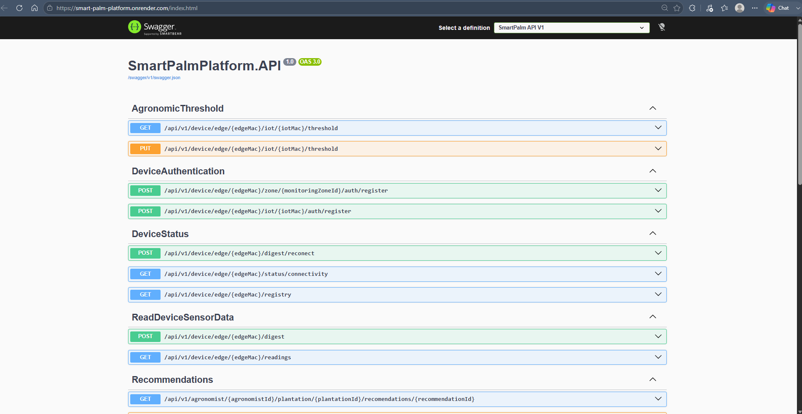
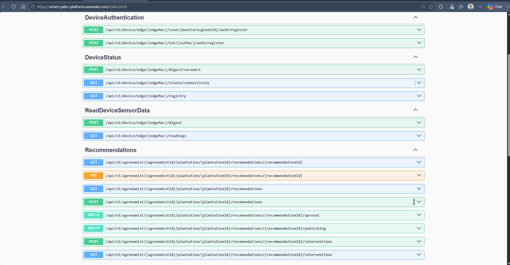

#### 6.2.2.7. Services Documentation Evidence for Sprint Review

En este Sprint se implementó y desplegó el RESTful Web Service **SmartPalmPlatform.API** en Render, documentado con OpenAPI a través de Swagger UI. La URL base del servicio desplegado es `https://smart-palm-platform.onrender.com`. A continuación se detalla cada endpoint implementado por bounded context.

---

##### Evidencia de documentación desplegada

A continuación se muestran capturas de la documentación Swagger del Web Service desplegado en Render:

 

 

##### IoT Device Management

**Device Authentication**

| Acción | Verbo HTTP | Endpoint | Descripción | Parámetros | Response |
|--------|-----------|----------|-------------|------------|----------|
| Registrar Edge Node | `POST` | `/api/v1/device/edge/{edgeMac}/zone/{monitoringZoneId}/auth/register` | Registra un nodo edge en una zona de monitoreo | `edgeMac`: MAC del edge (path), `monitoringZoneId`: ID de zona (path), body: `{ "description": string }` | `201 Created` |
| Registrar IoT Device | `POST` | `/api/v1/device/edge/{edgeMac}/iot/{iotMac}/auth/register` | Registra un dispositivo IoT sensor asociado a un edge | `edgeMac`: MAC del edge (path), `iotMac`: MAC del IoT (path), body: `{ "description": string }` | `201 Created` |

**Device Status**

| Acción | Verbo HTTP | Endpoint | Descripción | Parámetros | Response |
|--------|-----------|----------|-------------|------------|----------|
| Reconectar Edge | `POST` | `/api/v1/device/edge/{edgeMac}/digest/reconect` | Sincroniza el estado de un edge tras reconexión | `edgeMac`: MAC del edge (path), body: `EdgeSynchronizationResource` | `200 OK` |
| Consultar conectividad | `GET` | `/api/v1/device/edge/{edgeMac}/status/connectivity` | Retorna el estado de conectividad actual del edge | `edgeMac`: MAC del edge (path) | `200 OK` con `{ "isConnected": bool, "lastSeenAt": datetime }` |
| Consultar registro | `GET` | `/api/v1/device/edge/{edgeMac}/registry` | Retorna el registro completo del edge y sus dispositivos IoT asociados | `edgeMac`: MAC del edge (path) | `200 OK` con datos del edge y lista de IoT devices |

---

##### Sensor Data Processing

**Telemetría**

| Acción | Verbo HTTP | Endpoint | Descripción | Parámetros | Response |
|--------|-----------|----------|-------------|------------|----------|
| Ingestar lecturas | `POST` | `/api/v1/device/edge/{edgeMac}/digest` | Recibe un lote de lecturas de sensores desde el Edge API. Evalúa umbrales y persiste en base de datos. | `edgeMac`: MAC del edge (path), body: `{ "readings": [{ "sensorType": string, "measuredAt": datetime, "value": number }], "measuredAt": datetime }` | `200 OK` |
| Consultar lecturas | `GET` | `/api/v1/device/edge/{edgeMac}/readings` | Retorna las lecturas de sensores registradas para un edge. Soporta filtro por rango de fechas. | `edgeMac`: MAC del edge (path), `from`: datetime (query, opcional), `to`: datetime (query, opcional) | `200 OK` con lista de `{ "id", "edgeDeviceMacAddress", "sensorType", "value", "unit", "measuredAt" }` |

**Umbrales Agronómicos**

| Acción | Verbo HTTP | Endpoint | Descripción | Parámetros | Response |
|--------|-----------|----------|-------------|------------|----------|
| Consultar umbrales | `GET` | `/api/v1/device/edge/{edgeMac}/iot/{iotMac}/threshold` | Retorna los umbrales agronómicos configurados para el par edge/IoT. Usado por el Edge API al arrancar para sincronizar alertas. | `edgeMac`: MAC del edge (path), `iotMac`: MAC del IoT (path) | `200 OK` con lista de `{ "edgeMac", "iotMac", "min", "max", "description", "type" }` |
| Actualizar umbral | `PUT` | `/api/v1/device/edge/{edgeMac}/iot/{iotMac}/threshold` | Crea o actualiza el umbral agronómico para una variable de sensor en el par edge/IoT | `edgeMac`: MAC del edge (path), `iotMac`: MAC del IoT (path), body: `{ "sensorType": string, "min": number, "max": number, "description": string }` | `200 OK` |

---

##### Agronomic Recommendation

| Acción | Verbo HTTP | Endpoint | Descripción | Parámetros | Response |
|--------|-----------|----------|-------------|------------|----------|
| Listar recomendaciones | `GET` | `/api/v1/agronomist/{agronomistId}/plantation/{plantationId}/recomendations` | Retorna las recomendaciones agronómicas de una plantación. Permite filtrar por estado. | `agronomistId`, `plantationId` (path), `status`: string (query, opcional) | `200 OK` con lista de recomendaciones |
| Consultar recomendación | `GET` | `/api/v1/agronomist/{agronomistId}/plantation/{plantationId}/recomendations/{recommendationId}` | Retorna el detalle de una recomendación específica | `agronomistId`, `plantationId`, `recommendationId` (path) | `200 OK` con detalle de recomendación, o `404 Not Found` |
| Crear recomendación | `POST` | `/api/v1/agronomist/{agronomistId}/plantation/{plantationId}/recomendations` | Crea una nueva recomendación agronómica en estado borrador | `agronomistId`, `plantationId` (path), body: `{ "content": string, "type": string }` | `200 OK` con recomendación creada |
| Actualizar contenido | `PUT` | `/api/v1/agronomist/{agronomistId}/plantation/{plantationId}/recomendations/{recommendationId}` | Actualiza el contenido de una recomendación existente | `agronomistId`, `plantationId`, `recommendationId` (path), body: `{ "content": string }` | `200 OK` |
| Aprobar recomendación | `PATCH` | `/api/v1/agronomist/{agronomistId}/plantation/{plantationId}/recomendations/{recommendationId}/aproval` | Cambia el estado de una recomendación a aprobado | `agronomistId`, `plantationId`, `recommendationId` (path) | `200 OK` |
| Publicar recomendación | `PATCH` | `/api/v1/agronomist/{agronomistId}/plantation/{plantationId}/recomendations/{recommendationId}/publishing` | Publica la recomendación para que sea visible al productor | `agronomistId`, `plantationId`, `recommendationId` (path) | `200 OK` |
| Registrar intervención | `POST` | `/api/v1/agronomist/{agronomistId}/plantation/{plantationId}/recomendations/{recommendationId}/interventions` | Registra una intervención agronómica ejecutada en campo | `agronomistId`, `plantationId`, `recommendationId` (path), body: `{ "description": string, "performedBy": string, "executionDate": datetime }` | `200 OK` |
| Listar intervenciones | `GET` | `/api/v1/agronomist/{agronomistId}/plantation/{plantationId}/recomendations/{recommendationId}/interventions` | Retorna las intervenciones registradas para una recomendación | `agronomistId`, `plantationId`, `recommendationId` (path) | `200 OK` con lista de intervenciones |

---

 

