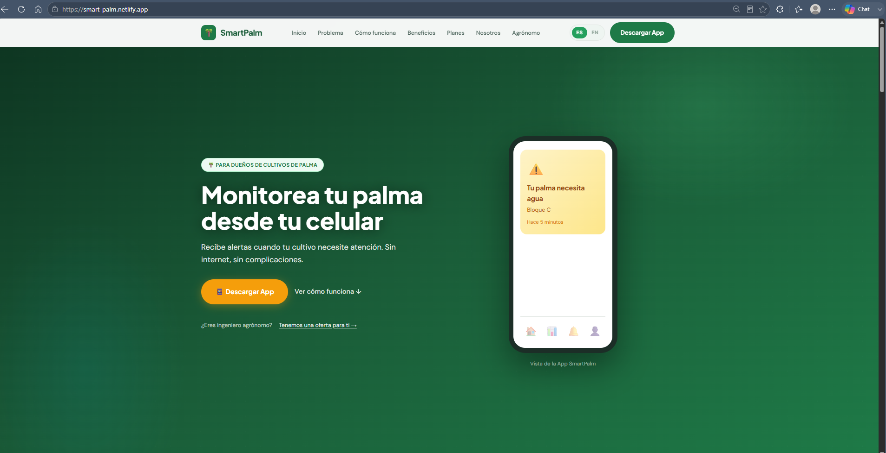
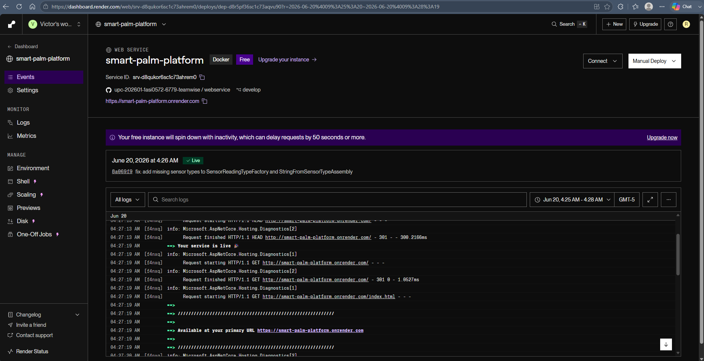
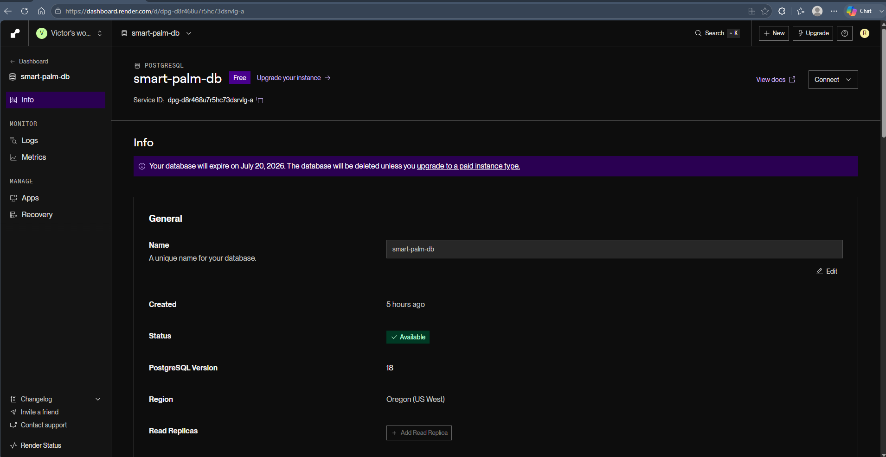
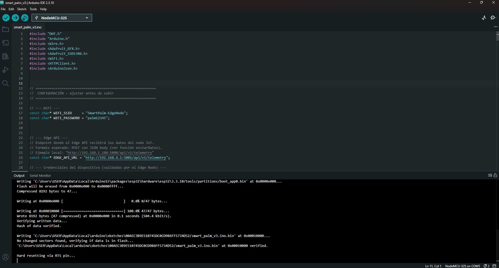
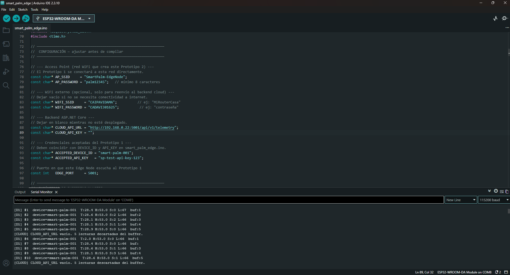
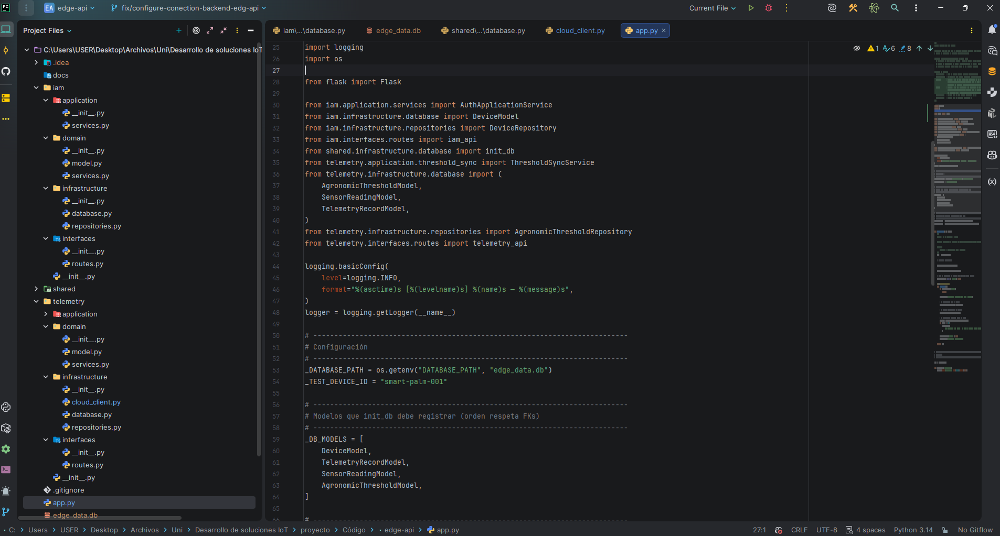

#### 6.2.2.8. Software Deployment Evidence for Sprint Review.

- Landing page desplegada en el entorno de producción, accesible a través de la URL proporcionada: https://smart-palm.netlify.app

 

 

- Backend desplegado en Render, accesible a través de la URL proporcionada: https://smart-palm-platform.onrender.com/
 

 

 

- Base de datos desplegada en Render.   

 

- Embedded Application 1 equipo con sensores: https://github.com/upc-202601-1asi0572-6779-teamwise/embeddedapp

  

 

- Embedded Application 2 equipo edge node.

 

     

- Edge Api en python: https://github.com/upc-202601-1asi0572-6779-teamwise/edgeservice

 

---