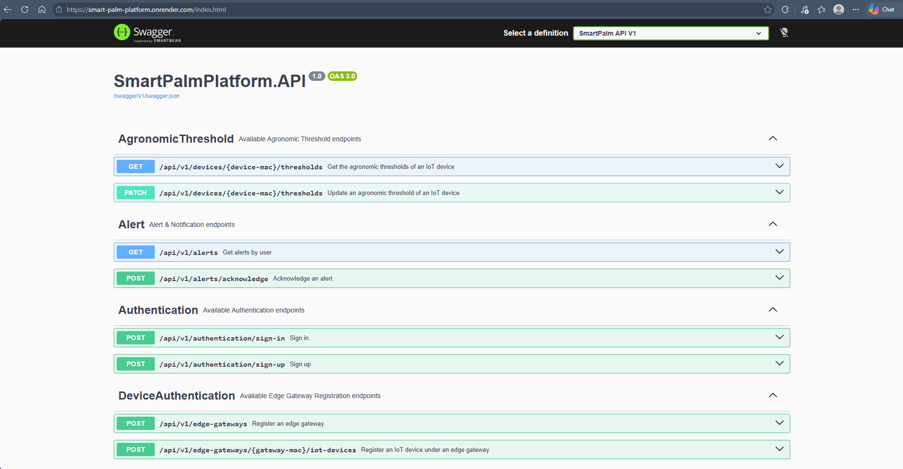
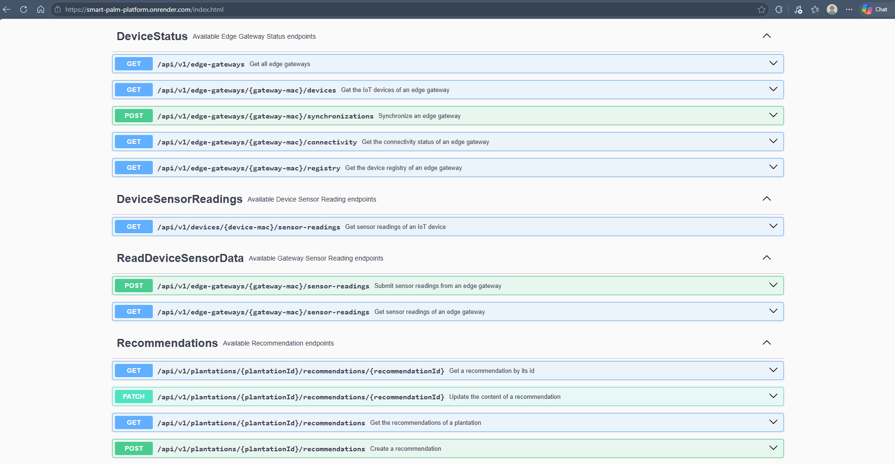
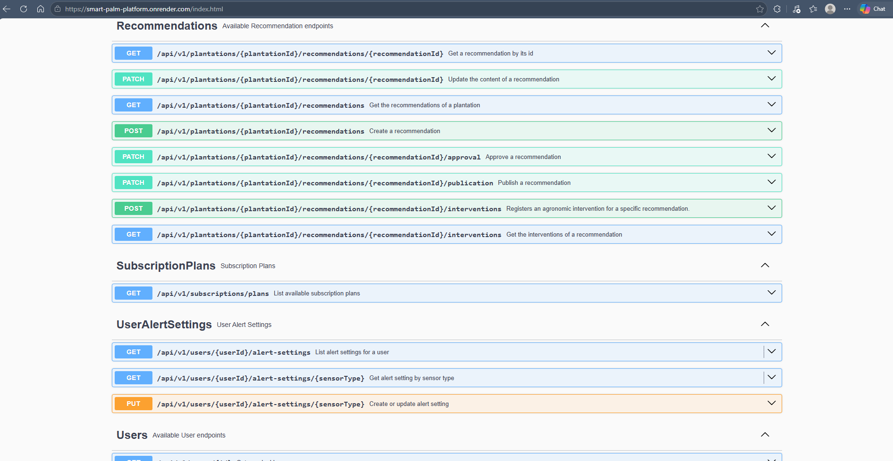
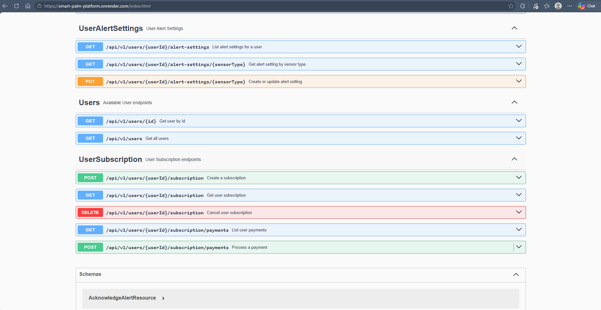

#### 6.2.3.7. Services Documentation Evidence for Sprint Review

Durante el Sprint 3 se completó la migración REST del **SmartPalmPlatform.API** y se incorporaron cuatro bounded contexts nuevos al Web Service: **IAM** (autenticación, usuarios y roles), **Subscription** (planes y suscripciones), **Alerts and Notifications** (alertas y configuración de notificaciones) y **Crop Monitoring** (plantaciones y sectores). Todos los endpoints están documentados con OpenAPI a través de Swagger UI. La URL base del servicio desplegado es `https://smart-palm-platform.onrender.com`. A continuación se detalla cada endpoint implementado por bounded context, incluyendo las restricciones de rol incorporadas este Sprint.

 

 

 

 

---

##### IAM

**Authentication**

| Acción | Verbo HTTP | Endpoint | Descripción | Parámetros | Response |
|--------|-----------|----------|-------------|------------|----------|
| Iniciar sesión | `POST` | `/api/v1/authentication/sign-in` | Autentica un usuario y emite un JWT con su rol como claim. Endpoint público. | body: `{ "username": string, "password": string }` | `200 OK` con `{ "id", "username", "role", "token" }`, o `401 Unauthorized` |
| Registrar usuario | `POST` | `/api/v1/authentication/sign-up` | Crea una cuenta con uno de los 3 roles del sistema (`Agronomist`, `Farmer`, `Administrator`). Endpoint público. | body: `{ "username": string, "password": string, "role": string }` | `200 OK` con el usuario creado, o `400 Bad Request` si el rol no es válido |

**Users**

| Acción | Verbo HTTP | Endpoint | Descripción | Parámetros | Response |
|--------|-----------|----------|-------------|------------|----------|
| Consultar usuario por id | `GET` | `/api/v1/users/{id}` | Retorna los datos de un usuario. Restringido al rol `Administrator`. | `id`: id de usuario (path) | `200 OK`, o `404 Not Found` |
| Listar usuarios | `GET` | `/api/v1/users` | Retorna todos los usuarios registrados. Restringido al rol `Administrator`. | — | `200 OK` con lista de usuarios |

**Subscription Plans**

| Acción | Verbo HTTP | Endpoint | Descripción | Parámetros | Response |
|--------|-----------|----------|-------------|------------|----------|
| Listar planes | `GET` | `/api/v1/subscriptions/plans` | Retorna los planes de suscripción disponibles. Endpoint público. | — | `200 OK` con lista de planes |

**User Subscription**

| Acción | Verbo HTTP | Endpoint | Descripción | Parámetros | Response |
|--------|-----------|----------|-------------|------------|----------|
| Contratar suscripción | `POST` | `/api/v1/users/{userId}/subscription` | Crea la suscripción de un usuario a un plan. | `userId` (path), body: `{ "planId": int }` | `201 Created`, `400 Bad Request` o `404 Not Found` |
| Consultar suscripción | `GET` | `/api/v1/users/{userId}/subscription` | Retorna la suscripción vigente del usuario. | `userId` (path) | `200 OK`, o `404 Not Found` |
| Cancelar suscripción | `DELETE` | `/api/v1/users/{userId}/subscription` | Cancela la suscripción activa del usuario. | `userId` (path) | `200 OK`, o `404 Not Found`/`409 Conflict` |
| Listar pagos | `GET` | `/api/v1/users/{userId}/subscription/payments` | Retorna el historial de pagos de la suscripción del usuario. | `userId` (path) | `200 OK` con lista de pagos |
| Procesar pago | `POST` | `/api/v1/users/{userId}/subscription/payments` | Registra un pago sobre la suscripción del usuario. | `userId` (path), body: `{ "amount": number, "method": string }` | `201 Created`, `400 Bad Request` o `404 Not Found` |

---

##### Alerts and Notifications

**Alerts**

| Acción | Verbo HTTP | Endpoint | Descripción | Parámetros | Response |
|--------|-----------|----------|-------------|------------|----------|
| Consultar alertas de un usuario | `GET` | `/api/v1/alerts` | Retorna las alertas activas asociadas a un usuario. | `userId`: id de usuario (query) | `200 OK` con lista de alertas |
| Reconocer alerta | `POST` | `/api/v1/alerts/acknowledge` | Marca una alerta como reconocida por el usuario. | body: `{ "alertId": int }` | `200 OK`, o `404 Not Found` |

**User Alert Settings**

| Acción | Verbo HTTP | Endpoint | Descripción | Parámetros | Response |
|--------|-----------|----------|-------------|------------|----------|
| Listar configuraciones de alerta | `GET` | `/api/v1/users/{userId}/alert-settings` | Retorna las configuraciones de alerta del usuario para cada tipo de sensor. | `userId` (path) | `200 OK` con lista de configuraciones |
| Consultar configuración por sensor | `GET` | `/api/v1/users/{userId}/alert-settings/{sensorType}` | Retorna la configuración de alerta de un tipo de sensor específico. | `userId`, `sensorType` (path) | `200 OK`, o `404 Not Found` |
| Crear o actualizar configuración | `PUT` | `/api/v1/users/{userId}/alert-settings/{sensorType}` | Crea o actualiza la configuración de notificación de un tipo de sensor. | `userId`, `sensorType` (path), body: `{ "enabled": bool, "channel": string }` | `200 OK` |

---

##### Crop Monitoring

**Plantations**

| Acción | Verbo HTTP | Endpoint | Descripción | Parámetros | Response |
|--------|-----------|----------|-------------|------------|----------|
| Crear plantación | `POST` | `/api/v1/plantations` | Registra una nueva plantación para el usuario autenticado. | body: `{ "name": string, "location": string }` | `201 Created`, o `400 Bad Request` |
| Listar mis plantaciones | `GET` | `/api/v1/plantations` | Retorna las plantaciones del usuario autenticado. | — | `200 OK` con lista de plantaciones |
| Consultar plantación por id | `GET` | `/api/v1/plantations/{id}` | Retorna el detalle de una plantación. | `id` (path) | `200 OK`, o `404 Not Found` |
| Actualizar plantación | `PATCH` | `/api/v1/plantations/{id}` | Actualiza los datos de una plantación existente. | `id` (path), body: `{ "name": string }` | `200 OK`, o `404 Not Found` |

**Plantation Sectors**

| Acción | Verbo HTTP | Endpoint | Descripción | Parámetros | Response |
|--------|-----------|----------|-------------|------------|----------|
| Asignar dispositivo como sector | `POST` | `/api/v1/plantations/{plantationId}/sectors` | Asigna un dispositivo IoT como sector de monitoreo de la plantación. Restringido al rol `Administrator`. | `plantationId` (path), body: `{ "iotDeviceMac": string, "name": string }` | `201 Created`, `400 Bad Request` o `404 Not Found` |
| Consultar sectores | `GET` | `/api/v1/plantations/{plantationId}/sectors` | Retorna los sectores (dispositivos IoT) asignados a la plantación. Endpoint público. | `plantationId` (path) | `200 OK` con lista de sectores |
| Remover sector | `DELETE` | `/api/v1/plantations/{plantationId}/sectors/{sectorId}` | Retira un dispositivo IoT como sector de la plantación. | `plantationId`, `sectorId` (path) | `200 OK`, o `404 Not Found` |

---

##### IoT Device Management

**Device Authentication**

| Acción | Verbo HTTP | Endpoint | Descripción | Parámetros | Response |
|--------|-----------|----------|-------------|------------|----------|
| Registrar edge gateway | `POST` | `/api/v1/edge-gateways` | Registra un edge gateway y lo asigna a la cuenta de un cliente. Restringido al rol `Administrator`. | body: `{ "edgeMac": string, "monitoringZoneId": int, "userId": int }` | `201 Created`, `403 Forbidden` o `409 Conflict` |
| Registrar dispositivo IoT | `POST` | `/api/v1/edge-gateways/{gateway-mac}/iot-devices` | Registra un dispositivo IoT bajo un edge gateway existente. Restringido al rol `Administrator`. | `gateway-mac` (path), body: `{ "iotMac": string }` | `201 Created`, `403 Forbidden`, `404 Not Found` o `409 Conflict` |

**Device Status**

| Acción | Verbo HTTP | Endpoint | Descripción | Parámetros | Response |
|--------|-----------|----------|-------------|------------|----------|
| Listar edge gateways | `GET` | `/api/v1/edge-gateways` | Retorna todos los edge gateways registrados en la plataforma. | — | `200 OK` con lista de gateways |
| Listar dispositivos de un gateway | `GET` | `/api/v1/edge-gateways/{gateway-mac}/devices` | Retorna los dispositivos IoT asociados a un edge gateway. | `gateway-mac` (path) | `200 OK`, o `404 Not Found` |
| Sincronizar edge gateway | `POST` | `/api/v1/edge-gateways/{gateway-mac}/synchronizations` | Registra la sincronización del gateway y actualiza su estado de conectividad y el de sus dispositivos IoT. | `gateway-mac` (path), body: `EdgeSynchronizationResource` | `200 OK`, `400 Bad Request` o `404 Not Found` |
| Consultar conectividad | `GET` | `/api/v1/edge-gateways/{gateway-mac}/connectivity` | Retorna el estado de conectividad actual del gateway. | `gateway-mac` (path) | `200 OK` con `{ "isConnected": bool, "lastSeenAt": datetime }`, o `404 Not Found` |
| Consultar registro | `GET` | `/api/v1/edge-gateways/{gateway-mac}/registry` | Retorna el registro completo del gateway y sus dispositivos IoT asociados. | `gateway-mac` (path) | `200 OK`, o `404 Not Found` |

---

##### Sensor Data Processing

**Sensor Readings**

| Acción | Verbo HTTP | Endpoint | Descripción | Parámetros | Response |
|--------|-----------|----------|-------------|------------|----------|
| Ingestar lecturas por gateway | `POST` | `/api/v1/edge-gateways/{gateway-mac}/sensor-readings` | Recibe un lote de lecturas agrupado por dispositivo IoT, valida que el gateway exista y persiste cada lectura atribuida a su dispositivo de origen. | `gateway-mac` (path), body: `{ "devices": [{ "deviceMac": string, "readings": [{ "sensorType": string, "measuredAt": datetime, "value": number }] }], "syncedAt": datetime }` | `201 Created`, o `400 Bad Request`/`404 Not Found` |
| Consultar lecturas de un gateway | `GET` | `/api/v1/edge-gateways/{gateway-mac}/sensor-readings` | Retorna las lecturas de todos los dispositivos de un gateway, con filtro opcional por dispositivo, rango de fechas y paginación. | `gateway-mac` (path), `from`, `to`: datetime (query, opcional), `device-mac`: string (query, opcional), `page`, `size`: int (query, opcional) | `200 OK` con lista paginada de lecturas |
| Consultar lecturas de un dispositivo | `GET` | `/api/v1/devices/{device-mac}/sensor-readings` | Retorna el histórico de lecturas de un dispositivo IoT individual, independientemente de cuántos otros dispositivos comparta su gateway. | `device-mac` (path), `from`, `to`: datetime (query, opcional), `page`, `size`: int (query, opcional) | `200 OK`, o `404 Not Found` |

**Agronomic Thresholds**

| Acción | Verbo HTTP | Endpoint | Descripción | Parámetros | Response |
|--------|-----------|----------|-------------|------------|----------|
| Consultar umbrales de un dispositivo | `GET` | `/api/v1/devices/{device-mac}/thresholds` | Retorna los umbrales agronómicos configurados para un dispositivo IoT. Restringido a los roles `Administrator` y `Agronomist`. | `device-mac` (path) | `200 OK`, o `404 Not Found` |
| Actualizar umbral de un dispositivo | `PATCH` | `/api/v1/devices/{device-mac}/thresholds` | Crea o actualiza el umbral agronómico de una variable de sensor para el dispositivo. Restringido a los roles `Administrator` y `Agronomist`. | `device-mac` (path), body: `{ "sensorType": string, "min": number, "max": number, "description": string }` | `200 OK`, `400 Bad Request` o `404 Not Found` |

---

##### Agronomic Recommendation

| Acción | Verbo HTTP | Endpoint | Descripción | Parámetros | Response |
|--------|-----------|----------|-------------|------------|----------|
| Consultar recomendación | `GET` | `/api/v1/plantations/{plantationId}/recommendations/{recommendationId}` | Retorna el detalle de una recomendación de una plantación. | `plantationId`, `recommendationId` (path) | `200 OK`, o `404 Not Found` |
| Listar recomendaciones | `GET` | `/api/v1/plantations/{plantationId}/recommendations` | Retorna las recomendaciones de una plantación, con filtro opcional por estado y por agrónomo. | `plantationId` (path), `status`: string (query, opcional), `agronomistId`: int (query, opcional) | `200 OK`, o `400 Bad Request` |
| Crear recomendación | `POST` | `/api/v1/plantations/{plantationId}/recommendations` | Crea una nueva recomendación agronómica en estado borrador para la plantación. | `plantationId` (path), body: `{ "agronomistId": int, "content": string, "type": string }` | `201 Created`, o `400 Bad Request` |
| Actualizar contenido | `PATCH` | `/api/v1/plantations/{plantationId}/recommendations/{recommendationId}` | Actualiza el contenido de una recomendación existente. | `plantationId`, `recommendationId` (path), body: `{ "content": string }` | `200 OK`, `400 Bad Request`, `404 Not Found` o `409 Conflict` |
| Aprobar recomendación | `PATCH` | `/api/v1/plantations/{plantationId}/recommendations/{recommendationId}/approval` | Cambia el estado de la recomendación a aprobado. | `plantationId`, `recommendationId` (path) | `200 OK`, `404 Not Found` o `409 Conflict` |
| Publicar recomendación | `PATCH` | `/api/v1/plantations/{plantationId}/recommendations/{recommendationId}/publication` | Publica la recomendación para que sea visible al productor. | `plantationId`, `recommendationId` (path) | `200 OK`, `404 Not Found` o `409 Conflict` |
| Registrar intervención | `POST` | `/api/v1/plantations/{plantationId}/recommendations/{recommendationId}/interventions` | Registra una intervención agronómica ejecutada en campo para la recomendación. | `plantationId`, `recommendationId` (path), body: `{ "description": string, "performedBy": string, "executionDate": datetime }` | `201 Created`, `400 Bad Request`, `404 Not Found` o `409 Conflict` |
| Listar intervenciones | `GET` | `/api/v1/plantations/{plantationId}/recommendations/{recommendationId}/interventions` | Retorna las intervenciones registradas para una recomendación. | `plantationId`, `recommendationId` (path) | `200 OK`, o `404 Not Found` |

---

#### Commits relacionados con Documentación — Sprint 3

| Repository | Branch | Commit Id | Commit Message | Commit Message Body | Committed on (Date) |
| :--- | :--- | :--- | :--- | :--- | :--- |
| upc-202601-1asi0572-6779-teamwise/webservice | feat/first-improvement-for-new-bc | `7c7a547` | feat: add integrations from bc and swagger | Registra los nuevos bounded contexts (IAM, Subscription, Alerts and Notifications, Crop Monitoring) y su configuración de Swagger en Program.cs. | Jul 08, 2026 |
| upc-202601-1asi0572-6779-teamwise/webservice | fix/update-rest-endpoints | `33f306a` | refactor: flatten threshold routes, align status codes/error handling and document endpoints with Swagger | Documenta con Swagger los endpoints de umbrales tras aplanar sus rutas y alinear los códigos de estado. | Jul 08, 2026 |
| upc-202601-1asi0572-6779-teamwise/webservice | fix/update-rest-endpoints | `f496c2f` | feat: add gateway and device listing endpoints | Agrega y documenta los endpoints de listado de edge gateways y de dispositivos IoT asociados. | Jul 08, 2026 |
| upc-202601-1asi0572-6779-teamwise/webservice | fix/update-rest-endpoints | `0001720` | feat: add per-device sensor readings endpoint and paginate gateway readings. | Agrega y documenta el endpoint de lecturas por dispositivo individual. | Jul 08, 2026 |
| upc-202601-1asi0572-6779-teamwise/webservice | refactor/rest-principles | `78b9057` | feat: update Swagger annotations for recommendation intervention registration | Actualiza las anotaciones de Swagger del registro de intervenciones de recomendaciones agronómicas. | Jul 06, 2026 |
| upc-202601-1asi0572-6779-teamwise/webservice | fix/update-iam-implementation | `774ac9d` | feat: update edge device registration and command models, add userId to edge device and update swagger annotations. | Actualiza las anotaciones de Swagger del registro de edge gateways tras incorporar el propietario del dispositivo. | Jul 08, 2026 |

---
