#### 6.2.3.8. Software Deployment Evidence for Sprint Review.

- Landing page desplegada en el entorno de producción con sección about the team actualizada, accesible a través de la URL proporcionada: https://smart-palm.netlify.app

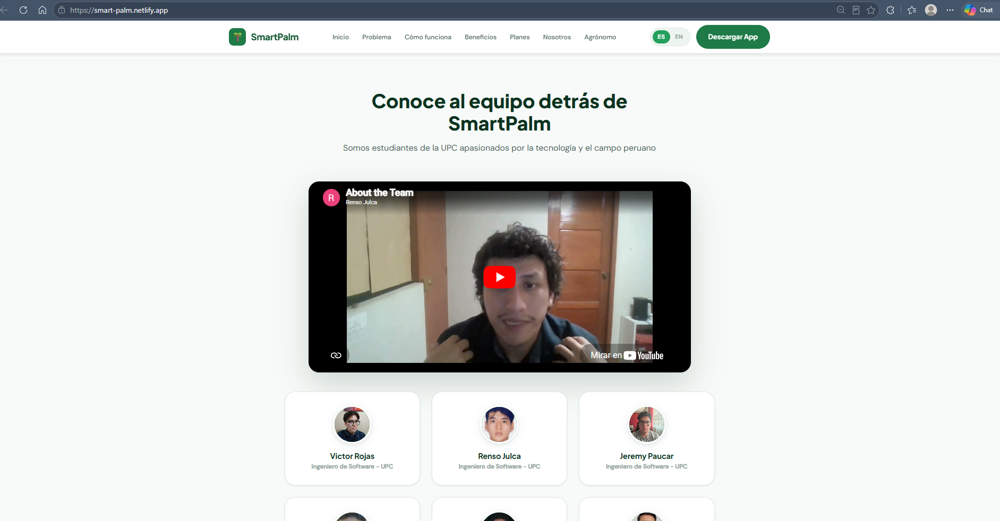

 

- Web Service actualizado desplegado en Render, accesible a través de la URL proporcionada: https://smart-palm-platform.onrender.com/

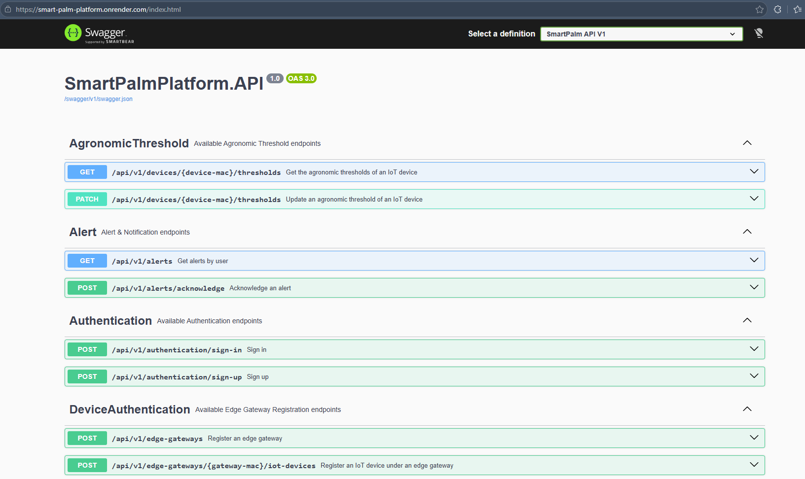

 

- Embedded Application dispositivo IoT versión release: https://github.com/upc-202601-1asi0572-6779-teamwise/embeddedapp

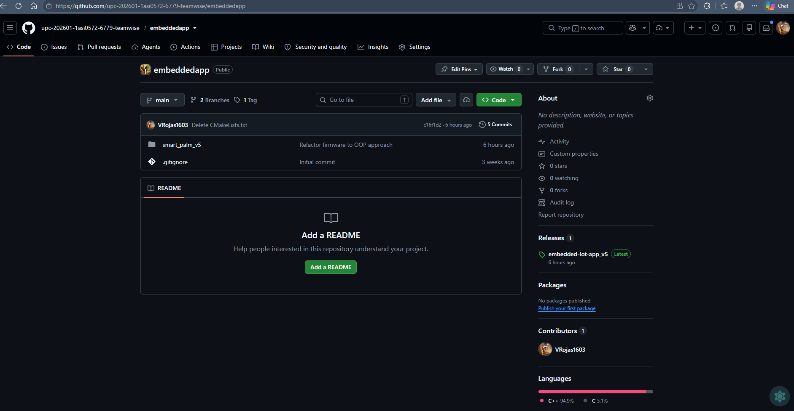

 

- Embedded Application dispositivo Edge Node con versión release: https://github.com/upc-202601-1asi0572-6779-teamwise/embeddedapp-edge-node 

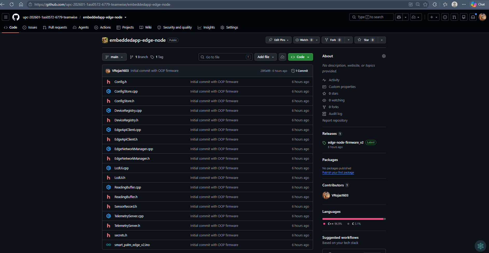

     

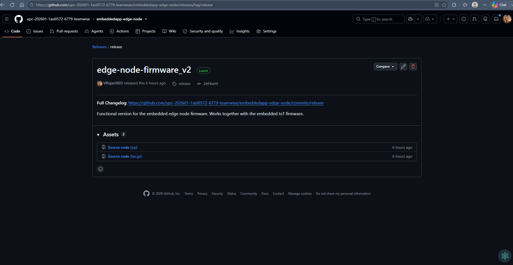

 

- Edge Api en python con versión release: https://github.com/upc-202601-1asi0572-6779-teamwise/edgeservice

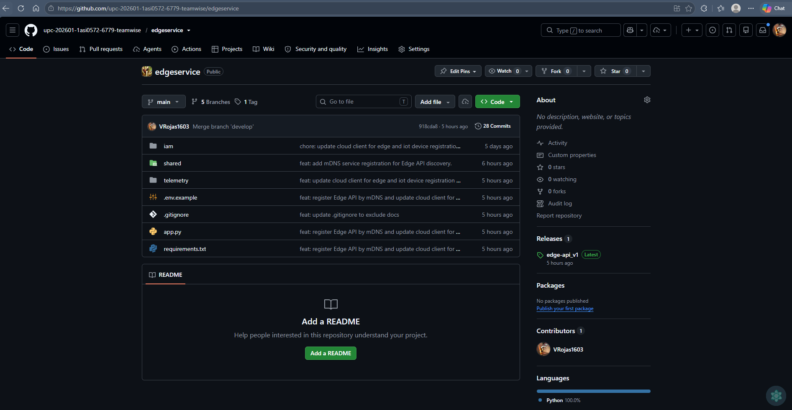

 

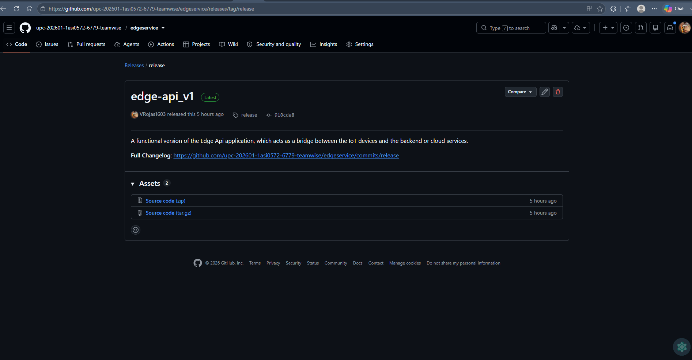

 

- Configuración de servicio de mensajería en Firebase para el envío de notificaciones push a la aplicación móvil: 

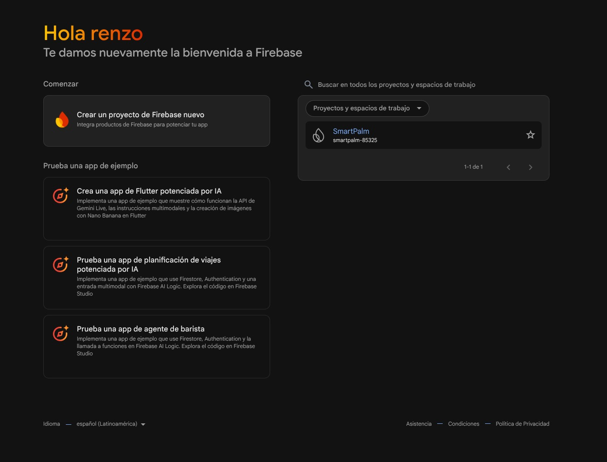

 

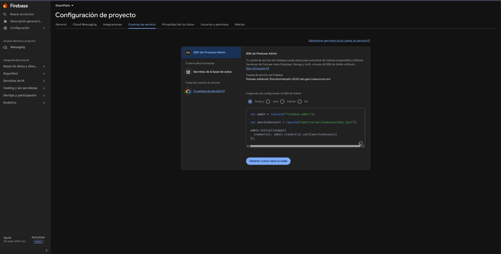

 

- Despliegue de la aplicación móvil en el entorno de producción mediante FirebaseApp Distribution:

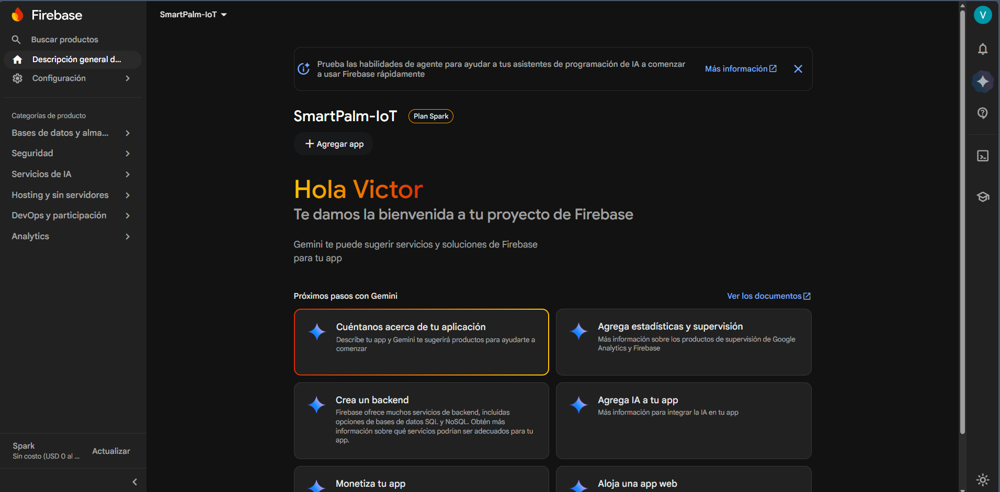

 

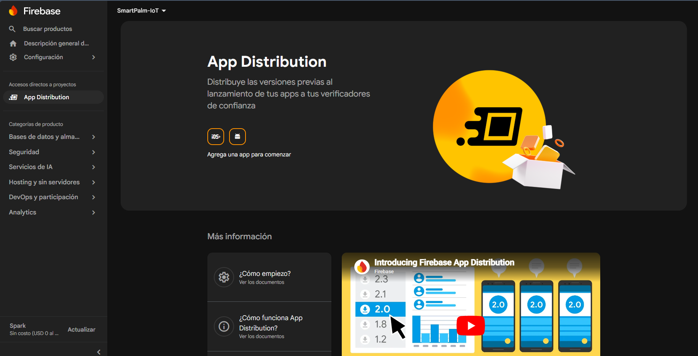

 

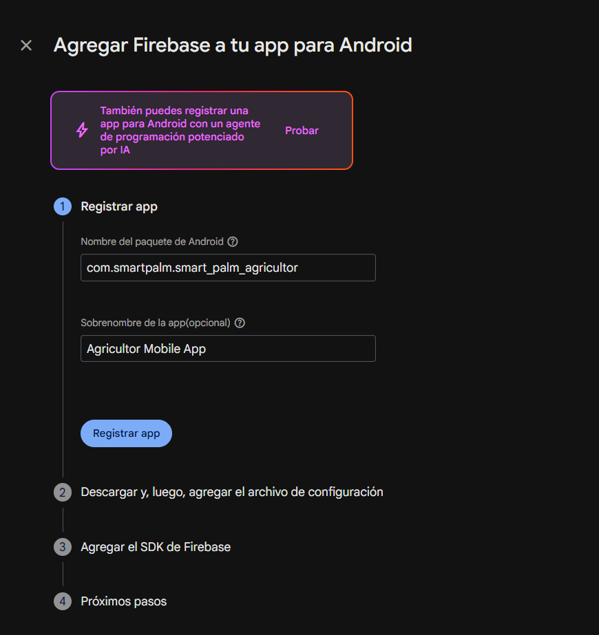

 

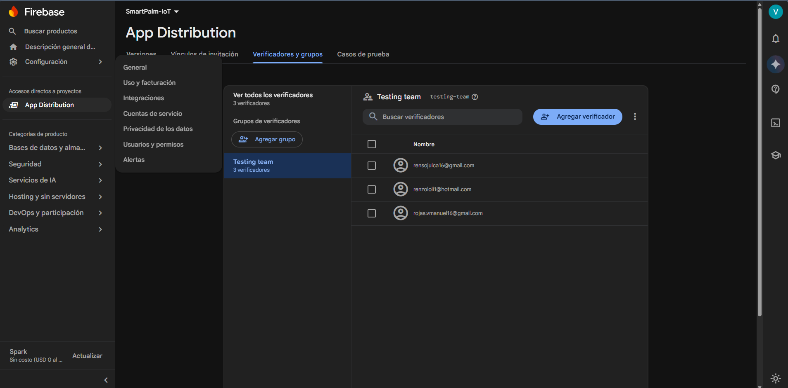

 

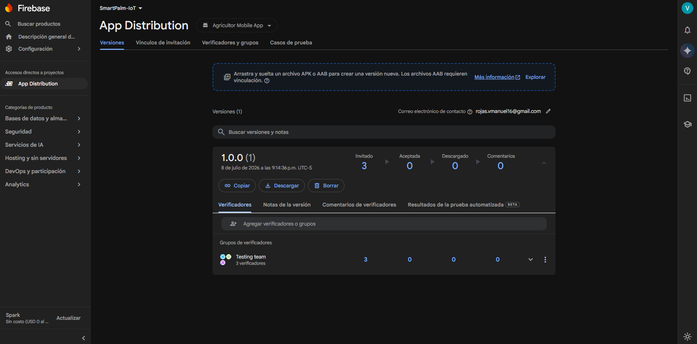

 

---