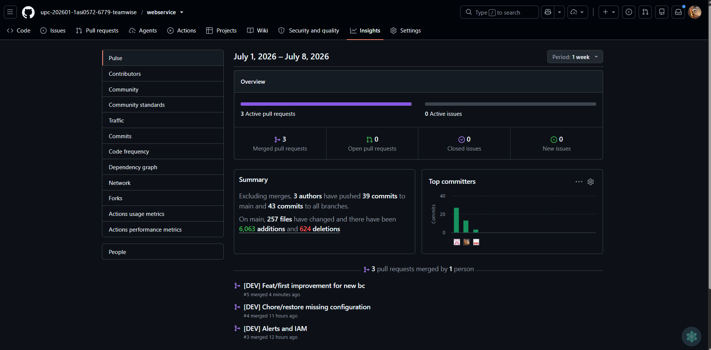
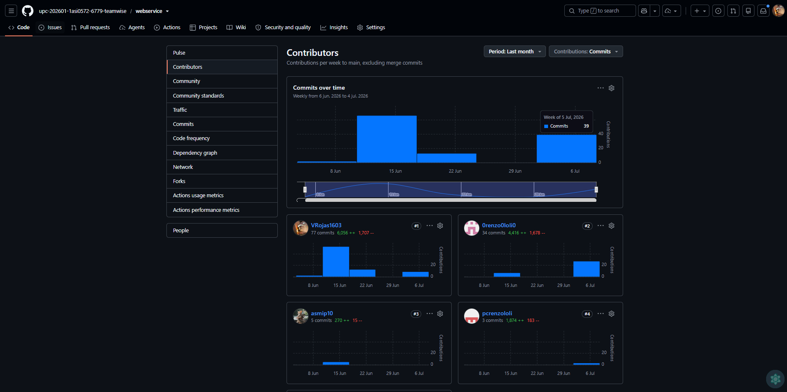
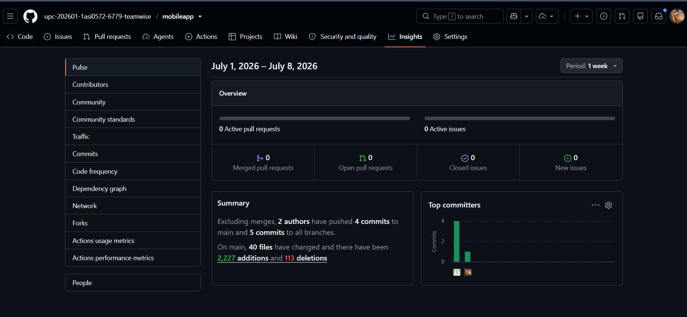
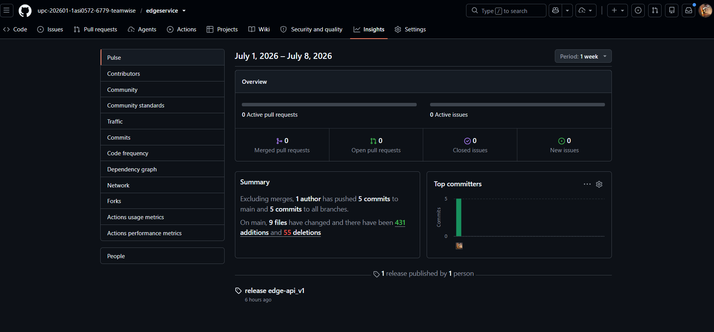
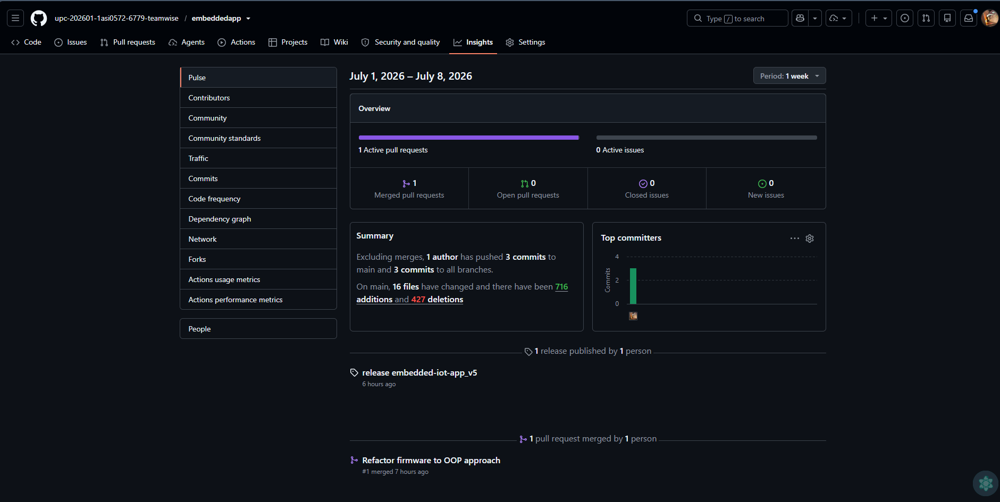
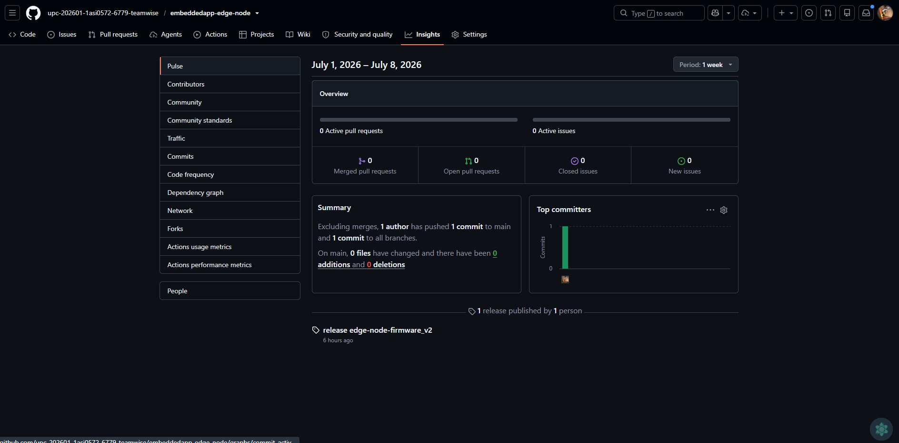

#### 6.2.3.9. Team Collaboration Insights during Sprint

Durante el Sprint 2, la colaboración del equipo se evidenció a través de los commits en el repositorio del reporte y la distribución de responsabilidades en los capítulos del producto.

Durante el Sprint 2, el equipo distribuyó el trabajo en 7 productos: Landing Page, Web App, Mobile App, Edge Service, Embedded App, Web Service y los prototipos físicos. Para los dos primeros, se implementaron mejoras en las interfaces y en la interacción con el usuario. En el caso del Web Service, se implementaron endpoints para el bounded context de Agronomic Recomendations, IoT Device Management y Sensor Data Processing por que los considerabamos de mayor importanticia como primera versión para el producto, mientras que en el Edge Service se desarrollaron funcionalidades para la gestión de dispositivos IoT. La Embedded App se centró en la integración de sensores y la comunicación con el Edge Service. La aplicación móvil presenta las vistas principales para el usuario dueño de cultivos, donde ve los sensores y alertas de estos. Finalmente, los prototipos físicos se enfocaron en el diseño y desarrollo de hardware para la conexión de dispositivos IoT.

| Integrante | Contribución | Descripción de la Contribución |
| :--- | :--- | :--- |
| **Victor Rojas**  | Mayoría de los merge de Pull Requests y despliegue de aplicaciones | Líder de integración, embedded apps, edge api, web service, mobile app |
| **Javier Tello**  | Implementación bounded context Agronomic Recomendations en el web service | Desarrolló endpoints pertenecientes a este bounded context |
| **Renzo Loli**  | Desarrollo de IoT Device management bounded context | Líder de implementación de endpoints para la conexión de dispositivos IoT |
| **Sebastian Carbajal**  | IoT Design (cap. 37) | Líder del firmware y hardware |
| **Renso Julca**  | Actualización Landing Page (imágenes), Web app | Lider en actualización de diseño y mejoras de la Landing Page |
| **Jeremy Paucar**  | Desarrollo Web App, Mobile App | Lider en desarrollo de las interfaces del web app y adaptación de los endpoints del backend necesarias |

 

**Web Service:**

 

 

**Mobile App:**

 

**Edge Service**

 

**Embedded App Dispositivo IoT**

**Embedded App Dispositivo Edge Node**

---