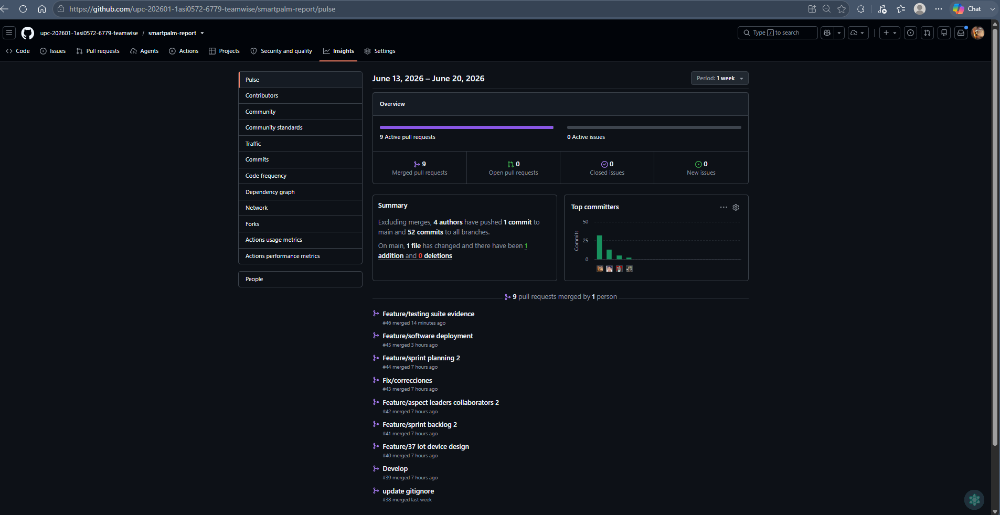
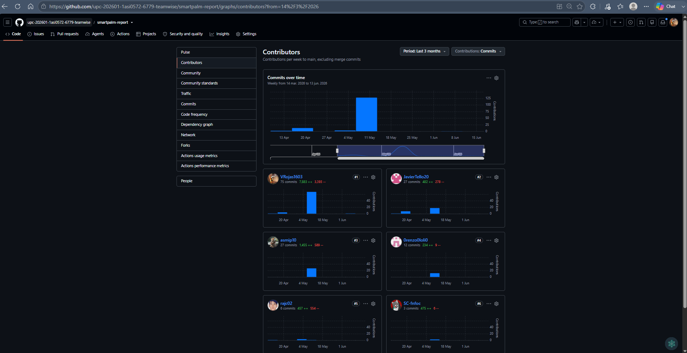
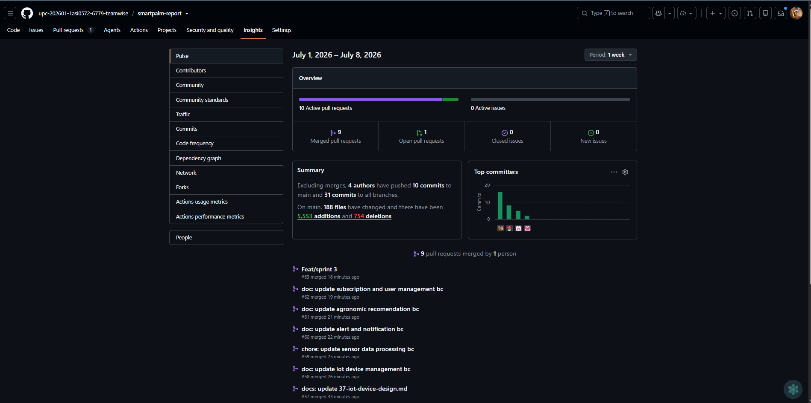
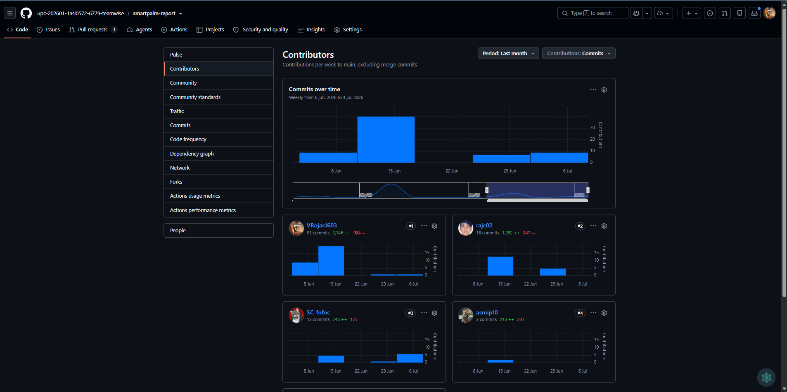

# Project Report Collaboration Insights

**Enlace del Repositorio:** [Repositorio de Informes - TempWise](https://github.com/TempWise-DesarrolloIoT-202610/upc-Desarrollo-IoT-Report)

### AV1
En esta etapa, el equipo estableció el flujo de trabajo "Docs-as-Code" utilizando GitFlow para la redacción colaborativa del informe. Creamos nuestra estructura de directorios dividiendo el reporte en múltiples archivos Markdown numerados por capítulo para evitar conflictos de integración. El equipo se reunió para definir el alcance y los objetivos, asignando tareas específicas a cada miembro. Comenzamos recopilando datos y revisando información relevante, con cada miembro contribuyendo con investigaciones individuales que luego compartimos y discutimos en reuniones periódicas. En GitHub, establecimos un flujo de trabajo para colaborar en la redacción del informe, creando un repositorio dedicado con secciones divididas en archivos Markdown para facilitar la colaboración y revisión

### TB1
En esta etapa, el equipo estableció el flujo de trabajo "Docs-as-Code" utilizando GitFlow para la redacción colaborativa del informe. Creamos nuestra estructura de directorios dividiendo el reporte en múltiples archivos Markdown numerados por secciones para evitar conflictos de integración.  
Se realizaron corercciones con respecto a la entrega anterior, se mejoró el diseño del documento y se actualizó el contenido con información más detallada sobre el proceso de desarrollo, las decisiones tomadas y los resultados obtenidos.  

**Evidencias de Colaboración y Commits (GitHub):**

 

### AV2 
Para esta entrega el equipo pudo desarrolar mejoras en los productos de software y hardware, así como en la documentación del proyecto. Se realizaron reuniones periódicas para discutir avances, resolver dudas y coordinar la integración de los cambios. 

 

### TB2

En este sprint, el equipo continuó utilizando el flujo de trabajo "Docs-as-Code" con GitFlow para la redacción colaborativa del informe. Se realizaron reuniones periódicas para discutir avances, resolver dudas y coordinar la integración de los cambios. Cada miembro del equipo contribuyó con el avance de los respectivos productos que abarcan la solución.  

 

