## 5.4. Applications UX/UI Design

### 5.4.1. Applications Wireframes

#### Web Application

##### Login

Pantalla de inicio de sesión donde el usuario —ingeniero agrónomo o dueño de cultivo— ingresa sus credenciales para acceder a la plataforma SmartPalm.

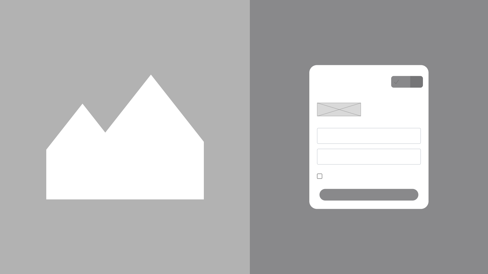

##### Register

Pantalla de registro para nuevos usuarios que desean crear una cuenta en SmartPalm, solicitando datos básicos como nombre, correo electrónico y tipo de usuario (ingeniero agrónomo o dueño de cultivo).

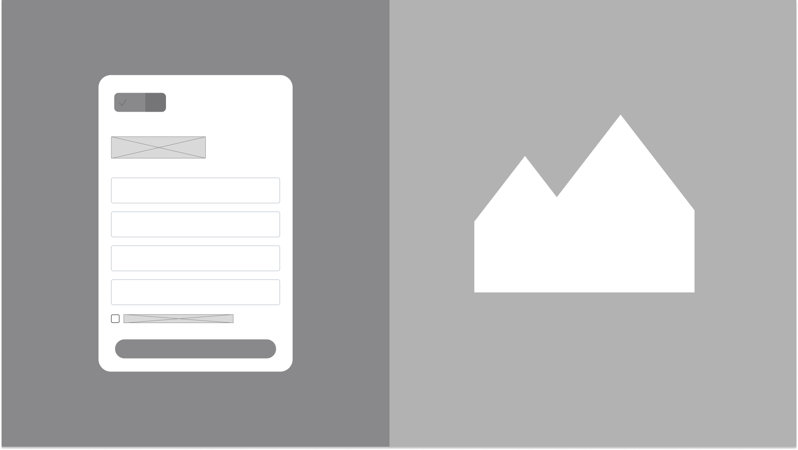

---

##### Dashboard

Panel principal que muestra una vista general del estado de las plantaciones, con indicadores clave como alertas activas, visitas programadas, condiciones actuales del cultivo y accesos rápidos a las funcionalidades principales.

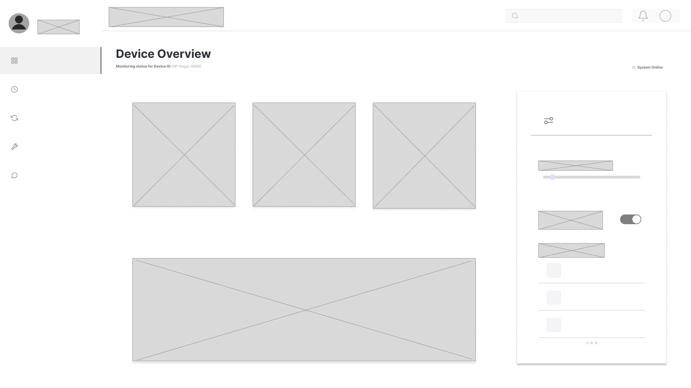

##### Schedule

Pantalla de planificación donde el ingeniero agrónomo organiza su calendario de visitas de campo, seleccionando la plantación, fecha y definiendo los objetivos de cada visita programada.

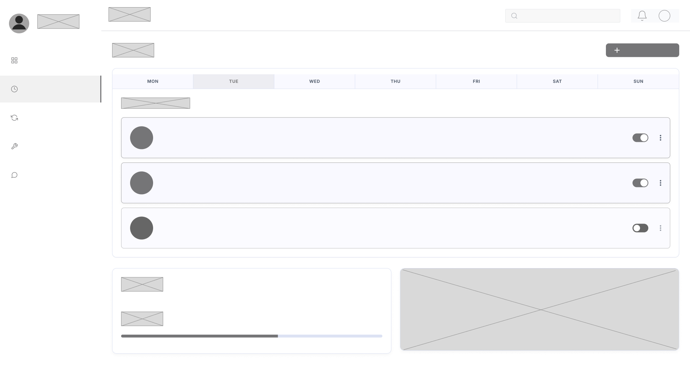

---

##### History

Historial de inspecciones realizadas, intervenciones agronómicas ejecutadas y alertas registradas. Permite filtrar por plantación, zona de monitoreo y rango de fechas para consultar el detalle de cada registro.

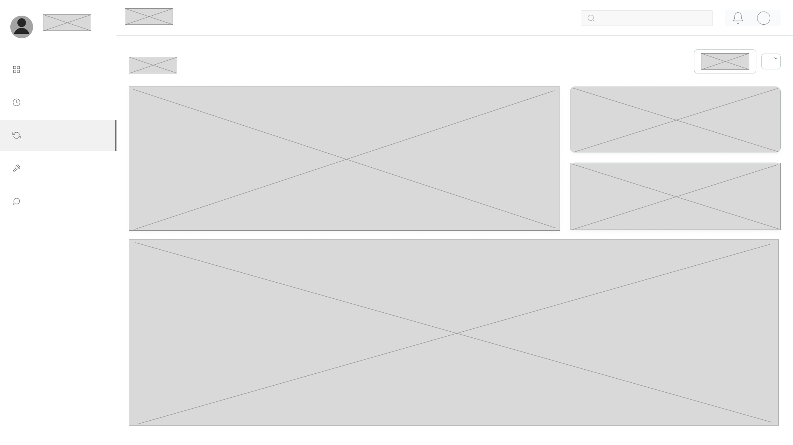

##### Settings

Pantalla de configuración de la cuenta del usuario, donde se gestionan las preferencias de notificación, parámetros de la aplicación y datos del perfil personal.

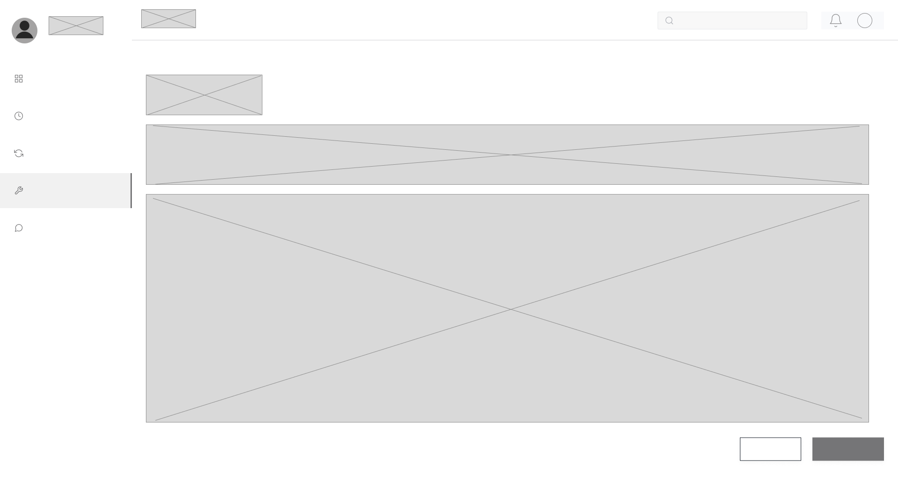

---

##### Support

Pantalla de soporte y ayuda donde el usuario puede consultar la documentación de la plataforma, reportar incidencias técnicas y contactar al equipo de soporte de SmartPalm.

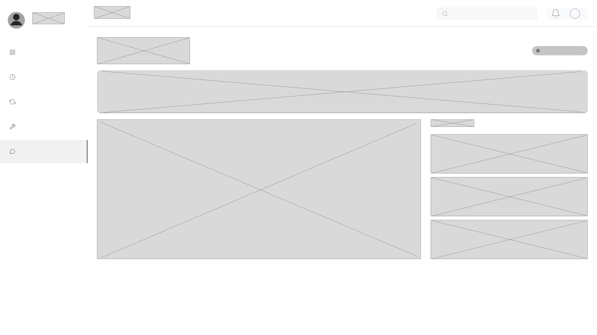

---

### 5.4.2. Applications Wireflow Diagrams

#### Web Application

##### Register

Flujo de registro de nuevo usuario: ingreso de datos personales → validación de correo → selección de tipo de cuenta (ingeniero agrónomo o dueño de cultivo) → confirmación → redirección al dashboard principal.

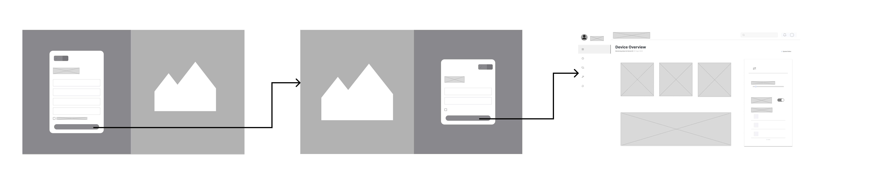

##### Login

Flujo de autenticación: ingreso de credenciales → validación contra el sistema → redirección al dashboard con vista personalizada según el rol del usuario (ingeniero agrónomo o dueño de cultivo).

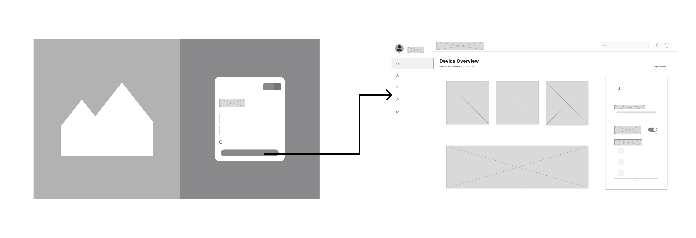

##### Schedule

Flujo de planificación de visita de campo: selección de plantación → elección de fecha en el calendario → definición de objetivos de la visita → confirmación y registro de la visita programada.

##### History

Flujo de consulta de historial: selección de plantación → aplicación de filtros por zona y rango de fechas → visualización del listado de inspecciones e intervenciones → acceso al detalle de cada registro con trazabilidad completa.

---

##### Settings

Flujo de configuración de cuenta: navegación a la sección de ajustes → modificación de preferencias de notificación y parámetros de la aplicación → guardado de cambios → confirmación visual de la actualización.

##### Support

Flujo de soporte al usuario: acceso a la sección de ayuda → consulta de documentación frecuente o envío de ticket de incidencia → confirmación de recepción y seguimiento del caso.

---

### 5.4.3. Applications Mock-ups

#### Web Application

##### Login

Mockup del inicio de sesión, donde el usuario ingresa sus credenciales para acceder al panel principal según su rol (ingeniero agrónomo o dueño de cultivo).

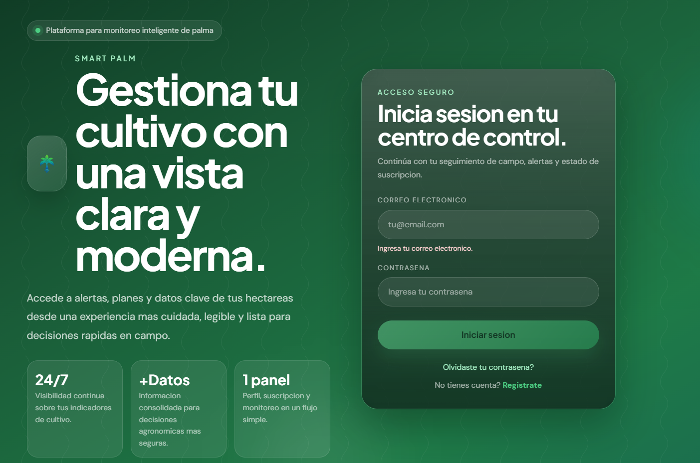

##### Dashboard

Panel principal con indicadores clave: alertas activas, visitas programadas, estado de plantaciones y accesos rápidos a las funcionalidades del sistema.

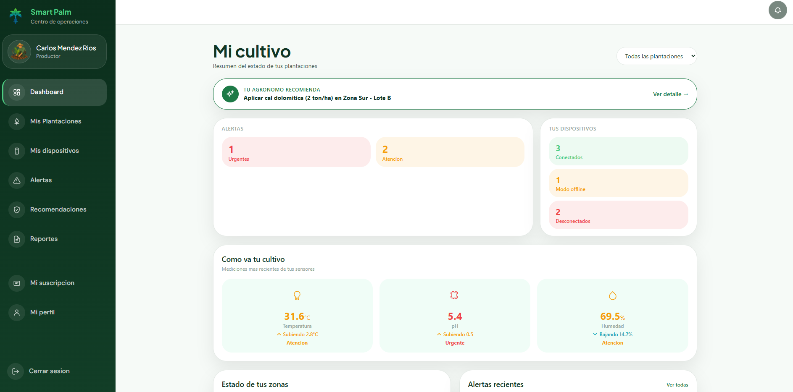

---

##### Plantaciones

Vista de gestión de plantaciones registradas, mostrando información de cada predio, sus zonas de monitoreo y el estado fitosanitario actual.

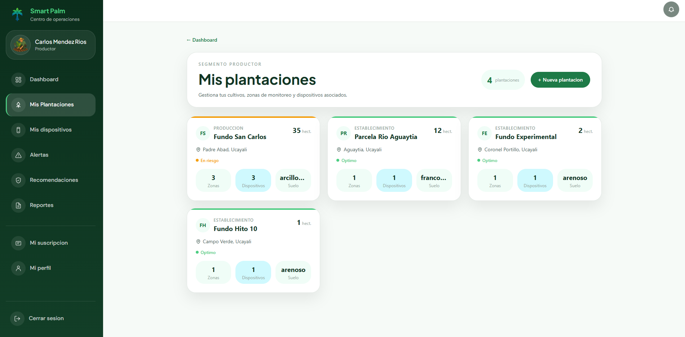

##### Alertas

Listado de alertas activas por plantación, con nivel de severidad, fecha de detección y estado de atención, vinculadas al bounded context de Alert & Notification.

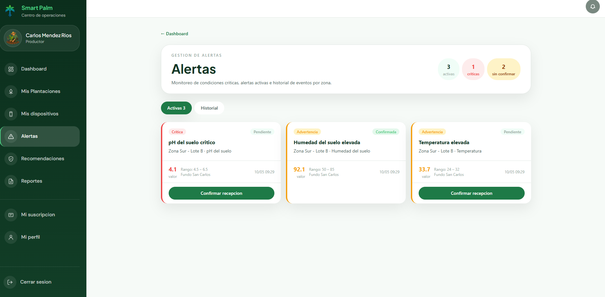

---

##### Dispositivos

Gestión de dispositivos IoT instalados en campo: sensores de humedad, temperatura y estaciones meteorológicas vinculadas a cada plantación para el monitoreo continuo del cultivo.

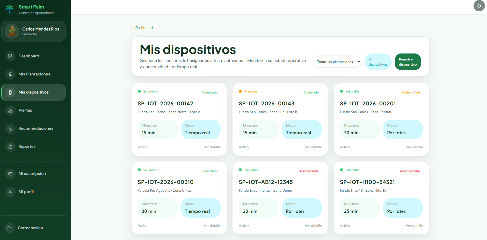

##### Recomendaciones

Recomendaciones agronómicas generadas por el sistema para cada plantación, con trazabilidad hacia las alertas que las originaron y las intervenciones ejecutadas.

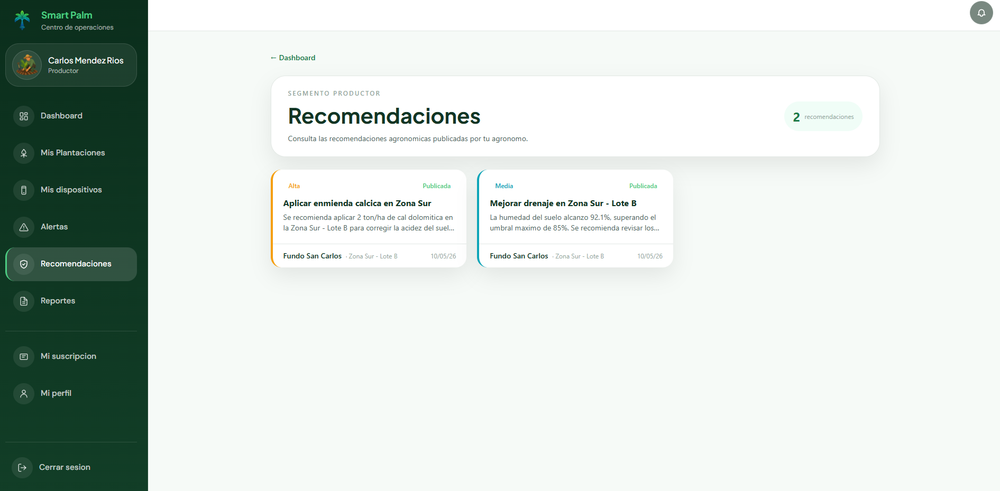

---

##### Reportes

Reportes y estadísticas del cultivo: evolución de condiciones, frecuencia de alertas por plantación, historial de intervenciones y tendencias en el tiempo.

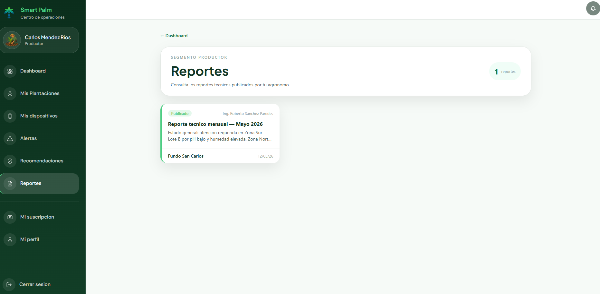

##### Suscripción

Gestión del plan de suscripción del usuario: estado del plan contratado, fecha de renovación y acceso a funcionalidades según el nivel de suscripción activa.

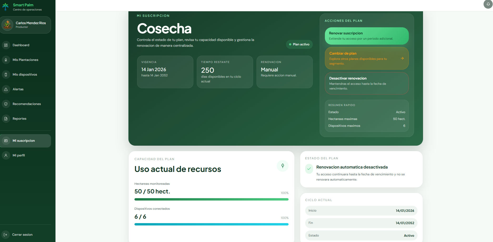

---

### 5.5. Applications Prototyping

#### Web Application

A continuación, se presenta el prototipo interactivo de la aplicación web SmartPalm, donde se evidencia el flujo de usuario completo: autenticación, panel de control, gestión de plantaciones, consulta de alertas y generación de reportes.

- **Prototipo (Figma):** [Web App - SmartPalm](https://www.figma.com/proto/bFDv7p60jPElSFuoSRZF1H/WebApp?node-id=2072-1742&p=f&t=c8TbbdnJ2ZNXnFD4-1&scaling=scale-down&content-scaling=fixed&page-id=0%3A1&starting-point-node-id=2072%3A75)
- **Video demostrativo (SharePoint):** [Web App - Recorrido completo](https://upcedupe-my.sharepoint.com/:v:/g/personal/u201719449_upc_edu_pe/IQDRFTcIoRRKSIPuibljwKbuATifjeCvBUGp_ySdt9_s_Kg?nav=eyJyZWZlcnJhbEluZm8iOnsicmVmZXJyYWxBcHAiOiJPbmVEcml2ZUZvckJ1c2luZXNzIiwicmVmZXJyYWxBcHBQbGF0Zm9ybSI6IldlYiIsInJlZmVycmFsTW9kZSI6InZpZXciLCJyZWZlcnJhbFZpZXciOiJNeUZpbGVzTGlua0NvcHkifX0&e=r0SlD2)

---

#### Mobile Application

A continuación, se presenta el prototipo interactivo de la aplicación móvil SmartPalm, mostrando el flujo de trabajo del ingeniero agrónomo en campo: registro de inspecciones offline, vinculación con alertas y consulta de recomendaciones.

- **Prototipo (Figma):** [Mobile App - SmartPalm](https://www.figma.com/proto/9zfoLcEEgnm15cXfdElAv6/Prototyping?node-id=1-2015&p=f&t=lTXhQ079NFQ9NE2a-1&scaling=min-zoom&content-scaling=fixed&page-id=0%3A1&starting-point-node-id=1%3A2015)
- **Video demostrativo (SharePoint):** [Mobile App - Flujo en campo](https://upcedupe-my.sharepoint.com/:v:/g/personal/u202312318_upc_edu_pe/IQD95BReG4PVTIdWSt4Xts5IATR2tJSg7a6IYBVbzCr34Po?nav=eyJyZWZlcnJhbEluZm8iOnsicmVmZXJyYWxBcHAiOiJPbmVEcml2ZUZvckJ1c2luZXNzIiwicmVmZXJyYWxBcHBQbGF0Zm9ybSI6IldlYiIsInJlZmVycmFsTW9kZSI6InZpZXciLCJyZWZlcnJhbFZpZXciOiJNeUZpbGVzTGlua0NvcHkifX0&e=OwGYah)
